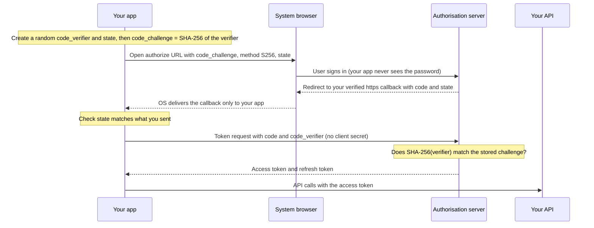
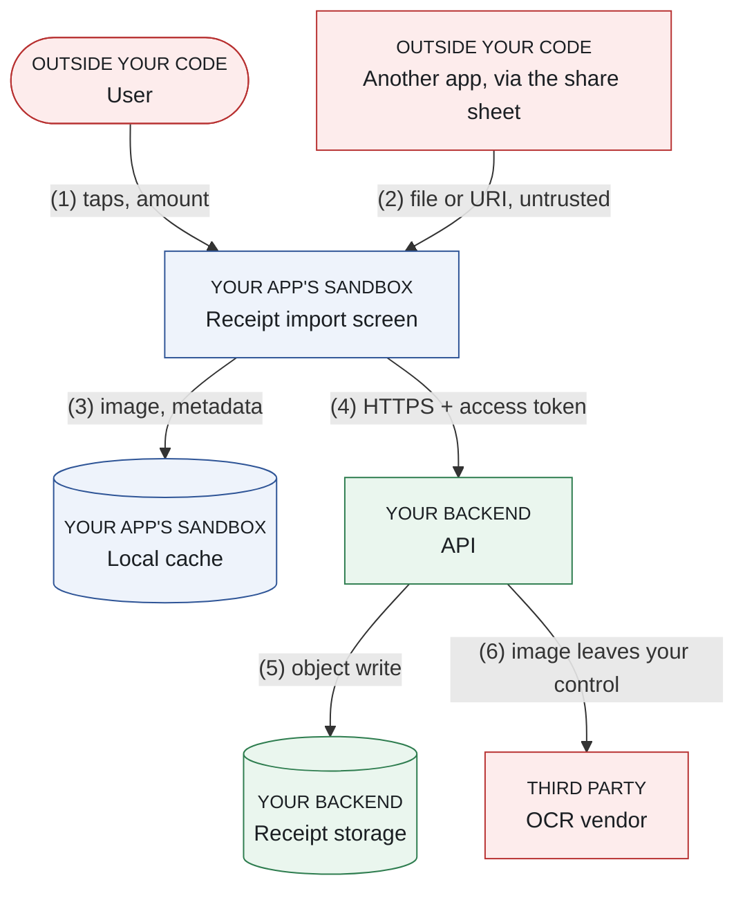

# Part 0: Foundations

You need six things before the rest of the book makes sense: the vocabulary, enough cryptography to make decisions, how authentication actually works, what the platforms protect for free, a systematic way to think about threats, and a way to rank what to protect first. That is this part, one chapter each. If you already know all six, skim the **Key takeaways** at the end of each chapter and move on. Come back when a later chapter uses a term you don't recognise.

---

## Chapter 0.1: The vocabulary

Picture a team that spends a sprint encrypting its local order cache, while its API hands any user's orders to anyone who changes the ID in the URL. Nobody on that team was careless. They just had no words for the difference between the problem they solved and the problem they had. Security writing is full of terms that sound interchangeable and aren't. Get these straight now and the rest of the book reads easily.

### The three properties you're protecting

Security protects three things. Naming which one a control protects is the fastest way to tell whether it is the right control.

**Confidentiality** means only the right people can read the data. Encryption gives you this.

**Integrity** means nobody changed the data without you noticing. Hashes, message authentication codes and signatures give you this.

**Availability** means the service works when users need it. It is why a pinning mistake that disconnects every user is a *security* failure, not just an outage: you broke a security property.

Together these are called the **CIA triad**. When you evaluate a control, ask which of the three it protects. A lot of confused design comes from assuming that encryption gives you integrity, or that a signature keeps data secret. Plain encryption modes such as AES-CBC don't detect tampering, and a signature hides nothing (Chapter 0.2).

### Authentication versus authorisation

The two words get swapped in conversation. They are different jobs, and they fail separately.

**Authentication** answers "who are you?" Logging in, biometrics, a token that proves identity.

**Authorisation** (spelt *authorization* in the OAuth specifications) answers "are you allowed to do this?" Whether *this* signed-in user may read *that* record.

An app with perfect authentication and no authorisation lets any logged-in user read every other user's data by changing an ID in a request. That bug class is extremely common, extremely serious, and it lives entirely on the server. Chapter 0.3 comes back to it.

### Threat, vulnerability, risk

A **threat** is something bad that could happen: someone steals a session token.

A **vulnerability** is the weakness that allows it: the token is stored in plaintext.

**Risk** combines how likely it is with how much it would hurt.

Why bother separating them? Because your time is limited, and risk is what you prioritise on. A severe vulnerability nobody can reach matters less than a mild one on your login screen.

### Attack surface, threat model, defence in depth

Your **attack surface** is every point where untrusted input or an untrusted actor meets your code: network responses, deep links, intents, WebView content, the clipboard, the camera, files a user picks, notifications, and IPC from other apps.

A **threat model** is a structured answer to "what could go wrong here, and what are we doing about it?" Chapter 0.5 shows you how to build one.

**Defence in depth** means layering controls so that one failure isn't total. The key word is *independent*. Three controls that all fail when the device is rooted are one control wearing three hats.

### Client, server, and why it matters here

Your **client** is the app on the user's device. Your **server**, often called the **backend**, is the code you run on machines you operate.

The single most important sentence in this book: **you control the server; you do not control the client.** Everything in Part 1 follows from it.

### Terms you'll meet constantly

A quick pass through the words that appear on almost every page from here on.

**Plaintext** is data before encryption. **Ciphertext** is data after it.

A **key** is the secret that makes encryption work. **Key material** means the actual bytes of a key.

A **nonce** is a "number used once". The word has two jobs, and you'll meet both. In a *protocol*, a nonce is a fresh value included in a request so that an old copy of the request can't be accepted again. Accepting an old copy is called a **replay**. In *encryption*, a nonce is a per-message input to a cipher mode that must never repeat under the same key (Chapter 0.2).

**IPC** is inter-process communication: the mechanisms that let separate apps or processes talk. On Android that means intents, content providers, services and broadcasts. On iOS it means URL schemes, universal links, app extensions and the pasteboard.

**Hooking** is replacing a function's behaviour at runtime without changing the file on disk. **Frida** is the standard hooking tool. Hooking is how most client-side security gets bypassed.

**Rooting** (Android) and **jailbreaking** (iOS) mean removing the OS restrictions that normally keep apps isolated from each other and from the system.

**Attestation** is a cryptographic statement from a trusted party about the state of something, usually "this is a genuine app on a genuine device."

#### Reading OWASP IDs

You'll see identifiers such as `MASWE-0007` and `MASTG-TEST-0232` from the next chapter onwards. They come from OWASP's Mobile Application Security (MAS) project, the industry's reference standard for mobile. Chapter 3 explains how the pieces fit together. Until then, treat each ID as a footnote you can look up later at [mas.owasp.org](https://mas.owasp.org/).

| Prefix | What it is | Example | Explained in |
|---|---|---|---|
| `MASVS-<AREA>-n` | A security **requirement** your app should meet | `MASVS-CRYPTO-1` | Chapter 26 |
| `MASWE-nnnn` | A **weakness**: a specific way apps fail a requirement | `MASWE-0007` improper encryption | Chapter 27 |
| `MASTG-TEST-nnnn` | A **test** that checks for a weakness | `MASTG-TEST-0232` | Chapter 28 |
| `MASTG-TECH-nnnn` | A testing **technique**, such as intercepting traffic | `MASTG-TECH-0011` | Chapter 28 |
| `MASTG-BEST-nnnn` | A **best practice**: the fix | `MASTG-BEST-0001` | Chapter 28 |
| `MASTG-DEMO-nnnn` | A runnable **demo** of a weakness and its test | `MASTG-DEMO-0058` | Chapter 28 |
| `MASTG-KNOW-nnnn` | A **knowledge** article: background on a platform feature | `MASTG-KNOW-0015` | Chapter 28 |

> **Trap:** the IDs moved in 2026. MASWE v1.0.0 renumbered every weakness, and MASTG v2.0.0 deprecated all the original tests. An ID copied from an older article may now point somewhere else (§3.1).

**Key takeaways**

- Name the property (confidentiality, integrity, availability) before you choose the control.
- Authentication and authorisation fail independently. Authorisation bugs live on the server.
- Prioritise by risk (likelihood × impact), not by how scary a vulnerability sounds.
- Layers of defence only count if they fail independently.

**Try it**

1. Pick one screen in your app. List every input that reaches it from outside your code: network, deep link, intent or URL scheme, clipboard, file picker, push payload. That list is the screen's attack surface.
2. For one control your team already has (say, "we encrypt the database"), write one sentence naming which CIA property it protects, and against whom. If you can't finish the sentence, you've found a control nobody has reasoned about.

---

## Chapter 0.2: Cryptography you actually need

In 2010, the fail0verflow group showed at the Chaos Communication Congress that Sony had signed PlayStation 3 software with ECDSA, but used the same "random" number for every signature. Two signatures were enough to compute Sony's private signing key. The algorithm was fine. The mathematics was fine. One value that was supposed to be fresh wasn't, and the platform's root of trust fell over.

That is what cryptographic failure usually looks like: a correct algorithm used slightly wrongly. You don't need to implement cryptography. You need to choose it and use it correctly, and to recognise when someone else got it wrong. That is a much smaller topic, and this chapter is all of it.

**The first rule: never write your own.** Use the platform's implementation (`javax.crypto` with the Android Keystore, Apple's CryptoKit) or Google's [Tink](https://developers.google.com/tink), which is designed to make misuse hard. Cryptographic code that looks right and is subtly wrong is the norm, not the exception, and the bugs are invisible in testing because broken crypto still decrypts.

### Symmetric encryption

In **symmetric** encryption, one key both encrypts and decrypts. It is fast, and it is what you use for bulk data.

The algorithm you want is **AES**. But AES alone isn't a decision. You also choose a **mode**, which says how AES is applied to data longer than one 16-byte block, and the mode is where things go wrong.

| Mode | What it gives you | Verdict |
|---|---|---|
| **AES-GCM** | Confidentiality *and* integrity (AEAD) | Use this |
| **ChaCha20-Poly1305** | Same guarantees as GCM, fast without AES hardware | Fine alternative, available in CryptoKit and Tink |
| **AES-CBC** | Confidentiality only; tampering goes undetected | Legacy. Only with a separate MAC, done correctly |
| **AES-ECB** | Neither, in practice: identical blocks give identical ciphertext | Broken. A finding wherever it appears |

**AES-GCM** is an **AEAD** mode, short for *authenticated encryption with associated data*. It gives you confidentiality and integrity together: if someone tampers with the ciphertext, decryption fails loudly instead of returning garbage you then trust. "Associated data" is extra information, such as a record ID, that isn't encrypted but is protected against tampering, so a valid ciphertext can't be pasted onto the wrong record.

**AES-CBC** encrypts but does **not** authenticate. An attacker can modify ciphertext in ways that change the plaintext predictably, and error messages can leak the plaintext byte by byte (a *padding oracle*). If you must use CBC, you have to add a MAC yourself, over the ciphertext, and check it before decrypting, which is exactly the kind of thing people get wrong. Prefer GCM.

**AES-ECB** encrypts each block independently, so structure leaks straight through. The famous demonstration is an image encrypted with ECB, whose outline is still visible. On Android, `Cipher.getInstance("AES")` with no mode can silently give you ECB, which is how it ends up in real apps.

OWASP references: `MASWE-0007` (improper encryption); tests `MASTG-TEST-0232` and `MASTG-TEST-0350` (Android) and `MASTG-TEST-0317` (iOS); `MASTG-DEMO-0058` shows ECB requested through `KeyGenParameterSpec`.

**The nonce rule that catches everyone.** Modes need an **initialisation vector** (IV), called a **nonce** in GCM: a per-message value that makes the same plaintext encrypt differently each time. It doesn't need to be secret. With GCM it must **never repeat under the same key**. Reuse one and an attacker learns the XOR of the two plaintexts and can recover GCM's internal authentication key, which lets them forge messages that decrypt as valid. The whole integrity guarantee is gone.

The practical rules:

- Use a **96-bit (12-byte) random nonce** for every encryption, and store it next to the ciphertext. It isn't secret.
- With random nonces, NIST SP 800-38D caps a single key at **2³² encryptions**. Most apps never come close. If yours might (a high-volume sync log, for example), rotate the key or use a library that manages this for you.
- Never hardcode a nonce, never derive it from something that repeats (a timestamp, a counter that resets on reinstall), and never reuse one "just for this case".
- Let the platform do it. With an Android Keystore AES key, the Keystore generates the IV itself and by default rejects one you supply; you read it back from `cipher.iv` after `init`. Tink's AEAD generates the nonce and prefixes it to the ciphertext. CryptoKit's `AES.GCM.seal` generates one if you don't pass it. §6.6 has the code.

`MASWE-0007` covers IV and nonce misuse. `MASTG-TEST-0309` and `MASTG-TEST-0310` are the Android tests reserved for it, but as of September 2026 they are placeholder pages with no procedure yet.

### Asymmetric encryption

**Asymmetric** cryptography uses two mathematically related keys: a **public key** you can share freely and a **private key** you protect. Anyone can encrypt to your public key, and only your private key decrypts. Or, the other way round, your private key signs and anyone with your public key can verify.

Asymmetric operations are slow, so they are used for small jobs: signing, and agreeing on or protecting a symmetric key that then does the bulk work. Combining the two is called **hybrid encryption**. TLS 1.3 is the example you use every day. The two sides run an elliptic-curve Diffie–Hellman (**ECDH**) **key agreement**, a way for two parties to derive the same secret over a public channel without ever sending it, and use that secret as their symmetric keys, and the server *signs* the handshake to prove who it is. Asymmetric crypto sets up the connection, and AES-GCM or ChaCha20-Poly1305 carries the data.

The algorithms:

- **RSA** is the older standard. It needs large keys: 2,048 bits is the minimum NIST still accepts, and 3,072 or more is preferred for anything meant to last. For RSA encryption use OAEP padding (the modern, randomised scheme), never PKCS #1 v1.5 padding (the older one, with known practical attacks).
- **Elliptic curve** cryptography gives equivalent strength with much smaller keys and faster operations: **ECDSA** (or Ed25519) for signing, **ECDH** (or X25519) for key agreement. P-256 is the curve you'll meet most on mobile.

Apple's Secure Enclave has never stored RSA keys, and it doesn't hold general AES keys you can use directly. For classical cryptography it supports **P-256 elliptic-curve keys only**, a constraint you'll meet in Chapter 4. From iOS 26, CryptoKit adds post-quantum types that the Secure Enclave can also hold: ML-KEM for key encapsulation and ML-DSA for signatures (`SecureEnclave.MLKEM768`, `SecureEnclave.MLDSA65` and their larger variants).

> **Why it matters:** a large enough quantum computer would break RSA and elliptic-curve cryptography, but not AES. NIST published its first post-quantum standards (ML-KEM as FIPS 203, ML-DSA as FIPS 204) in August 2024. Its draft transition plan, NIST IR 8547, proposes deprecating today's 112-bit-strength public-key algorithms after 2030 and disallowing them after 2035. The platforms are already moving: from iOS 26, `URLSession` and `Network.framework` offer quantum-secure key exchange (X25519MLKEM768) in TLS 1.3 by default, and use it whenever your server supports it. For most app teams the action today is small. Keep keys and algorithms configurable rather than hardcoded, so you can migrate when your backend does.

### Hashing

A **hash** turns input of any size into a fixed-size fingerprint, one way. You can't reverse it, and changing one bit of input changes the output completely.

Use **SHA-256** or stronger (SHA-384, SHA-512, SHA-3). **MD5 and SHA-1 are broken** for security purposes. Attackers can construct *collisions*, two different inputs with the same hash. A public SHA-1 collision was demonstrated in 2017. They are fine as non-security checksums. They are findings anywhere security depends on them (`MASWE-0008`, improper hashing; `MASTG-TEST-0211` on iOS).

**Hashing is not encryption.** Hashing is one-way and has no key. If you "hashed" something you need to read back later, you've lost it.

### Password hashing is a different problem

This distinction trips up a lot of engineers. General-purpose hashes are designed to be **fast**, which is exactly wrong for passwords: fast means an attacker with a stolen database can try billions of guesses per second.

For passwords, use a **deliberately slow, memory-hard** function, and give each password its own random **salt** (a per-password value stored with the hash, so identical passwords produce different hashes and precomputed tables are useless). The [OWASP Password Storage Cheat Sheet](https://cheatsheetseries.owasp.org/cheatsheets/Password_Storage_Cheat_Sheet.html) currently recommends, in order of preference:

| Function | Minimum configuration (OWASP, checked September 2026) |
|---|---|
| **Argon2id** | 19 MiB memory, 2 iterations, parallelism 1. Equivalent trade-offs are listed, such as 46 MiB with 1 iteration |
| **scrypt** | N = 2¹⁷ (128 MiB), r = 8, p = 1 |
| **bcrypt** | Work factor 10 or more. It only uses the first 72 bytes of input, so enforce that limit |
| **PBKDF2** | 600,000 iterations with HMAC-SHA-256 (use where FIPS 140, the US government's standard for cryptographic modules, demands it) |

These parameters get raised over time as hardware gets faster, so check the cheat sheet rather than this table when you implement.

Password hashing is almost always a *server* concern. Your app should send the password over TLS and let the backend hash it.

> **Trap:** an app that hashes the password locally and sends the hash has just made the hash the password. Anyone who captures it can log in with it, and your server now stores something equivalent to a plaintext password.

There is one legitimate client-side use: deriving an encryption key from something the user types, such as a passphrase for a local vault. That is `MASWE-0014`, improper key derivation. Be honest about its limits. A key derived from a six-digit PIN has only a million possible values, and an attacker who copies the ciphertext off the device can try all of them offline, whatever KDF you use *(reasoned)*. For PINs, let the hardware enforce attempt limits: keep the real key in the Keystore or Secure Enclave, gated by user authentication, as in Chapter 11.

### Message authentication codes and signatures

A **MAC** (message authentication code) proves that data wasn't modified *and* came from someone holding a shared secret key. **HMAC-SHA256** is the standard choice. Because both parties hold the same key, a MAC can't prove *which* of them produced a message. That's fine between your app and your server, and useless when you need to prove to a third party who did something (*non-repudiation*). When you check a MAC, compare it in constant time (`MessageDigest.isEqual` on the JVM). An ordinary `==` can leak, through timing, how many leading bytes matched.

A **digital signature** uses asymmetric crypto: sign with a private key, verify with the public key. That *does* prove origin, which is why app signing, JWT verification and attestation all use signatures.

> **Trap:** producing a signature correctly and *verifying* one correctly are separate problems, and verification is where the bugs live. Watch for: accepting a token whose signature was never checked; accepting a JWT with `alg: none`; letting the token's own header choose the algorithm, so an RSA public key gets used as an HMAC secret; and verifying against a key the attacker supplied. `MASWE-0011` is "improper verification of cryptographic signature", and it exists because this happens a lot.

### Randomness

Cryptography needs unpredictable random numbers for keys, nonces, salts and tokens. Your language's default random number generator is usually **not** suitable. It is designed for speed and even distribution, not unpredictability, and its future output can often be predicted from a few samples.

| Platform | Use | Never use for security |
|---|---|---|
| Android / Kotlin | `java.security.SecureRandom()` with the default constructor | `java.util.Random`, `kotlin.random.Random`, `Math.random()` |
| iOS / Swift | `SecRandomCopyBytes` (check the return status); CryptoKit's `SymmetricKey(size:)` for keys | `rand()`, `random()`, or seeding a generator yourself |

On Apple platforms Swift's `SystemRandomNumberGenerator`, the default behind `Int.random(in:)`, is backed by `arc4random_buf`, which is cryptographically secure, so it's fine for tokens and IDs. For key material, prefer the purpose-built APIs above, which make your intent obvious to a reviewer.

> **Trap:** never seed a secure generator with something predictable such as a timestamp or a device ID. That throws away the only property you wanted. `new SecureRandom()` seeds itself from the operating system; leave it alone.

The OWASP references: `MASWE-0012` (improper random number generation), `MASTG-TEST-0204` and `MASTG-TEST-0205` (Android), `MASTG-TEST-0311` and `MASTG-TEST-0349` (iOS), and `MASTG-BEST-0001`, "use secure random number generator APIs". Chapter 0.3 has a worked example: generating a PKCE verifier.

### Key lifecycle

Keys have a life, and each stage is a place to fail (`MASVS-CRYPTO-2`, key management):

**Generation.** In secure hardware where possible, from a secure random source, at an adequate size (`MASWE-0013`).

**Storage.** In the platform keystore. Never in your source code, never in your app package. A hardcoded key is not a key; it's a public constant with extra steps (`MASWE-0003`, keys stored outside the platform keystore; `MASWE-0004`, sensitive data hardcoded in the app package).

**Use.** Restricted to the purpose you generated it for. A key that both signs and encrypts creates attack paths that neither use would create alone (`MASTG-TEST-0307`). Both keystores let you fix a key's purposes when you create it. Do so.

**Rotation.** A plan for replacing a key without losing access to data encrypted under the old one. Most apps have none, which is why `MASWE-0015` exists.

**Destruction.** Actually removed when it's no longer needed, including at logout and account deletion.

**Key takeaways**

- AES-GCM (or ChaCha20-Poly1305) for data, SHA-256 or better for hashes, elliptic curves for signatures and key agreement, Argon2id or bcrypt for passwords on the server.
- Never reuse a GCM nonce under the same key. Let the Keystore, CryptoKit or Tink generate it.
- Use `SecureRandom` and `SecRandomCopyBytes`, never the default random generator, and never seed them yourself.
- Keys live in the platform keystore, limited to one purpose, with a rotation plan.
- Never trust a signature you didn't verify yourself, with an algorithm you chose.

**Try it**

1. Search your codebase for the usual suspects:

    ```bash
    grep -rnE 'AES/ECB|"AES"|AES/CBC|MD5|SHA-?1([^0-9]|$)|java\.util\.Random|kotlin\.random|Insecure\.' \
      --include='*.kt' --include='*.java' --include='*.swift' .
    ```

    Each hit is either justified in a code comment or it's a finding. `"AES"` on its own matters because on Android it can default to ECB. `Insecure.` catches CryptoKit's deliberately named `Insecure.MD5` and `Insecure.SHA1`.
2. Find every place your app creates an IV or nonce. For each one, write down who generates it and whether it can ever repeat under the same key.
3. Open [MASWE-0007](https://mas.owasp.org/MASWE/MASVS-CRYPTO/MASWE-0007/) and read its *Modes of Introduction*. Tick off the ones you've just ruled out in your own app.

---

## Chapter 0.3: Authentication, sessions and tokens

Suppose your sign-in screen is a WebView showing your identity provider's login page, and the redirect back to your app is `myapp://callback`. It works and it looks polished. It also lets your app read every password typed into it. Any other app that registers `myapp://` can race you for the authorisation code, and your users have no way to check which site they are typing into. None of this shows up in testing. Most mobile authentication bugs come from a handful of misunderstandings like these, and this chapter clears them up.

### What your app is holding

After a user logs in, your app holds something that proves the session. Usually two things:

An **access token**: short-lived (typically minutes to an hour), sent with each API request. The short life is the point. If it leaks, the window is small.

A **refresh token**: long-lived (days to months), used only to obtain new access tokens. This is the valuable one. It's why Chapter 6 tells you to keep access tokens in memory where you can and to give the refresh token real protection. The OAuth security best practice, [RFC 9700](https://www.rfc-editor.org/rfc/rfc9700.html) (January 2025), adds a server-side rule: for a public client such as a mobile app, refresh tokens **must** either be *rotated*, so each use returns a new one and invalidates the old, or be *sender-constrained*.

Rotation only protects you if the server also does **reuse detection**. If a refresh token that has already been used is presented again, the server can't tell whether the thief or the real app sent it, so it revokes the whole token family: the old token and every token issued from it (RFC 9700 §4.14.2). The user signs in again, and the attacker's copy dies with the rest. Without reuse detection, rotation just starts a race: whoever uses the stolen copy first gets the fresh token, and if that's the attacker, the real app is the one locked out.

**Sender-constrained** tokens are bound to a key the client holds, so a stolen copy is useless without that key. For apps, the practical mechanism is usually **DPoP**, [RFC 9449](https://www.rfc-editor.org/rfc/rfc9449.html); mutual TLS ([RFC 8705](https://www.rfc-editor.org/rfc/rfc8705.html)) is the other option RFC 9700 names. The app keeps a private key (ideally non-exportable, in the Keystore or Secure Enclave) and signs a short proof for every request. The proof covers the HTTP method, the URL, a timestamp, a unique ID and, when an access token is sent, a hash of it. A token lifted from a log file or a proxy then fails at the server. DPoP needs support from your authorisation server, so check before you design around it.

Many systems use **JWTs** (JSON Web Tokens, RFC 7519) for access tokens: a base64url-encoded JSON payload with a signature. Two things to know. First, **a signed JWT is not encrypted**: anyone holding it can decode and read it, so never put secrets in one. (An encrypted form, JWE, exists but is rare for access tokens.) Second, **the signature only means something if someone verifies it**, and for authorisation that someone is your server.

> **Trap:** an app that decodes a JWT to read the user ID or role, then trusts it to decide what to show or allow, has trusted attacker-controlled data. Decode tokens for display if you like. Make decisions on the server.

### OAuth 2.0 on mobile, done correctly

If your app signs users in through an identity provider, you're using OAuth 2.0 (usually with OpenID Connect, the identity layer on top). Mobile has specific rules for it. They're in [RFC 8252, "OAuth 2.0 for Native Apps"](https://www.rfc-editor.org/rfc/rfc8252.html) (Best Current Practice 212), updated by the security best practice in RFC 9700. They exist because mobile breaks assumptions the base specification made.

**Your app is a public client.** This is the foundational point. RFC 8252 is blunt about it: a secret shipped inside an app distributed to many users is not confidential, because any user can inspect their copy and extract it. Authorisation servers are told not to require a shared client secret from native apps. So any flow that needs a client secret in the app is broken by design. (This is Chapter 1's principle, arriving early.)

**Use the authorisation code flow with PKCE.** PKCE, short for *Proof Key for Code Exchange* ([RFC 7636](https://www.rfc-editor.org/rfc/rfc7636.html), pronounced "pixie"), stops a stolen authorisation code from being useful. Your app generates a random secret, the **code verifier**, and sends only its SHA-256 hash, the **code challenge**, with the authorisation request. When it redeems the code, it presents the verifier itself. An app that intercepted the code doesn't have the verifier, so the code is worthless to it. RFC 8252 says native apps **must** use PKCE and authorisation servers **must** support it. RFC 7636 already requires the `S256` method whenever the client can use it, and RFC 9700 reinforces that: `plain` would put the verifier itself in the browser URL.



*Figure 2: Sign-in with the authorisation code flow and PKCE, through the system browser*

The **state** parameter in that flow is a separate random value that ties the callback to the request your app actually started. Without it, an attacker can feed your app an authorisation response from *their own* login.

**Don't use the implicit flow, or the password grant.** RFC 8252 marks the implicit flow NOT RECOMMENDED for native apps, for two reasons: PKCE can't protect it, and its tokens can't be refreshed without the user. RFC 9700 goes further for all clients: don't use the implicit grant, and the *resource owner password credentials* grant (the app collects the password and posts it to the token endpoint) **must not** be used at all.

**Use the system browser, not a WebView.** This one surprises people, because an embedded WebView feels more polished. RFC 8252 says native apps **must not** use embedded user-agents for authorisation requests, and lets authorisation servers detect and block them. A WebView is *your* code. Users can't verify what site they're on, your app can read what they type, and you lose the single sign-on session the browser already holds. Use:

- **Android:** [Auth Tab](https://developer.chrome.com/docs/android/custom-tabs/guide-auth-tab) (`AuthTabIntent`, from `androidx.browser` 1.9, Chrome 137 and later), a Custom Tab built for sign-in that falls back to a normal Custom Tab on browsers without it. For an `https` redirect, the browser checks through Digital Asset Links that your app owns the redirect domain.
- **iOS:** `ASWebAuthenticationSession`. From iOS 17.4 it accepts an `https` callback (`.https(host:path:)`) whose host must belong to a domain associated with your app.

**Prefer verified `https` redirects to custom schemes.** A private-use URI scheme such as `myapp://callback` can be registered by *several* apps, and RFC 8252 notes that it is then indeterminate which one receives your authorisation code. That code-interception attack is what PKCE was created to mitigate. A claimed `https` redirect (App Links on Android, Universal Links on iOS, or the browser-verified redirects above) is tied to a domain you control. Keep PKCE either way. §17.5 covers link verification.

**Prefer a maintained library to hand-rolled code.** The OpenID Foundation's [AppAuth](https://appauth.io/) libraries implement RFC 8252 end to end, including PKCE, `state` and the token exchange. Check their activity before you adopt them: AppAuth-Android's most recent Maven release is 0.11.1, from December 2021, and it predates Auth Tab. Your identity provider's own SDK may be better maintained. Whatever you use, verify the behaviours below rather than trusting a README.

To demystify PKCE, here is the part a library does for you: a verifier from a secure random source, and its S256 challenge.

```kotlin
import android.util.Base64
import java.security.MessageDigest
import java.security.SecureRandom

private const val BASE64URL = Base64.URL_SAFE or Base64.NO_PADDING or Base64.NO_WRAP

/** RFC 7636: 32 random bytes encode to a 43-character code_verifier. */
fun newCodeVerifier(): String {
    val bytes = ByteArray(32)
    SecureRandom().nextBytes(bytes) // never java.util.Random or kotlin.random.Random
    return Base64.encodeToString(bytes, BASE64URL)
}

/** code_challenge = BASE64URL(SHA-256(ASCII(code_verifier))), sent with code_challenge_method=S256. */
fun codeChallengeS256(verifier: String): String {
    val digest = MessageDigest.getInstance("SHA-256")
        .digest(verifier.toByteArray(Charsets.US_ASCII))
    return Base64.encodeToString(digest, BASE64URL)
}
```

```swift
import CryptoKit
import Foundation
import Security

enum PKCEError: Error { case randomGenerationFailed(OSStatus) }

/// RFC 7636: 32 random bytes encode to a 43-character code_verifier.
func newCodeVerifier() throws -> String {
    var bytes = [UInt8](repeating: 0, count: 32)
    let status = SecRandomCopyBytes(kSecRandomDefault, bytes.count, &bytes)
    guard status == errSecSuccess else { throw PKCEError.randomGenerationFailed(status) }
    return Data(bytes).base64URLEncodedString()
}

/// code_challenge = BASE64URL(SHA-256(ASCII(code_verifier))), sent with code_challenge_method=S256.
func codeChallengeS256(_ verifier: String) -> String {
    Data(SHA256.hash(data: Data(verifier.utf8))).base64URLEncodedString()
}

extension Data {
    func base64URLEncodedString() -> String {
        base64EncodedString()
            .replacingOccurrences(of: "+", with: "-")
            .replacingOccurrences(of: "/", with: "_")
            .replacingOccurrences(of: "=", with: "")
    }
}
```

And the system-browser half, with verified `https` redirects on both platforms:

```kotlin
import android.net.Uri
import androidx.activity.ComponentActivity
import androidx.browser.auth.AuthTabIntent

class SignInActivity : ComponentActivity() {

    // Must be registered before the activity reaches STARTED, so as a property.
    private val authLauncher =
        AuthTabIntent.registerActivityResultLauncher(this, ::onAuthResult)

    fun startSignIn(authorizeUri: Uri) {
        // authorizeUri already carries code_challenge, code_challenge_method=S256 and state.
        AuthTabIntent.Builder().build()
            .launch(authLauncher, authorizeUri, "auth.example.com", "/oauth/callback")
    }

    private fun onAuthResult(result: AuthTabIntent.AuthResult) {
        when (result.resultCode) {
            AuthTabIntent.RESULT_OK -> {
                val callback: Uri = result.resultUri ?: return
                // Check callback's `state`, then send `code` plus the verifier to the token endpoint.
            }
            AuthTabIntent.RESULT_VERIFICATION_FAILED,
            AuthTabIntent.RESULT_VERIFICATION_TIMED_OUT -> {
                // Digital Asset Links did not confirm you own the redirect domain.
                // Fail closed. Do not silently fall back to a custom scheme.
            }
            else -> { /* Cancelled: user closed the tab. */ }
        }
    }
}
```

```swift
import AuthenticationServices

@MainActor
final class SignInCoordinator: NSObject, ASWebAuthenticationPresentationContextProviding {
    private let window: ASPresentationAnchor
    private var session: ASWebAuthenticationSession?

    init(window: ASPresentationAnchor) { self.window = window }

    /// `authorizeURL` already carries code_challenge, code_challenge_method=S256 and state.
    func start(authorizeURL: URL) {
        let session = ASWebAuthenticationSession(
            url: authorizeURL,
            callback: .https(host: "auth.example.com", path: "/oauth/callback") // iOS 17.4+
        ) { callbackURL, error in
            guard let callbackURL, error == nil else { return } // cancelled or failed
            // Check `state`, then send `code` plus the verifier to the token endpoint.
            _ = callbackURL
        }
        session.presentationContextProvider = self
        self.session = session
        session.start()
    }

    func presentationAnchor(for session: ASWebAuthenticationSession) -> ASPresentationAnchor {
        window
    }
}
```

#### Verify it

Put an intercepting proxy between a test device and your identity provider, then sign in once. (If you have never set one up, §22.1 walks you through it; come back to this afterwards.) **Pass:** the authorisation request carries `code_challenge` with `code_challenge_method=S256` and a `state` value; the token request carries `code_verifier` and no `client_secret`; the redirect is an `https` URL on your domain; and the sign-in page opens in the system browser or Auth Tab, not inside your app's view hierarchy. **Fail:** any one of these missing. Then replay the captured token request a second time. **Pass:** the server rejects it, because authorisation codes are single-use.

### Sessions, and ending them properly

A session begins at login and should genuinely end at logout. "Genuinely" is doing work in that sentence.

Logout must invalidate the tokens **server-side**. Deleting them from the client is not logout; it's hiding them. If the refresh token still works when replayed, the user isn't logged out. OAuth has a standard endpoint for this, token revocation (RFC 7009). Call it, and make sure your server honours it.

Logout must also clear **local data**: cached API responses, database rows, in-memory state, log entries, WebView storage and cookies, and any keys created for that user. `MASWE-0024`, "sensitive data accessible after session termination", is common precisely because teams implement logout as an authentication concern rather than a data concern.

Set **timeouts** proportionate to risk: an inactivity timeout that requires re-authentication, and an absolute session lifetime that ends even an active session. Make both shorter for financial flows.

### Step-up authentication

Not all actions deserve the same proof. **Step-up authentication** means asking for additional proof before a sensitive operation, even within a valid session: a biometric before a transfer, a password before changing the account email.

`MASVS-AUTH-3` asks for this ("the app secures sensitive operations with additional authentication"), and `MASWE-0023` names its absence. Chapter 11 shows how to implement it so it can't be hooked away. The short version: the biometric must unlock a key that signs something the server checks, rather than flip a boolean in the app.

### The bug class that isn't about tokens at all

This one is worth naming here because it's the most damaging authentication-adjacent bug, and it isn't in the client: **missing authorisation checks on the server.** Your app requests `/api/orders/12345`, and the server returns it without checking that order 12345 belongs to the caller. Change the number and you can read someone else's order. The OWASP API Security Top 10 (2023) ranks it first, as *Broken Object Level Authorization* (BOLA).

No client-side control fixes this. `MASVS-AUTH-1` asks the app to use secure authentication and authorisation protocols, but the MASVS says outright that enforcement must happen on the remote endpoint, and that the MASVS covers only the app. Verify the server against the [OWASP ASVS](https://owasp.org/projects/asvs) (version 5.0, May 2025). Chapter 12 covers the server's side of the bargain.

**Key takeaways**

- A mobile app is a public client. Nothing in the binary is a secret, including a client secret.
- Sign-in means authorisation code + PKCE (S256) + `state`, in the system browser (Auth Tab, Custom Tabs, `ASWebAuthenticationSession`), with a verified `https` redirect.
- No implicit flow, no password grant, no WebView login.
- Refresh tokens are the crown jewels. Rotate them with reuse detection or bind them to a device key (DPoP), and revoke them server-side at logout.
- Authorisation is checked on the server for every object, every time.

**Try it**

1. Run the **Verify it** above against your own app's sign-in, or against a test tenant of your identity provider.
2. In your API, pick one endpoint that takes an object ID. With two test accounts, request account B's object using account A's token. If you get data back, stop reading and file the bug.
3. Log out of your app, then replay a request with the old refresh token (from your proxy history; §22.1 covers proxy setup). It should fail.

---

## Chapter 0.4: What the platforms give you for free

A team ships a network security configuration with `cleartextTrafficPermitted="true"` because a staging server didn't have a certificate yet. Nobody removes it. The platform had been protecting them all along, and they switched the protection off. Before you add anything, understand what Android and iOS already do. A surprising amount of "security work" duplicates a platform guarantee, and a surprising amount of real risk comes from turning one off.

### The app sandbox

Both platforms isolate apps. On Android, each app runs as its own Linux user ID in its own process, with a private data directory. On iOS, each app runs in a sandbox with its own container, and the kernel enforces what it may touch. An app can only reach outside itself through defined channels: IPC, system pickers, and permissions.

This is the foundation of everything else. It means your app's private files are protected from *other apps* by default, which is why Chapter 6 argues that encrypting non-sensitive local data often buys nothing. The sandbox already handled the threat you were worried about. OWASP agrees: its weakness for unencrypted sensitive data in private storage (`MASWE-0001`) is tagged for the MAS-L2 profile, not the MAS-L1 baseline (§3.2).

The sandbox does **not** protect you from the device's owner, from an attacker who has rooted or jailbroken the device, or from your own data leaving through backups, logs, screenshots or the clipboard.

### Storage encryption

Both platforms encrypt storage at rest, with keys tied to the device and the user's passcode.

**Android** uses **file-based encryption** (FBE). Devices launching with Android 10 or later must use it; the older full-disk encryption isn't allowed on them.

**iOS** uses **Data Protection**, with classes that decide when a file's key is available. The default for app files is *complete until first user authentication*: after the first unlock following a restart, the file stays decryptable until the device next powers off, locked or not. §4.4 covers choosing a stronger class, because that choice is yours to make.

So data your app writes to private storage is encrypted at rest and isolated from other apps without you doing anything. What that doesn't cover: a device that is unlocked and compromised, a backup that travels somewhere, or a protection class you loosened.

### Code signing

Every app is cryptographically signed, and the OS refuses code whose signature doesn't check out.

- **Android** verifies the signature at install, and on every update requires that the new version be signed by the same key (or one rotated in through the APK Signature Scheme v3 lineage). A repackaged app therefore has to be re-signed with a *different* key, which your app can detect by checking its own signing certificate (`MASTG-KNOW-0003`).
- **iOS** checks signatures at install *and* at runtime: the kernel refuses to execute code pages that aren't validly signed. Outside the App Store, apps still need an Apple-issued certificate, and apps from EU alternative marketplaces must pass Apple's notarisation.

Signing also gates identity-based features: Android App Links, iOS keychain access groups, and the "restrict this API key to my app's package name and signing certificate" protection in Chapter 15.

On Android, identity is becoming part of installation too. From **30 September 2026**, installs from participating app stores (Google Play and six partner stores such as Galaxy Store and the OPPO and HONOR markets) on certified Android 7+ devices in Brazil, Indonesia, Singapore and Thailand require the app to be registered to a verified developer. In 2027 Google expands this globally to all apps on certified devices, sideloaded ones included, while keeping an "advanced flow" for power users who choose to install unverified apps ([Android developer verification](https://developer.android.com/developer-verification)). Once the global phase arrives, this raises the cost of redistributing a cloned app to ordinary users. It doesn't stop a cloner from sideloading the clone onto their own device.

### Permissions

Access to sensitive resources (camera, location, contacts, microphone) requires a declared permission and, for the dangerous ones, explicit runtime consent. On iOS you also have to state the purpose in a usage-description string. Users can revoke consent later, and both platforms now offer partial grants such as approximate location or selected photos. Chapter 18 covers using permissions well, because over-requesting is both a privacy finding and a conversion problem.

### Transport security defaults

Both platforms push you to HTTPS by default:

- **Android.** The network security configuration blocks cleartext by default for apps targeting Android 9 (API 28) or later. Apps targeting Android 7 (API 24) or later ignore **user-added certificate authorities** by default, which is why proxying a modern app takes deliberate effort. Since Android 14, the system root store lives in an updatable module that Google can patch through Play system updates. For apps targeting Android 17 (API 37), **Certificate Transparency** is enforced by default for system-trusted certificates, so a certificate that was never publicly logged is rejected.
- **iOS.** App Transport Security (ATS) requires HTTPS with TLS 1.2 or later and forward secrecy unless you declare exceptions. From iOS 26, `URLSession` and `Network.framework` offer quantum-secure key exchange (X25519MLKEM768) by default and use it when the server supports it; otherwise they fall back to classical key exchange.

These defaults are strong. Most real network findings come from someone weakening them: a `cleartextTrafficPermitted="true"`, an ATS exception, a debug trust anchor that shipped. Part 3 covers what TLS still leaves open.

### Verified boot

At startup, the device checks that it's running an unmodified OS, anchored in hardware. You don't interact with this directly, but it matters. On Android 13 and later, Play Integrity's `MEETS_DEVICE_INTEGRITY` verdict now needs hardware-backed proof that the bootloader is locked and the OS is a certified manufacturer image. `MEETS_STRONG_INTEGRITY` additionally needs a security update from the last year. Chapter 9 explains what that means for your users.

Apple is going further on exploit resistance. On iPhone 17, iPhone Air and later models (A19 chips onward), *Memory Integrity Enforcement* uses hardware memory tagging to block whole classes of memory-corruption exploits, the raw material of jailbreaks and spyware. You get this for free on those devices.

### Hardware key storage

Both platforms give you somewhere to put keys where even your own process can't read them. The **Android Keystore** is backed by a Trusted Execution Environment (TEE) or a separate StrongBox security chip on most modern devices, and falls back to software on some. You can check which one a key actually got. The **iOS Keychain** is protected by the Secure Enclave. Your app asks the hardware to *use* the key, and the key material never enters your process. This is the single most valuable thing the platform hands you, and Chapter 4 is devoted to how it works.

### The takeaway

| The platform gives you | It does not cover |
|---|---|
| Isolation from other apps (sandbox) | The device owner; rooted or jailbroken devices; data you export (backups, logs, clipboard, screenshots) |
| Encryption at rest | An unlocked, compromised device; data after first unlock under the default iOS class |
| Code integrity (signing, verified boot) | A repackaged app installed by its own user; logic you ship that trusts the client |
| Permission gating | Over-broad permissions you asked for; data a third-party SDK collects with them |
| HTTPS by default, system CAs only (Android), CT (Android 17 targets) | Exceptions you add; a device whose owner installs their own root CA; your server's own security |
| Hardware key storage | Keys you generate *outside* it; misuse of a key your app is allowed to use |

Your job is to *use* these guarantees correctly, avoid switching them off, and add protection only for the threats in the right-hand column.

**Key takeaways**

- The sandbox, storage encryption and code signing already defeat the "another app steals my files" threat.
- The platform does not protect you from the device's owner. Everything else in this book is about that gap.
- Transport defaults are strong. Most network findings are self-inflicted exceptions.
- Hardware keystores are the best free tool you have. Keys generated anywhere else are weaker.

**Try it**

1. Open your Android `network_security_config.xml` and your iOS `Info.plist`. List every exception (`cleartextTrafficPermitted`, `<certificates src="user"/>`, `NSAllowsArbitraryLoads`, `NSExceptionDomains`) and write down who needs each one and why. Anything without an answer should be deleted.
2. Check which targetSdk your Android app declares. If it's below 37, note which default from the list above (Certificate Transparency) you aren't getting yet.

---

## Chapter 0.5: How to threat model a feature

Your team adds "import a receipt from another app" to an expenses feature. The code review passes. Six weeks later, a tester shows that another app can hand yours a file path pointing inside *your own* sandbox, and your import code reads and uploads it. No scanner would have found this, because nothing in the code is a known-bad pattern. A forty-minute conversation before the code was written would have.

Threat modelling sounds formal. In practice it's that conversation, with a whiteboard, and it is the highest-value security activity you have, because it's the only one that happens before the code exists. The [Threat Modeling Manifesto](https://www.threatmodelingmanifesto.org/) boils it down to four questions:

1. What are we working on?
2. What can go wrong?
3. What are we going to do about it?
4. Did we do a good enough job?

Here is a method that answers them for your next feature.

### Step 1: Draw what you're building

Sketch the components and the data moving between them: the app, the backend, third-party services, local storage, and any other app you talk to.

Then draw **trust boundaries**: lines where data crosses from something you control to something you don't, or between zones with different privileges. Every boundary is a place you need a check. The app-to-backend line is one. The user-to-app line is one. The "content from a WebView reaches native code" line is one, and it's the one people forget.

Here is the receipt-import feature drawn that way. The numbered arrows are the crossings you'll interrogate.



*Figure 3: Data-flow diagram of the receipt-import feature, with numbered trust-boundary crossings*

### Step 2: Classify the data

For each piece of data, ask three questions. **How bad if it leaks?** **How bad if it's modified?** **How bad if it's unavailable?** Those are the three CIA properties from Chapter 0.1.

You'll usually find that most data doesn't matter much and one or two items matter enormously. That's the point: it tells you where to spend. Chapter 0.6 gives you a starting table.

### Step 3: Ask what could go wrong

Use prompts rather than imagination. **STRIDE** is the classic set:

| Letter | Threat | Property it attacks |
|---|---|---|
| **S** | Spoofing: pretending to be someone or something else | Authentication |
| **T** | Tampering: changing data or code | Integrity |
| **R** | Repudiation: denying you did something | Non-repudiation |
| **I** | Information disclosure: leaking data | Confidentiality |
| **D** | Denial of service: making it unavailable | Availability |
| **E** | Elevation of privilege: doing what you shouldn't be allowed to | Authorisation |

For mobile specifically, the MASWE catalogue in Chapter 27 is a better prompt list: seventy-eight things that actually go wrong in mobile apps, rather than six abstractions. Read down the relevant categories and ask "does this apply here?" For features that handle personal data, the [LINDDUN](https://linddun.org/) method (linking, identifying, non-repudiation, detecting, data disclosure, unawareness, non-compliance) does for privacy what STRIDE does for security.

Four questions worth asking every time:

- What happens if the device is rooted or jailbroken?
- What happens if an attacker can see and modify all network traffic?
- What happens if a valid request is replayed, or sent from a different device?
- What happens if this input is hostile rather than the well-formed thing we tested with?

Applied to the receipt diagram, the crossings give you a short, concrete list:

| Crossing | What could go wrong | Decision |
|---|---|---|
| (1) User → import screen | The user edits the amount after OCR | Accept: it's their claim, reviewed by an approver on the server |
| (2) Another app → import screen | The "file" is a path into your own sandbox, or a huge or malformed image | Mitigate: accept content URIs only, copy through the resolver, reject your own files, cap size, decode defensively (Chapters 17, 19) |
| (3) Import screen → cache | Receipts contain names and card fragments and outlive logout | Mitigate: clear on logout (`MASWE-0024`); exclude from backup |
| (4) App → API | A script uploads receipts for other users' expense reports | Mitigate: server checks the report belongs to the caller (Chapter 0.3) |
| (5) API → receipt storage | Internal to your backend | Out of scope for the mobile model; covered by your server-side threat model |
| (6) API → OCR vendor | Vendor retains or trains on receipt images | Transfer or accept: contract terms, a documented decision, and a line in the privacy notice (Chapter 18) |

### Step 4: Decide, and write it down

For each threat, choose one: **mitigate** it; **transfer** it (insurance, or a third party's contractual responsibility); **accept** it deliberately; or **eliminate** it by not building the risky thing.

Accepting is a legitimate choice, and writing down *why* is what makes it professional rather than negligent. "We accept that a rooted-device user can read their own cached order history, because it's their data and it's worth little to an attacker" is a decision. Silence is not.

### Step 5: Turn it into work

Each mitigation becomes a ticket with an owner. Each acceptance becomes a line in a document someone can revisit when circumstances change. That document is your answer to the fourth question: when the feature changes, or an incident happens, you reread it and ask whether you did a good enough job.

### What good looks like

A one-page output: a diagram, a data classification, a short list of threats with decisions, and the accepted risks with reasons. Forty minutes, revisited when the feature changes materially.

This produces better results than any tool, because the hard part was never finding known vulnerability patterns. It was noticing that your new share-sheet feature lets another app hand you a file path you then read.

**Key takeaways**

- Threat model before the code exists. It's the only security activity that can change a design cheaply.
- Draw trust boundaries. Every arrow that crosses one needs a check.
- Use prompt lists (STRIDE, MASWE) instead of imagination.
- Every threat gets a decision, including "accept", written down with a reason.

**Try it**

1. Pick a feature you shipped recently. Draw its data-flow diagram in Mermaid or on paper, with trust boundaries, in fifteen minutes.
2. Walk each boundary crossing through the four standard questions above. Write one row per real threat in a table like the receipt example.
3. Open [the MASWE index](https://mas.owasp.org/MASWE/), read the MASVS-PLATFORM and MASVS-STORAGE weaknesses, and add any that apply to your feature.

---

## Chapter 0.6: Classifying assets and ranking threats

Chapter 0.5 gave you a method. This chapter gives you two tables to fill in while you use it, because "what could go wrong?" is easier to answer against a list than against a blank page.

### Asset protection levels

Rate what you hold, because it tells you where to spend.

| Asset | Typical classification | Impact if compromised |
|---|---|---|
| Authentication tokens, especially refresh tokens | **Critical** | Full account takeover; access to everything the user can do |
| Payment credentials | **Critical** | Financial fraud and regulatory liability (PCI DSS) |
| User PII: email, phone, address | **Critical** | Identity theft; GDPR and similar liability |
| Restricted API keys | **High** | Unauthorised API use, metered cost, possible data access |
| Session state | **High** | Session hijacking and impersonation |
| App configuration and feature flags | **Medium** | Feature manipulation; possible service disruption |
| Analytics data | **Low** | Competitive intelligence leak |
| Public content | **None** | No impact |

### Threat likelihood and impact

Then rank the threats. The ratings below are judgement calls for a typical consumer app handling accounts and payments *(estimate)*. The point of the exercise is the right-hand column: a threat with no mitigation named is a decision you haven't made yet.

| Threat | Likelihood | Impact | Mitigation, and where it is covered |
|---|---|---|---|
| API key extracted from the binary | Very high | High | Don't embed it. Put it behind a Backend-for-Frontend (BFF: a thin server of yours that holds the key and calls the provider, §12.3); classification (§15.2) |
| Token theft from a compromised device | High | Critical | Hardware-backed storage and biometric binding (Chapters 6, 11); sender-constrained tokens (Chapter 0.3) |
| Interception of traffic | High | Critical | TLS configuration, and pinning where justified (Chapters 7, 8) |
| App repackaged and redistributed | Medium | High | Attestation and signature verification (Chapters 9, 10) |
| Runtime hooking with Frida | Medium | High | Detection reported to a backend risk score (Chapters 12, 14) |
| Credential stuffing | High | High | Server-side rate limiting per account and device, plus attestation on login (Chapter 12) |
| Root or jailbreak exploitation | Medium | Medium | Detection and reporting; backend policy rather than a local block (§14.2) |
| Supply chain compromise | Medium | Critical | Dependency locking, an SBOM (software bill of materials, §15.4), SDK audit, pipeline hardening (Chapter 15) |
| Missing server-side authorisation (BOLA) | High | Critical | Per-object authorisation checks on every endpoint (Chapters 0.3, 12) |

Both tables are starting points, not answers. Change the ratings to match your app. A messaging app and a parcel-tracking app shouldn't produce the same numbers, and if yours match this table exactly, you haven't done the exercise.

**Key takeaways**

- Classify assets before threats: the classification tells you which threats are worth your time.
- Tokens, payment data and PII are almost always critical. Most other data isn't.
- A threat with no named mitigation and no written acceptance is an unmade decision.

**Try it**

1. Copy both tables into your team's wiki. Re-rate every row for your own app, and add at least two assets and two threats that are specific to your product.
2. For each row rated High or Critical, link the ticket, pull request or accepted-risk note that covers it. The rows you can't link are your backlog.

---
