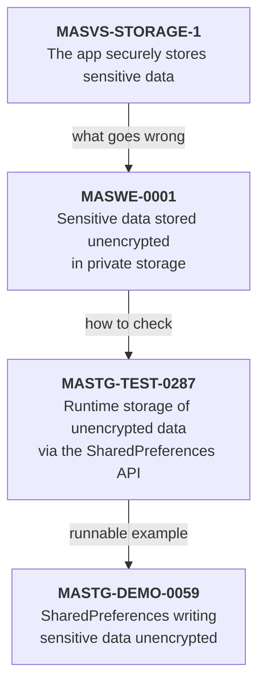

# Part 1: Understanding the threat

## Chapter 1: What an attacker can actually do

In 2022, researchers at CloudSEK scanned mobile apps with their BeVigil search engine and reported **3,207 apps** shipping valid Twitter API consumer keys and secrets. In **230** of them, all four credentials needed to act as the app's linked accounts were sitting in the package: enough to read direct messages, post, and follow or unfollow *(reported)*. Nobody had to break anything. They unzipped the apps and read them. ([The Hacker News](https://thehackernews.com/2022/08/researchers-discover-nearly-3200-mobile.html), [Security Magazine](https://www.securitymagazine.com/articles/98104-3207-apps-are-leaking-twitter-api-keys))

Every design decision in mobile security follows from an accurate picture of the adversary's capabilities. Most bad designs come from an inaccurate one, usually from imagining the attacker as a stranger on the network, when in fact the attacker may own the device your code is running on.

### 1.1 The device is not yours

When your app runs on a user's phone, your code is executing inside an environment that person fully controls. If that person is an attacker, or the device is rooted, jailbroken, emulated or simply instrumented, the assumptions you carried over from server-side development stop holding.

Concretely, assume an attacker can do all of the following, on both platforms, at will.

**Read your code.** An APK is a ZIP file. [JADX](https://github.com/skylot/jadx) turns its DEX bytecode (Android's compiled code format) back into readable Java in minutes. Kotlin compiles to the same bytecode, so it decompiles to Java that is only slightly stranger. App Store binaries are encrypted with Apple's FairPlay DRM, but that barely slows anyone down. The binary has to be decrypted in memory to run, so an attacker with a jailbroken device dumps the decrypted app (the MASTG lists tools such as frida-ios-dump) and opens it in Ghidra, Hopper or radare2. Your class names, method flow, API endpoint structure and any logic you wrote to make security decisions are all legible. R8, Android's build-time code shrinker, renames classes and removes unused code. Commercial obfuscators can also scramble control flow and encrypt strings. Both slow an analyst down; neither stops one who is willing to spend an afternoon (Chapter 14).

**Read every constant in the binary.** Run `strings` over your own release build (the **Try it** at the end of this chapter shows how). Whatever comes out, an attacker already has: API keys, endpoint URLs, encryption keys, debug flags, internal hostnames. It takes thirty seconds, and it's the single most educational experiment in this book.

**See all your traffic in cleartext.** On a device they control, an attacker can put themselves in the middle of your TLS connections and read everything through mitmproxy or Burp Suite. How much effort that takes depends on the platform:

- **iOS:** installing a certificate profile and turning on full trust for it in Settings is enough for apps that use the default trust evaluation. No jailbreak is needed.
- **Android:** apps targeting Android 7 or later ignore user-installed certificate authorities, so the attacker roots the device and adds a system CA (harder since Android 14 moved the root store into a signed module, but documented), repackages your app with a permissive network security configuration, or uses Frida to switch off certificate checks.

TLS protects you from a stranger on the coffee-shop network. It doesn't protect you from the person holding the phone. Pinning raises the effort, and Chapter 8 argues about whether that's worth it, but it doesn't change this conclusion.

**Modify behaviour at runtime.** Frida attaches to your process and lets an attacker replace any method's implementation while the app runs. On a rooted or jailbroken device that's trivial. On a stock device, the attacker repackages your app with Frida's *gadget* library embedded and installs that. A function that returns `true` when the device is rooted can be made to return `false`. A biometric callback can be invoked with no biometric. A certificate validator can be replaced with one that accepts everything.

**Read process memory.** Anything you decrypt "temporarily" exists in memory, and with root or an injected agent, memory is readable. That's why "we decrypt it just before use" is not a mitigation against this attacker.

**Read local storage.** On a rooted or jailbroken device, the private sandbox is open: `/data/data/<package>/` on Android, the app's container under `/var/mobile/Containers/Data/Application/` on iOS. SQLite databases, preference files, cached responses and log files are all there.

**Repackage and redistribute.** Your app can be modified, re-signed with a different key and handed out. Users who sideload it won't notice. Android's developer verification requirement, starting 30 September 2026 (Chapter 0.4), raises the cost of mass redistribution. It does nothing about an attacker who sideloads a modified copy onto *their own* device, which is the case that matters for everything else on this list.

### 1.2 What follows from this

Once you accept that list, one principle organises everything else:

> **Make secrets useless if found, not impossible to find.**

Don't spend your budget trying to prevent extraction. You'll lose, and not narrowly. Spend it making sure that whatever gets extracted is worthless without a server-side check the attacker doesn't control. The Twitter keys above weren't dangerous because they were findable; every key in every app is findable. They were dangerous because they worked on their own.

Three consequences deserve stating outright, because teams violate them constantly.

**The client is never the trust boundary. Your server is.** Any decision that matters (whether this user may transfer money, what this item costs, whether this account may be modified) is made on the server, or it isn't made securely at all.

**Client-side checks produce signals, not verdicts.** Root detection tells your backend "this session looks unusual." It doesn't tell your app "refuse this user." The distinction sounds pedantic and is load-bearing. Chapter 14 explains exactly why.

**Defence in depth means genuinely independent layers.** Each layer must reduce risk on its own, because you have to assume any single layer will be defeated. Layers that all fail together are one layer in a costume.

### 1.3 Who is actually attacking you

"The attacker" isn't one person, and treating them as one leads to spending money in the wrong places. In practice you face four groups with very different economics *(reasoned)*.

**The opportunist** runs automated tooling against many apps, looking for cheap wins: an exposed API key, an unauthenticated endpoint, a token in cleartext. They won't spend an hour on you. Almost every control in this book stops them, and this is where obfuscation and basic hygiene pay for themselves.

**The cloner** repackages your app to inject ads, steal credentials or bypass payment. They need your binary to run modified. Signature verification, attestation and integrity checks raise their cost materially.

**The fraudster** uses your app as intended, at scale, against your business logic: creating accounts, abusing promotions, laundering transactions, draining a metered resource. Client-side controls barely touch them. Backend risk scoring, rate limiting and attestation used as a signal are what work.

**The targeted adversary** wants one specific thing badly and has time and money. They'll defeat every client-side control you ship. What you can do is make sure that defeating them yields nothing without also compromising your backend, and that you notice.

The OWASP MAS profiles (§3.2) describe the same spread from the other end, as the attacker each profile assumes:

| Attacker | What they control | Closest MAS profile | What actually works |
|---|---|---|---|
| Opportunist | Your public binary and API | MAS-L1: other apps are the adversary, the OS is trusted | Hygiene: no secrets in the app, TLS defaults, server-side authorisation |
| Cloner | A modified copy of your app | MAS-R: the user is the adversary | Attestation, signature checks, server-side entitlement |
| Fraudster | Genuine devices and accounts, at scale | None: they don't break the app, they use it | Rate limits, risk scoring, business-logic checks on the server |
| Targeted adversary | A rooted device, time, possibly physical access | MAS-L2 (OS untrusted) plus MAS-R | Hardware-backed keys, server-side decisions, detection and response |

Turned around, the same analysis tells you what each of the book's main controls buys you against each attacker *(reasoned)*:

| Control | Opportunist | Cloner | Fraudster | Targeted |
|---|---|---|---|---|
| Hygiene: no secrets in the app, TLS defaults, no debug leftovers (§14.1) | High | Some | None | Some |
| Certificate pinning (Chapter 8) | Some | Some | None | Some |
| Attestation: Play Integrity, App Attest (Chapters 9, 10) | Some | High | Some | Some |
| Biometric-bound keys (Chapter 11) | None | Some | None | High |
| Obfuscation (Chapter 14) | High | Some | None | None |
| Tamper and signature checks (Chapter 14) | Some | High | None | None |
| Server-side risk scoring and rate limits (§12.5) | Some | Some | High | Some |
| BFF: secrets and decisions on your server (§12.3) | High | High | Some | High |

Only server-side risk scoring holds up well against the fraudster; the BFF helps because it's where your business-logic checks live, but it doesn't spot abuse on its own. Against the targeted adversary, what holds up is whatever keeps the decision or the key material out of their reach: the BFF, and hardware-bound keys whose signatures your server checks. Everything that runs purely on the client, obfuscation and tamper checks included, they'll eventually defeat. That pattern is the argument of Chapter 12.

The reason to name them separately is triage. A news app worries about the opportunist. A banking app worries about all four. Knowing which one a control addresses stops you arguing about obfuscation when your real problem is that your API trusts a client-supplied user ID.

**Key takeaways**

- Assume the attacker can read your code and constants, see and change your traffic, hook any function, and read your storage and memory.
- Make secrets useless if found. Anything in the app package is public.
- The server makes every decision that matters. Client checks are signals.
- Name the attacker a control is for. The fraudster doesn't care about your obfuscation.

**Try it**

1. Pull the strings out of your own release build. An APK is a ZIP, so extract the DEX files first:

    ```bash
    # Android: search the compiled code of your release APK
    unzip -o app-release.apk 'classes*.dex' -d apk-dex
    strings -n 8 apk-dex/classes*.dex | grep -Ei 'api[_-]?key|secret|token|password|https?://' | sort -u

    # iOS: your own archive is not FairPlay-encrypted, so read the executable directly
    strings -n 8 MyApp.xcarchive/Products/Applications/MyApp.app/MyApp \
      | grep -Ei 'api[_-]?key|secret|token|password|https?://' | sort -u
    ```

    **Pass:** nothing that would let someone call a paid or privileged API on your behalf. **Fail:** any live credential. Rotate it today and read §15.2. Repeat for `lib/*/*.so`, `assets/` and `resources.arsc` (open the APK in JADX to see decoded resources), because keys hide there too.
2. Open the same APK in JADX, search for `isRooted`, `pinning`, `biometric` or your own security class names, and time how long it takes to find the decision point. That number is your attacker's cost.
3. Practise on a target that is meant to be broken: [Android UnCrackable Level 1](https://mas.owasp.org/crackmes/Android/) from the OWASP MAS crackmes. Find the secret with JADX alone, without running the app.

---

## Chapter 2: The economics of the numbers

You'll be asked to justify security work in money. Use current figures and understand what they measure, because a stakeholder who catches you quoting a stale number will discount everything else you say. The reports below are annual, and each new edition replaces the last. This chapter reflects the editions available in September 2026.

### 2.1 What breaches cost

IBM's *Cost of a Data Breach* report, researched by the Ponemon Institute, is the standard reference. The [2026 edition](https://www.ibm.com/reports/data-breach), released 29 July 2026, covers **602 organisations** in 16 countries and regions and 17 industries, breached between March 2025 and February 2026.

- The global average cost reached **$4.99 million**, up 12% year on year and a record, driven by higher detection, escalation and lost-business costs.
- The United States averaged **$11.5 million**, more than twice the global figure.
- The mean time to identify and contain a breach rose to **247 days** (about 183 to identify and 64 to contain), up from 241 and ending a five-year decline *(reported)*.

Watch the trajectory, because people quote whichever year suits them. 2024 was $4.88 million. 2025 *fell* to $4.44 million, the first decline in five years. 2026 rose to a record. If someone cites $4.88 million in 2026, they're two reports behind.

IBM's AI finding grew sharply. In the words of its [press release](https://newsroom.ibm.com/2026-07-29-ibm-study-one-in-four-malicious-breaches-are-ai-enabled,-costing-companies-6-million-on-average), **one in four malicious breaches were AI-enabled**, "a 56% increase over last year", and those breaches cost an average of **$6 million**, "roughly $1 million more than the global breach average". §29.2 has the detail.

Verizon's *Data Breach Investigations Report* is the other annual reference, and it measures something different: *how* breaches start, not what they cost. The [2026 DBIR](https://www.verizon.com/about/news/breach-industry-wide-dbir-finds), released 19 May 2026, found **exploitation of vulnerabilities** was the leading way in, at **31%** of breaches, overtaking stolen credentials for the first time in 19 years of the report. Third-party involvement reached **48%**. It also found mobile social engineering (fake texts and calls) outperforming email phishing, a reason to treat SMS codes and links as weak points (§29.2).

- IBM: <https://www.ibm.com/reports/data-breach>
- Reporting on the IBM 2026 findings: <https://www.infosecurity-magazine.com/news/cost-of-a-data-breach-5m-ibm/>
- Verizon DBIR: <https://www.verizon.com/business/resources/reports/dbir/>

### 2.2 What leaks look like

GitGuardian's [*State of Secrets Sprawl 2026*](https://blog.gitguardian.com/the-state-of-secrets-sprawl-2026/), the fifth edition, published 17 March 2026, found **28.65 million** new hardcoded secrets added to public GitHub commits in 2025, up 34% and the largest single-year jump it has recorded. Since 2021 leaked secrets have grown 152%, while the public developer base grew 98%.

More usefully, it found that more than **64%** of secrets confirmed valid in 2022 were still valid when retested in January 2026. Leaking is common. Remediating is rare. That asymmetry is the real problem, and it's why Chapter 15 cares more about rotation than detection.

Two findings matter specifically to modern teams.

**AI tooling is now a leak source in its own right.** Leaked secrets for AI services reached 1,275,105, up 81%, and eight of the ten fastest-growing categories of leaked secret were AI-related. Commits co-authored by one AI coding assistant, Claude Code, which is identifiable by the co-author trailer it adds to commits, leaked secrets at **3.2%** against a **1.5%** baseline across all public commits. GitGuardian's own caveat is fair: developers still decide what to accept and push. Treat this as evidence that AI-assisted work needs the same secret scanning as everything else, not as a figure for "all AI tools". **MCP configuration files** alone exposed **24,008** unique secrets, 2,117 of them verified valid, partly because popular MCP setup guides tell you to paste API keys into config files.

**Leaks have moved out of source code.** In the data GitGuardian analysed from the second Shai-Hulud attack (a self-replicating npm worm, §15.1), **59%** of compromised machines were CI/CD runners, the machines that build and ship your code (Chapter 15), rather than developer laptops. And about **28%** of secret incidents originated entirely outside code repositories, in Slack, Jira and Confluence. Those were 13 percentage points more likely to be rated critical.

- <https://blog.gitguardian.com/the-state-of-secrets-sprawl-2026/>
- <https://www.gitguardian.com/state-of-secrets-sprawl-report-2026>

### 2.3 How to use these honestly

Misusing these numbers costs you credibility permanently, so two cautions.

**First, these are enterprise averages.** A mobile security incident at a mid-sized company usually costs far less than $4.99 million. If you present the average as your exposure, someone will eventually notice, and every future request you make will be discounted. Say "the industry average for a full enterprise breach is X; our realistic exposure is Y, and here's how I got Y."

**Second, resist the temptation to invent ranges.** Any "$50,000 to $500,000 per incident" figure you've seen is an estimate someone made up and everyone repeated. If you need a number for your own organisation, derive it from inputs you can defend:

| Component | Where the input comes from |
|---|---|
| Users affected | Your analytics: active users of the affected feature or version |
| Notification and credit monitoring | Per-user cost from your legal team or a vendor quote |
| Support load | Your support team's cost per contact × expected contact rate |
| Engineering and incident response | Team day rate × days, including the forced release and store review |
| Regulatory exposure | Your regulator's published penalty framework, not a headline fine |
| Fraud losses | Your fraud team's historical loss rate for the affected flow |

That number will be defensible. The borrowed one won't be. §29.4 walks through the calculation.

> **Trap:** quoting last year's report. IBM publishes each July, Verizon each spring, GitGuardian each March. Before a number goes into a slide, check the edition year on the report itself, not on the blog post that quoted it.

**Key takeaways**

- IBM 2026: $4.99 million global average (a record), $11.5 million in the US, 247 days to identify and contain.
- Verizon 2026: vulnerability exploitation is now the top way in, and mobile social engineering outperforms email phishing.
- GitGuardian 2026: 28.65 million new public secrets, and most secrets confirmed valid in 2022 were still valid in 2026.
- Present industry averages as context. Derive your own exposure from your own inputs.

**Try it**

1. Fill in the table in §2.3 for one feature of your own app, using real inputs from your analytics and support teams. Mark every input you had to guess as *(estimate)*.
2. Find the last security business case your organisation wrote. Check every statistic's edition year against the current reports above.

---

## Chapter 3: The standard, and how its pieces fit

You're halfway through an audit. The report template asks for "MASVS L2" findings, the tester's notes cite `MASWE` IDs from a 2025 blog post, and half the MASTG test links open pages with a deprecation banner. Each of those is a sign that the OWASP mobile standard has moved and the documents around you haven't. OWASP publishes four separate things in this space, they have all changed recently, and people conflate them constantly. Twenty minutes getting them straight gives you the vocabulary that security teams, auditors and interviewers use.

### 3.1 The four pieces

Here is what each one is for.

**The OWASP Mobile Top 10** is an awareness list of commonly observed risks, maintained by its own project team. Its final 2024 release was the first update since 2016. It opens with *M1: Improper Credential Usage* and *M2: Inadequate Supply Chain Security*. Its job is to make risk legible to people who aren't specialists. It isn't a standard, and you can't verify an app against it.

The other three form the **OWASP Mobile Application Security (MAS)** project, known as the MSTG until a 2022 rebrand.

**MASVS**, the Mobile Application Security Verification Standard, is the standard: what must be true of a secure app. The current version is **v2.1.0**, released 18 January 2024, and it is still current in September 2026. It contains **eight categories holding twenty-four controls**, each with an ID like `MASVS-STORAGE-1` that a finding can point at. v2.1.0 added the MASVS-PRIVACY category.

**MASWE**, the Mobile Application Security Weakness Enumeration, fills the gap between high-level controls and low-level tests. It plays the role CWE plays for general software: it lists the specific things that actually go wrong. It appeared as a beta in July 2024. **MASWE v1.0.0**, the first stable release, came out on 17 August 2026 with **seventy-eight weaknesses**, every one fully written and each with a one-sentence requirement you can put in a policy or contract. OWASP counts 35 of the 78 as having no MASTG test yet.

**MASTG**, the Mobile Application Security Testing Guide, is how you verify all of it: tests, techniques, tools, knowledge articles, best practices and runnable demos, per platform. **v2.0.0**, released at the end of June 2026, is the first stable, non-beta release of the refactored guide. It completes a refactor that started in 2021 and broke the old book-like guide into roughly 860 individually referenceable, machine-readable components. It no longer ships the MAS Checklist spreadsheet (or a PDF). The website and repositories are the authoritative source.

The chain runs from requirement to runnable proof:



*Figure 4: How the OWASP MAS pieces connect, from requirement to runnable proof*

Read it top to bottom: the **control** says what must be true, the **weakness** says what goes wrong, the **test** says how to check for it on one platform, and the **demo** is a small app and script that shows the test finding it. Every v2 test names the weakness it checks, and every weakness names the controls it violates.

Learn that chain. It's how you turn "make the app secure" into something a developer can fix and a tester can confirm.

**Two things to watch when you look IDs up.**

> **Trap:** MASWE IDs from before August 2026 may point at the wrong weakness. The beta had 119 entries. For v1.0.0, OWASP merged 47, renamed and rescoped 72, created 6 new ones, and renumbered everything once so the IDs run consecutively by category. Old blog posts, tool reports and even some OWASP release notes cite beta numbers. From v1.0.0 on, OWASP says IDs are stable: new weaknesses get new numbers, and existing ones are never reused. If an ID's title doesn't match what the source is describing, check the [beta-to-v1.0.0 mapping](https://github.com/OWASP/maswe/releases/tag/v1.0.0).

> **Trap:** MASTG v1 tests are deprecated. The low-numbered tests are the original v1 tests. With v2.0.0 they are "no longer maintained", kept on the website only "for a limited time" behind a *Show Deprecated* switch, and each carries a banner linking to the atomic v2 tests that replace it. `MASTG-TEST-0001` (local storage), for example, is covered by seven v2 tests, and `MASTG-TEST-0044` by two. **Check the page for a banner before you cite a test.** Where this book cites a v1 ID because it's still the clearest pointer to a topic, it says so. The page is the authority, not the book.

### 3.2 The levels that are not levels any more

This is the single most common way to date yourself in a security conversation.

Before MASVS v2.0.0 (April 2023), the standard contained verification levels: L1 as a baseline, L2 adding defence in depth for apps handling sensitive data, and R for resilience against reverse engineering.

Those levels **no longer live in MASVS**. They were moved into the MASTG as *testing profiles*, reworked again during the 2026 MASWE refactor, and now have their own section at [mas.owasp.org/Profiles](https://mas.owasp.org/Profiles/). Each profile is defined by the attacker it assumes:

| Profile | Name | Assumes | Recommended for |
|---|---|---|---|
| **MAS-L1** | Essential Security | The OS can be trusted; other apps are adversaries; the user isn't | Every app, as a baseline |
| **MAS-L2** | Advanced Security | The OS can't be trusted (rooted or jailbroken); third parties, possibly with physical access, are adversaries | Apps with high-risk data or sensitive functions: health, finance |
| **MAS-R** | Resilient Security | The user of the device is the adversary: reverse engineers, cheaters | Apps protecting their own business logic or assets. Always *on top of* L1 or L2, never alone |
| **MAS-P** | Baseline Privacy | Not attacker-centric; focuses on personal-data handling | Every app that handles user-sensitive data |

OWASP has also published a first *specialised* profile, **MAS-EUDIW**, for EU Digital Identity Wallets. It's built with Dutch, Belgian and Finnish government bodies, draws on controls from all four base profiles, and maps them to the EU's wallet risk register.

The profiles are attached to the catalogue itself: every MASWE weakness says which profiles it belongs to. That makes them useful in design as well as in testing. For example, `MASWE-0001` (sensitive data stored unencrypted in *private* storage) is tagged **L2**, not L1. OWASP's baseline assumes the sandbox protects private files, which is exactly §6.4's argument.

So the correct phrasing is "the MAS-L2 profile," not "MASVS L2." Likewise, if a blog post says "MSTG" rather than "MASTG", or cites L1, L2 and R as MASVS levels, it predates the refactor, and its API-level detail is probably stale too.

### 3.3 What OWASP will not do for you

OWASP, as a vendor-neutral not-for-profit, **does not certify any vendors, verifiers or software**. The [MASVS says so directly](https://mas.owasp.org/MASVS/04-Assessment_and_Certification/), and warns that trust marks claiming MASVS certification aren't vetted by OWASP. Companies may still sell assurance services against the MASVS, provided they don't claim it's official OWASP certification. Some real programmes build on the standard. Google's App Defense Alliance MASA and CREST OVS both reference MASVS and MASTG, but they are those organisations' schemes, not OWASP's.

What you can always do is publish your own verification statement: which profile you tested against, which controls you meet, how you tested each one, and the date *(reasoned)*. That can be more credible than a badge, because anyone holding the MASTG can check it.

Two more limits worth knowing:

- **The MASVS covers the app, not your backend.** It says so outright, and points you to the [OWASP ASVS](https://owasp.org/projects/asvs) for servers and APIs. An assessment that passes every MASVS control can still ship a server that hands out other users' data (Chapter 0.3).
- **Tools alone can't complete a MASVS verification.** The MASVS is explicit that automated scanners help but aren't sufficient. Someone has to understand the app's architecture and business logic.

The MAS documents are licensed under Creative Commons Attribution-ShareAlike 4.0, with no fee.

### 3.4 The tension inside the standard

Worth knowing early, because it'll confuse you otherwise. **`MASVS-NETWORK-2` says "The app performs identity pinning for all remote endpoints under the developer's control." OWASP's own [Pinning Cheat Sheet](https://cheatsheetseries.owasp.org/cheatsheets/Pinning_Cheat_Sheet.html), asking whether you should pin, answers "probably never."** *(contested)*

Both are OWASP, and both are current. They're less contradictory than they look. The scoping phrase "under the developer's control" does a lot of work, and the cheat sheet's own rule ("if you don't control the client and server side of the connection, don't pin") makes controlling both ends a precondition for pinning, not an exemption from its "probably never". That precondition is exactly the scope MASVS-NETWORK-2 names. Chapter 8 unpacks the rest. But discovering the apparent conflict mid-audit is disorienting. Now you know.

**Key takeaways**

- Four things: the Mobile Top 10 (awareness), MASVS (what must be true), MASWE (what goes wrong), MASTG (how to check).
- Current versions, September 2026: MASVS v2.1.0, MASWE v1.0.0, MASTG v2.0.0.
- Say "the MAS-L2 profile", never "MASVS L2". There are now four base profiles: L1, L2, R and P.
- MASWE IDs were renumbered once, in August 2026, and MASTG v1 tests are deprecated. Check the page before you cite an ID.
- OWASP certifies nothing, and the MASVS doesn't cover your backend.

**Try it**

1. Take one finding from your last security review or pen test. Trace it along the chain: find the MASVS control, the MASWE weakness, and the MASTG test for your platform. If you can't find a test, check whether that weakness is one of the 35 with none yet.
2. Open [`MASTG-TEST-0001`](https://mas.owasp.org/MASTG/tests/android/MASVS-STORAGE/MASTG-TEST-0001/), follow its deprecation banner, and list the v2 tests that replace it. Then do the same for any v1 test ID in your own team's templates.
3. Read the four profile pages and decide which ones your app should be assessed against. Write one sentence per profile saying why it does or doesn't apply.

Primary sources:

- MAS project and news — <https://mas.owasp.org/>
- MASVS — <https://mas.owasp.org/MASVS/>
- MASWE — <https://mas.owasp.org/MASWE/> · v1.0.0 release — <https://mas.owasp.org/news/2026/08/17/maswe-v100-release/>
- MASTG — <https://mas.owasp.org/MASTG/> · v2.0.0 release — <https://github.com/OWASP/mastg/releases/tag/v2.0.0>
- MAS Profiles — <https://mas.owasp.org/Profiles/>
- OWASP Mobile Top 10 — <https://owasp.org/www-project-mobile-top-10/>

---
