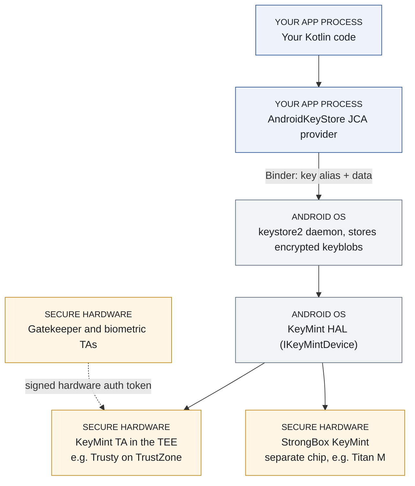
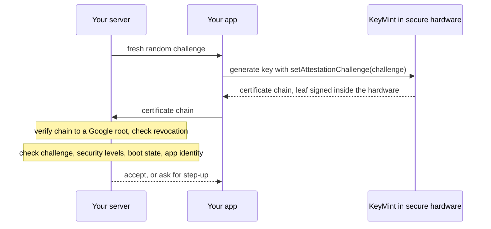
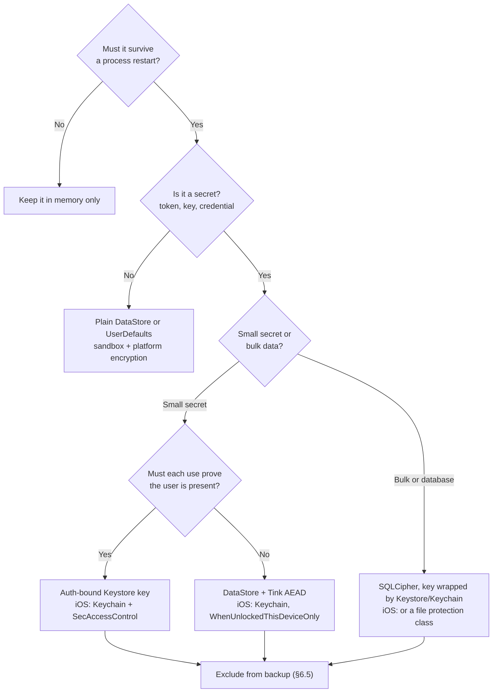

# Part 2: Data at rest

## Chapter 4: How platform key storage actually works

A security reviewer asks one question about your token storage: *"If someone roots this phone, can they take the key off it?"* You answer "it's in the Keystore". That is the start of an answer, not the answer. Whether the key can be copied, merely used, or read in plain text depends on hardware you never see and flags you may never have set.

This chapter is the mechanism underneath. Once you can draw it, you can answer the reviewer's question for any device.

### 4.1 The Android Keystore, from the top down

Start with the short version. Your app never holds a hardware-backed key: it holds a **handle** (an alias) that names the key. The key itself lives in secure hardware that Android cannot read. Each time you use the key, that hardware checks the conditions you attached to it (an unlocked device, a recent fingerprint) and only then does the work, handing back the result and never the key.

The diagram shows the layers a request passes through. You do not need every name in it to use the Keystore well; the subsection after it explains them for when you do.



*Figure 5: The Android Keystore stack: your process holds a handle, the key stays in secure hardware*

#### Under the hood

Skip this on a first read; come back when a reviewer asks where the key really is.

The `AndroidKeyStore` you call from Kotlin is a Java Cryptography Architecture (JCA) provider: a plug-in behind the standard `KeyStore`, `Cipher` and `Signature` classes. It runs **inside your app's own process**, and it does not hold your keys. It forwards each request over Binder (Android's inter-process call mechanism) to a system daemon.

That daemon is **keystore2**, introduced in Android 12 and written in Rust. Rust matters here because key handling is exactly the kind of code where a memory-safety bug is catastrophic. keystore2 stores **keyblobs**: your key material, encrypted so that the daemon can store it but **cannot use or reveal it**. Even the system service that holds your key cannot read it. That property is the foundation of the design.

Below the daemon sits a hardware abstraction layer (HAL: the interface Android uses to talk to vendor hardware) implementing `IKeyMintDevice`. **KeyMint** is the current HAL. It replaced the older **Keymaster** in Android 12, and KeyMint 2 (Android 13) added Curve25519 for signing and key agreement. Behind the HAL runs the **KeyMint trusted application (TA)**: software in a secure context, most often ARM TrustZone, the processor's hardware-isolated "secure world". The TA is the only component that ever sees raw key material. It performs every operation and checks every access condition on the key before allowing its use.

So when your code "encrypts with a Keystore key", this is what physically happens. Your process sends the plaintext and the key alias to keystore2. keystore2 passes the encrypted keyblob and the request to the TA. The TA decrypts the keyblob inside secure hardware, checks the key's authorisations, performs the operation, and returns only the result. **For a hardware-backed key, the key material never enters your process and never enters Android itself.** For a `SOFTWARE` key (§4.2) it lives in the OS, and the OS is all that protects it.

One more component matters. **Gatekeeper** is the TA that verifies the user's PIN, pattern or password. Fingerprint and face checks go through the biometric HAL and their own TAs instead. Each one, on success, issues a signed **hardware auth token** that KeyMint verifies before it will use an **authentication-bound key** (a key usable only after the user has authenticated). Despite the name, a hardware auth token has nothing to do with the OAuth access and refresh tokens of Chapter 0.3: it is a short-lived message between secure components that never reaches your code. That machinery is what makes Chapter 11's biometric binding real rather than decorative.

The algorithm list keeps growing. Android 17 added **ML-DSA** (a post-quantum signature scheme standardised by NIST) to the Keystore, on devices whose hardware supports it ([Android 17 Beta 4](https://android-developers.googleblog.com/2026/04/the-fourth-beta-of-android-17.html)).

- <https://source.android.com/docs/security/features/keystore>
- <https://developer.android.com/privacy-and-security/keystore>

### 4.2 TEE versus StrongBox, and why the difference is real

Every Keystore key has a **security level**, and you can query it. On API 31 and later, `KeyInfo.getSecurityLevel()` returns one of five constants, all prefixed `KeyProperties.SECURITY_LEVEL_`. On API 30 and below, all you have is the boolean `KeyInfo.isInsideSecureHardware()`, deprecated since API 31.

| Constant | Where the key lives | Treat it as |
|---|---|---|
| `SOFTWARE` | In the Android OS | Extractable on a compromised device |
| `TRUSTED_ENVIRONMENT` | In the TEE on the main processor | Hardware-backed |
| `STRONGBOX` | In a separate secure chip | Hardware-backed, tamper-resistant |
| `UNKNOWN_SECURE` | Secure hardware of an unreported kind | Hardware-backed |
| `UNKNOWN` | Not reported | Unknown: do not assume hardware |

The first three are the ones you will actually see, and each deserves a closer look.

**`SOFTWARE`** means the OS is the only thing protecting the key. On a rooted or compromised device, treat the key as extractable. It beats a key in your APK. It is not hardware protection.

**`TRUSTED_ENVIRONMENT`** means the key lives in the **TEE** (Trusted Execution Environment): an isolated area of the *main* processor, walled off from Android by hardware. If Android is fully compromised, the TEE still holds. An attacker with root can ask the TEE to *use* your key on that device. They cannot *copy* it off the device. Google's open-source TEE is **Trusty**; other TEEs exist and Android supports them.

**`STRONGBOX`** means the key lives in a separate, purpose-built secure processor: an embedded Secure Element or an on-chip secure unit with its own CPU, storage and random-number generator. Titan M in Pixel phones is the familiar example. StrongBox arrived in Android 9 (API 28) and resists physical tampering and side-channel attacks better than a TEE.

Three practical consequences follow, and they are where designs go wrong.

**StrongBox is not universal.** The Android 17 compatibility definition still only says devices with a dedicated secure processor are "STRONGLY RECOMMENDED" to support it, and that it "will likely become a requirement in a future release" ([Android 17 CDD §9.11.2](https://source.android.com/docs/compatibility/17/android-17-cdd)). The wording has not changed from Android 16. Check `PackageManager.FEATURE_STRONGBOX_KEYSTORE`, request it, catch `StrongBoxUnavailableException`, and choose your fallback deliberately.

**StrongBox is slower and supports less.** Google's list is RSA-2048, AES-128 and AES-256, ECDSA and ECDH on P-256, HMAC-SHA256 and Triple DES. Google also warns it is slower, more resource-constrained and handles fewer concurrent operations. Reserve it for keys that justify it. Ask for an exotic configuration and key generation fails on devices that would otherwise have served you fine.

**Silent fallback is a finding, not a fallback.** Suppose your payment flow requests StrongBox, fails, and quietly settles for a software key without telling anyone. You now have a control that reports success while providing nothing. Either fall back to the TEE explicitly and record that you did, or require server-side step-up authentication for that flow on that device. Write down which. One question separates people who have shipped hardware-backed crypto from people who have only read about it: *what does your app do when StrongBox is unavailable?*

### 4.3 The iOS Keychain, from the top down

Apple's design differs in structure but rhymes in principle.

The Keychain is **a single SQLite database** on the file system, shared by all apps and managed by the **securityd** daemon. There is one database, not one per app. When your code calls a Keychain API, securityd decides what your process may see by reading your `keychain-access-groups`, `application-identifier` and `application-group` entitlements. Sharing between apps is possible only for apps from the same developer, enforced through code signing and provisioning profiles.

Each item is encrypted with **two AES-256-GCM keys**. A **metadata key** encrypts every attribute except the secret value, so securityd can search quickly. That key is protected by the Secure Enclave but cached in the Application Processor for speed. A **per-row secret key** encrypts `kSecValueData`, the secret itself, and using it **always requires a round trip through the Secure Enclave**.

The split is worth understanding. Search stays fast because metadata decryption is cheap, while the part that matters cannot be read without the hardware taking part.

The **Secure Enclave** is a separate secure subsystem, present on A7 and later chips. It performs the cryptography for Data Protection key management and keeps Data Protection intact **even if the kernel is compromised**. Private keys created in it never leave it in plain text; neither your process nor the kernel ever sees them. A `SecKey` in your Swift is a *handle*, not the key.

Two constraints surprise people.

- **Algorithms are limited.** Through the Security framework, the Secure Enclave takes **NIST P-256 elliptic-curve keys only**. There is no RSA. Since iOS 26, CryptoKit also offers post-quantum **ML-KEM** and **ML-DSA** keys inside it (`SecureEnclave.MLKEM768`, `SecureEnclave.MLDSA65` and their larger variants).
- **It does not encrypt your data directly.** Its keys are for signing and key agreement. To protect data with it, you perform ECDH key agreement (or ML-KEM encapsulation) and derive a symmetric key from the result, rather than calling an encrypt function on an enclave key.

Access control lists on Keychain items are **evaluated inside the Secure Enclave**, and the key is released only when their conditions are met. That is why a biometric-gated Keychain item is genuinely protected and not just a UI prompt.

- <https://support.apple.com/guide/security/keychain-data-protection-secb0694df1a/web>
- <https://developer.apple.com/documentation/security/protecting-keys-with-the-secure-enclave>

### 4.4 Data Protection classes: the decision you keep getting wrong

Every Keychain item carries an accessibility class, set with `kSecAttrAccessible`. Every file carries an analogous **Data Protection class**. Both decide *when* the decryption key is available.

| Keychain class | File class | Readable when | Use it for |
|---|---|---|---|
| `kSecAttrAccessibleWhenUnlocked` | `NSFileProtectionComplete` | Only while unlocked. The key is discarded about 10 seconds after lock (with Require Password set to Immediately) | Tokens and secrets used in the foreground. Your default |
| `kSecAttrAccessibleAfterFirstUnlock` | `NSFileProtectionCompleteUntilFirstUserAuthentication` | After the first unlock since boot, then even while locked | Items background refresh needs. Apple names this use case |
| `kSecAttrAccessibleWhenPasscodeSetThisDeviceOnly` | — | Like "when unlocked", and only if a passcode is set | Your most sensitive items. They are destroyed if the passcode is removed |
| — | `NSFileProtectionCompleteUnlessOpen` | A file open at lock time stays usable; new files can still be written while locked | Downloads that must finish in the background |
| `kSecAttrAccessibleAlways` | `NSFileProtectionNone` | Always, even before first unlock | Nothing sensitive. The Keychain class is deprecated since iOS 12; the file class is not deprecated, but it protects nothing |

Two defaults are worth knowing. **Files your app creates default to `CompleteUntilFirstUserAuthentication`**, not `Complete`, so a file you never thought about is readable on a locked phone. And Apple's replacement for `Always` is explicit in its deprecation note: use `AfterFirstUnlock`.

Append **`ThisDeviceOnly`** to a Keychain class and the item never migrates to another device. It is still copied into a device backup, but encrypted with a key fused into that device's hardware, so it is useless if restored anywhere else. It also never syncs to iCloud Keychain. The `WhenPasscodeSetThisDeviceOnly` class goes further: it is not backed up at all.

The failure mode is depressingly consistent. Background refresh breaks because an item is `WhenUnlockedThisDeviceOnly`. The symptom is `errSecInteractionNotAllowed` (-25308) from `SecItemCopyMatching` while the phone is locked. Someone "fixes" it by switching to `kSecAttrAccessibleAlways`, dropping `ThisDeviceOnly` on the way. Now a token that needed an unlocked device is readable before the user has ever unlocked it, and it migrates to new devices too.

> **Trap:** the right fix is almost always to restructure *when* the work happens, not to weaken the class. If background refresh genuinely needs a credential, `AfterFirstUnlockThisDeviceOnly` is the considered answer, never `Always`.

This is not academic. The checkm8 bootrom exploit affects A5 to A11 devices (up to the iPhone X) and cannot be patched in software. Forensic tools built on it can extract data from a locked phone before first unlock. Without the passcode, the only Keychain items they recover are the `Always` ones ([Elcomsoft](https://blog.elcomsoft.com/2019/12/bfu-extraction-forensic-analysis-of-locked-and-disabled-iphones/)) *(reported)*. The class is the difference between "recovered" and "not recovered". Data Protection raises the bar a long way. It is not absolute against an attacker with your device, the right exploit and, eventually, the passcode.

### 4.5 A note on sharing

On Android, keys are per-app by default, and the Keystore's isolation is strong. Android 16 added a deliberate exception: `KeyStoreManager.grantKeyAccess()` lets your app grant another app, identified by its UID, the use of one specific key until you revoke it. Treat each grant as a trust decision you record, exactly like a keychain access group. See the [`KeyStoreManager` reference](https://developer.android.com/reference/android/security/keystore/KeyStoreManager).

On iOS, adding another app to your `keychain-access-groups` entitlement means **trusting that app completely**. Anything in the group can call `SecItemCopyMatching` on your items, including a compromised app under your own Team ID. The same applies to App Group containers you share with extensions. Access groups are a genuine feature with a genuine cost. List what is in yours.

### 4.6 Key authorizations: the conditions the hardware enforces

A key's protection is not only *where* it lives but *when* it may be used. You set those conditions once, at creation, and the secure hardware enforces them from then on. Nothing your app does later, and nothing a Frida hook does, can relax them.

On Android you set them on `KeyGenParameterSpec.Builder`:

| Setter (API level) | What the hardware enforces | Watch out for |
|---|---|---|
| `setUserAuthenticationRequired(true)` (23) | The key works only after the user authenticates | Needs a secure lock screen. Removing the lock screen permanently invalidates the key |
| `setUserAuthenticationParameters(timeout, type)` (30) | `timeout` 0 means authenticate for every use, via `BiometricPrompt` with a `CryptoObject`; above 0 means a window in seconds. `type` is `AUTH_BIOMETRIC_STRONG`, `AUTH_DEVICE_CREDENTIAL` or both | Replaces the deprecated `setUserAuthenticationValidityDurationSeconds` |
| `setInvalidatedByBiometricEnrollment(…)` (24) | Defaults to `true`: enrolling a new biometric destroys the key | Stops applying if the key also accepts the device credential or has a validity window. §11.3 |
| `setUnlockedDeviceRequired(true)` (28) | Symmetric and private-key operations fail while the device is locked | Public-key operations are never restricted, and before API 31 symmetric encryption was not either. Background work breaks, just as with iOS `WhenUnlocked` |
| `setIsStrongBoxBacked(true)` (28) | Generate the key in StrongBox or fail | §4.2's fallback decision |

On iOS, the equivalent is a `SecAccessControl` object passed as `kSecAttrAccessControl`, combining an accessibility class from §4.4 with flags:

| Flag | Meaning |
|---|---|
| `.biometryCurrentSet` | Face ID or Touch ID, **and** the enrolled set must not have changed since the item was created. The stolen-phone defence of §11.3 |
| `.biometryAny` | Any enrolled biometric, including one enrolled yesterday by a thief |
| `.userPresence` | Biometry or the device passcode |
| `.devicePasscode` | The passcode only |
| `.privateKeyUsage` | Required for a Secure Enclave private key to sign at all |
| `.or`, `.and` | Combine the constraints above |

The pattern is the same on both platforms. **Authorisation lives in the key, not in your `if` statement.** Chapter 11 builds biometric flows on exactly this.

### 4.7 The two platforms side by side

The mechanisms differ; the questions you ask of them do not. Use this table when you design a feature for both platforms, or when a reviewer asks how the Android and iOS halves compare.

| | Android Keystore | iOS Keychain and Secure Enclave |
|---|---|---|
| Hardware | TEE on the main processor (all modern devices); StrongBox secure chip on some (§4.2) | Secure Enclave on A7 and later; Keychain item keys also depend on it (§4.3) |
| Algorithms in hardware | AES, HMAC, RSA, EC (P-256 and others), Curve25519 from KeyMint 2, ML-DSA from Android 17 where supported; StrongBox narrower | Security framework: P-256 only. CryptoKit from iOS 26: ML-KEM and ML-DSA as well |
| Encrypt data directly with the hardware key? | Yes: an AES key does `Cipher` work in the TEE | No: derive a symmetric key by ECDH or ML-KEM (§4.3) |
| Biometric binding API | `setUserAuthenticationParameters` plus `BiometricPrompt` with a `CryptoObject` (§4.6, Chapter 11) | `SecAccessControl` with `.biometryCurrentSet` (§4.6, Chapter 11) |
| New biometric enrolled | Key destroyed by default (`setInvalidatedByBiometricEnrollment`) | Item unusable with `.biometryCurrentSet`; survives with `.biometryAny` |
| Backup behaviour | Keys are never backed up; restored ciphertext cannot decrypt (§6.5) | Items are backed up; a `ThisDeviceOnly` item restores only to the same device, and `WhenPasscodeSetThisDeviceOnly` is not backed up at all (§4.4) |
| Sharing with other apps | Per-app; `KeyStoreManager.grantKeyAccess()` from Android 16 (§4.5) | Keychain access groups within one Team ID (§4.5) |
| Query what you got | `KeyInfo.getSecurityLevel()` (§4.2); key attestation for your server (Chapter 5) | No per-key security-level query; check `SecureEnclave.isAvailable` (CryptoKit) before creating a key, and a Secure Enclave key fails to create if the hardware is absent. App Attest for your server (Chapter 10) |

**Key takeaways**

- The Keystore and Keychain hand your process a *handle*. For hardware-backed keys, the key material never reaches your code or the OS.
- Query the security level you actually got. `SOFTWARE` on a flow designed for hardware is a finding.
- StrongBox is optional, slower and narrower than the TEE. Decide and record your fallback.
- On iOS, the accessibility class decides when a secret is readable. `Always` is deprecated and is exactly what forensic tools recover.
- Put conditions of use in the key's authorisations, where the hardware enforces them.

**Try it**

1. On one physical Android phone and one emulator, generate an AES key with `setIsStrongBoxBacked(true)`, catch `StrongBoxUnavailableException`, retry without it, and log `KeyInfo.securityLevel` (§6.6 has the code). Explain the difference you see.
2. In an iOS test app, store an item as `WhenUnlockedThisDeviceOnly`. Lock the phone, trigger a background task that reads it, and confirm you get `-25308`. Then decide, in writing, whether that task should move to the foreground or the item should become `AfterFirstUnlockThisDeviceOnly`.

---

## Chapter 5: Key attestation — proving where a key lives

In February 2026, Google's key attestation began moving to a new root certificate. By April, most modern Android phones were presenting attestation chains that older server code rejected. Nothing changed in those apps. Their backends had hard-coded an assumption Google had warned about four years earlier.

The Keystore protects your key. **Attestation** lets your *server* verify that protection for itself, which is a different and more valuable thing. It is also a moving target, and this chapter shows you where it moves.

### 5.1 The problem it solves

Your app tells your backend, "I generated this key in hardware." Why would the backend believe it? A rooted device, an emulator or a modified build can claim anything. Key attestation is the cryptographic answer to that question.

Key attestation arrived in Android 7.0 with Keymaster 2. ID attestation, which can also vouch for hardware identifiers, followed in Android 8.0 with Keymaster 3.

### 5.2 How it works

The flow is worth memorising, because it is the shape of every attestation protocol you will meet, App Attest included (Chapter 10):



*Figure 6: Key attestation: the server's challenge comes back inside a certificate chain signed by the hardware*

1. Your **server** generates a random, single-use challenge (a nonce) and sends it to the app.
2. The **app** generates a key pair in the `AndroidKeyStore`, passing the challenge to `setAttestationChallenge()`.
3. **KeyMint, inside the secure hardware, signs a certificate for the new public key** using an attestation key. The leaf certificate carries a `KeyDescription` extension, identified by the OID `1.3.6.1.4.1.11129.2.1.17` (an OID, or object identifier, is the dotted number that names a certificate extension). It records the security level of the key and of the attestation, the boot state, the key's authorisations, and your challenge.
4. The app reads the chain with `KeyStore.getCertificateChain(alias)` and sends it to your server.
5. Your **server** verifies the chain up to a Google attestation root, checks every certificate against Google's revocation list, confirms the challenge is the one it issued, and reads the properties.

The crucial detail is where the information comes from. The hardware-enforced authorisation list is **collected or generated by code in the secure hardware and is not controlled by the platform**: it comes from the bootloader, or over a channel that does not require trusting Android. The OS cannot forge those claims, because the OS was never asked.

That is also the limit. The `KeyDescription` carries a `softwareEnforced` list alongside `hardwareEnforced`. Anything in the software list is only as trustworthy as the Android that wrote it. Read each field from the list you expect it in.

What a server should check, at minimum:

| Check | Why |
|---|---|
| Chain verifies to one of Google's current roots | Otherwise anyone can mint a chain |
| No certificate appears in the [revocation list](https://android.googleapis.com/attestation/status) | Leaked attestation keys are revoked there |
| `attestationChallenge` equals the challenge you issued, used once | Stops replay of an old, genuine chain |
| `attestationSecurityLevel` and `keyMintSecurityLevel` are `TrustedEnvironment` or `StrongBox` | The whole point of the exercise |
| `RootOfTrust.verifiedBootState` is `Verified` and `deviceLocked` is true | An unlocked bootloader means the OS can lie |
| `attestationApplicationId` matches your package name and signing-certificate digest | Stops a genuine chain from another app being passed off as yours |
| The client later signs a fresh challenge with the attested private key | Forces the attacker to hold the key, or keep a live signing proxy to a device that does |

Do not hand-roll this parser. Google publishes a [Kotlin verification library](https://github.com/android/keyattestation) and recommends migrating custom verifiers to it. §5.5 shows it in use.

- <https://source.android.com/docs/security/features/keystore/attestation>
- <https://developer.android.com/privacy-and-security/security-key-attestation>

### 5.3 The thing that will break your production app in 2026

Attestation keys used to be injected into each device at the factory. Google moved to **Remote Key Provisioning (RKP)**: optional from Android 12, mandatory from Android 13 as Google announced in 2022 (its attestation page now describes RKP support as optional under the Android 15 policy), and the only mechanism for devices launching with Android 16. RKP improves privacy substantially. Each app receives a different attestation key, keys rotate regularly, and Google's backend is split so that the server verifying a device's public key never sees the attestation keys attached to it. Google cannot correlate attestation keys back to a device ([Android Developers Blog, 2022](https://android-developers.googleblog.com/2022/03/upgrading-android-attestation-remote.html)).

It improves revocation too. A leaked factory key compromised every device that shared it. An RKP key can be revoked for a single device.

The operational consequence arrived this year. Google's attestation documentation announced that a new **ECDSA P-384 root** ("Key Attestation CA 1") would "begin signing attestation certificate chains on February 1, 2026" ([Google](https://developer.android.com/privacy-and-security/security-key-attestation)). RKP-enabled devices switched to it exclusively on **10 April 2026** *(reported)*. From that date, a verifier that trusts only the old RSA root rejects chains from most modern Android phones. Devices with factory-provisioned keys keep using the RSA root, so you must trust **both**.

None of this was a surprise. When Google introduced RKP in 2022, it warned that "the chain length is longer than it was previously, and is subject to change", and that the root "will eventually be updated from the current RSA key to an ECDSA key".

And it is not over. Android 17 "begins the transition of Remote Attestation to a fully PQC-compliant architecture", moving KeyMint's certificate chains to post-quantum algorithms ([Google, March 2026](https://blog.google/security/security-for-the-quantum-era-implementing-post-quantum-cryptography-in-android/)). No date for a post-quantum root has been published.

> **Trap:** hard-coding the root certificate, the chain length or the signature algorithm in your verifier. All three have changed or are changing. Load the roots from Google's published list, accept any chain length, and verify with a library that supports every algorithm Google announces.

The revocation list lives at the same URL it always has (`https://android.googleapis.com/attestation/status`). It is JSON: an `entries` object keyed by certificate serial number in lowercase hex. Each entry carries a `status` of `REVOKED` or `SUSPENDED`, an optional `reason` such as `KEY_COMPROMISE` or `SOFTWARE_FLAW`, and an optional expiry date. Honour its `Cache-Control` header rather than fetching it once at deploy time.

### 5.4 What attestation does not prove

Two honest limits.

It proves properties of a **key**, not the trustworthiness of a **user**. An attested key on a genuine device in the hands of a fraudster is still a fraudster.

And the mechanism is a target. Tools such as [**TEESimulator**](https://github.com/JingMatrix/TEESimulator) defeat hardware-backed key attestation for selected apps. They run AOSP's own reference KeyMint TA inside the real keystore daemon and sign attestations with a supplied (in practice, leaked) factory "keybox" (attestation key and certificates). The result is certificates generated exactly the way real hardware generates them, and therefore internally consistent. Researchers have also shown **relay attacks**: a genuine chain obtained on a clean phone is spliced into an app running on a rooted one ([Quarkslab, August 2026](https://blog.quarkslab.com/bypassing-android-hardware-attestation.html)).

Both attacks leave marks a good verifier can use. A leaked keybox ends up on the revocation list once Google detects it; until then it works. RKP devices never had a factory keybox to leak. A chain relayed from another app fails the `attestationApplicationId` check; Quarkslab added that one comparison and it rejected their relayed chain. A same-app relay must then answer §5.2's proof-of-possession challenge by relaying every signature to the clean phone as well. That is a live proxy, costly and fragile, but it is not stopped; Quarkslab proposes the check without having tested it against their relay. Attestation raises the bar considerably. It is not a wall, and a design that treats one attestation result as the final word is brittle. Feed it into a risk score alongside other signals; §12.2 and §12.5 cover how.

### 5.5 How to implement it

The table in §5.2 is your specification. This section turns it into server code: Kotlin on the JVM, using Google's [android/keyattestation](https://github.com/android/keyattestation) library for the parts you must not hand-roll (chain validation, revocation, extension parsing).

> **In practice:** the library is at **v0.1, which its own release notes call "a test release"**, and at the time of writing it is not published to Maven Central. Its build publishes to a local Maven directory, so build it from source, publish it to your internal repository, and pin the commit. I read the API below from the repository source on 24 September 2026; it may change before 1.0, and it is already moving: an app-identity check (an `expectedAttestationApplicationId` constructor parameter) was added and reverted upstream on that same day. If it lands, it replaces the manual `attestationApplicationId` block below. The README's example still names a result type (`ExtensionConstraintViolation`) that the source now calls `ConstraintViolation`, so trust the source over the README.

#### The app side: generate the key and send the chain

```kotlin
import android.security.keystore.KeyGenParameterSpec
import android.security.keystore.KeyProperties
import android.util.Base64
import java.security.KeyPairGenerator
import java.security.KeyStore
import java.security.spec.ECGenParameterSpec

/** Returns the attestation chain, leaf first, as Base64 DER strings for your API. */
fun attestedKeyChain(alias: String, serverChallenge: ByteArray): List<String> {
    val spec = KeyGenParameterSpec.Builder(alias, KeyProperties.PURPOSE_SIGN)
        .setAlgorithmParameterSpec(ECGenParameterSpec("secp256r1"))
        .setDigests(KeyProperties.DIGEST_SHA256)
        .setAttestationChallenge(serverChallenge)      // the server's one-time nonce
        .build()
    KeyPairGenerator.getInstance(KeyProperties.KEY_ALGORITHM_EC, "AndroidKeyStore")
        .apply { initialize(spec) }
        .generateKeyPair()
    val keyStore = KeyStore.getInstance("AndroidKeyStore").apply { load(null) }
    return keyStore.getCertificateChain(alias).map {
        Base64.encodeToString(it.encoded, Base64.NO_WRAP)
    }
}
```

#### The server side: verify, then check what the library leaves to you

The library validates the chain against both Google roots. Its `GoogleTrustAnchors` object is generated from a mirror of `https://android.googleapis.com/attestation/root`, which holds the 2022 RSA-4096 root and the P-384 "Key Attestation CA 1" (certificate CN `Key Attestation CA1`). It checks every serial against the revocation list and parses the `KeyDescription`. Its parser treats only `REVOKED` entries as revoked; if you want `SUSPENDED` keys rejected too, supply your own `revokedSerialsSource`. Its default constraints require the attestation and KeyMint security levels to match and not be `SOFTWARE`, and reject an imported rather than generated key and a missing root of trust. The code below still checks the security level itself, so a relaxed `ConstraintConfig` or a change to the pre-1.0 defaults cannot quietly accept a software key. It **returns** the boot state without enforcing it, and it does not check your app identity. Those two are yours.

```kotlin
import com.android.keyattestation.verifier.ChallengeChecker
import com.android.keyattestation.verifier.GoogleTrustAnchors
import com.android.keyattestation.verifier.SecurityLevel
import com.android.keyattestation.verifier.VerificationResult
import com.android.keyattestation.verifier.VerifiedBootState
import com.android.keyattestation.verifier.Verifier
import com.android.keyattestation.verifier.getGoogleRevocationStatusFromWeb
import com.android.keyattestation.verifier.keyDescription
import com.google.common.util.concurrent.Futures
import com.google.common.util.concurrent.ListenableFuture
import com.google.protobuf.ByteString
import java.security.PublicKey
import java.security.Signature
import java.security.cert.X509Certificate
import java.time.Duration
import java.time.Instant

/** Your nonce store. consume() must atomically delete the entry and return true only once. */
interface ChallengeStore {
    fun consume(sessionId: String, challenge: ByteArray): Boolean
}

/** The challenge must be one you issued to this session, and unused. This stops replay. */
class OneTimeChallenge(
    private val store: ChallengeStore,
    private val sessionId: String,
) : ChallengeChecker {
    override fun checkChallenge(challenge: ByteString): ListenableFuture<Boolean> =
        Futures.immediateFuture(store.consume(sessionId, challenge.toByteArray()))
}

/** The library's fetcher downloads the list on every call. Cache it, and fail closed. */
object CachedRevocations : () -> Set<String> {
    private val maxAge = Duration.ofHours(1)   // simplification: honour Cache-Control in your own fetcher
    @Volatile private var serials: Set<String> = emptySet()
    @Volatile private var fetchedAt: Instant = Instant.EPOCH

    @Synchronized
    override fun invoke(): Set<String> {
        if (Duration.between(fetchedAt, Instant.now()) > maxAge) {
            serials = getGoogleRevocationStatusFromWeb()   // throws on failure: fail closed
            fetchedAt = Instant.now()
        }
        return serials
    }
}

private val productionVerifier = Verifier(GoogleTrustAnchors, CachedRevocations, { Instant.now() })

sealed interface Attestation {
    data class Accepted(val publicKey: PublicKey, val strongBox: Boolean) : Attestation
    data class Rejected(val reason: String) : Attestation
}

fun verifyAttestation(
    chain: List<X509Certificate>,           // leaf first, as the app sent it
    sessionId: String,
    store: ChallengeStore,
    expectedPackage: String,
    expectedSignerDigests: Set<ByteString>, // SHA-256 of your signing certificate(s)
    verifier: Verifier = productionVerifier, // tests pass one with a pinned clock
): Attestation {
    val result = verifier.verify(chain, OneTimeChallenge(store, sessionId))
    if (result !is VerificationResult.Success) {
        return Attestation.Rejected(result::class.simpleName ?: "unknown")
    }

    // The library reports boot state; it does not enforce it.
    if (result.verifiedBootState != VerifiedBootState.VERIFIED || !result.deviceLocked) {
        return Attestation.Rejected("boot=${result.verifiedBootState} locked=${result.deviceLocked}")
    }

    // §5.2 wants both levels in hardware. securityLevel is the lower of the two, so SOFTWARE
    // means at least one is in software. The default constraints catch this; do not rely on it.
    if (result.securityLevel == SecurityLevel.SOFTWARE) return Attestation.Rejected("securityLevel=SOFTWARE")

    // keystore2 writes the app identity, so it sits in the software-enforced list.
    // It is trustworthy only because the boot checks above passed.
    val appId = chain.first().keyDescription()?.softwareEnforced?.attestationApplicationId
        ?: return Attestation.Rejected("no attestationApplicationId")
    if (appId.packages.none { it.name == expectedPackage }) return Attestation.Rejected("package")
    if (appId.signatures != expectedSignerDigests) return Attestation.Rejected("signer")

    return Attestation.Accepted(result.publicKey, result.securityLevel == SecurityLevel.STRONG_BOX)
}

/** Last row of §5.2's table: the client signs a second, fresh challenge with the attested key. */
fun provesPossession(publicKey: PublicKey, freshChallenge: ByteArray, signature: ByteArray): Boolean =
    Signature.getInstance("SHA256withECDSA").run {
        initVerify(publicKey)
        update(freshChallenge)
        verify(signature)
    }
```

Decode the app's Base64 strings with `CertificateFactory.getInstance("X.509")` before calling `verifyAttestation`. Issue the proof-of-possession challenge only after an `Accepted` result, and consume it once, like the first. The app signs it with `Signature.getInstance("SHA256withECDSA")` initialised with the Keystore private key. Store the public key against the account only after `provesPossession` returns `true`.

Three notes on this code. `result.securityLevel` is the lower of the attestation and KeyMint levels, so a `STRONG_BOX` result means both, and a `SOFTWARE` result means at least one is in software. The signer comparison is exact set equality, which is right for one signing key; if you have rotated your key with APK Signature Scheme v3, look at what your real chains carry before you tighten or loosen it. And the app must not branch on `Rejected`: the server turns it into a risk decision (§12.2, §12.5).

If you cannot adopt a pre-1.0 library, the manual route is the same list in the same order. Run a `java.security.cert` PKIX validation against both roots with the built-in revocation check switched off (Google's list is neither a CRL nor OCSP). Look up every serial in the status JSON yourself. Then parse the extension with the ASN.1 schema on [source.android.com](https://source.android.com/docs/security/features/keystore/attestation#schema). That parse is where hand-rolled verifiers go wrong, which is why Google recommends the library.

#### Verify it

Test the rejections, not just the happy path. Record a real chain from a test phone once, and keep it as a fixture along with the time you recorded it. RKP intermediates are short-lived and the `Verifier` checks certificate dates against its clock, so build the test verifier with that time pinned (`Verifier(GoogleTrustAnchors, CachedRevocations, { recordedAt })`) and pass it to `verifyAttestation`. Otherwise, once the intermediates expire, the replay test returns `PathValidationFailure` and never reaches the challenge check.

1. **Replay.** Submit the recorded chain a second time, or with a session whose challenge is already consumed. **Pass:** `Rejected("ChallengeMismatch")`. **Fail:** `Accepted`, which means your store's `consume` is not atomic or not single-use.
2. **Another app's leaf.** On the same device, generate an attested key in a second app you own (different package name or signing key), using a challenge your server issued, and submit that chain under your app's session. **Pass:** `Rejected("package")` or `Rejected("signer")`. **Fail:** `Accepted`, so you are not checking `attestationApplicationId`.
3. **Emulator or unlocked bootloader.** Submit a chain from an emulator or from a test device with an unlocked bootloader. **Pass:** a rejection: `PathValidationFailure` for an emulator, whose chain ends in a software root, or the boot-state check for an unlocked device. Note which one fired, so you know what your server actually caught.
4. **Revocation fetch fails.** Block `android.googleapis.com` from the test server after the cache has expired. **Pass:** `verifyAttestation` throws, and your endpoint answers with an error. **Fail:** `Accepted`.

**Key takeaways**

- Attestation lets your server verify the key's claims itself, instead of trusting the app's word.
- Verify the chain, the revocation list, the challenge, the security levels, boot state, app identity and proof of possession. Missing any one of them opens a known bypass.
- Trust both Google roots, and never hard-code root, chain length or algorithm. The post-quantum migration will change them again.
- Use Google's verification library rather than writing your own parser.
- Treat an attestation result as a strong signal in a risk decision, not a verdict.

**Try it**

1. Generate an attested EC key on a physical phone and send the chain to your laptop (Base64 in logcat is fine for a test). Parse the leaf with `openssl x509 -text -noout` and find the extension with OID `1.3.6.1.4.1.11129.2.1.17`. Then check which Google root the chain ends in.
2. Fetch `https://android.googleapis.com/attestation/status` and check every serial in your chain against it. **Pass:** none listed. Now write down what your production verifier does when this fetch fails.
3. Run the same chain through [android/keyattestation](https://github.com/android/keyattestation) and compare its verdict with what you read by hand.

---

## Chapter 6: Choosing storage in practice

For almost a decade, the standard answer to "where do I store a token on Android?" was one class: `EncryptedSharedPreferences`. Tutorials, code reviews and security checklists all said so. Then Google deprecated it, and the advice most developers had memorised became wrong overnight.

This is the applied chapter. It covers what replaced that class, whether you needed it in the first place, and the leaks that have nothing to do with encryption at all.

### 6.1 EncryptedSharedPreferences is dead

`EncryptedSharedPreferences` came from Jetpack Security Crypto (`androidx.security:security-crypto`). It wrapped `SharedPreferences` with Tink encryption, using a key held in the Android Keystore.

**Google deprecated every API in the library on 9 April 2025, in 1.1.0-alpha07**, "in favour of existing platform APIs and direct use of Android Keystore". The line then shipped as a stable 1.1.0 on 30 July 2025 with everything still deprecated, and nothing has been released since ([release notes](https://developer.android.com/jetpack/androidx/releases/security)). Google's reference names the replacements bluntly:

| Deprecated | Google's stated replacement |
|---|---|
| `EncryptedSharedPreferences` | `android.content.SharedPreferences` |
| `EncryptedFile` | `java.io.File` |
| `MasterKey`, `MasterKeys` | `javax.crypto.KeyGenerator` with the `AndroidKeyStore` instance |

Google said little about why. Practitioners point to the bug trackers *(reported)*. The library had to paper over Keystore inconsistencies across manufacturers and Android versions. It performed synchronous cryptography on the calling thread, which tripped StrictMode (Android's detector for slow work on the main thread). And "keyset corruption" exceptions filled crash logs on specific OEM devices. Keeping that stack alive alongside Jetpack DataStore was not sustainable.

For almost a year there was no official encrypted replacement. That changed in March 2026 (§6.3).

- <https://developer.android.com/reference/androidx/security/crypto/package-summary>
- <https://blog.includesecurity.com/2026/08/encryptedsharedpreferences-is-dead-heres-what-you-should-use-instead/>

### 6.2 Superseded advice, kept findable

Skim this on a first read; it exists for readers arriving from older articles. If you arrived here searching for one of these, you are in the right place, and the advice has moved.

> **`EncryptedSharedPreferences`, `EncryptedFile`, `MasterKey`: deprecated April 2025.** These were Jetpack's one-line wrappers for encrypted preferences and files. The whole Jetpack Security Crypto library was deprecated at 1.1.0-alpha07 and shipped as a deprecated stable 1.1.0 in July 2025. Replacement in §6.3; why the original advice was misleading even when current in §6.4.

> **`SafetyNet Attestation`: retired.** This was Google's earlier "is this a genuine device?" API. Play Integrity is the only supported path. Chapter 9.

> **`UIWebView`: deprecated.** This was iOS's original embedded browser view, running web content inside your app's process. Use `WKWebView`, which runs content out of process. §16.6.

> **WHOIS-based domain email validation: discontinued 15 July 2025.** This was a way for certificate authorities to prove you own a domain by emailing the contact in its public registration record. §8.5.

> **"MASVS L1 / L2 / R".** These were the OWASP standard's old verification levels. They left MASVS at v2.0.0 and became testing profiles: MAS-L1 (the baseline for every app), MAS-L2, MAS-R, and MAS-P for privacy (proposed with the MASVS-PRIVACY category in October 2023, which shipped in MASVS v2.1.0 in January 2024). §3.2.

> **`net.zetetic:android-database-sqlcipher` with `SupportFactory`: deprecated 2023.** This was the original Android packaging of SQLCipher, the encrypted SQLite. Use `net.zetetic:sqlcipher-android`. §6.7.

Stubs exist because readers arrive from three-year-old blog posts searching for the old term, and because a book that silently rewrites its own advice is harder to trust than one that shows the change.

### 6.3 What to use instead

Three layers, each doing one job:

**Jetpack DataStore for persistence.** Asynchronous I/O through coroutines, type-safe, and nothing on the main thread. Note carefully that **DataStore on its own is not encrypted**. It is a persistence mechanism, not a security one; `MASTG-DEMO-0069` shows a token sitting in a DataStore file in plain text.

**Google Tink for encryption.** Tink is Google's cryptography library, designed so that the easy path is the safe one. You ask for an **AEAD** (authenticated encryption with associated data: encryption that also detects tampering) rather than assembling ciphers, modes and IVs yourself.

**The Android Keystore for key protection.** Tink keeps its working keys in a **keyset**, and that keyset is encrypted by a master key in the Keystore. The master key never enters your process.

Since **DataStore 1.3.0-alpha07 (11 March 2026)**, Google ships the glue as `androidx.datastore:datastore-tink`. Its `AeadSerializer` wraps your existing DataStore serializer and encrypts the whole file as one AEAD message: file-level encryption, not per-value. That design removes a whole class of per-value problems the old library had. It is JVM and Android only, and **still alpha** at 1.3.0-alpha11 (September 2026). §6.6 shows it in code.

> **Trap:** Tink's own `AndroidKeysetManager` warns that the Android Keystore "is unreliable" on some devices. When its self-test fails, it disables the Keystore and **stores the keyset in cleartext**, with nothing but a logcat warning to show for it. (If the master key already exists but is unusable, `build()` throws a `KeyStoreException` instead, so handle that too.) That is §4.2's silent fallback, inside a library. Check `isUsingKeystore()` after building the manager, and record the result, exactly as you would a StrongBox fallback.

Migration uses DataStore's `SharedPreferencesMigration`, which accepts any `SharedPreferences` instance, including an `EncryptedSharedPreferences` one. Read the old store through the deprecated API one last time, and let DataStore copy the values across. Know what its clean-up does and does not do. It removes the keys it migrated, and it deletes the file only when you used the constructor that takes a context and a file name. It never deletes the old library's Keystore master key (alias `_androidx_security_master_key_` by default). Once the migration has succeeded in production, delete the old preferences with `context.deleteSharedPreferences(...)` and the old alias with `KeyStore.deleteEntry(...)`.

If you cannot migrate yet, a community fork (`dev.spght:encryptedprefs-ktx`, [ed-george/encrypted-shared-preferences](https://github.com/ed-george/encrypted-shared-preferences)) keeps `EncryptedSharedPreferences` and `EncryptedFile` building against current Tink. Treat it as a bridge with a deadline, not a destination; its own README asks whether you should use it and answers "No, probably not." It requires minSdk 23, because Tink Android dropped API 21 and 22 in 1.18.0.

In Kotlin Multiplatform, `datastore-tink` covers only the Android side. Put storage of secrets behind an interface with a Keychain implementation on iOS; Chapter 21 explains where that line belongs.

### 6.4 The uncomfortable question nobody asked

Here is the part that got lost in a decade of "use EncryptedSharedPreferences" advice. The maintainer of that community fork puts it most clearly: the library "has misled many developers by implying that there's an inherent insecurity with SharedPreferences, which is simply not true."

Since Android 10, file-based encryption is mandatory, and the app sandbox (Chapter 0.4) keeps other apps out of your private files. Reading another app's `SharedPreferences` generally requires physical access plus an exploit, or an already-compromised device. Tink's own documentation makes the same argument when explaining its cleartext fallback. If your threat model does not include those attackers, encrypting your feature flags bought nothing except latency and a class of keyset-corruption crashes.

So decide by threat model, not by reflex:

**Long-lived refresh tokens and credentials** deserve Keystore-protected keys and encrypted payloads. Where the flow tolerates it, make the key authentication-bound (`setUserAuthenticationParameters`, §4.6). These are worth real protection because they are worth stealing and they last.

**Short-lived access tokens** are best held in memory for the session, where your architecture allows it. What is never written cannot be read off the disk. Persist only what must survive a process death.

**Feature flags, UI state and non-sensitive preferences** belong in plain DataStore. Encrypting them buys nothing.

**Anything you can avoid storing** should not be stored. This is the cheapest control in the entire book and the one most often skipped, because it takes a product conversation rather than a code change.



*Figure 7: Choosing where to store a piece of data*

### 6.5 The leaks that are not about encryption

MASVS-STORAGE-2, "the app prevents leakage of sensitive data", exists because data escapes through channels that have nothing to do with your storage choice. Each of these is a real finding class, with its MASWE weakness ID where one exists.

**Logs (`MASWE-0005`).** A token in a log line is a token on disk. Since Android 4.1, ordinary apps can read only their own log entries. But logs still reach `adb logcat`, bug reports, and any crash reporter that uploads recent log lines. Strip logging from release builds (§6.6 has the pattern) and verify by inspecting the artefact, not by trusting a build flag.

**Backups (`MASWE-0006`).** Android Auto Backup and iCloud backup will happily copy your *unencrypted* files somewhere an attacker can read them. They will just as happily copy your *encrypted* files to a new device where the Keystore key does not exist. Keystore keys are never backed up, so the restored ciphertext fails to decrypt, typically as a crash on first launch.

On Android 12 and later (targeting API 31+), you control this with `android:dataExtractionRules`, which has separate `<cloud-backup>` and `<device-transfer>` sections. Since Android 16 QPR2 (the second quarterly platform release of Android 16) there is also `<cross-platform-transfer>`, for moves to iOS. For Android 11 and lower, use `android:fullBackupContent`. Two details catch people:

- For apps targeting API 31+, Android's documentation warns that on some manufacturers' devices `android:allowBackup="false"` disables cloud backup but not device-to-device transfer ([Auto Backup](https://developer.android.com/identity/data/autobackup)). Exclude sensitive files explicitly in `<device-transfer>` as well.
- `disableIfNoEncryptionCapabilities="true"` on `<cloud-backup>` sends a backup only if it can be end-to-end encrypted, which in practice means the user has a lock screen.

On iOS, set `isExcludedFromBackup` on the file's `URLResourceValues`, and prefer `ThisDeviceOnly` Keychain classes (§4.4).

**Screenshots and screen recording (`MASWE-0038`).** When your app goes to the background, the OS captures its screen for the app switcher. If a balance or card number is on screen, it is now in a file.

- On Android, `FLAG_SECURE` blocks screenshots, recording and the recents thumbnail for that window. `Activity.setRecentsScreenshotEnabled(false)` (API 33) blocks only the thumbnail.
- In Compose, a `Dialog` defaults to `SecureFlagPolicy.Inherit`, taking the flag from its parent window. Set `SecureFlagPolicy.SecureOn` when the dialog itself shows the secret on an otherwise ordinary screen. A classic `android.app.Dialog` has its own window and inherits nothing.
- Android 14 (API 34) can *tell* you a screenshot was taken, via `registerScreenCaptureCallback`. Android 15 (API 35) can tell you the app is being recorded, via `addScreenRecordingCallback`. Detection is not prevention.
- On iOS, cover sensitive views when the scene leaves the foreground, and watch `UITraitCollection.sceneCaptureState` (iOS 17+) for recording and mirroring.

§6.6 has the code.

**The keyboard cache.** Keyboards learn what users type, including into fields that should never have been learnt from. On Android, use a password input type or `TYPE_TEXT_FLAG_NO_SUGGESTIONS`, and set `IME_FLAG_NO_PERSONALIZED_LEARNING` (API 26). It is a request, and some keyboards ignore it. On iOS, use `isSecureTextEntry` for secrets, and set `autocorrectionType = .no` and `spellCheckingType = .no` on other sensitive fields. `MASTG-DEMO-0076` shows how testers find the omission.

**Notifications (`MASWE-0037`).** A lock-screen notification showing a one-time code, or a balance, gives it to anyone holding the phone. On Android, mark such notifications `VISIBILITY_PRIVATE` with a redacted `setPublicVersion(...)`. On iOS, keep the payload generic and fetch the detail after the user unlocks. Android 15 also hides one-time codes in notifications from untrusted notification-listener apps *(reported)*, but that protects the code from other apps, not from someone looking at the screen.

**The clipboard (`MASWE-0030`).** Since Android 10, only the focused app and the default keyboard can read the clipboard. From API 33, mark sensitive clips with `ClipDescription.EXTRA_IS_SENSITIVE` so the system hides their preview. On iOS the general pasteboard can travel to the user's other devices through Universal Clipboard, so use `.localOnly` and an `.expirationDate`. §6.6 has the code.

**Keychain items that outlive the app.** On iOS, Keychain items have historically survived app deletion, so a reinstall can find a previous user's refresh token *(reported)*. Apple does not document this behaviour either way. The common defence is to write a "has launched" flag to `UserDefaults` (which *is* deleted with the app) and clear your Keychain items when the flag is missing.

**Process memory.** You cannot fully solve this one, but you can shrink the window *(reasoned)*. Avoid holding secrets in long-lived `String` objects, which you cannot overwrite. Prefer a `ByteArray` or `CharArray` you can `fill(0)` after use. And do not keep a decrypted blob resident for the app's whole lifetime.

### 6.6 How to implement it

#### Android, option A: DataStore + Tink + Keystore

This is §6.3's three layers. The Keystore holds the master key, Tink encrypts, DataStore persists. Use it for any secret you store as data: refresh tokens, cached personal data, small files.

```kotlin
// build.gradle.kts
dependencies {
    implementation("androidx.datastore:datastore:1.3.0-alpha11")
    implementation("androidx.datastore:datastore-tink:1.3.0-alpha11")  // alpha: pin and test
    implementation("com.google.crypto.tink:tink-android:1.23.0")
}
```

```kotlin
import android.content.Context
import androidx.datastore.core.DataStore
import androidx.datastore.core.DataStoreFactory
import androidx.datastore.core.Serializer
import androidx.datastore.dataStoreFile
import androidx.datastore.tink.AeadSerializer
import com.google.crypto.tink.Aead
import com.google.crypto.tink.KeyTemplate
import com.google.crypto.tink.RegistryConfiguration
import com.google.crypto.tink.aead.AeadConfig
import com.google.crypto.tink.aead.PredefinedAeadParameters
import com.google.crypto.tink.integration.android.AndroidKeysetManager
import java.io.InputStream
import java.io.OutputStream

data class Session(val refreshToken: String = "")

// Your ordinary, unencrypted serializer. AeadSerializer wraps it.
object SessionSerializer : Serializer<Session> {
    override val defaultValue = Session()
    override suspend fun readFrom(input: InputStream): Session =
        Session(input.readBytes().decodeToString())
    override suspend fun writeTo(t: Session, output: OutputStream) =
        output.write(t.refreshToken.encodeToByteArray())
}

object SecureSessionStore {
    private const val FILE = "session.enc"
    @Volatile private var instance: DataStore<Session>? = null

    /** False if Tink fell back to a cleartext keyset. Read it in tests and debug logs. */
    @Volatile var usingKeystore: Boolean = false
        private set

    // DataStore allows exactly one instance per file, so this is a process-wide singleton.
    fun get(context: Context): DataStore<Session> =
        instance ?: synchronized(this) {
            instance ?: create(context.applicationContext).also { instance = it }
        }

    private fun create(context: Context): DataStore<Session> {
        AeadConfig.register()
        val manager = AndroidKeysetManager.Builder()
            .withSharedPref(context, "session_keyset", "tink_keysets")  // keyset, itself encrypted
            .withKeyTemplate(KeyTemplate.createFrom(PredefinedAeadParameters.AES256_GCM))
            .withMasterKeyUri("android-keystore://session_master_key")  // the Keystore key
            .build()
        usingKeystore = manager.isUsingKeystore
        if (!usingKeystore) {
            // Tink fell back to a cleartext keyset (§6.3). Record it; do not pretend.
            SecurityTelemetry.record("tink_keystore_unavailable")
        }
        val aead = manager.keysetHandle.getPrimitive(RegistryConfiguration.get(), Aead::class.java)

        return DataStoreFactory.create(
            serializer = AeadSerializer(
                aead = aead,
                wrappedSerializer = SessionSerializer,
                associatedData = FILE.encodeToByteArray(),  // binds ciphertext to this file
            ),
            produceFile = { context.dataStoreFile(FILE) },
        )
    }
}
```

`SecurityTelemetry` stands for whatever your app uses to report security events (§14.4). The `associatedData` is not secret. It is mixed into the authentication tag, so a ciphertext copied from another encrypted file fails to decrypt here instead of being silently accepted. Google's documentation recommends the file name for exactly this reason.

DataStore 1.3 also introduces `DataStore.Builder`, which Google now recommends over `DataStoreFactory`. `DataStoreFactory` is used here because it is the API that has been stable longest.

To migrate from `EncryptedSharedPreferences`, add a migration to `DataStoreFactory.create(...)`:

```kotlin
import androidx.datastore.migrations.SharedPreferencesMigration
import androidx.datastore.migrations.SharedPreferencesView

val fromLegacyPrefs = SharedPreferencesMigration(
    produceSharedPreferences = { openLegacyEncryptedPrefs(context) },  // your existing EncryptedSharedPreferences.create(...)
    keysToMigrate = setOf("refresh_token"),
) { prefs: SharedPreferencesView, current: Session ->
    prefs.getString("refresh_token")?.let { current.copy(refreshToken = it) } ?: current
}
// DataStoreFactory.create(..., migrations = listOf(fromLegacyPrefs), ...)
```

#### Android, option B: a Keystore key used directly

Use a Keystore key directly when the key needs authorisations Tink cannot express: authentication-bound keys, StrongBox, or per-use biometric binding (Chapter 11). This code assumes minSdk 28, which `setIsStrongBoxBacked` and `setUnlockedDeviceRequired` both need.

```kotlin
import android.content.Context
import android.content.pm.PackageManager
import android.os.Build
import android.security.keystore.KeyGenParameterSpec
import android.security.keystore.KeyInfo
import android.security.keystore.KeyProperties
import android.security.keystore.StrongBoxUnavailableException
import java.security.KeyStore
import javax.crypto.KeyGenerator
import javax.crypto.SecretKey
import javax.crypto.SecretKeyFactory

private const val ANDROID_KEYSTORE = "AndroidKeyStore"

private fun getOrCreateKey(alias: String, strongBox: Boolean): SecretKey {
    val keyStore = KeyStore.getInstance(ANDROID_KEYSTORE).apply { load(null) }
    (keyStore.getEntry(alias, null) as? KeyStore.SecretKeyEntry)?.let { return it.secretKey }

    val spec = KeyGenParameterSpec.Builder(
        alias,
        KeyProperties.PURPOSE_ENCRYPT or KeyProperties.PURPOSE_DECRYPT,
    )
        .setBlockModes(KeyProperties.BLOCK_MODE_GCM)              // AEAD, per Chapter 0.2
        .setEncryptionPaddings(KeyProperties.ENCRYPTION_PADDING_NONE)
        .setKeySize(256)
        .setUnlockedDeviceRequired(true)                          // §4.6: drop if background work must decrypt
        // For a refresh token, require the user as well (§4.6, Chapter 11):
        // .setUserAuthenticationRequired(true)
        // .setUserAuthenticationParameters(0, KeyProperties.AUTH_BIOMETRIC_STRONG)
        .setIsStrongBoxBacked(strongBox)
        .build()

    return KeyGenerator.getInstance(KeyProperties.KEY_ALGORITHM_AES, ANDROID_KEYSTORE)
        .apply { init(spec) }
        .generateKey()
}
```

**Handle the StrongBox failure explicitly**, because this is §4.2's decision in code:

```kotlin
fun tokenKey(context: Context, alias: String): SecretKey {
    val hasStrongBox =
        context.packageManager.hasSystemFeature(PackageManager.FEATURE_STRONGBOX_KEYSTORE)
    return try {
        getOrCreateKey(alias, strongBox = hasStrongBox)
    } catch (e: StrongBoxUnavailableException) {
        // Deliberate, recorded fallback to the TEE — not a silent downgrade.
        SecurityTelemetry.record("keystore_strongbox_unavailable")
        getOrCreateKey(alias, strongBox = false)
    }
}

// Confirm what you actually got, rather than assuming.
fun securityLevelOf(key: SecretKey): String {
    val info = SecretKeyFactory.getInstance(key.algorithm, ANDROID_KEYSTORE)
        .getKeySpec(key, KeyInfo::class.java) as KeyInfo
    return if (Build.VERSION.SDK_INT >= Build.VERSION_CODES.S) {
        when (info.securityLevel) {
            KeyProperties.SECURITY_LEVEL_STRONGBOX -> "strongbox"
            KeyProperties.SECURITY_LEVEL_TRUSTED_ENVIRONMENT -> "tee"
            KeyProperties.SECURITY_LEVEL_UNKNOWN_SECURE -> "secure_unknown"
            KeyProperties.SECURITY_LEVEL_SOFTWARE -> "software"
            else -> "unknown"
        }
    } else {
        @Suppress("DEPRECATION")
        if (info.isInsideSecureHardware) "secure_hardware" else "software"
    }
}
```

Encrypting means a fresh IV (initialisation vector) every time. That is Chapter 0.2's rule that a GCM nonce must never repeat, and the Keystore enforces it for you:

```kotlin
import javax.crypto.Cipher
import javax.crypto.spec.GCMParameterSpec

private const val IV_BYTES = 12
private const val TAG_BITS = 128

fun encrypt(plaintext: ByteArray, key: SecretKey, aad: ByteArray): ByteArray {
    val cipher = Cipher.getInstance("AES/GCM/NoPadding")
    cipher.init(Cipher.ENCRYPT_MODE, key)          // the Keystore generates the IV; do not supply one
    cipher.updateAAD(aad)                          // e.g. "refresh_token", binds purpose to ciphertext
    val ciphertext = cipher.doFinal(plaintext)
    return cipher.iv + ciphertext                  // store the IV alongside; it is not secret
}

fun decrypt(stored: ByteArray, key: SecretKey, aad: ByteArray): ByteArray {
    val iv = stored.copyOfRange(0, IV_BYTES)
    val ciphertext = stored.copyOfRange(IV_BYTES, stored.size)
    val cipher = Cipher.getInstance("AES/GCM/NoPadding")
    cipher.init(Cipher.DECRYPT_MODE, key, GCMParameterSpec(TAG_BITS, iv))
    cipher.updateAAD(aad)
    return cipher.doFinal(ciphertext)              // throws AEADBadTagException if tampered
}
```

**The wrong version, for contrast:**

```kotlin
// DON'T: CBC gives you no integrity, and a fixed IV leaks structure.
val cipher = Cipher.getInstance("AES/CBC/PKCS5Padding")
cipher.init(Cipher.ENCRYPT_MODE, key, IvParameterSpec(ByteArray(16)))  // fixed IV — broken
// (A Keystore key refuses a caller-supplied IV unless you also weakened it with
// setRandomizedEncryptionRequired(false). If your code compiles and runs, check for that.)
```

Then persist the result, for example as Base64 in plain DataStore. The DataStore file is not encrypted; your bytes are.

#### Android: keep secrets out of backups

Exclude the ciphertext **and** the Tink keyset. The Keystore master key never travels, so restoring either one to a new device produces data that can never be decrypted.

```xml
<!-- AndroidManifest.xml -->
<application
    android:allowBackup="true"
    android:dataExtractionRules="@xml/data_extraction_rules"
    android:fullBackupContent="@xml/backup_rules">
</application>
```

```xml
<!-- res/xml/data_extraction_rules.xml: Android 12+ when targeting API 31+ -->
<data-extraction-rules>
    <cloud-backup disableIfNoEncryptionCapabilities="true">
        <exclude domain="file" path="datastore/session.enc" />
        <exclude domain="sharedpref" path="tink_keysets.xml" />
    </cloud-backup>
    <device-transfer>
        <exclude domain="file" path="datastore/session.enc" />
        <exclude domain="sharedpref" path="tink_keysets.xml" />
    </device-transfer>
</data-extraction-rules>
```

```xml
<!-- res/xml/backup_rules.xml: Android 11 and lower -->
<full-backup-content>
    <exclude domain="file" path="datastore/session.enc" />
    <exclude domain="sharedpref" path="tink_keysets.xml" />
</full-backup-content>
```

After a restore, the user signs in again on the new device. That is the correct outcome for a credential.

#### iOS: Keychain with the right accessibility class

```swift
import Foundation
import Security

enum KeychainError: Error {
    case unexpectedStatus(OSStatus)
}

func storeToken(_ token: Data, account: String,
                service: String = "com.example.app.session") throws {
    let query: [String: Any] = [
        kSecClass as String: kSecClassGenericPassword,
        kSecAttrService as String: service,
        kSecAttrAccount as String: account,
    ]
    let attributes: [String: Any] = [
        kSecValueData as String: token,
        // WhenUnlocked: needs an unlocked device. ThisDeviceOnly: never migrates
        // to another device. See §4.4.
        kSecAttrAccessible as String: kSecAttrAccessibleWhenUnlockedThisDeviceOnly,
    ]

    // Update in place if it exists; add it if not. No delete-then-add window.
    var status = SecItemUpdate(query as CFDictionary, attributes as CFDictionary)
    if status == errSecItemNotFound {
        let newItem = query.merging(attributes) { _, new in new }
        status = SecItemAdd(newItem as CFDictionary, nil)
    }
    guard status == errSecSuccess else { throw KeychainError.unexpectedStatus(status) }
}

func readToken(account: String,
               service: String = "com.example.app.session") throws -> Data? {
    let query: [String: Any] = [
        kSecClass as String: kSecClassGenericPassword,
        kSecAttrService as String: service,
        kSecAttrAccount as String: account,
        kSecReturnData as String: true,
        kSecMatchLimit as String: kSecMatchLimitOne,
    ]
    var item: CFTypeRef?
    let status = SecItemCopyMatching(query as CFDictionary, &item)
    switch status {
    case errSecSuccess: return item as? Data
    case errSecItemNotFound: return nil
    default: throw KeychainError.unexpectedStatus(status)   // -25308: device locked, §4.4
    }
}
```

If background refresh needs the token while the device is locked, the considered change is `kSecAttrAccessibleAfterFirstUnlockThisDeviceOnly`. It is **not** `kSecAttrAccessibleAlways`, which is deprecated and protects nothing before first unlock.

For a key that must never leave hardware, create it in the Secure Enclave. Remember from §4.3 that it is P-256 only through this API and does signing and key agreement, not direct encryption:

```swift
func makeSigningKey(tag: Data) throws -> SecKey {
    var cfError: Unmanaged<CFError>?
    guard let access = SecAccessControlCreateWithFlags(
        kCFAllocatorDefault,
        kSecAttrAccessibleWhenPasscodeSetThisDeviceOnly,   // destroyed if the passcode is removed
        [.privateKeyUsage, .biometryCurrentSet],           // "CurrentSet", not "Any": §11.3
        &cfError
    ) else { throw cfError!.takeRetainedValue() as Error }

    let attributes: [String: Any] = [
        kSecAttrKeyType as String: kSecAttrKeyTypeECSECPrimeRandom,
        kSecAttrKeySizeInBits as String: 256,
        kSecAttrTokenID as String: kSecAttrTokenIDSecureEnclave,
        kSecPrivateKeyAttrs as String: [
            kSecAttrIsPermanent as String: true,
            kSecAttrApplicationTag as String: tag,
            kSecAttrAccessControl as String: access,
        ] as [String: Any],
    ]
    guard let key = SecKeyCreateRandomKey(attributes as CFDictionary, &cfError) else {
        throw cfError!.takeRetainedValue() as Error
    }
    return key   // a handle; the private key stays in the Secure Enclave
}
```

For files, choose the class when you write, and exclude from backup what must not travel:

```swift
func writeSensitive(_ data: Data, to url: URL) throws {
    try data.write(to: url, options: [.atomic, .completeFileProtection])
    var values = URLResourceValues()
    values.isExcludedFromBackup = true
    var fileURL = url
    try fileURL.setResourceValues(values)
}
```

#### Screenshots and the recents thumbnail

`MASWE-0038`, *Insufficient Protection of Sensitive Data from Screenshots or Screen Recordings* (§6.5). On Android, apply `FLAG_SECURE` to the sensitive screen for as long as that screen exists:

```kotlin
import android.os.Bundle
import android.view.WindowManager
import androidx.appcompat.app.AppCompatActivity

class PaymentActivity : AppCompatActivity() {
    override fun onCreate(savedInstanceState: Bundle?) {
        super.onCreate(savedInstanceState)
        window.addFlags(WindowManager.LayoutParams.FLAG_SECURE)   // before content is shown
        setContentView(R.layout.activity_payment)
    }
}
```

> **Trap:** a common snippet sets `FLAG_SECURE` in `onResume()` and clears it in `onPause()`. That clears the flag at the moment the user leaves the app, which is when the system captures the thumbnail for the recents screen. The one screenshot you most wanted to block is the one you let through. The lifecycle order predicts this, and the Verify it step below checks it on your own device *(reasoned)*.

In a single-activity Compose app, scope the flag to the screen instead (`LocalActivity` is in `androidx.activity:activity-compose` 1.10 and later):

```kotlin
import android.view.WindowManager
import androidx.activity.compose.LocalActivity
import androidx.compose.runtime.Composable
import androidx.compose.runtime.DisposableEffect

@Composable
fun SecureScreen(content: @Composable () -> Unit) {
    val activity = LocalActivity.current
    DisposableEffect(activity) {
        activity?.window?.addFlags(WindowManager.LayoutParams.FLAG_SECURE)
        onDispose { activity?.window?.clearFlags(WindowManager.LayoutParams.FLAG_SECURE) }
    }
    content()
}
```

§6.5's dialog rule, in code, is `DialogProperties(securePolicy = SecureFlagPolicy.SecureOn)`. One more gap catches people who did everything else right: a `SurfaceView` needs `setSecure(true)` before its window is attached.

On iOS there is no `FLAG_SECURE`. You can detect that the screen is being recorded or mirrored and hide sensitive content. From iOS 17, read the scene's capture state from the trait collection and observe changes (`UIScreen.isCaptured`, which older samples use, is deprecated in iOS 27):

```swift
final class PaymentViewController: UIViewController {
    private let sensitiveView = UIView()   // the balance, card number or similar

    override func viewDidLoad() {
        super.viewDidLoad()
        view.addSubview(sensitiveView)
        registerForTraitChanges([UITraitSceneCaptureState.self]) { (self: Self, _) in
            self.updateForCapture()
        }
        updateForCapture()
    }

    private func updateForCapture() {
        sensitiveView.isHidden = traitCollection.sceneCaptureState == .active
    }
}
```

Screenshots are different: iOS tells you only *after* one was taken (`UIApplication.userDidTakeScreenshotNotification`), which is useful for logging, not prevention. For the app-switcher snapshot, cover sensitive content when the scene resigns active. The long-standing `isSecureTextEntry` trick (placing your sensitive view inside the layer of a secure `UITextField`, which the OS excludes from captures) works, but it relies on undocumented behaviour, so test it after each iOS release.

#### Secure logging

`MASWE-0005`, *Insertion of Sensitive Data into Logs*. The robust pattern is a logging tree that drops everything below error in release:

```kotlin
// Application.onCreate
if (BuildConfig.DEBUG) {
    Timber.plant(Timber.DebugTree())
} else {
    Timber.plant(object : Timber.Tree() {
        override fun log(priority: Int, tag: String?, message: String, t: Throwable?) {
            if (priority >= Log.ERROR) crashReporter.log(message)   // no verbose/debug/info
        }
    })
}
```

This beats scattering `if (BuildConfig.DEBUG)` at call sites, because it cannot be forgotten at one of them. It does not stop an error message carrying a token or an email address, so keep personal data out of error messages too. Pair it with the `-assumenosideeffects` rule in §15.8, and verify by inspecting the artefact.

#### The clipboard

`MASWE-0030`, *Improper Use of the Clipboard*. Both platforms have a flag for this and almost nobody sets it.

```kotlin
val clip = ClipData.newPlainText("", sensitiveValue).apply {
    description.extras = PersistableBundle().apply {
        // ClipDescription.EXTRA_IS_SENSITIVE on API 33+; the literal also works on older targets
        putBoolean("android.content.extra.IS_SENSITIVE", true)
    }
}
clipboardManager.setPrimaryClip(clip)
```

On Android 13 and later the flag hides the value in the system's copy-confirmation preview. Google's documentation is explicit that it does not otherwise change clipboard behaviour or add security: any app that can read the clipboard can still read it, so copy sensitive values only when the user asks to.

```swift
import UniformTypeIdentifiers

UIPasteboard.general.setItems(
    [[UTType.plainText.identifier: sensitiveValue]],
    options: [
        .localOnly: true,                                // do not sync to other devices
        .expirationDate: Date().addingTimeInterval(60)   // clears itself
    ]
)
```

The iOS `localOnly` option matters more than it looks: without it, a copied value can travel to the user's other devices through Universal Clipboard.

#### Verify it

Code review does not tell you whether encryption is on the write path you think it is. Check the artefact.

**Android.** `run-as` works only on a debuggable build, so run this on a debug build of the same code, or on a rooted test device. The glob must expand inside the app's sandbox, hence the `sh -c`:

```bash
adb shell "run-as com.example.app sh -c 'cat shared_prefs/*.xml'"
adb shell "run-as com.example.app ls -la files/datastore/"
adb exec-out run-as com.example.app cat files/datastore/session.enc | xxd | head   # exec-out: binary-safe
```

**Pass:** the DataStore file is binary that does not contain your token, and the preferences hold only Tink's encrypted keyset. **Fail:** readable JSON or a recognisable token string. That means your encryption layer is not on the write path, a common outcome when a migration half-succeeded. `MASTG-DEMO-0069` (DataStore) and `MASTG-DEMO-0059` (SharedPreferences) show the failing case.

Confirm the key is where you think, using `securityLevelOf()` from option B:

```kotlin
Log.d("keycheck", "securityLevel=${securityLevelOf(key)} tinkKeystore=${SecureSessionStore.usingKeystore}")
```

**Fail:** `software`, or `tinkKeystore=false`, on a flow you designed for hardware backing. That is §4.2's silent-fallback finding, showing up in a log line. Remove the line before release.

**Android backups.** Follow `MASTG-DEMO-0020`'s script, which enables `bmgr`, selects the local transport (`com.android.localtransport/.LocalTransport`) and marks it encrypted (`adb shell settings put secure backup_local_transport_parameters 'is_encrypted=true'`), runs `adb shell bmgr backupnow com.example.app`, then reinstalls the app so the backup is restored. Without the encrypted flag, `disableIfNoEncryptionCapabilities` skips the whole `<cloud-backup>` section and the check passes vacuously; without the local transport, the backup goes somewhere you cannot inspect. **Pass:** after the restore, your other files are back (list them with `run-as`) but neither `session.enc` nor `tink_keysets.xml` is. `bmgr` never exercises `<device-transfer>`, so check that section by review, or with a real device-to-device transfer to a second phone.

**iOS.** On the simulator, inspect the app container for plain text:

```bash
DATA=$(xcrun simctl get_app_container booted com.example.app data)
grep -rIl "eyJ" "$DATA"          # a JWT begins "eyJ"
```

**Pass:** no output. **Fail:** a token in a plist, a cache or a log file. The simulator does not enforce Data Protection classes, so it proves only what was written in plain text. Check classes and Secure Enclave keys on a physical device.

**Screenshots and recents.** On a physical device, open each sensitive screen, press Home, and open the recents screen. **Pass:** the thumbnail is blank (Android) or covered (iOS), and a screenshot of the screen itself fails or comes out black on Android. **Fail:** you can read the balance or card number in the thumbnail.

**Logs.** Install the release build, exercise sign-in and the flows that handle secrets, and watch `adb logcat --pid=$(adb shell pidof -s com.example.app)`. **Pass:** nothing below error level from your app, and no tokens or email addresses at any level.

### 6.7 Encrypting a local database

The rest of this chapter covers tokens and preferences. Databases are the other half, and they are where most personal data actually lives.

**The default position.** On both platforms, app-private database files sit inside the sandbox and are covered by platform storage encryption at rest (Chapter 0.4). For a great deal of app data, that is genuinely sufficient. Room adds no encryption of its own; `MASTG-DEMO-0070` shows a Room database read in plain text.

**When to add database encryption on top.** Add it when your threat model includes a compromised or rooted device, when a regulator requires encryption at rest as a distinct control, or when the database holds something whose exposure would be individually serious: health records, financial history, message content.

**Android.** The standard route is **SQLCipher**, now shipped as `net.zetetic:sqlcipher-android` (package `net.zetetic.database.sqlcipher`; 4.19.0 at the time of writing, minSdk 23). Two things to know:

- **It plugs into Room.** Room 3 takes it through `SQLCipherDriver`, and Room 2 through `SupportOpenHelperFactory`. Call `System.loadLibrary("sqlcipher")` before opening any database.
- **The old library is a dead end.** `net.zetetic:android-database-sqlcipher` (package `net.sqlcipher`), with its `SupportFactory`, was deprecated in 2023 and receives no updates; do not start a new project on it. It will not gain 16 KB page-size support. Google Play first announced that requirement for 1 November 2025 ([Android Developers Blog](https://android-developers.googleblog.com/2025/05/prepare-play-apps-for-devices-with-16kb-page-size.html)); its current guide says that from **1 February 2027** you cannot release an update targeting Android 15 or later without it ([page sizes guide](https://developer.android.com/guide/practices/page-sizes)). §19.6 has the rest.

With Room 3:

```kotlin
// build.gradle.kts:
//   implementation("net.zetetic:sqlcipher-android:4.19.0@aar")
//   implementation("androidx.sqlite:sqlite:<the version SQLCipher's README names>")

import android.content.Context
import androidx.room3.Room
import net.zetetic.database.sqlcipher.driver.SQLCipherDriver

fun buildDatabase(context: Context, passphrase: ByteArray): AppDatabase {
    System.loadLibrary("sqlcipher")                  // once, before first use
    return Room.databaseBuilder(
            context, AppDatabase::class.java, context.getDatabasePath("app.db").absolutePath
        )
        .setDriver(SQLCipherDriver(passphrase, null, null))
        .build()
}
```

On Room 2, the equivalent is `.openHelperFactory(SupportOpenHelperFactory(passphrase))`, also from `net.zetetic.database.sqlcipher`.

The passphrase is where implementations go wrong. **You cannot read the bytes of a hardware-backed Keystore key.** `getEncoded()` returns `null`, by design. So generate 32 random bytes with `SecureRandom`, encrypt them with a Keystore key (§6.6 option B), store the ciphertext, and decrypt it at startup to pass to `buildDatabase`. Never use a constant.

> **Trap:** a hard-coded passphrase converts database encryption into an obfuscation exercise. `strings` on your APK will find it (`MASWE-0004`).

Note the cost, too. SQLCipher adds native libraries to your app, and it has a measurable overhead on large queries. Measure before committing.

**iOS.** Two options. SQLCipher works the same way, with the passphrase kept in the Keychain. Or use **file-level Data Protection**: `NSPersistentStoreFileProtectionKey` for Core Data, or the `SQLITE_OPEN_FILEPROTECTION_*` flags with `sqlite3_open_v2`. That leans on the platform instead of adding a dependency. The trade-off is that your data is readable whenever the device is unlocked, which may be exactly what your app needs anyway.

> **Trap:** `NSFileProtectionComplete` on a database your app touches from background tasks. The database becomes unreadable about 10 seconds after lock, and a background sync that opens it fails or crashes. Use `CompleteUntilFirstUserAuthentication` for such stores, or move the work into the foreground.

**What database encryption does not solve.** The key has to be available for the app to read its own data. On a device where an attacker can run code as your app, they read the database through your app's own key. Encryption raises the cost of offline extraction and physical access. It does not defeat a live compromise. Be clear which of those you are buying.

**Key takeaways**

- `EncryptedSharedPreferences` is deprecated. The replacement is DataStore + Tink + Keystore, now packaged as `datastore-tink` (still alpha).
- Plain `SharedPreferences` inside the sandbox was never insecure. Encrypt because your threat model includes device compromise, not by reflex.
- Every silent fallback (StrongBox to TEE, Tink to cleartext) must be detected and recorded.
- Most real storage findings are leaks, not weak ciphers: logs, backups, screenshots, keyboards, notifications, the clipboard.
- For databases, derive nothing from the Keystore key itself. Wrap a random passphrase with it, and use `sqlcipher-android`, not the deprecated library.

**Try it**

1. Reproduce `MASTG-DEMO-0059` (<https://mas.owasp.org/MASTG/demos/android/MASVS-STORAGE/MASTG-DEMO-0059/MASTG-DEMO-0059/>) in your own app: write a fake token to plain `SharedPreferences` and read it back with `run-as`. Then switch the write to §6.6 option A and confirm the file no longer contains it.
2. Add §6.6's backup rules, run `adb shell bmgr backupnow` on your package over an encrypted local transport, restore it, and confirm the excluded files are absent while your other files came back (`MASTG-DEMO-0020` shows the setup; §6.6's Verify it explains why the encrypted flag matters).
3. On iOS, list every file your app writes under `Library/` and `Documents/`, and record its protection class and backup status. Anything sensitive that is still at the default `CompleteUntilFirstUserAuthentication`, or backed up, is a finding for your backlog.

---
