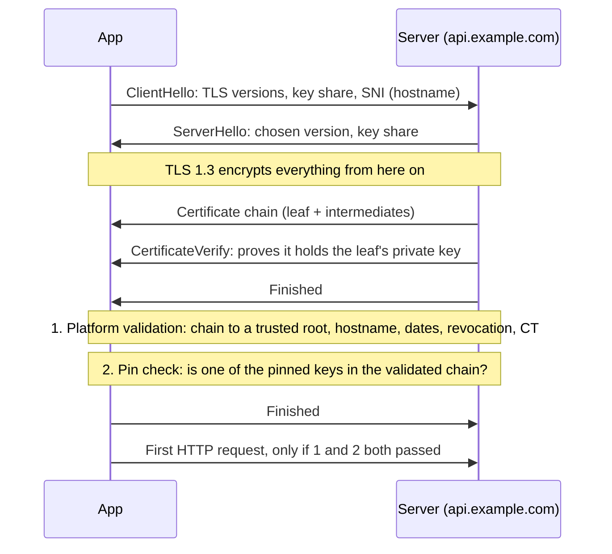
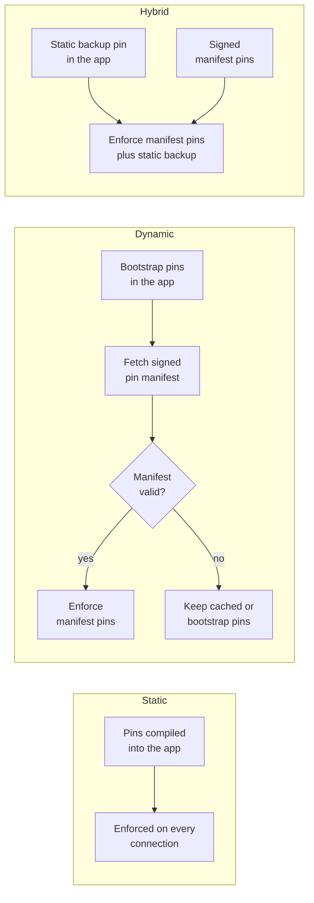
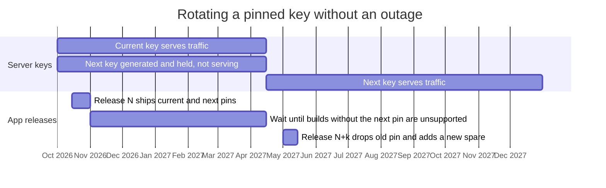

# Part 3: Data in transit

## Chapter 7: What TLS gives you, and what pinning adds

In August 2011 someone broke into DigiNotar, a Dutch certificate authority, and issued certificates for Google domains. Those certificates were genuine in every technical sense: signed by a CA that every browser and operating system trusted. They were used to intercept Gmail users, with evidence pointing mainly at users in Iran. Standard certificate validation accepted them without complaint. What caught the attack was Chrome, which had Google's keys **pinned**: only a small set of CAs was allowed to vouch for Gmail, and DigiNotar was not one of them. Within weeks DigiNotar had been removed from every trust store and had gone bankrupt ([Google, 2011](https://security.googleblog.com/2011/08/update-on-attempted-man-in-middle.html)).

That story holds both halves of this Part. Standard TLS is very strong, and it still has a gap. Most arguments about pinning are really arguments about that gap, carried on by people who cannot describe it precisely. By the end of this chapter you can.

### 7.1 The baseline

**TLS** (Transport Layer Security) is the protocol under every `https://` URL. It gives you three things:

- **Confidentiality:** nobody on the network path can read the traffic.
- **Integrity:** nobody on the path can change it without detection.
- **Server authentication:** you are talking to the server that owns the name you asked for, not to someone pretending.

The first two come from encryption keys that client and server agree during the **handshake**. The third, which is the one pinning cares about, comes from **certificates**.

A certificate binds a public key to a name such as `api.example.com`, and it is signed by a **certificate authority** (CA). The server sends a **chain**: its own **leaf** certificate, one or more **intermediate** CA certificates, and, implicitly, a **root**. Your device checks that chain against its **trust store**, the set of root certificates the platform ships and updates. Apple's current trust store lists about 150 roots ([Apple](https://support.apple.com/en-us/126047)). Validation checks four things: every signature in the chain is valid up to a trusted root; the leaf covers the hostname you asked for; nothing has expired; and nothing has been revoked or distrusted.

Here is where each check happens, and where a pin check sits relative to them:



*Figure 8: A TLS 1.3 handshake, and where the pin check sits*

The ClientHello's **SNI** (Server Name Indication) is the hostname you asked for, sent in the clear so that a server hosting many sites knows which certificate to present.

Two details in that picture matter later. **The pin check runs after, and in addition to, normal validation:** it narrows what the platform already accepted; it never replaces it. And depending on the mechanism, it runs either inside the certificate check (Android network security configuration, iOS `NSPinnedDomains`, a `URLSession` delegate) or immediately after the handshake completes but before any request is sent (OkHttp's `CertificatePinner`). Either way, no application data leaves the device until both checks pass.

This baseline is strong, and it is free. It defeats the coffee-shop attacker (the person on the same Wi-Fi running an interception proxy) completely, because that attacker cannot get a trusted CA to sign a certificate for your domain.

#### What the platforms already do for you

| Default | Android | iOS |
|---|---|---|
| TLS 1.3 | Enabled by default from Android 10 | Enabled by default for `URLSession` and Network.framework since iOS 12.2; App Transport Security (ATS) requires at least TLS 1.2 |
| Cleartext HTTP | Blocked by default for apps targeting API 28+ | Blocked by ATS since iOS 9 unless you add an exception |
| User-installed CAs | Ignored for apps targeting API 24+ | Trusted only if the user manually enables full trust for that root in Settings, and then every app trusts it |
| Certificate Transparency | Opt-in on Android 16; **on by default for apps targeting Android 17 (API 37)** | Enforced since iOS 12.1 for publicly trusted certificates issued after 15 October 2018 |
| Encrypted Client Hello | **On by default for apps targeting API 37**, where the networking library supports it | Experimental Network.framework option only; off by default |

Sources: [network security configuration](https://developer.android.com/privacy-and-security/security-config), [Android 10](https://developer.android.com/about/versions/10/behavior-changes-all) and [Android 17](https://developer.android.com/about/versions/17/behavior-changes-17) behaviour changes, [Apple Platform Security: TLS](https://support.apple.com/guide/security/tls-security-sec100a75d12/web), [Apple CT policy](https://support.apple.com/en-us/103214), [trusting installed profiles on iOS](https://support.apple.com/en-us/102390).

The iOS row on user-installed CAs is the one people miss. On Android, a user who installs a CA certificate does not affect your app unless you opted in to user CAs. On iOS, a user who installs a configuration profile *and* switches on full trust for its root has made that root trusted by every app on the device, including yours.

#### Get the free things right first

Most apps still do not, and each of these is cheaper than any pinning scheme.

**Require TLS 1.2 minimum, prefer 1.3.** The platform defaults already do this. The risk is a library or an exception that lowers them. On iOS, an `NSExceptionMinimumTLSVersion` of `TLSv1.0` or `TLSv1.1` in `Info.plist` is the usual culprit. On Android, the network security configuration has no TLS-version setting, so the place to be explicit is your HTTP client:

```kotlin
// OkHttp 5.x. MODERN_TLS already offers TLS 1.3 and 1.2 only.
// Leaving ConnectionSpec.CLEARTEXT out of the list makes every http:// URL fail.
val client = OkHttpClient.Builder()
    .connectionSpecs(listOf(ConnectionSpec.MODERN_TLS))
    .build()
```

```swift
// URLSession. ATS already enforces 1.2; raise it only if every server you call speaks 1.3.
let configuration = URLSessionConfiguration.default
configuration.tlsMinimumSupportedProtocolVersion = .TLSv12
```

**Forbid cleartext, and prove it.** On Android that is `cleartextTrafficPermitted="false"`, the default for apps targeting API 28 and later. On iOS it is ATS with no `NSAllowsArbitraryLoads`. Then look for the hardcoded `http://` URL that some SDK is using anyway (`MASTG-TEST-0235` and `0236` cover the Android configuration and the wire).

**Do not trust user-added CAs in release builds.** This is the single most valuable property of an Android network security configuration. Apps targeting API 24+ already ignore user CAs; the hole appears when someone adds `<certificates src="user"/>` to `base-config` to make a proxy work and it ships (`MASTG-TEST-0285`, `0286`).

**Put debug trust where Android intends it.** `debug-overrides` applies only when the app is `android:debuggable`, and is "completely ignored" otherwise, so it is the safe place for a proxy CA, and safer than conditional code, because stores reject debuggable apps. The real hole is a *release* build that is debuggable, or debug trust written into `base-config`. Inspect the release artefact, not the source (§15.7).

```xml
<?xml version="1.0" encoding="utf-8"?>
<!-- res/xml/network_security_config.xml: a sound baseline -->
<network-security-config>
    <base-config cleartextTrafficPermitted="false">
        <trust-anchors>
            <certificates src="system" />
        </trust-anchors>
    </base-config>
    <!-- Only honoured when android:debuggable="true". Lets you proxy debug builds. -->
    <debug-overrides>
        <trust-anchors>
            <certificates src="user" />
        </trust-anchors>
    </debug-overrides>
</network-security-config>
```

> **Trap:** a `debug-overrides` trust anchor also switches off pinning for chains that end in it: its `overridePins` defaults to `true`. That is exactly what you want when debugging, and exactly why a debuggable release build is a pinning bypass.

**Handle TLS errors correctly, especially in WebViews.** `onReceivedSslError` calling `proceed()` is a complete bypass of everything above (§16.4, `MASTG-TEST-0284`). It appears in real apps because it makes a certificate warning go away during development.

### 7.2 So what is left for pinning to do?

Standard validation accepts a certificate from **any** root in the trust store: around 150 roots run by dozens of organisations, plus anything an administrator or user has added. Pinning narrows that set. Instead of "any trusted CA", your app accepts only keys you nominated.

The threats that narrowing addresses:

- **A rogue or compromised public CA:** the DigiNotar case.
- **A CA installed on the device by someone other than you:** corporate TLS inspection through mobile device management (MDM), or a user talked into installing a profile. On iOS, once full trust is on, every app is affected.
- **A state-mandated root.** In 2019 Kazakhstan told citizens to install a government root certificate so traffic could be intercepted; browser vendors blocked it ([Mozilla](https://blog.mozilla.org/security/2019/08/21/protecting-our-users-in-kazakhstan/)).

What pinning does **not** address, so you can stop anyone claiming otherwise in a design review:

- **An attacker on their own device.** They can remove your pins with a Frida script in minutes (§8.10's *Verify it*, and Chapter 1). Pinning protects your users from third parties, not your API from your users.
- **A compromised server, or a bug in your backend.** The pinned connection delivers the attack faithfully.
- **Anything after TLS terminates:** a CDN, a load balancer, a logging pipeline.

That is a real threat model, and it is narrower than it was ten years ago. Whether it justifies pinning is the argument of Chapter 8.

### 7.3 The ground is moving

Your trust decisions sit on top of systems that change every year. Four changes affect mobile apps directly.

**Roots get distrusted.** Root programmes remove CAs that break the rules. Chrome stopped trusting new certificates from Entrust's public TLS roots issued after 11 November 2024, and Apple followed from 15 November 2024 ([Google](https://security.googleblog.com/2024/06/sustaining-digital-certificate-security.html), [Apple](https://support.apple.com/en-us/121668)). Chrome did the same to Chunghwa Telecom and NetLock for certificates issued after 31 July 2025 ([Google](https://blog.google/security/sustaining-digital-certificate-security-chrome-root-store-changes/)). Chrome's decisions govern Chrome's own root store, which the browser uses; Android's platform store, which `HttpsURLConnection` and OkHttp use, is managed separately, whereas Apple's Entrust distrust applies to apps too. Existing certificates kept working until they expired, which is what makes a distrust survivable for a website. If your app pins a CA that gets distrusted, you must move CA and ship new pins at the same time. This is why §8.4 insists your backup pin sits with a *different* CA.

**Android's trust store now updates without an OS update.** From Android 14, root certificates live in the updatable Conscrypt module and arrive through Google Play system updates ([AOSP](https://source.android.com/docs/core/ota/modular-system/conscrypt)), so a distrust or a new root reaches devices far faster than it used to.

**Certificate Transparency is becoming mandatory on Android.** **Certificate Transparency** (CT) is a set of public, append-only logs of every certificate a public CA issues (§8.9). iOS has required CT for publicly trusted certificates since 2018; the old `NSRequiresCertificateTransparency` key is now obsolete because the system always enforces it. Android 16 added opt-in enforcement through a new `<certificateTransparency>` element; Android 17 **turns it on by default for apps targeting API 37**. CT is skipped automatically for `user` and inline trust anchors, so private CAs configured that way keep working ([network security configuration](https://developer.android.com/privacy-and-security/security-config)). Rooted test devices with a proxy CA pushed into the *system* store will stop working, because that CA's certificates are not logged ([HTTP Toolkit](https://httptoolkit.com/blog/android-17-certificate-transparency/) *(reported)*).

**Encrypted Client Hello and post-quantum key exchange are arriving by default.** **Encrypted Client Hello** (ECH, [RFC 9849](https://www.rfc-editor.org/rfc/rfc9849)) encrypts the hostname in the ClientHello (the SNI in the diagram above), so a network observer cannot see which of a CDN's customers you are talking to. Android 17 uses it by default for apps targeting API 37, controlled by a new `<domainEncryption>` element. It takes effect only if the server supports it and so does the networking library (Google names HttpEngine, WebView and OkHttp) ([Android 17 behaviour changes](https://developer.android.com/about/versions/17/behavior-changes-17)). OkHttp 5.5 added ECH support as an opt-in. On Apple platforms ECH is so far only an experimental Network.framework option.

Separately, hybrid **post-quantum** key exchange is arriving: a classical and a quantum-resistant algorithm combined, so that traffic recorded today cannot be decrypted by a future quantum computer. Since iOS 26, `URLSession` and Network.framework offer `X25519MLKEM768` by default ([WWDC25](https://developer.apple.com/videos/play/wwdc2025/314/)). Android has not documented a platform default; Conscrypt 2.7.0, the standalone library, made `X25519MLKEM768` its default TLS key exchange in August 2026 ([release notes](https://github.com/google/conscrypt/releases/tag/2.7.0)). Neither feature changes how you pin: pinning concerns the certificate, while ECH and post-quantum key exchange concern the ClientHello and the key agreement.

> **In practice:** when you raise `targetSdk` to 37, retest every environment that uses a certificate not issued by a public CA (staging servers, on-premise installs, interception proxies). Add a per-domain `<certificateTransparency enabled="false"/>` only for hosts you have confirmed need it.

**Key takeaways**

- TLS gives confidentiality, integrity and server authentication; pinning only ever narrows the *authentication* step, and always runs after normal validation.
- The platforms already block cleartext, ignore user CAs (Android) and enforce CT (iOS, and Android 17 for apps targeting API 37). Most real findings are someone weakening those defaults.
- Pinning defends against a rogue CA or a device-installed CA. It does not defend against an attacker on their own device or a compromised server.
- `debug-overrides` is safe by design; a debuggable release build is not.

**Try it**

1. Decode your own release APK (`apktool d app-release.apk`; apktool is introduced in Chapter 13) and read `res/xml/network_security_config.xml`. **Pass:** no `cleartextTrafficPermitted="true"` outside named hosts, and no `src="user"` outside `debug-overrides`. On iOS, run `plutil -p Payload/YourApp.app/Info.plist` on the extracted IPA and look under `NSAppTransportSecurity`. **Pass:** no `NSAllowsArbitraryLoads` and no minimum-TLS exception below 1.2.
2. Check what your server actually negotiates: `openssl s_client -connect api.example.com:443 -servername api.example.com -tls1_1 -cipher 'DEFAULT:@SECLEVEL=0' </dev/null`. The `-cipher` flag matters: OpenSSL 3's default security level refuses TLS 1.1 on the client side, so without it the handshake fails locally ("no protocols available") and the test passes even against a server that still accepts TLS 1.1. Lowering the level affects only this one diagnostic connection. **Pass:** the server rejects the handshake (a `protocol version` alert). Repeat with `-tls1_3` and no `-cipher` flag. **Pass:** it succeeds. These flags assume OpenSSL 3 (`openssl version`); other builds, such as the LibreSSL that macOS ships, may behave differently.
3. Raise a test build to `targetSdk 37` and run it against each of your environments. Any failures are CT or ECH issues you would otherwise meet in production.

---

## Chapter 8: The pinning debate, argued properly

Picture a Friday afternoon *(illustrative)*. Your infrastructure team moves the API behind a new CDN, and the CDN serves its own certificate from a different CA. Every build of your app released in the last two years pins your old intermediate. By Saturday morning every user, on both platforms, sees "Unable to connect". The fix is an app release, then store review, then waiting for users to update. Some never will.

Now picture the other failure. Your app has no pins, and a user's phone has a corporate root installed by an MDM profile they accepted without reading. Every request, including the session token, is readable by whoever runs that proxy.

This is the most contested question in mobile security. You should be able to argue either side, because your interviewer might hold either position and both are defensible.

### 8.1 The case against pinning

Four arguments, and they are stronger than most pinning advocates admit.

**OWASP's own Pinning Cheat Sheet is blunt about it.** To the question "Should I pin?" it answers that "the answer to this is probably never" ([OWASP](https://cheatsheetseries.owasp.org/cheatsheets/Pinning_Cheat_Sheet.html)). Its reasoning is that outage risk now outweighs the benefit, given Certificate Transparency and the other improvements below.

**Google's Android documentation cautions against it.** It says pinning "is not recommended for Android apps", because future server changes such as moving CA leave pinned apps unable to connect until they update ([Android](https://developer.android.com/privacy-and-security/security-ssl)).

**The environment improved underneath the threat.** Certificate Transparency makes misissued certificates for your domain publicly visible. Certificate lifetimes are collapsing (§8.5), which limits the value of any single stolen key. Automated issuance through **ACME** (the protocol behind Let's Encrypt and most automated renewal) removed most of the human error that used to produce misissuance. Together these narrowed pinning's marginal benefit and left its operational risk untouched.

**The failure mode is catastrophic and asymmetric.** A pinning mistake does not degrade your app; it disconnects every user on that build at once, and the only fix is a store update, which takes hours at best and which users must then install.

### 8.2 The case for pinning

Four arguments the other way, and they are stronger than most pinning critics admit.

**The MASVS asks for it, and the MASTG explains how.** `MASVS-NETWORK-2` reads: "The app performs identity pinning for all remote endpoints under the developer's control." The MASTG tags its pinning tests for the `MAS-L2` profile: apps handling financial, health or similarly sensitive data.

**Google's warning is conditional, not a ban.** Read past the first sentence and Google's own page says that if you pin, "it's critical to include multiple backup pins, including at least one key that's fully in your control, and a sufficiently short expiration period". That is instructions, not prohibition. The OWASP MAS project reads it the same way: an answer to exactly this question, accepted by the project's lead in the MASVS discussions, called Google's text a warning that pinning "is a complicated procedure" and pinning "still a recommended practice, especially at the L2 level" ([MASVS discussion #573](https://github.com/OWASP/masvs/discussions/573), 2021). The MASTG's own Android page (`MASTG-KNOW-0015`) calls the network security configuration "the preferred and recommended way" to pin.

**Mobile is not the web.** This is the strongest technical argument. You cannot update a browser on your schedule; you can force-update a mobile app through the stores (`MASVS-CODE-2`). The operational objection that killed pinning for websites is materially weaker for apps. Chrome deprecated HTTP Public Key Pinning in Chrome 67 (2018) and removed it in Chrome 72 (January 2019), citing the risk of sites locking out their own users ([Chromium](https://groups.google.com/a/chromium.org/g/blink-dev/c/he9tr7p3rZ8/m/eNMwKPmUBAAJ), [Chrome 72 removals](https://developer.chrome.com/blog/chrome-72-deps-rems)).

**Regulated industries do it anyway.** Banking apps pin, often because a regulator or an auditor asks for defence in depth rather than because the engineering team chose it. If you work in that world, "OWASP says don't" will not end the conversation.

### 8.3 The honest synthesis *(contested)*

The debate is not "pinning good" versus "pinning bad". It is about operational maturity.

**Pinning done badly is worse than not pinning at all.** One pin, no backup, no rotation plan, no monitoring: you have added a self-inflicted outage risk without meaningfully raising an attacker's cost.

**Pinning done properly adds a real layer**, and for a payment or health app that layer is worth the operational weight.

So the question is not "should we pin?" It is: **can this team operate a pin set for the next three years without locking users out?** That is a question about runbooks, ownership and monitoring, not about cryptography. If the answer is no, the right decision is not to pin, and to say so plainly rather than pinning badly to satisfy a checklist.

### 8.4 What to pin, and why SPKI

#### First: three different things people all call "pinning"

"SSL pinning" in a job description or a blog post can mean any of three things.

| Type | What the app stores | What it compares against |
|---|---|---|
| **Certificate pinning** | The whole certificate, or a hash of it | The certificate the server presents, in full |
| **Public key pinning**, also called **SPKI pinning** | A SHA-256 hash of the Subject Public Key Info | The public key of each certificate in the validated chain |
| **CA pinning** | The key of an issuing authority | Whether the validated chain passes through that authority |

**Certificate pinning is not just weaker: it is differently broken.** Because it matches the whole certificate, it also pins the expiry date and the serial number. So it breaks on **every** renewal, even when the server reuses the same key pair. There is no situation where this is the right choice for a mobile app.

**Public key pinning is the one you want**, and the rest of this chapter assumes it.

**CA pinning** is public key pinning applied further up the chain. It appears below as the intermediate and root options.

#### Now the rule

Pin the hash of the **SPKI** (the **Subject Public Key Info**, the part of a certificate that holds the public key and names its algorithm). Never pin the whole certificate.

The reason is renewal. A certificate expires and is reissued regularly. If the new certificate carries **the same public key**, its SPKI hash is unchanged and the pin still matches.

That leaves a choice of *which* certificate's key to pin, and the trade-off is trust breadth against operational resilience:

| Pin target | Survives renewal? | What you are trusting |
|---|---|---|
| Leaf SPKI | Only if the key pair is reused | Exactly one key. Tightest, most fragile |
| Intermediate CA SPKI | Yes, across leaf renewals, until the CA rotates its intermediate | Anything that intermediate issues for your domain |
| Root CA SPKI | Yes, for years | That CA's entire issuance. Weakest protection |

> **Trap:** your server does not choose the chain your user's device validates. The platform builds the chain from what the server sends, what it already knows and cross-signatures, and every mechanism in this chapter checks pins against *that validated chain*. A CDN chain can include CAs you never chose: `example.com`, served through Cloudflare, chained on 23 September 2026 through a Cloudflare intermediate and an SSL.com "Transit" intermediate to an SSL.com root. Extract pins from what clients actually receive, on every platform you ship.

#### Four questions this raises

**Which hash algorithm?** SHA-256. It is the only `digest` Android's `<pin>` accepts, it is what iOS's `SPKI-SHA256-BASE64` key names, and it is why OkHttp pins carry a `sha256/` prefix. OkHttp also accepts legacy `sha1/` pins; do not use them.

**Does a more expensive certificate help?** No. Domain-validated (DV), organisation-validated (OV) and extended-validation (EV) certificates differ in how much the CA checked about *your organisation*, not in cryptographic strength. You are pinning a public key, so the validation level buys you nothing here.

**What about a self-signed certificate or your own private CA?** For an internal or enterprise app where you control both ends, trusting your own private CA is legitimate and common. On Android, name it as the only `trust-anchor` for that domain, which is stronger than pinning because no public CA is trusted at all. It shifts the calculus both ways. No public CA can misissue for you, which removes the threat pinning exists to stop. But there are no Certificate Transparency logs to fall back on, because CT covers only publicly trusted certificates. The rotation runbook in §8.7 matters more, not less.

**What makes a real backup pin?** Ship at least one, always: a pin set with a single pin is one certificate incident away from an outage only a release can fix. But a backup is only real if you can switch to it tomorrow without the thing that just failed. Two patterns work:

- **A spare key pair you hold.** Generate a second key, keep it offline, and pin its SPKI. When you need it, any CA can issue a certificate for that key. This is what Google means by "at least one key that's fully in your control". It works for leaf pinning.
- **An intermediate at a second CA.** Arrange a fallback CA in advance and pin its intermediate. This survives your primary CA being distrusted (§7.3), which a second intermediate from the *same* CA does not.

### 8.5 The 2026 development that changes the arithmetic

Two clocks are shrinking, not one. Before the table makes sense, you need the concept behind the second column.

#### What domain validation is

Before a CA gives you a certificate for `api.example.com`, it has to check that you control that domain. Otherwise anyone could request a certificate for your site. That check is **Domain Control Validation**, usually shortened to **DCV**.

You prove control in one of a few ways. You publish a DNS record the CA asks for (`DNS-01` in ACME terms), or you serve a file at a URL on the domain (`HTTP-01`). Email and phone methods still exist but are being phased out; WHOIS contact look-ups already ended on 15 July 2025.

A CA does not have to re-check every time it issues. It may **reuse** a previous validation, provided the validation was done within a set number of days **before it issues the certificate**. That period is the second column below, and it runs on a separate clock from the certificate's own lifetime.

- **Certificate lifetime:** how long a certificate is valid, so how often you must **replace it**.
- **DCV reuse period:** how old a proof of ownership may be **at the moment of issuance**.

#### The schedule

Both are shortening under CA/Browser Forum **Ballot SC-081v3**, adopted on 11 April 2025 with no votes against. Apple proposed it, with Google, Mozilla and Sectigo endorsing ([ballot](https://cabforum.org/2025/04/11/ballot-sc081v3-introduce-schedule-of-reducing-validity-and-data-reuse-periods/)). The numbers live in sections 6.3.2 and 4.2.1 of the [Baseline Requirements](https://github.com/cabforum/servercert/blob/main/docs/BR.md), and no later ballot has changed them.

| Certificates issued on or after | Maximum certificate lifetime | DCV reuse period |
|---|---|---|
| Before 15 March 2026 | 398 days | 398 days |
| **15 March 2026** (in force now) | **200 days** | **200 days** |
| 15 March 2027 | 100 days | 100 days |
| 15 March 2029 | **47 days** | **10 days** |

#### What that means for your workload

Take the 2029 row and work it through.

**Certificates.** A 47-day maximum means replacing each certificate at least every six to seven weeks, and in practice more often, because ACME clients renew well before expiry. Most teams did this once a year until 2026. For an estate of 1,000 certificates, about 1,000 renewals a year becomes 8,000 or more.

**Validation.** With a 10-day reuse period, a proof of ownership is almost never young enough to reuse. Nearly every issuance needs a **fresh** validation, run shortly before the certificate is issued. Validation stops being a once-a-year chore that happens to coincide with renewal and becomes a step inside every renewal.

That is the point of the second column. A team that automates renewal but leaves DNS validation as a manual ticket still fails, because the CA's challenge arrives with every renewal.

**The consequence.** Manual validation stops working. Tickets to the DNS team cannot run every few weeks per domain. Automated validation through ACME becomes the only sustainable route. A newer method, **persistent DCV** (`DNS-PERSIST-01`, Ballot [SC-088v3](https://cabforum.org/2025/10/09/ballot-sc-088v3-dns-txt-record-with-persistent-value-dcv-method/), permitted since 10 November 2025), replaces the per-renewal DNS edit with one standing TXT record, naming your CA and your ACME account, that the CA re-checks at each issuance; ask your CA whether it supports it. And automation makes your ACME account key a high-value target, because a stolen one can yield valid certificates without domain control: while the CA holds cached authorisations for that account, and for as long as the record stays published if you use persistent DCV, because the standing record authorises the account itself. Protect it like a signing key (§15.6).

#### Why this decides your pinning design

Automated renewal usually generates a **fresh key pair** every time. If yours does, your leaf SPKI changes on every renewal: survivable at 398 days, untenable at 47. Two ways out:

**Pin the intermediate CA SPKI**, which survives leaf rotation. You widen your trust to that intermediate's issuance for your domain, and you accept that. Watch for the CA rotating intermediates: Let's Encrypt, for example, issues from several intermediates and changes them over time.

**Or reuse the key pair across renewals**, so the SPKI stays stable while the certificate rotates. Most ACME clients can do this (`certbot --reuse-key`, for example), but it is a setting someone must choose.

Either is defensible. What is not defensible is not knowing which one your infrastructure does. Ask whoever owns your certificates before you ship a pin.

### 8.6 Where the pins live: static, dynamic and hybrid

Everything above says *what* to pin. This section is about *where the pin lives*, which decides whether pinning is operationally survivable.



*Figure 9: Where the pins live: static, dynamic and hybrid delivery*

#### Static pinning

The pins are baked into the app at build time: in Android's network security configuration, iOS's `Info.plist`, or your own trust-evaluation code.

It is easy to audit and easy to reason about: you read the file and know what the app trusts. And it **welds your network operations to your app release cycle**. When a pinned key changes, you ship a release. §8.5's shrinking lifetimes make that sharper every year.

The failure story is concrete. A key rotates, the old pin no longer matches, and every user on that build loses connectivity until they install an update.

#### Dynamic pinning

The app ships with **bootstrap pins**, then fetches a **signed pin manifest** from your own endpoint at runtime.

If you take one thing from this section, take this: **the manifest is signed with a key that has nothing to do with the web PKI** (the public CA system). If you trusted the connection that delivers your pins *because of* the pins it delivers, you would have circular trust. So the manifest carries its own signature, verified against a public key compiled into the app. TLS gets you a connection; the signature gets you authenticity.

What this buys you is rotation without a release. The certificate changes, you publish a new manifest, apps in the field pick it up.

Open-source implementations exist (Wultra's [`ssl-pinning-ios`](https://github.com/wultra/ssl-pinning-ios) and [`ssl-pinning-android`](https://github.com/wultra/ssl-pinning-android), both at 2.0 in September 2026), and several commercial platforms sell it as a managed service. The motivation they all give is the same: certificate expiry forces app updates, some users never update, and those users lose access.

#### The honest cost of going dynamic

Vendor material presents dynamic pinning as strictly better. It is not.

**You have moved your trust root, not removed it.** The manifest signing key needs protecting for the life of the app, in a hardware security module (HSM) or equivalent, with its own rotation story. You have swapped a certificate-rotation problem for a key-custody problem.

**You have added a runtime dependency.** If the manifest endpoint is down, what does the app do? Fail closed and you have invented a new outage. Fail open and you have invented a bypass. The answer is a cached manifest with a defined staleness window, falling back to the bootstrap pins.

**You still need backup pins.** Dynamic delivery moves where they live; it does not remove them.

**You have stepped outside the standard.** The MASTG's tests are written around static mechanisms: `MASTG-TEST-0242` and `0243` read the network security configuration, and `MASTG-TEST-0385` reads `NSPinnedDomains`. There is no normative treatment of signed manifests. An auditor may not recognise your design, and you will be explaining it rather than pointing at a test ID.

**My view** *(reasoned)*: for a small team, static pinning on an intermediate CA SPKI with a documented runbook, a real backup pin and an expiration date is usually the better engineering decision. Dynamic pinning earns its complexity when you have many endpoints, frequent rotation you do not control, an install base that updates slowly, or a security team that can own a signing key.

#### How this differs on Android and iOS

On both platforms the **declarative mechanism cannot be changed at runtime**, so going dynamic means giving up the declarative option. What you lose differs, and on Android it is more than most teams realise.

| | **Android** | **iOS** |
|---|---|---|
| Declarative mechanism | `network_security_config.xml`, API 24+ | `NSPinnedDomains` in `Info.plist`, iOS 14+ |
| Can it change at runtime? | **No**: compiled into the app | **No** |
| What the declarative pins cover | Every client using the platform's default trust manager: `HttpsURLConnection`, OkHttp, **and WebView** | `URLSession` and the rest of the URL Loading System. **Not `WKWebView`** in my tests |
| Programmatic mechanism | OkHttp `CertificatePinner`, or your own `X509TrustManager` | A `URLSessionDelegate` server-trust handler |
| What the programmatic pins cover | Only that client | Only that session |
| WebView option | Covered by the declarative config | A `WKNavigationDelegate` server-trust handler, best effort |

**On Android, the network security configuration covers more than people think.** It is enforced inside the platform's default trust manager, so it applies to any client that uses that trust manager. OkHttp does by default. WebView does too: Chromium's WebView uses the Android certificate verifier. I confirmed both on an Android 17 emulator (evidence note below).

**So on Android, going dynamic costs you WebView coverage.** OkHttp's `CertificatePinner` governs only traffic through that OkHttp client. If your pins move from the XML file into a runtime manifest, your WebView silently stops being pinned. If a WebView loads anything sensitive, keep a static `pin-set` for its hosts alongside the dynamic path.

**On iOS, do not count on `NSPinnedDomains` for `WKWebView`.** `WKWebView` does its networking in a separate WebKit process, Apple has never documented whether it honours your app's pins, and practitioner reports disagree (the forum threads and reports are listed in Chapter 33's sources). In my own simulator test it **ignored** them: the wrong pin that made `URLSession` fail let `WKWebView` render the page. `SFSafariViewController` runs outside your app entirely and is not covered either *(reported)*. What you can do is run the same pin check in the navigation delegate's `webView(_:didReceive:completionHandler:)`, which receives server-trust challenges. Treat it as best effort: a challenge arrives only when WebKit opens a *new* TLS connection, and `MASTG-KNOW-0072` says subresource loads are not covered, so coverage is incomplete and undocumented. The robust mitigation is architectural: do not load sensitive content in a WebView (§16.5).

**`CertificatePinner` is immutable once built.** You cannot add a pin to a live instance. Dynamic pinning on Android means rebuilding the pinner and the client when a new manifest arrives, or wrapping your own `X509TrustManager` around a mutable pin set. Rebuilding is simpler and usually correct.

**Declarative pinning is easy to audit and easy to strip.** A reviewer reads one file. An attacker edits the same file, re-signs the app, and installs it with pinning gone, on either platform. Pinning in code, especially native code, costs an attacker more to remove. That is not an argument against declarative pinning, because an attacker on their own device wins either way (Chapter 1). But if your threat model includes someone redistributing a modified build to *other* users, it is a point in favour of code.

> **Evidence:** tested 23 September 2026 on emulators and simulators, not a device matrix. *Android 17 emulator, WebView 152, a wrong `pin-set` for `example.com`:* `HttpsURLConnection` and an `OkHttpClient` with no `CertificatePinner` failed with `Pin verification failed`, and WebView called `onReceivedSslError`; the correct pin let all three connect, and so did the wrong pin with `expiration="2020-01-01"`. *iOS 26.5 and 27.0 simulators, a wrong `NSPinnedCAIdentities` pin:* `URLSession` failed with `-1200`, `WKWebView` rendered the page, and a relaunched app's `WKWebView` raised no trust challenge at all. A build with changed pins installed over the old one took effect on the next launch. If hardware behaves differently, [open an issue](https://github.com/hossam9k/mobile-app-security/issues/new/choose).

#### Hybrid, which is what most mature apps do

Ship a **static backup pin** in the binary and rely primarily on **dynamically fetched pins**. You get rotation flexibility from the dynamic path and a floor under you if the manifest endpoint fails. On Android, keeping the static part in the network security configuration also keeps your WebView pinned.

#### The safety valve people forget: expiration

Android's `pin-set` takes an optional `expiration` date, and it does exactly what the documentation says: on that date the pins expire, "thus disabling pinning". The connection still validates normally against the trust store; your pins are ignored. It is a deliberate **fail-open**: availability over security, so that a forgotten app does not break forever.

Google now recommends "a sufficiently short expiration period". OWASP's `MASTG-KNOW-0015` says to set one *and* "ensure timely updates", and `MASTG-TEST-0243` flags pins that have already expired. Put the two together: set an expiration a little beyond the longest you expect any supported build to stay in use, and put a reminder well before it. Otherwise the app stops pinning one morning and nothing tells you.

iOS has no equivalent. `NSPinnedDomains` pins never expire, so a stale pin set on iOS fails closed.

#### Side by side

| | **Static** | **Dynamic** | **Hybrid** |
|---|---|---|---|
| **Pros** | Easy to audit. No runtime dependency. Recognised by the MASTG. On Android, covers WebView and every default-trust client | Rotation without a release. Survives 47-day certificates. Users on old builds keep working | Rotation flexibility with a floor under you |
| **Cons** | Rotation needs a release. Easily stripped from a repackaged build | A signing key to protect for years. New runtime dependency. Outside the standard. On Android, loses WebView coverage unless you keep static pins too | Most moving parts. Two mechanisms to test |
| **Best for** | One or two endpoints you control, and you can ship releases | Many endpoints, rotation you do not control, a slow-updating install base | Most mature apps at scale |
| **Worst for** | Estates with frequent uncontrolled rotation | Small teams with no key-custody capability | Teams that will maintain only one path properly |

#### Choosing

| Situation | Approach |
|---|---|
| One or two endpoints, certificates you control, you can ship releases | **Static**, intermediate SPKI, backup pin at a second CA, expiration set, runbook written |
| Frequent rotation you do not control, or a slow-updating install base | **Hybrid**: static backup plus signed dynamic manifest |
| Many endpoints, a security team that can own a signing key | **Dynamic**, with a cached manifest and a defined staleness policy |
| You cannot securely update the pin set, or do not control both ends | **Do not pin.** Strict TLS configuration, CT and monitoring (§8.9) |

### 8.7 What pinning costs you operationally

If you pin, you owe your team all of the following. This list decides whether pinning helps or hurts.

- A **documented rotation runbook** with a named owner, describing exactly what happens when a key changes.
- **Backup pins in every release**, at a second CA or on a key you hold.
- A **monitoring alert on pin-validation failures**, so you learn from telemetry rather than from store reviews.
- **Certificate Transparency monitoring** for your domains, so you detect misissuance, the threat you pinned against in the first place.
- A **remote kill switch** that disables pinning without a release, because the alternative is waiting for store review during an outage. Protect it like the manifest key: an unauthenticated switch is a bypass.
- An **explicit agreement with whoever manages certificates, CDNs and load balancers** that pinned-key changes follow the runbook.

Missing any one of these is how pinning causes the outage it was supposed to prevent.

The runbook's core is a rotation that never leaves a supported build without a matching pin. It looks like this:



*Figure 10: Pin rotation timeline: the new pin ships long before the new key serves traffic*

The order is the whole trick: **the new pin ships long before the new key serves traffic**, and the old pin is removed only after the switch. Skip the waiting row and you have rebuilt the Friday-afternoon scenario.

### 8.8 The decision, by application type

Reason from the threat, not the table; the table only encodes the reasoning.

**Banking, fintech, trading:** SPKI pinning on an intermediate with a backup, plus CT monitoring. Often a compliance requirement, and the value of the transactions justifies the operational weight.

**Health and medical:** the same. Patient data is high-value and long-lived, and the regulatory environment rewards defence in depth.

**E-commerce:** depends on where payment happens. Handle cards in-app and you are in the first category. Delegate to a payment provider's SDK and strict TLS plus CT monitoring is a reasonable position.

**Ride-sharing, delivery, marketplaces:** strict TLS, CT monitoring and backend fraud detection. Payment is usually tokenised elsewhere, and the operational overhead of pinning buys little.

**Social, messaging, content:** platform defaults with a strict configuration. Pinning a news feed adds risk and no security. (End-to-end-encrypted messengers are the exception that proves the rule: they protect content with their own keys, so TLS pinning is not their primary defence.)

**Enterprise and internal:** trust your private CA explicitly, and pin only if you control both client and server. If a customer's MDM legitimately inspects traffic, pinning breaks your own deployment.

**The rule that decides it, from OWASP's cheat sheet:** "If you don't control the client and server side of the connection, don't pin", and "if you can't update the pinset securely, don't pin."

### 8.9 The alternatives, properly described

"Use CT and HSTS instead" is easy to say. It is worth unpacking, because these do different jobs, and one of them barely applies to native apps.

**Certificate Transparency** is a set of public, append-only logs of issued certificates. Browsers, iOS and now Android (§7.3) reject publicly trusted certificates that were not logged. So a CA cannot quietly issue a certificate for your domain: it must be logged, and you can watch the logs. Note what this is: **detection, not prevention.** A misissued certificate still works until someone notices and it is revoked. What CT changes is that noticing becomes possible for *you*, rather than depending on luck, but only if someone is watching.

#### How to actually monitor Certificate Transparency

The quickest manual check is a CT search service such as [`crt.sh`](https://crt.sh), which queries logged certificates for a domain. Run it once now for your own domains; teams are routinely surprised by forgotten subdomains and certificates issued by providers they no longer use.

For ongoing monitoring you want alerts rather than a manual check. Several CAs and commercial services offer this, or you can poll a CT search API for your domains and diff against a known-good inventory. The requirement is not sophistication. It is **someone receiving the alert and knowing what to do with it**: a runbook question, not a tooling question. And you cannot spot an unexpected certificate if you do not know which ones are expected, so keep the inventory.

**HSTS** (HTTP Strict Transport Security) is a response header telling a *browser* to use only HTTPS for your domain in future, so an attacker cannot downgrade a later visit to HTTP. It matters for anything browser-based, including WebViews loading your site. For native networking it mostly does not: your app does not type URLs, and forbidding cleartext in configuration (§7.1) already gives you what HSTS gives a browser. Not every HTTP library implements HSTS anyway *(reasoned)*. Neither does anything about a fraudulently issued certificate.

**Backend anomaly detection** catches the traffic pattern of an interception attempt: a client whose behaviour changes, requests from unexpected paths, sudden shifts in device signals (Chapter 12).

Together, strict TLS configuration, CT and monitoring give you fast detection and a narrow attack surface without the outage risk. For most apps that is the correct trade. For the ones handling money or health records, layering pinning on top is worth it, if and only if §8.7 is genuinely in place.

### 8.10 How to implement it

Minimal, correct implementations for both platforms: getting the pin values, static pinning, then the dynamic manifest.

#### Getting the pin values

A pin is the base64 of the SHA-256 of the DER-encoded SPKI. OpenSSL computes it from a live server. Save the chain the server sends:

```bash
HOST=api.example.com
openssl s_client -connect "$HOST:443" -servername "$HOST" -showcerts </dev/null > chain.txt
```

Split it into one file per certificate (`cert1.pem` is the leaf, `cert2.pem` the first intermediate, and so on), then hash each certificate's public key:

```bash
awk '/BEGIN CERTIFICATE/{n++} n{print > ("cert" n ".pem")}' chain.txt
for f in cert*.pem; do
  openssl x509 -in "$f" -noout -subject
  openssl x509 -in "$f" -pubkey -noout \
    | openssl pkey -pubin -outform der \
    | openssl dgst -sha256 -binary \
    | openssl enc -base64
done
```

For a spare key you hold, hash the key directly: `openssl pkey -in spare-key.pem -pubout -outform der | openssl dgst -sha256 -binary | openssl enc -base64`.

> **Trap:** if any stage of that pipeline fails (a typo in the hostname, no network), the later stages happily hash empty input and print `47DEQpj8HBSa+/TImW+5JCeuQeRkm5NMpJWZG3hSuFU=`. That is the SHA-256 of nothing. If you see it, or the same value for two different certificates, stop.

The alternative is OkHttp's documented shortcut: configure a deliberately wrong pin, make one request, and read the real hashes from the exception message. Whichever you use, the same string goes into Android, iOS and Ktor: if two platforms disagree for one endpoint, one of them is wrong.

The pin values in the listings below are placeholders, not `example.com`'s real hashes. Generate your own with the commands above; a pasted listing will fail every connection.

#### Android: network security configuration (declarative, API 24+)

This is the first choice on Android. It covers every client that uses the platform's default trust manager (§8.6), with no code.

```xml
<?xml version="1.0" encoding="utf-8"?>
<!-- res/xml/network_security_config.xml -->
<network-security-config>
    <domain-config cleartextTrafficPermitted="false">
        <domain includeSubdomains="true">api.example.com</domain>
        <!-- base64 SHA-256 of the SPKI, not of the whole certificate -->
        <pin-set expiration="2027-12-31">
            <!-- Primary: your CA's intermediate -->
            <pin digest="SHA-256">YLh1dUR9y6Kja30RrAn7JKnbQG/uEtLMkBgFF2Fuihg=</pin>
            <!-- Backup: an intermediate at a second CA, or a spare key you hold -->
            <pin digest="SHA-256">Vjs8r4z+80wjNcr1YKepWQboSIRi63WsWXhIMN+eWys=</pin>
        </pin-set>
    </domain-config>
</network-security-config>
```

Reference it from the manifest:

```xml
<application android:networkSecurityConfig="@xml/network_security_config" >
    <!-- activities, services … -->
</application>
```

Three things to notice. The XML declaration must be the very first line of the file; nothing, not even a comment, may come before it. The `expiration` is the fail-open valve from §8.6. And `includeSubdomains="true"` matches the domain **and all its subdomains at any depth**: convenient, and wider than you may intend.

#### Android: OkHttp CertificatePinner (programmatic)

Choose this when you need pins that can change at runtime, or pins scoped to one client. It does not install a trust manager: OkHttp lets the platform validate the chain first, then compares your pins against the validated chain after the handshake and before sending the request. So the network security configuration still applies underneath it.

```kotlin
// OkHttp 5.x (Maven group com.squareup.okhttp3; docs now at lysine.dev/okhttp, formerly square.github.io/okhttp)
val certificatePinner = CertificatePinner.Builder()
    .add(
        "api.example.com",
        "sha256/YLh1dUR9y6Kja30RrAn7JKnbQG/uEtLMkBgFF2Fuihg=", // primary
        "sha256/Vjs8r4z+80wjNcr1YKepWQboSIRi63WsWXhIMN+eWys=", // backup
    )
    .build()

val client = OkHttpClient.Builder()
    .certificatePinner(certificatePinner)
    .build()
```

The host pattern matters. `api.example.com` matches exactly that host. `*.example.com` matches exactly **one** extra label, and (easy to miss) **no pinning is enforced** for `example.com` itself or for `a.b.example.com`. `**.example.com` matches the domain and every subdomain, and OkHttp's documentation recommends it for most apps.

> **Trap:** because OkHttp's pins apply only to hosts that match a pattern, a typo in the pattern does not fail: it silently pins nothing. Step 1 of *Verify it* below is how you find out.

#### Choosing an Android approach

| | **Network security configuration** | **OkHttp CertificatePinner** | **Both together** |
|---|---|---|---|
| **Pros** | Declarative and auditable. Covers every default-trust client (§8.6). No code. Supports `expiration` | Can be rebuilt at runtime, so it can be dynamic. Clear failure exceptions | Defence in depth |
| **Cons** | API 24+ (every current app). Cannot change at runtime. Stripped by editing one file in a repackaged APK | Governs only that client, not WebView (§8.6). Immutable once built. Pattern typos pin nothing | Two places to update; a mismatch between them is confusing to debug |
| **Use when** | Most apps, and any app with a WebView reaching a pinned host | You need dynamic pins | Financial and health apps where the extra check is worth the maintenance |

Frameworks that bring their own TLS stack may not use the platform trust manager at all: the MASTG notes that Flutter's Dart `HttpClient` uses its own BoringSSL rather than the platform's networking (`MASTG-KNOW-0015`). Native code with its own TLS library is in the same position. Check how yours validates certificates before assuming the XML file protects it.

#### Android: making the programmatic path dynamic

`CertificatePinner` is immutable, so "update the pins" means building a new pinner and a new client:

```kotlin
class PinnedClientProvider(
    private val baseClient: OkHttpClient,      // shared pool, timeouts, interceptors
    private val manifestStore: ManifestStore,  // returns only signature-verified manifests
) {
    private data class Cached(val version: Long, val client: OkHttpClient)

    @Volatile private var cached: Cached? = null

    fun client(): OkHttpClient {
        val manifest = manifestStore.current()
        cached?.takeIf { it.version == manifest.version }?.let { return it.client }

        val pinner = CertificatePinner.Builder().apply {
            manifest.entries.forEach { entry -> add(entry.host, *entry.pins.toTypedArray()) }
            // Always keep the bootstrap pins as a floor.
            BOOTSTRAP_PINS.forEach { (host, pins) -> add(host, *pins.toTypedArray()) }
        }.build()

        // newBuilder() shares the connection pool and dispatcher with baseClient.
        val built = baseClient.newBuilder().certificatePinner(pinner).build()
        cached = Cached(manifest.version, built)
        return built
    }
}
```

Two things this does deliberately. It keeps the **bootstrap pins** in the set rather than replacing them, so a bad manifest cannot lock you out of your own backend. And it rebuilds only when the manifest **version** changes, deriving the new client from a shared base with `newBuilder()` so connection pools and threads are reused rather than multiplied.

#### iOS: NSPinnedDomains (declarative, iOS 14+)

Apple calls this **identity pinning**. It is the iOS counterpart to Android's network security configuration, available since iOS 14 and macOS 11.

```xml
<!-- Info.plist -->
<key>NSAppTransportSecurity</key>
<dict>
    <key>NSPinnedDomains</key>
    <dict>
        <key>api.example.com</key>
        <dict>
            <key>NSIncludesSubdomains</key>
            <true/>
            <!-- Pins an intermediate or root. Use NSPinnedLeafIdentities to pin the leaf. -->
            <key>NSPinnedCAIdentities</key>
            <array>
                <dict>
                    <key>SPKI-SHA256-BASE64</key>
                    <string>YLh1dUR9y6Kja30RrAn7JKnbQG/uEtLMkBgFF2Fuihg=</string>
                </dict>
                <dict>
                    <!-- Backup pin -->
                    <key>SPKI-SHA256-BASE64</key>
                    <string>Vjs8r4z+80wjNcr1YKepWQboSIRi63WsWXhIMN+eWys=</string>
                </dict>
            </array>
        </dict>
    </dict>
</dict>
```

**The value format is a useful cross-check.** `SPKI-SHA256-BASE64` is the base64 SHA-256 of the DER-encoded SPKI: **exactly the string you put in Android's `<pin>`**, and exactly what the OpenSSL commands above print. I confirmed this: pins computed with OpenSSL matched under `NSPinnedDomains` without modification.

**Choose the right key.** `NSPinnedCAIdentities` matches only CA certificates in the chain; `NSPinnedLeafIdentities` matches only the leaf. They are not interchangeable: in my test, a correct leaf hash placed under `NSPinnedCAIdentities` failed. Everything in §8.4 about chain position applies, so `NSPinnedCAIdentities` on an intermediate is usually right.

**Documented and observed limitations, all of which have bitten someone:**

- `NSIncludesSubdomains` covers **one** subdomain level. Apple's own example: pinning `example.org` covers `math.example.org` but not `advanced.math.example.org` ([Apple](https://developer.apple.com/news/?id=g9ejcf8y)). I saw the same on macOS: with `amazonaws.com` pinned, `sts.amazonaws.com` was pinned and `s3.us-east-1.amazonaws.com` was not. Deeper hosts need their own entries. This is the opposite of Android's `includeSubdomains`.
- If you list both `NSPinnedCAIdentities` and `NSPinnedLeafIdentities` for a host, ATS requires a match in **each**.
- Pinning only ever tightens. As Apple puts it, it "cannot loosen the trust requirements of your app": normal validation still runs first.
- A framework cannot pin this way on its own behalf; it depends on the host app's `Info.plist`.
- Practitioners report that a changed entry sometimes needs an **app reinstall** before ATS drops cached trust *(reported)*. I could not reproduce this on the iOS 26.5 and 27.0 simulators (an over-the-top install took effect on the next launch), but if a change seems to do nothing on a device, reinstall before debugging further.
- Pins never expire (§8.6).

**And the honest caveat.** A security auditor can read one file, which is a real advantage. An attacker can edit the same file, re-sign the app and install it with pinning gone; Guardsquare published both that and a one-line Frida equivalent ([Guardsquare](https://www.guardsquare.com/blog/leveraging-infoplist-based-certificate-pinning-ios-and-making-its-shortcomings)). Pinning in code costs more to remove. See §8.6 for when that matters.

#### iOS: URLSessionDelegate, done in the right order

Almost every hand-written iOS pinning delegate gets two things wrong: it compares pins *instead of* validating the chain, and it hashes the wrong bytes. The helper below fixes the second, the delegate after it fixes the first, and the four rules after both listings say why.

```swift
import CryptoKit
import Foundation
import Security

/// The base64 SHA-256 of a certificate's DER-encoded SubjectPublicKeyInfo:
/// the same string as Android's <pin>, OkHttp's "sha256/…" and Apple's SPKI-SHA256-BASE64.
enum SPKIPin {

    static func of(_ certificate: SecCertificate) -> String? {
        guard let key = SecCertificateCopyKey(certificate),
              let attributes = SecKeyCopyAttributes(key) as? [CFString: Any],
              let keyType = attributes[kSecAttrKeyType] as? String,
              let raw = SecKeyCopyExternalRepresentation(key, nil) as Data?
        else { return nil }

        // SecKeyCopyExternalRepresentation returns the bare key — PKCS #1 for RSA,
        // ANSI X9.63 for elliptic curve — not the SubjectPublicKeyInfo the pin
        // is defined over. Rebuild the SPKI before hashing.
        let spki: Data?
        if keyType == (kSecAttrKeyTypeRSA as String) {
            spki = rsaSPKI(pkcs1: raw)
        } else if keyType == (kSecAttrKeyTypeECSECPrimeRandom as String) {
            switch raw.count {
            case 65:  spki = try? P256.Signing.PublicKey(x963Representation: raw).derRepresentation
            case 97:  spki = try? P384.Signing.PublicKey(x963Representation: raw).derRepresentation
            case 133: spki = try? P521.Signing.PublicKey(x963Representation: raw).derRepresentation
            default:  spki = nil
            }
        } else {
            spki = nil
        }
        return spki.map { Data(SHA256.hash(data: $0)).base64EncodedString() }
    }

    // SEQUENCE { AlgorithmIdentifier(rsaEncryption, NULL), BIT STRING { RSAPublicKey } }
    private static func rsaSPKI(pkcs1: Data) -> Data {
        let algorithm: [UInt8] = [0x30, 0x0D, 0x06, 0x09, 0x2A, 0x86, 0x48, 0x86,
                                  0xF7, 0x0D, 0x01, 0x01, 0x01, 0x05, 0x00]
        let bitString: [UInt8] = [0x03] + derLength(pkcs1.count + 1) + [0x00] + [UInt8](pkcs1)
        let body = algorithm + bitString
        return Data([0x30] + derLength(body.count) + body)
    }

    private static func derLength(_ length: Int) -> [UInt8] {
        guard length >= 0x80 else { return [UInt8(length)] }
        var bytes: [UInt8] = []
        var remaining = length
        while remaining > 0 {
            bytes.insert(UInt8(remaining & 0xFF), at: 0)
            remaining >>= 8
        }
        return [0x80 | UInt8(bytes.count)] + bytes
    }
}
```

The delegate itself, using the `async` form of the challenge method:

```swift
import Foundation
import Security

final class PinningDelegate: NSObject, URLSessionDelegate, Sendable {

    /// base64 SHA-256 of the SPKI — primary and backup. The same strings as on Android.
    private let pins: Set<String>

    init(pins: Set<String>) {
        self.pins = pins
    }

    func urlSession(
        _ session: URLSession,
        didReceive challenge: URLAuthenticationChallenge
    ) async -> (URLSession.AuthChallengeDisposition, URLCredential?) {

        // Only server-trust challenges are ours. Client certificates and HTTP
        // authentication get the system's default behaviour.
        guard challenge.protectionSpace.authenticationMethod == NSURLAuthenticationMethodServerTrust,
              let trust = challenge.protectionSpace.serverTrust else {
            return (.performDefaultHandling, nil)
        }

        // 1. Validate the chain the normal way first: trusted root, dates, hostname.
        //    Skipping this is the classic mistake — you would accept an expired or
        //    self-signed certificate that happens to carry a pinned key.
        let policy = SecPolicyCreateSSL(true, challenge.protectionSpace.host as CFString)
        SecTrustSetPolicies(trust, policy)
        guard SecTrustEvaluateWithError(trust, nil) else {
            return (.cancelAuthenticationChallenge, nil)
        }

        // 2. Only then compare pins, across the whole evaluated chain, so that an
        //    intermediate or root pin works as well as a leaf pin.
        let chain = (SecTrustCopyCertificateChain(trust) as? [SecCertificate]) ?? []
        if chain.contains(where: { SPKIPin.of($0).map(pins.contains) == true }) {
            return (.useCredential, URLCredential(trust: trust))
        }

        // 3. No pin matched. Refuse — never fall back to .performDefaultHandling here.
        return (.cancelAuthenticationChallenge, nil)
    }
}

// let session = URLSession(configuration: .default,
//                          delegate: PinningDelegate(pins: [primary, backup]),
//                          delegateQueue: nil)
```

The four rules both listings follow:

- **Validate first, then compare pins.** Use the current trust APIs (`SecTrustEvaluateWithError`, `SecTrustCopyCertificateChain` from iOS 15, `SecCertificateCopyKey`); `SecTrustEvaluate`, `SecTrustGetCertificateAtIndex` and `SecTrustCopyPublicKey` are deprecated.
- **Hash the rebuilt SPKI.** `SecKeyCopyExternalRepresentation` returns the bare key (PKCS #1 for RSA, an ANSI X9.63 point for elliptic curves), not the SPKI, so its hash never matches OpenSSL, Android or `NSPinnedDomains`. `SPKIPin` rebuilds the SPKI with CryptoKit's `derRepresentation` for elliptic-curve keys and a DER wrapper for RSA.
- **Search the whole evaluated chain**, so pinning an intermediate works as well as pinning the leaf.
- **Never return `.performDefaultHandling` from the failure path.** That is a pinning implementation that does not pin, and it appears in production apps (`MASTG-TEST-0396` looks for delegates that weaken trust evaluation).

> **Evidence:** I compiled both listings with Swift 6 and ran them on macOS 27. `SPKIPin` matched the OpenSSL commands for P-256, P-384 and RSA 2048/3072/4096 certificates; the delegate connected to `example.com` with its intermediate pinned, and a wrong pin failed with `NSURLErrorCancelled` (-999).

If a `WKWebView` reaches a pinned host, you can apply the same check in its navigation delegate's `webView(_:didReceive:completionHandler:)`, best effort, per §8.6.

#### Choosing an iOS approach

| | **NSPinnedDomains** | **URLSessionDelegate** | **TrustKit** |
|---|---|---|---|
| **What it is** | Declarative, in `Info.plist`, iOS 14+ | Your own trust evaluation in code | A long-standing open-source pinning library ([TrustKit](https://github.com/datatheorem/TrustKit), last release June 2025) |
| **Pros** | Simplest to add. Auditable: one file. No code to get wrong. What the MASTG calls the recommended approach (`MASTG-KNOW-0072`) | Full control of chain position and pin logic. Can be made dynamic. Harder to strip | Handles SPKI extraction and reporting for you |
| **Cons** | Cannot change at runtime. `NSIncludesSubdomains` covers one level. No `WKWebView`. No expiry. Trivially stripped by editing the plist and re-signing | Easy to get wrong: see the four rules above. More code to maintain | A dependency in your trust path, which is a supply-chain consideration (§15.4). Releases are infrequent |
| **Use when** | You want pinning today with minimal risk of implementation error | You need dynamic pins or resistance to stripping | You want reporting built in and accept the dependency |

#### Kotlin Multiplatform: pinning with Ktor

If you share networking through Ktor, know one thing first: **Ktor's common API does not pin.** Pinning is enforced by the engine underneath, and each engine is configured separately. A project that configures Android and forgets iOS is pinned on one platform and open on the other, and it passes the test suite.

The shape that works: **pin values in `commonMain`, enforcement in each platform's `actual`.** The pin strings are identical on both platforms, so sharing them removes the most common source of drift. Ktor's Darwin engine ships its own `CertificatePinner`, modelled on OkHttp's, so neither side needs hand-written trust code.

```kotlin
// commonMain — the pins themselves are shared
import io.ktor.client.HttpClient

object CertificatePins {
    const val HOST = "api.example.com"
    const val CURRENT = "sha256/YLh1dUR9y6Kja30RrAn7JKnbQG/uEtLMkBgFF2Fuihg="
    const val BACKUP = "sha256/Vjs8r4z+80wjNcr1YKepWQboSIRi63WsWXhIMN+eWys="
}

expect fun createPinnedHttpClient(): HttpClient
```

```kotlin
// androidMain — OkHttp engine, so OkHttp's CertificatePinner applies
import io.ktor.client.HttpClient
import io.ktor.client.engine.okhttp.OkHttp
import okhttp3.CertificatePinner

actual fun createPinnedHttpClient(): HttpClient = HttpClient(OkHttp) {
    engine {
        config {
            certificatePinner(
                CertificatePinner.Builder()
                    .add(CertificatePins.HOST, CertificatePins.CURRENT, CertificatePins.BACKUP)
                    .build()
            )
        }
    }
}
```

```kotlin
// iosMain — Darwin engine, with Ktor's own pinner. It validates the chain first by default.
import io.ktor.client.HttpClient
import io.ktor.client.engine.darwin.Darwin
import io.ktor.client.engine.darwin.certificates.CertificatePinner

actual fun createPinnedHttpClient(): HttpClient = HttpClient(Darwin) {
    engine {
        handleChallenge(
            CertificatePinner.Builder()
                .add(CertificatePins.HOST, CertificatePins.CURRENT, CertificatePins.BACKUP)
                .build()
        )
    }
}
```

Two mistakes to avoid, because they are the ones that happen. **Configuring one platform and forgetting the other**: put both `actual` implementations in the same pull request, and run *Verify it* on both. And **assuming shared code pins** because it looks like it is doing something. It is not, until an engine enforces it. On Darwin, note that if you hand Ktor your own session with `usePreconfiguredSession`, its `handleChallenge` block is ignored and your session's delegate must pin instead. Note also that Ktor's Darwin pinner rebuilds the SPKI from hardcoded headers for RSA 1024, 2048, 3072 and 4096-bit keys and EC P-256 and P-384 keys only ([source](https://github.com/ktorio/ktor/blob/main/ktor-client/ktor-client-darwin/darwin/src/io/ktor/client/engine/darwin/certificates/CertificatesInfo.kt)). A pin for any other key, such as P-521, matches on Android but never on iOS through Ktor; if a certificate you pin has such a key, pin a different position in the chain.

This covers only traffic through your Ktor client; WebView traffic follows §8.6.

#### The dynamic manifest, in shape

Not a library, just the structure, so you can evaluate one or build one. The one design rule that matters is that the signed content travels as an **opaque string**, not as nested JSON. If the signature sat next to a `manifest` object in the same document, the client would parse the body and then have to re-serialise the object to check the signature, and two JSON encoders rarely produce identical bytes; cutting the raw substring out by hand instead is fragile and a classic source of signature bypasses (duplicate keys, differences between parsers). So the server serialises the manifest once, signs those bytes, and sends them base64url-encoded:

```json
{
  "manifest": "<base64url of the UTF-8 manifest JSON below>",
  "signature": "<base64url of a DER-encoded ECDSA P-256 / SHA-256 signature over the decoded manifest bytes>"
}
```

The decoded `manifest` bytes are the manifest itself:

```json
{
  "version": 42,
  "issuedAt": "2026-09-10T00:00:00Z",
  "expiresAt": "2026-10-10T00:00:00Z",
  "entries": [
    {
      "host": "api.example.com",
      "pins": [
        "sha256/YLh1dUR9y6Kja30RrAn7JKnbQG/uEtLMkBgFF2Fuihg=",
        "sha256/Vjs8r4z+80wjNcr1YKepWQboSIRi63WsWXhIMN+eWys="
      ]
    }
  ]
}
```

If you would rather use a standard envelope, JWS compact serialisation ([RFC 7515](https://www.rfc-editor.org/rfc/rfc7515)) with `ES256` does the same job: the payload is again a base64url string, verified before it is parsed (note that JWS encodes an ES256 signature as the raw 64-byte `r‖s`, not DER). Fix the algorithm in the client and reject any other `alg` value, `none` included.

The client logic that makes it safe:

1. Fetch over TLS with the **bootstrap pins** still enforced.
2. **Verify `signature`** over the base64url-decoded `manifest` bytes, against a public key compiled into the app. This is the trust anchor, and it is not a web PKI key. Only if the signature verifies, parse **those same bytes** as JSON. Never parse first and verify a re-serialised copy.
3. Reject if `version` is **not greater** than the cached version *(reasoned)*. Otherwise an attacker replays an old manifest containing a pin they have since compromised. This is the same monotonic-counter idea as App Attest's assertion counter (§10.1).
4. Reject if past `expiresAt`, and define what happens then: fall back to the bootstrap pins, not to no pinning.
5. Cache the signed envelope as received, not the parsed object, so it can be verified again when the app next loads it, and define a **staleness window**: how long you will run on a cached manifest before you require a fresh one.

Step 3 is the one that gets missed, and it is the difference between dynamic pinning and a downgrade attack.

#### Verify it

Pinning is the control most often believed in and least often tested, because a working app proves nothing: an unpinned app also works.

**Step 1: confirm pinning is actually on.** Put a proxy such as mitmproxy in front of the app (set-up: §22.1 and §22.3), and make the app *trust* the proxy's CA; otherwise the connection fails whether or not you pin, and the test proves nothing. On Android, do not use `debug-overrides` for this step, because its trust anchors bypass pinning by default (§7.1); add the proxy CA to `base-config` in a test-only build instead. First confirm an **unpinned** host through the proxy is readable. **Pass:** every pinned host fails. **Fail:** you can read a pinned host's traffic, meaning pinning is absent, misconfigured, or not applied to that client. Test each client separately: native, WebView, and any SDK with its own networking.

**Step 2: confirm it can be bypassed, and note how easily.**

```bash
# objection 1.12 syntax (§22.1)
objection -n com.example.app start
# then, at the objection prompt:
android sslpinning disable   # or: ios sslpinning disable
```

**Expected:** traffic now intercepts. That is not a failure of your implementation: it is Chapter 14's opening point, that a competent attacker with device access can bypass any client-side control, demonstrated on your own app. What you are measuring is the *cost* to an attacker: whether objection's generic bypass was enough, or whether they needed a custom Frida script for your implementation.

**Step 3: confirm the backup pin works**, which nobody tests until the outage. Make the primary pin invalid in a test build and confirm the app still connects through the backup. If it does not, you have one pin, not two.

**Step 4: confirm every platform pins the same thing.** The `SPKI-SHA256-BASE64` value on iOS, the `<pin>` value on Android and the `sha256/` value in OkHttp and Ktor are the same string for the same key. If they differ for one endpoint, one is wrong.

**Step 5: check the expiry date** in the release build's network security configuration. **Pass:** it is in the future, with a reminder set before it. **Fail:** it has passed, and the app is not pinning (`MASTG-TEST-0243`).

Relevant tests: `MASTG-TEST-0242` (missing pinning in the network security configuration), `0243` (expired pins), `0244` (missing pinning in live traffic), `0385` (missing pinning in ATS). Techniques: `MASTG-TECH-0012` (Android) and `MASTG-TECH-0064` (iOS), both "Bypassing Certificate Pinning". These replace `MASTG-TEST-0022` (Android) and `MASTG-TEST-0068` (iOS), both deprecated in MASTG v2.

### 8.11 When pinning breaks: troubleshooting

Pinning failures are opaque by design: the connection simply refuses. Work down this table.

| Symptom | Likely cause | What to do |
|---|---|---|
| App cannot connect after a certificate renewal | The new certificate's key matches no pin you shipped | Check whether your renewal reuses the key pair (§8.5). If not, your backup pin should have matched; find out why it did not |
| `SSLHandshakeException: Pin verification failed` on Android | A network security configuration `pin-set` rejected the chain, for any client, including OkHttp | Re-extract the SPKI hashes from the live server (§8.10) and compare them with the `pin-set` |
| `SSLPeerUnverifiedException: Certificate pinning failure!` from OkHttp | OkHttp's `CertificatePinner` rejected the chain | The exception message lists the hashes of the chain the server actually presented. Compare them byte for byte |
| `NSURLErrorCancelled` (-999) on iOS | Your `URLSessionDelegate` cancelled the challenge: pin mismatch or failed evaluation | Log which step refused. If it is the pin, check you hash the rebuilt SPKI, not the raw key (§8.10) |
| `NSURLErrorSecureConnectionFailed` (-1200) on iOS with `NSPinnedDomains` | ATS rejected the chain, often a pin mismatch | Check the value sits under the right key: `NSPinnedCAIdentities` for CAs, `NSPinnedLeafIdentities` for the leaf |
| Works on Android, fails on iOS (or the reverse) | Different chains served per platform or client, often via SNI or a CDN, or different subdomain rules (§8.10) | Compare `openssl s_client -servername` output with what each platform validates. Remember iOS `NSIncludesSubdomains` covers one level only |
| Android WebView page is blank, but `onPageFinished` fired | The pin check failed and `onReceivedSslError` cancelled the load; `onPageFinished` fires anyway | Log `onReceivedSslError`. Never call `proceed()` to "fix" it |
| Pinning blocks every request in development | No debug trust configured | Android: a `debug-overrides` block. iOS: for a delegate, skip the pin check under `#if DEBUG`; for `NSPinnedDomains`, which lives in `Info.plist` and cannot be compiled conditionally, use a separate Debug `Info.plist` (`INFOPLIST_FILE` per build configuration). Make certain neither reaches release |
| Users locked out after an emergency rotation | No usable backup pin, and no force-update mechanism | This is why backup pins are mandatory (§8.4) and why `MASVS-CODE-2` asks for enforced updates. Ship a hotfix and force the update |
| Works on Wi-Fi, fails on cellular or a corporate network | A transparent TLS-inspecting proxy on that network | Test across networks. If this is real, pinning is doing the job you added it for; decide whether those users are in scope |
| A cloud provider's rotation broke pinning | The provider rotated its intermediate CA | Pin the intermediate rather than the leaf *with* a backup at another CA, or move to dynamic pins (§8.6). Cloud-hosted endpoints rotate on someone else's schedule |
| Works in staging, fails in production | The two environments serve different chains | Extract hashes from both and cover both, or pin per environment by build variant |
| Broke immediately after raising `targetSdk` to 37 | Certificate Transparency is now enforced, and a certificate in the chain is not logged | Common with private CAs installed in the system store and with interception proxies. See §7.3 |
| Broke immediately after a store release | A build-variant mix-up: debug trust configuration in release, or the wrong `Info.plist` | Inspect the release artefact, not the source (§15.7) |

**The pattern across most of these:** the failure is almost never in the pinning code. It is in the assumption that the certificate you tested against is the certificate your users receive.

**Key takeaways**

- Whether to pin is an operations question: can you run a pin set, with backups and a rotation runbook, for three years? If not, do not pin, and say so.
- Pin SPKI hashes, usually of an intermediate, with a backup at a second CA or on a key you hold. The same base64 string works on Android, iOS, OkHttp and Ktor (for Ktor on iOS, only with RSA or P-256/P-384 keys); if they differ, one is wrong.
- On Android, the network security configuration covers `HttpsURLConnection`, OkHttp and WebView; `CertificatePinner` covers only its own client. On iOS, nothing declarative covers `WKWebView`.
- On iOS, `SecKeyCopyExternalRepresentation` is not the SPKI. Rebuild it, or your pins will never match.
- By 2029 certificates last at most 47 days and ownership proofs 10 days. Automate issuance and validation, and design pins that survive it.

**Try it**

1. Run the OpenSSL commands in §8.10 against your own API and against `example.com`. Note how many certificates are in each chain and which CA issued each. Then look your domain up on `crt.sh`. **Pass:** you can name the owner of every certificate listed.
2. Build a throwaway Android app with a deliberately wrong `pin-set` for one host, and load that host with `HttpsURLConnection`, OkHttp and a WebView. **Pass:** all three fail. Add a past `expiration` and confirm all three now connect: the fail-open valve in action.
3. Restore the correct pin in the app from exercise 2 (or use your own app's test build), put mitmproxy in front of it with its CA trusted as in *Verify it* step 1, and confirm pinning blocks you. Then bypass it with objection (`objection -n <package> start`, then `android sslpinning disable`). Write two sentences on how long the bypass took: that is the number your threat model should use. For the opposite mistake, read [`MASTG-DEMO-0057`](https://mas.owasp.org/MASTG/demos/android/MASVS-NETWORK/MASTG-DEMO-0057/MASTG-DEMO-0057/), a network security configuration that trusts user-added CAs.
