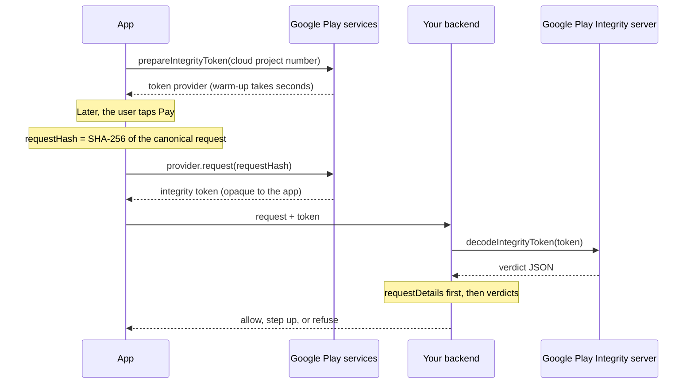
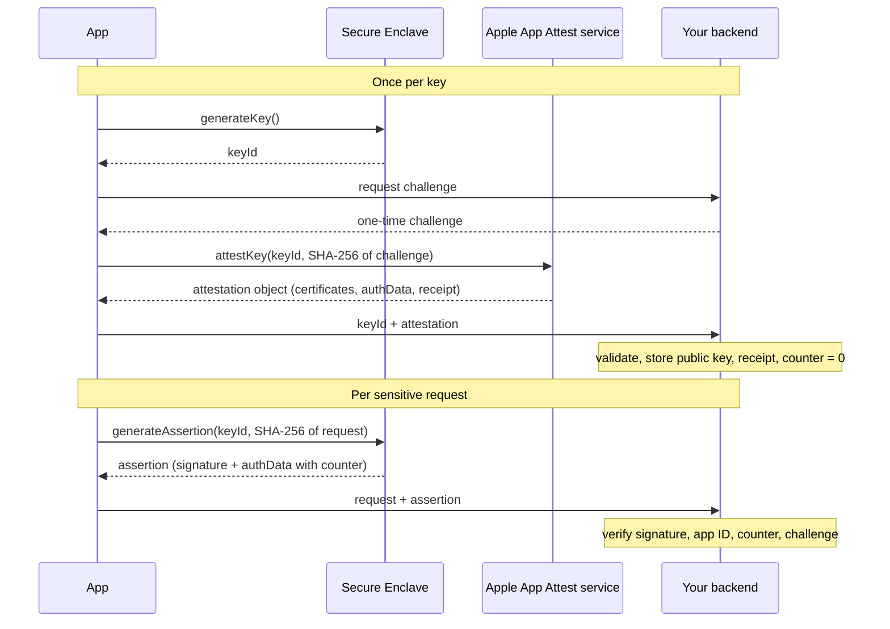
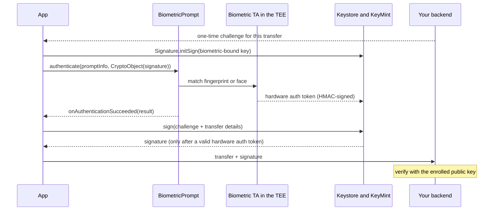
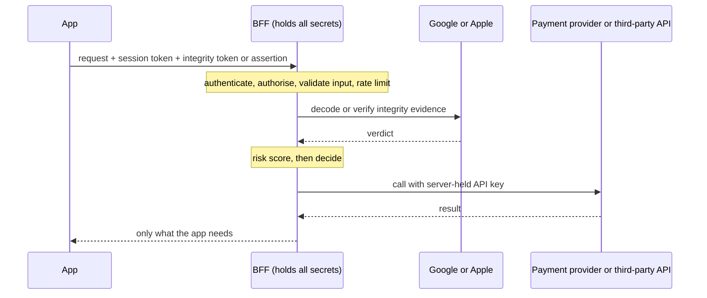
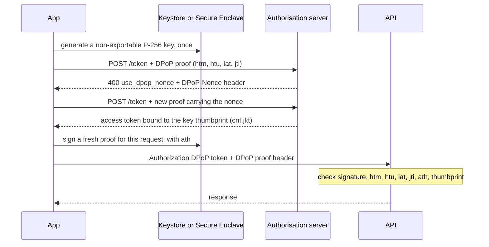

# Part 4: Proving who is calling

Every request that reaches your API arrives as bytes. Nothing in those bytes proves they came from your app, on a real phone, driven by the person whose session token is attached. Parts 2 and 3 protected the data. This part is about the caller.

Four chapters. Two platform attestation services (Play Integrity, App Attest), which vouch for the **app and device**. Biometrics, which, done properly, vouch for the **user's presence**. And the backend, which is the only place any of it can be decided.

## Chapter 9: Play Integrity — what it proves and what it does not

Picture a sign-up promotion: new accounts get credit. Within a week, a script running on a rack of emulators is creating thousands of accounts through your API. Each request is well formed. It carries a plausible device model and a plausible app version. Your server has no way to tell the script from a customer, because everything it knows about the caller, the caller told it.

**Attestation** fixes that asymmetry. The platform vendor, not the client, makes a signed statement about the app and the device, and your server checks it. That moves the trust decision to a place the attacker cannot reach, which is why it is the highest-value control most teams skip.

**SafetyNet Attestation is gone.** Google deprecated it in 2022 and completed the turndown in January 2025. Calls now fail with an `ApiException` whose status code is 7 (`NETWORK_ERROR`). Play Integrity is the only supported path on Android ([deprecation timeline](https://developer.android.com/privacy-and-security/safetynet/deprecation-timeline)).

### 9.1 The shape of the thing

Your app asks Google Play services for an **integrity token**: an encrypted, signed blob (for the curious: a JWS, a signed JSON Web Token, inside a JWE, an encrypted one). The app cannot read it. The app forwards it to your backend. Your backend sends it to Google's `decodeIntegrityToken` endpoint, which decrypts it, checks it, and returns a **verdict payload**. Your backend decides what to do, then tells the app.

Note where the decryption happens. The verdict reaches your server from Google, not from the device. A hooked app can refuse to send a token, or send someone else's, but it cannot write its own verdict. That is what makes attestation worth more than any client-side root check (Chapter 14).

The payload is plain JSON with a fixed set of top-level fields. Field order is not guaranteed:

```json
{
  "requestDetails":     { "requestPackageName": "...", "requestHash": "...", "timestampMillis": "..." },
  "appIntegrity":       { "appRecognitionVerdict": "...", "certificateSha256Digest": ["..."], "versionCode": "..." },
  "deviceIntegrity":    { "deviceRecognitionVerdict": ["..."] },
  "accountDetails":     { "appLicensingVerdict": "..." },
  "environmentDetails": { "playProtectVerdict": "...", "appAccessRiskVerdict": { "appsDetected": ["..."] } }
}
```

What each block tells you:

| Block | Question it answers | Values |
|---|---|---|
| `requestDetails` | Is this token for *this* request? | Package name, `requestHash` (standard) or `nonce` (classic), `timestampMillis` |
| `appIntegrity` | Is this my unmodified binary, as Play distributes it? | `PLAY_RECOGNIZED`, `UNRECOGNIZED_VERSION`, `UNEVALUATED` |
| `deviceIntegrity` | What kind of device is this? | A list of labels (§9.3), possibly empty |
| `accountDetails` | Was the app installed or updated through Google Play? | `LICENSED`, `UNLICENSED`, `UNEVALUATED` |
| `environmentDetails` *(opt-in)* | Is anything risky running alongside? | Play Protect status; apps that can capture the screen, overlay, or control the device |

**Check `requestDetails` first**, before anything else. Confirm the package name, confirm the `requestHash` or `nonce` matches the request you are processing, and confirm `timestampMillis` falls inside a short window. If any of those fail, nothing else in the payload means anything. You may be looking at a replayed token from a different request, or a token harvested from a different app.



*Figure 11: A Play Integrity standard request, from warm-up to the server's decision*

### 9.2 Standard or classic — choosing properly

There are two request types, and the choice is not cosmetic ([overview](https://developer.android.com/google/play/integrity/overview)).

| | Standard | Classic |
|---|---|---|
| Warm-up | Required: prepare a token provider in advance. A few seconds; most under 10 s | None |
| Token latency | A few hundred milliseconds | A few seconds |
| Intended frequency | On demand, for any action worth checking | Occasional one-off for the highest-value actions |
| Binds to your request via | `requestHash` (up to 500 bytes; send a digest, never raw data) | `nonce` (URL-safe Base64, no wrap, 16–500 characters) |
| Replay protection | Automatic, by Google Play | **Yours**: a server-issued, single-use nonce you track |
| Decryption | Google's server | Google's server, or locally with keys you download from Play Console |

**Use standard requests for nearly everything.** Prepare the provider at app start or in the background. Request a token when you make the server call you want to protect. If the provider has been held too long, requests fail with `INTEGRITY_TOKEN_PROVIDER_INVALID`: prepare a new one and retry once ([standard requests](https://developer.android.com/google/play/integrity/standard)).

**Use classic requests sparingly**, when you want a server-issued nonce as an additional guarantee on top of standard requests. Google's wording is that you are responsible for implementing classic requests correctly against exfiltration and certain attacks. Take that literally ([classic requests](https://developer.android.com/google/play/integrity/classic)).

#### Quotas, which are documented

The limits are published ([setup](https://developer.android.com/google/play/integrity/setup), [classic](https://developer.android.com/google/play/integrity/classic)):

| Limit | Value |
|---|---|
| Token requests per day | 10,000 by default, **shared between classic requests and standard provider preparations** |
| Token decryptions per day | 10,000 by default, shared between classic and standard |
| Classic requests per app instance | 5 per minute |
| Provider preparation on warm start | No more than 5 per minute per app instance |
| Increase | Request form in Play Console; app must be on Google Play; processing can take up to a week |

Read the first two rows together. Standard token requests after warm-up do not consume the token-request quota, but **every token your server decodes consumes a decryption**. The decode count is usually the one you hit first. Sudden spikes can also be throttled, so ramp large changes gradually and set quota alerts in Google Cloud Console.

> **Trap:** decrypt each token once. Google Play prevents a token from being "reused many times", and repeated decryption returns **cleared verdicts**: the device recognition verdict comes back empty, the app recognition and licensing verdicts come back `UNEVALUATED`, and opted-in optional verdicts are cleared too ([standard requests](https://developer.android.com/google/play/integrity/standard)). Google does not say how many decryptions trigger it. If production verdicts are mysteriously empty, check whether a retry path, a queue redelivery, or a second service is decoding a token that was already consumed. Decode once, then pass the parsed verdict along.

### 9.3 Reading the verdicts like an engineer, not a bouncer

The device verdict is a **list** of labels, and by default you get only one of them. `MEETS_BASIC_INTEGRITY` and `MEETS_STRONG_INTEGRITY` are **optional labels you must opt into** in Play Console. So are `deviceAttributes`, `recentDeviceActivity`, `deviceRecall` (beta) and the whole `environmentDetails` block ([verdicts](https://developer.android.com/google/play/integrity/verdicts)). If you have never seen `MEETS_STRONG_INTEGRITY`, check the opt-in before blaming your install base.

With the opt-in, a device that meets strong integrity returns all three labels. A device that meets none returns an empty list. Here is what each label requires today:

| Label | Android 13 and later | Android 12 and earlier |
|---|---|---|
| `MEETS_STRONG_INTEGRITY` *(opt-in)* | Device integrity **plus** a security update in the last 12 months, on both the OS partition and the vendor partition | Hardware-backed proof of boot integrity. No patch-recency requirement |
| `MEETS_DEVICE_INTEGRITY` | Hardware-backed, positive verified boot: bootloader locked, certified manufacturer OS image | Genuine, certified Android device; no hardware-backed verified-boot requirement (Google says these verdicts only "partially" used hardware-backed signals) |
| `MEETS_BASIC_INTEGRITY` *(opt-in)* | Android Platform Key Attestation root of trust from Google. Bootloader may be unlocked; rooted devices can qualify | Passes basic system integrity checks; may be uncertified |
| *(empty)* | Signs of attack (hooking, rooting) or an emulator that fails the checks | Same |

A fourth label, `MEETS_VIRTUAL_INTEGRITY`, appears only for Google Play Games for PC.

These Android 13+ requirements arrived in **May 2025**, announced in [December 2024](https://android-developers.googleblog.com/2024/12/making-play-integrity-api-faster-resilient-private.html). The change moved the verdict onto hardware-backed key attestation, cut the device signals Google collects by about 90%, and targets up to 80% lower worst-case latency, with Google saying the latency gains arrive gradually. It also made all optional signals except device attributes require, on Android 13 and later, that the app was installed or updated by Google Play ([improvements](https://developer.android.com/google/play/integrity/improvements)). **Verified boot**, the hardware check that the device started an unmodified OS (Chapter 0.4), became the anchor.

**Here is the consequence almost everyone gets wrong.** A missing `MEETS_STRONG_INTEGRITY` does **not** mean the device is compromised. On Android 13+ it most often means the phone has not had a security update in a year. That is common on older or regionally supported hardware, and entirely outside the user's control. Google's own estimate for the May 2025 change was a drop of about 14.5% in strong responses, against about 0.4% for device and basic.

So treat the labels as a gradient, not a gate:

- **Strong integrity** is a bonus signal for your very highest-risk actions. Never make it a baseline, or you lock out real customers on older phones.
- **Device integrity** is a reasonable expectation for sensitive flows. When it is missing, move the session into a higher-risk bucket rather than blocking: allow browsing, require step-up authentication for anything sensitive (Chapter 0.3), cap limits, monitor.
- **Basic integrity only**, on Android 13+, usually means an unlocked bootloader or a custom OS. Raise scrutiny; do not refuse service by reflex.
- **Empty** is the strongest negative signal the API gives you. Even here, pair refusal with a route out (§9.4).

Use `deviceAttributes.sdkVersion` (opt-in) when you need to know which column of that table applies. Use `recentDeviceActivity` (opt-in) to spot hyperactive devices: `LEVEL_4` means more than 50 standard (or 15 classic) token requests from that device for your app in the last hour, which is what a farm replaying one phone looks like.

### 9.4 How to roll it out without breaking your users

Google's documentation recommends the sequence, and it is right: **implement without enforcement first** ([overview](https://developer.android.com/google/play/integrity/overview)).

Ship the integration. Log verdicts from your real install base. Look at the distribution per label, per Android version, per country. Only then estimate what each enforcement option would cost, and choose. Enforcing on day one against an unknown distribution is how a team blocks a measurable slice of paying customers and finds out from store reviews.

Then enforce incrementally, starting with your highest-value flows and leaving general use alone.

When you refuse or restrict something, give the user a way out. **Remediation dialogs** are Play-provided screens your app can trigger:

| Dialog | Fixes | Library |
|---|---|---|
| `GET_LICENSED` | Unlicensed or modified app: sends the user to Google Play | 1.3.0+ |
| `CLOSE_UNKNOWN_ACCESS_RISK`, `CLOSE_ALL_ACCESS_RISK` | Apps capturing the screen or controlling the device | 1.4.0+ |
| `GET_INTEGRITY` | Missing device integrity, licensing and app issues, and remediable client exceptions such as outdated Play services | 1.5.0+ (28 August 2025) |
| `GET_STRONG_INTEGRITY` | Everything `GET_INTEGRITY` covers, plus strong integrity and Play Protect issues | 1.5.0+ |

Version 1.5.0 also introduced a single `showDialog` method on the integrity managers and deprecated the old per-token one ([remediation](https://developer.android.com/google/play/integrity/remediation), [release notes](https://developer.android.com/google/play/integrity/reference/com/google/android/play/core/release-notes)). The current library is **1.6.0** (20 November 2025).

Your server decides which dialog applies, because only your server can read the verdict. It returns the dialog code to the app, and the app shows it.

### 9.5 The honest limits

Play Integrity proves that a request comes from your genuine, unmodified binary as distributed by Google Play, installed or updated through Play, on a device meeting a stated integrity level.

It does **not** prove that the user is legitimate. A fraudster with a genuine phone passes. It is not a root oracle either: an unlocked or rooted device can still earn basic integrity, and leaked hardware attestation keys (§5.4) are exactly what attackers use to fake stronger labels. It depends on Google Play services, which excludes some legitimate devices and whole markets. And quota and throttling behaviour is a real constraint at scale, which is part of why commercial alternatives exist *(reported)* ([Approov's critique](https://approov.io/blog/limitations-of-google-play-integrity-api-ex-safetynet)).

Use it as one strong input to a backend risk decision (§12.2). Not as the decision.

### 9.6 How to implement it

#### Android client: prepare early, bind every token to its request

```kotlin
import android.content.Context
import android.util.Base64
import com.google.android.play.core.integrity.IntegrityManagerFactory
import com.google.android.play.core.integrity.StandardIntegrityException
import com.google.android.play.core.integrity.StandardIntegrityManager.PrepareIntegrityTokenRequest
import com.google.android.play.core.integrity.StandardIntegrityManager.StandardIntegrityTokenProvider
import com.google.android.play.core.integrity.StandardIntegrityManager.StandardIntegrityTokenRequest
import com.google.android.play.core.integrity.model.StandardIntegrityErrorCode
import kotlinx.coroutines.sync.Mutex
import kotlinx.coroutines.sync.withLock
import kotlinx.coroutines.tasks.await   // org.jetbrains.kotlinx:kotlinx-coroutines-play-services
import java.security.MessageDigest

// Gradle: implementation("com.google.android.play:integrity:1.6.0")
class IntegrityClient(context: Context, private val cloudProjectNumber: Long) {

    private val manager = IntegrityManagerFactory.createStandard(context.applicationContext)
    private val lock = Mutex()
    private var provider: StandardIntegrityTokenProvider? = null

    /** Call at app start, off the critical path. Warm-up takes seconds. */
    suspend fun warmUp() {
        lock.withLock { if (provider == null) provider = prepare() }
    }

    /** A token bound to exactly these request bytes. */
    suspend fun tokenFor(canonicalRequest: ByteArray): String {
        val requestHash = sha256UrlSafe(canonicalRequest)
        val current = lock.withLock { provider ?: prepare().also { provider = it } }
        return try {
            request(current, requestHash)
        } catch (e: StandardIntegrityException) {
            if (e.errorCode != StandardIntegrityErrorCode.INTEGRITY_TOKEN_PROVIDER_INVALID) throw e
            // The provider expired. Prepare a fresh one and retry once.
            val fresh = lock.withLock { prepare().also { provider = it } }
            request(fresh, requestHash)
        }
    }

    private suspend fun prepare(): StandardIntegrityTokenProvider =
        manager.prepareIntegrityToken(
            PrepareIntegrityTokenRequest.builder()
                .setCloudProjectNumber(cloudProjectNumber)
                .build()
        ).await()

    private suspend fun request(p: StandardIntegrityTokenProvider, hash: String): String =
        p.request(
            StandardIntegrityTokenRequest.builder()
                .setRequestHash(hash)
                .build()
        ).await().token()

    private fun sha256UrlSafe(bytes: ByteArray): String =
        Base64.encodeToString(
            MessageDigest.getInstance("SHA-256").digest(bytes),
            Base64.URL_SAFE or Base64.NO_WRAP or Base64.NO_PADDING
        )
}
```

Three things this code does on purpose. The request hash is a digest of the **exact bytes** the server will receive, so the server can recompute it. Nothing sensitive goes into the hash input unhashed, because Google stores `requestHash` verbatim in the token. And retryable errors (`TOO_MANY_REQUESTS`, `CLIENT_TRANSIENT_ERROR`, `GOOGLE_SERVER_UNAVAILABLE`) are left to your caller's exponential backoff rather than retried in a tight loop.

#### Server: requestDetails first, then a level

After your backend calls `decodeIntegrityToken` with a service account that has the `playintegrity` scope, parse the payload and check it. The response wraps the verdict as `tokenPayloadExternal`; deserialise that field, not the whole body, into `TokenPayload`. This is framework-neutral Kotlin (JVM) using `kotlinx.serialization`:

```kotlin
import kotlinx.serialization.Serializable
import java.security.MessageDigest

@Serializable data class RequestDetails(
    val requestPackageName: String,
    val requestHash: String? = null,          // standard requests
    val nonce: String? = null,                // classic requests
    val timestampMillis: String,
)
@Serializable data class AppIntegrity(
    val appRecognitionVerdict: String,
    val certificateSha256Digest: List<String> = emptyList(),
)
@Serializable data class DeviceIntegrity(val deviceRecognitionVerdict: List<String> = emptyList())
@Serializable data class AccountDetails(val appLicensingVerdict: String)
@Serializable data class TokenPayload(
    val requestDetails: RequestDetails,
    val appIntegrity: AppIntegrity,
    val deviceIntegrity: DeviceIntegrity,
    val accountDetails: AccountDetails,
)

enum class DeviceLevel { NONE, BASIC, DEVICE, STRONG }

sealed interface IntegrityResult {
    /** The token is not for this request. Treat it exactly like no token at all. */
    data object NotForThisRequest : IntegrityResult
    data class Evaluated(val appGenuine: Boolean, val licensed: Boolean, val device: DeviceLevel) : IntegrityResult
}

private const val MAX_AGE_MILLIS = 60_000L        // tune; shorter is stricter
private const val MAX_CLOCK_SKEW_MILLIS = 5_000L

fun evaluate(
    payload: TokenPayload,
    expectedPackage: String,
    expectedRequestHash: String,                  // recomputed from the request you received
    expectedCertDigest: String,                   // your Play app signing certificate, as Play reports it
    nowMillis: Long = System.currentTimeMillis(),
): IntegrityResult {
    val rd = payload.requestDetails
    val hashMatches = MessageDigest.isEqual(
        rd.requestHash.orEmpty().toByteArray(), expectedRequestHash.toByteArray()
    )
    val age = nowMillis - (rd.timestampMillis.toLongOrNull() ?: return IntegrityResult.NotForThisRequest)
    if (rd.requestPackageName != expectedPackage || !hashMatches ||
        age !in -MAX_CLOCK_SKEW_MILLIS..MAX_AGE_MILLIS
    ) return IntegrityResult.NotForThisRequest

    val labels = payload.deviceIntegrity.deviceRecognitionVerdict
    val device = when {
        "MEETS_STRONG_INTEGRITY" in labels -> DeviceLevel.STRONG
        "MEETS_DEVICE_INTEGRITY" in labels -> DeviceLevel.DEVICE
        "MEETS_BASIC_INTEGRITY" in labels  -> DeviceLevel.BASIC
        else                               -> DeviceLevel.NONE
    }
    val app = payload.appIntegrity
    return IntegrityResult.Evaluated(
        appGenuine = app.appRecognitionVerdict == "PLAY_RECOGNIZED" &&
            expectedCertDigest in app.certificateSha256Digest,
        licensed = payload.accountDetails.appLicensingVerdict == "LICENSED",
        device = device,
    )
}
```

Decode with `Json { ignoreUnknownKeys = true }` so opt-in fields you have not modelled do not break parsing. The function returns facts, not a decision. The decision belongs to the risk score in §12.5.

#### Verify it

**Binding.** Capture a valid request and token with a proxy (Chapter 22), change one field in the body, and resend with the same token. **Pass:** the server treats it as `NotForThisRequest`. **Fail:** it is accepted, meaning the server never compared `requestHash`.

**Replay.** Resend the captured request unchanged after your `MAX_AGE_MILLIS` window. **Pass:** rejected. **Fail:** accepted.

**Decode-once.** Grep the backend for every call to `decodeIntegrityToken`. **Pass:** exactly one code path, called once per token. **Fail:** a retry wrapper or a second service decodes the same token.

**Key takeaways**

- Play Integrity moves the trust decision to your server: the verdict comes from Google, never from the device.
- Check `requestDetails` (package, `requestHash` or `nonce`, timestamp) before reading any verdict.
- `MEETS_BASIC_INTEGRITY` and `MEETS_STRONG_INTEGRITY` are opt-in; a missing strong label usually means an unpatched phone, not an attacker.
- The quotas are published: 10,000 token requests and 10,000 decryptions a day by default. Decode each token once.
- Log first, enforce later, and pair every refusal with a remediation dialog.

**Try it**

1. **Settle an untested claim.** In a debug build of your own Play-distributed app, request one standard token, then decode it twice (or ten times) against `decodeIntegrityToken` and diff the payloads. Record at which decode, if any, the verdicts clear. That is one of the [claims Chapter 33 lists as untested](12-verification.md#claims-this-book-asserts-but-has-not-empirically-tested), and the result is worth [an issue](https://github.com/hossam9k/mobile-app-security/issues/new/choose).
2. Opt into `MEETS_STRONG_INTEGRITY` and `deviceAttributes` in Play Console, log verdicts for a week without enforcing, and chart the label distribution by `sdkVersion`.
3. Install Play Integrity on a rooted or unlocked-bootloader test device and on a stock phone, and compare the labels each returns.

---

## Chapter 10: App Attest — Apple's model

An attacker downloads your IPA, patches out the paywall check, re-signs it and runs it on their own iPhone. Every request it sends looks exactly like your app's, because it *is* your app's code, minus one branch. Your server cannot tell.

Apple's **App Attest**, part of the DeviceCheck framework, solves the same problem as Play Integrity with a different structure. The difference shapes your integration, so it is worth understanding before you write a line.

### 10.1 Attest once, assert often

The flow has two phases. Conflating them is the most common implementation error.

**Registration, once per key.** Your app calls `generateKey()`. That creates a P-256 key pair in the **Secure Enclave**, Apple's isolated security coprocessor (§4.3), and returns a key identifier. The private key never leaves the Enclave. Your app fetches a one-time challenge from your server and calls `attestKey(_:clientDataHash:)` with a SHA-256 hash of it. This call **contacts Apple's servers**, which certify that the key lives in genuine Apple hardware and belongs to your app. You get back an **attestation object**: a certificate chain rooted in Apple's App Attest root CA, authenticator data, and a **receipt**. Your server validates it and stores the public key, the receipt and a counter of zero against that user and device.

**Ongoing use, per protected request.** Your app calls `generateAssertion(_:clientDataHash:)` over a hash of the request. Assertions are **generated locally, with no round trip to Apple**. The app sends the assertion with the request, and your server verifies the signature with the public key it stored.



*Figure 12: App Attest: attest once, assert on every protected request*

That asymmetry dictates the design: attestation contacts Apple, assertions do not. Attest rarely. Assert on the requests that matter.

Apple places no limit on assertions per key, but recommends reserving them for sensitive moments, such as downloading premium content ([Establishing your app's integrity](https://developer.apple.com/documentation/devicecheck/establishing-your-app-s-integrity)). Each is a Secure Enclave signature, so keep them off tight loops and hot lifecycle paths. Use them for authentication-related requests, premium content, and transactions.

Two rules from the same page. **One key per user per device**: sharing a key across accounts on one device makes it hard to spot one compromised device serving many remote users. And keys survive app updates but **not** reinstallation, device migration or restore from backup. After any of those, you start again with a new key.

### 10.2 What your server must do

Apple's server-side procedure has more steps than most tutorials show ([Validating apps that connect to your server](https://developer.apple.com/documentation/devicecheck/validating-apps-that-connect-to-your-server)).

**For the attestation (once):**

| Check | Why |
|---|---|
| Certificate chain validates to Apple's App Attest root CA | The key really is in Apple hardware |
| The nonce in the leaf certificate (OID `1.2.840.113635.100.8.2`) equals SHA-256 of `authData` + your `clientDataHash` | The attestation answers *your* challenge |
| SHA-256 of the public key in X9.62 uncompressed form (`0x04‖X‖Y`, 65 bytes) equals the Base64-decoded key identifier, and `credentialId` equals it too | The certificate is for this key. Hashing the DER `SubjectPublicKeyInfo` instead gives a mismatch |
| `RP ID` hash equals SHA-256 of your App ID (`TEAMID.com.example.app`; on macOS, the signing identifier replaces the bundle ID) | The key belongs to *your* app, not a lookalike |
| `counter` is 0 | A fresh key |
| `aaguid` is `appattestdevelop` (development) or `appattest` followed by seven `0x00` bytes (production) | Development keys cannot be used in production, and vice versa |
| iOS 27+: `extensions` carry the launch validation category and bundle version | See §10.3 |
| The public key is not already registered to another user | Stops one attested key serving many accounts (a replayed registration) |

Then store the public key against this user and device, and verify and store the attestation receipt at the same time; you need it for the fraud metric (§10.3). Expect several (key, receipt) pairs per user, one per device, and keep development pairs apart from production ones.

Apple's *Preparing to use the App Attest service* page says to expect `appattestsandbox` in development, which contradicts the validating procedure above. Accept exactly the value for the environment you run, and check it against a real development build rather than trusting either page.

**For every assertion:**

**Verify the signature.** Hash the client data you received, concatenate it after the authenticator data, hash again to form the nonce, and verify the signature against the stored public key.

**Confirm the `RP ID` hash is your App ID.** This binds the assertion to your app.

**Confirm the embedded challenge matches one you issued**, and that it has not been used before.

**Track the counter per key and require it to be strictly increasing.** This is the check people skip. Without it, a captured assertion can be replayed, and you have built an elaborate signature check that does not stop the attack it exists to prevent. Apple adds that a steady or decreasing counter may indicate a compromised copy of your app that does not know the value your server recorded ([WWDC26 Session 201](https://developer.apple.com/videos/play/wwdc2026/201/)).

Make the counter update atomic, or two concurrent requests can both pass:

```sql
-- Succeeds only if the new counter is strictly greater. 0 rows updated = replay.
UPDATE app_attest_keys
   SET counter = :new_counter
 WHERE key_id  = :key_id
   AND counter < :new_counter;
```

On challenges: Apple's documented flow uses a server-issued, single-use challenge embedded in the client data, and that is the design to default to. Some teams instead hash a server-reconstructible request digest and rely on the counter for replay protection, to save a round trip *(reasoned)*. If you do, your server must be able to rebuild exactly what was hashed for that request, or you have removed the binding.

### 10.3 What changed in 2026

WWDC26 Session 201, *Secure your apps with App Attest*, is the current reference ([session](https://developer.apple.com/videos/play/wwdc2026/201/)). What is genuinely new:

**Two signals on iOS 27.** A new `extensions` structure is appended to the authenticator data, carrying the app's **launch validation category** and its **bundle version**. If you shipped through the App Store but an attestation reports a TestFlight launch category, or reports a bundle version you never shipped, the app is running somewhere you did not expect.

**App Attest on macOS 27.** Previously unsupported on the Mac. On macOS 27 the leaf certificate also carries the key's access-control property (the "ACL Blob" OID), describing the conditions the Secure Enclave enforced. Apple's procedure is prescriptive here: extract the `aclBlob` (OID `1.2.840.113635.100.8.6`) and require it to equal the single Base64 value Apple publishes for System Integrity Protection plus full security mode; attested Mac keys should be trusted for that exact value only. On macOS the `RP ID` is also derived from the app's signing identifier rather than its bundle ID.

What is **not** new, despite how it is often summarised: the **fraud metric**, which Apple's documentation calls the risk metric. It has existed since WWDC21 ([session 10244](https://developer.apple.com/videos/play/wwdc2021/10244/)). Your server sends the receipt from attestation to Apple's server-to-server endpoint and gets back a fresh receipt containing an approximate count of attested keys for your app on that device over the past 30 days ([Assessing fraud risk](https://developer.apple.com/documentation/devicecheck/assessing-fraud-risk)). A high number suggests one device serving many modified instances. You can refresh a receipt only after its "not before" date and must do so before it expires, so fetch the metric on a schedule. Apple's 2026 advice is to treat it as an investigation signal, not a reason to block.

The session's operational guidance deserves quoting, because it prevents a real customer-harming bug. Apple: "Don't reject new keys outright". Reinstalls and restores legitimately rotate keys, so do not immediately invalidate a user's older keys either. A backend that treats "this user presented a key I have not seen" as fraud punishes honest customers for changing phones. Handle it as a re-registration event, scored alongside the fraud metric and the user's key history.

Two more signals from the same session: `isSupported` returning false on a platform where it should be true can itself indicate tampering, and your server, not the app, should control when attestation starts.

### 10.4 Errors you will actually meet

`DCError` has five codes: `featureUnsupported`, `invalidInput`, `invalidKey`, `serverUnavailable` and `unknownSystemFailure`. Apple's rule for `attestKey` is short. On `serverUnavailable`, try again later **with the same key**. On any other error, discard the key identifier and generate a new key before trying again ([Establishing your app's integrity](https://developer.apple.com/documentation/devicecheck/establishing-your-app-s-integrity)). The challenge is yours to manage: fetch a fresh single-use one for each attempt. Cap retries and back off exponentially; Apple's 2026 session recommends exponential backoff specifically to avoid global rate limits.

Two rough edges, from developer forum reports rather than documentation:

- **Persistent `invalidKey`.** Developers report that a small share of devices fail `attestKey` with `invalidKey` every time, even with fresh keys and after reinstalling, with no answer from Apple *(reported)*.
- **Throttling.** Apple documents that the rate threshold fluctuates and that you should be able to pull back requests (§10.5). It has not said whether throttling can surface as `invalidKey`.

One common self-inflicted cause of `invalidKey`: persisting the key identifier somewhere that migrates with a backup. The restored app finds a key ID whose key does not exist on the new device *(reported)*. Store the key ID in the Keychain with a `ThisDeviceOnly` accessibility class (§6.6) so it never migrates. That does not make it always valid: the Keychain survives a reinstall, and a `ThisDeviceOnly` item still comes back from a same-device backup (§4.4), while the App Attest key does neither. So also handle `invalidKey` by discarding the ID and re-attesting.

The practical response: **stage your rollout**, let the server decide who attests when, back off, and design a grace mode that lets a user continue with elevated scrutiny rather than being locked out because attestation failed on their particular handset.

### 10.5 Limits, and when to actually check

Apple publishes more guidance than it is usually credited with, in [Preparing to use the App Attest service](https://developer.apple.com/documentation/devicecheck/preparing-to-use-the-app-attest-service):

| Limit | Value | Source |
|---|---|---|
| Rate of `attestKey()` | Keep calls below roughly **100 per second across all installations**. The threshold may fluctuate dynamically; be ready to pull back | Apple |
| Rollout pace | Ramp gradually and uniformly, **no more than 10 million users per day per app** | Apple |
| After rollout | New users, new devices and reinstalls only; Apple says this "shouldn't result in any throttling" | Apple |
| Assertions | No limit per key | Apple |
| Daily quota, SLA, increase process | None published | Absence of documentation |
| Environments | Development and production keys and receipts are not interchangeable; distributed apps always use production | Apple |

Note the precise wording of the `attestKey()` rule: **once per key**. "Once per installation" is the usual consequence, not the rule. A reinstall, a device migration or a restore legitimately produces a new key, and per §10.3, Apple's guidance is not to treat a new key from an existing user as fraud.

#### When to check integrity

Integrity checks cost quota on Android and rate budget on iOS, so you cannot attest everything. This table is the discriminator, and it applies to both platforms.

| User action | Check integrity? | Why |
|---|---|---|
| Payment or checkout | **Yes** | Financial transaction; highest risk |
| Add a payment method | **Yes** | Financial data at risk |
| Change password or email | **Yes** | The classic account-takeover vector |
| Delete account | **Yes** | Irreversible |
| Initial login | **Yes** | This is where the session is established |
| Product browsing | No | Low risk, high volume, would burn quota for nothing |
| Search | No | No sensitive data involved |
| View cart | No | No state change |
| View profile | No | **Already behind authentication** |

That last row generalises: **if an action is already gated by something you trust, attesting it again buys little.** Attestation earns its cost where trust is established or where state changes irreversibly, not on every screen behind the login.

### 10.6 The shared limit

Both platforms' attestation proves something about the **app and device**, not about the **user**. Apple says so plainly: App Attest "can't definitively pinpoint a device with a compromised operating system" ([DeviceCheck](https://developer.apple.com/documentation/devicecheck)). A jailbroken device can still hold a genuine Secure Enclave key.

Attestation belongs in a risk score, alongside authentication, account history, behaviour and velocity. Chapter 12 builds one.

If you would rather not write the verification yourself, Firebase App Check wraps App Attest (and Play Integrity on Android) behind one verifier. You trade control over the checks and the risk decision for less code.

### 10.7 How to implement it

#### iOS client: register once, assert on sensitive requests

```swift
import CryptoKit
import DeviceCheck
import Foundation

/// Your networking layer. The server issues single-use challenges and verifies everything.
protocol AttestBackend: Sendable {
    func fetchChallenge() async throws -> Data
    func register(keyID: String, attestation: Data, challenge: Data) async throws
}

/// Persists the key ID in the Keychain with a ThisDeviceOnly class (§6.6) so it never
/// migrates to a new device. It can still come back after a reinstall or a same-device
/// restore (the Keychain outlives the app), so `assertion(for:)` treats invalidKey as
/// "re-register".
protocol KeyIDStore: Sendable {
    func load() -> String?
    func save(_ keyID: String?)
}

enum AttestError: Error { case unsupported, notRegistered }

actor AppAttestClient {
    // Not Sendable in the SDK; without this, Swift 6 mode can flag the async calls below
    // as "sending 'self.service' risks causing data races". Apple-managed singleton.
    nonisolated(unsafe) private let service = DCAppAttestService.shared
    private let backend: AttestBackend
    private let store: KeyIDStore
    private var pendingKeyID: String?   // kept across serverUnavailable retries

    init(backend: AttestBackend, store: KeyIDStore) {
        self.backend = backend
        self.store = store
    }

    /// Call when your server says this user should attest (staged rollout, §10.4).
    func registerIfNeeded() async throws {
        guard service.isSupported else { throw AttestError.unsupported } // report this: it is a signal
        guard store.load() == nil else { return }

        let keyID: String
        if let pendingKeyID { keyID = pendingKeyID } else { keyID = try await service.generateKey() }
        pendingKeyID = nil               // by default, a failed attempt discards the key

        let challenge = try await backend.fetchChallenge()               // fresh, ≥ 16 random bytes
        let attestation: Data
        do {
            attestation = try await service.attestKey(keyID, clientDataHash: Data(SHA256.hash(data: challenge)))
        } catch let error as DCError where error.code == .serverUnavailable {
            pendingKeyID = keyID         // Apple: retry later, with backoff, with the SAME key
            throw error
        }
        try await backend.register(keyID: keyID, attestation: attestation, challenge: challenge)
        store.save(keyID)
    }

    /// `clientData` is the exact request body, including the server's challenge.
    /// The server hashes the same bytes when it verifies.
    func assertion(for clientData: Data) async throws -> Data {
        guard let keyID = store.load() else { throw AttestError.notRegistered }
        do {
            return try await service.generateAssertion(keyID, clientDataHash: Data(SHA256.hash(data: clientData)))
        } catch let error as DCError where error.code == .invalidKey {
            store.save(nil)              // the key is gone: re-register
            throw error
        }
    }
}
```

Add the App Attest capability in Xcode, which writes the `com.apple.developer.devicecheck.appattest-environment` entitlement. Development builds use Apple's development environment unless you set that entitlement to `production`; TestFlight and App Store builds always use production.

#### Server: verify every assertion

The client is the easy half. This is the half that decides anything: Apple's assertion procedure from §10.2, in order, on a JVM backend ([Validating apps that connect to your server](https://developer.apple.com/documentation/devicecheck/validating-apps-that-connect-to-your-server)). The assertion is a CBOR map with two byte strings, `signature` and `authenticatorData`. The public key is the one you stored from `credCert` when the attestation passed (next subsection).

```kotlin
// Server (JVM). CBOR parsing: com.fasterxml.jackson.dataformat:jackson-dataformat-cbor (2.x).
import com.fasterxml.jackson.dataformat.cbor.databind.CBORMapper
import java.nio.ByteBuffer
import java.security.KeyFactory
import java.security.MessageDigest
import java.security.Signature
import java.security.spec.X509EncodedKeySpec

/** The DER SubjectPublicKeyInfo you saved from credCert at attestation. */
class StoredKey(val keyId: String, val publicKeyDer: ByteArray)

interface AttestKeys {
    /** Runs the UPDATE ... WHERE counter < :new_counter from §10.2. True only if one row changed. */
    fun advanceCounter(keyId: String, newCounter: Long): Boolean
}

interface Challenges {
    /** True only for a challenge you issued, unexpired and unused. Marks it used. */
    fun consume(challenge: String): Boolean
}

private val cbor = CBORMapper()

private fun sha256(vararg parts: ByteArray): ByteArray =
    MessageDigest.getInstance("SHA-256").apply { parts.forEach { update(it) } }.digest()

/**
 * `appId` is "TEAMID.com.example.app". `challenge` is the value your own format embeds
 * inside `clientData`: parse it out of those bytes, never from a separate field.
 */
fun verifyAssertion(
    assertion: ByteArray, clientData: ByteArray, challenge: String,
    key: StoredKey, appId: String, keys: AttestKeys, challenges: Challenges,
): Boolean {
    val node = cbor.readTree(assertion)
    val signature = node.get("signature")?.binaryValue() ?: return false
    val authData = node.get("authenticatorData")?.binaryValue() ?: return false
    if (authData.size < 37) return false   // RP ID hash (32) + flags (1) + counter (4), then iOS 27 extensions

    // Steps 1-3: nonce = SHA-256(authenticatorData || SHA-256(clientData)), signed with the stored key.
    val nonce = sha256(authData, sha256(clientData))
    val publicKey = KeyFactory.getInstance("EC").generatePublic(X509EncodedKeySpec(key.publicKeyDer))
    val signatureValid = Signature.getInstance("SHA256withECDSA").run {
        initVerify(publicKey)
        update(nonce)
        verify(signature)
    }
    if (!signatureValid) return false

    // Step 4: the RP ID hash binds the assertion to your App ID, not a lookalike's.
    if (!MessageDigest.isEqual(authData.copyOfRange(0, 32), sha256(appId.toByteArray()))) return false

    // Step 6: the challenge must be one you issued, and it is spent now.
    if (!challenges.consume(challenge)) return false

    // Step 5: the counter (big-endian, bytes 33-36) must rise, and the update must be atomic.
    val counter = ByteBuffer.wrap(authData, 33, 4).int.toLong() and 0xFFFF_FFFFL
    return keys.advanceCounter(key.keyId, counter)
}
```

Three details that break real verifiers:

- **The length check is a minimum.** On iOS 27 an `extensions` CBOR map follows the counter, carrying the launch validation category and bundle version (§10.3). Apple's current procedure adds checking both as steps 7 and 8; read them from there, and never insist on exactly 37 bytes.
- **Hash the bytes you received.** `clientData` is whatever the app signed. Re-serialising a parsed JSON body before hashing changes the bytes, and every signature then fails.
- **The counter update is the replay check.** Returning `true` before `advanceCounter` succeeds turns the atomic SQL in §10.2 into decoration.

#### Server: verify the attestation, once

The assertion verifier trusts whatever public key you stored, so the attestation check is where that trust comes from, and it is the more error-prone half. The attestation object is a CBOR map: `fmt` (`"apple-appattest"`), `attStmt` (`x5c`, the leaf and intermediate certificates, plus `receipt`) and `authData`. This sketch follows Apple's steps 1 to 9 and the storage rule from §10.2, reusing `cbor` and `sha256` from above. Pin the root you download from Apple's Private PKI page (`Apple_App_Attestation_Root_CA.pem`), not one fetched at runtime.

```kotlin
// Server (JVM). Adds org.bouncycastle:bcprov-jdk18on for ASN.1. Any exception means reject.
import org.bouncycastle.asn1.*
import java.math.BigInteger
import java.security.MessageDigest
import java.security.cert.*
import java.security.interfaces.ECPublicKey
import java.util.Base64

val AAGUID_PRODUCTION = "appattest".toByteArray() + ByteArray(7)   // seven 0x00 bytes
val AAGUID_DEVELOPMENT = "appattestdevelop".toByteArray()

interface KeyRegistry {
    /** INSERT under a UNIQUE key_id; false if the key is already bound to any user. */
    fun register(userId: String, keyId: String, publicKeyDer: ByteArray, receipt: ByteArray): Boolean
}

/** `challenge`: the single-use bytes you issued for this attempt, already consumed. */
fun verifyAttestation(
    attestation: ByteArray, keyIdB64: String, challenge: ByteArray, userId: String,
    appId: String, aaguid: ByteArray, appleRoot: X509Certificate, registry: KeyRegistry,
): Boolean {
    val obj = cbor.readTree(attestation)
    if (obj.path("fmt").asText() != "apple-appattest") return false
    val x5c = obj.path("attStmt").path("x5c")
    val receipt = obj.path("attStmt").get("receipt")?.binaryValue() ?: return false
    val authData = obj.get("authData")?.binaryValue() ?: return false
    if (x5c.size() != 2 || authData.size < 55) return false

    // Step 1: credCert -> intermediate -> the pinned Apple App Attestation Root CA.
    val cf = CertificateFactory.getInstance("X.509")
    val chain = (0 until 2).map { cf.generateCertificate(x5c[it].binaryValue().inputStream()) as X509Certificate }
    val params = PKIXParameters(setOf(TrustAnchor(appleRoot, null))).apply { isRevocationEnabled = false }
    CertPathValidator.getInstance("PKIX").validate(cf.generateCertPath(chain), params)   // throws if invalid
    val credCert = chain[0]

    // Steps 2-4: SHA-256(authData || SHA-256(challenge)) equals the extension's
    // SEQUENCE { [1] EXPLICIT OCTET STRING }.
    val ext = credCert.getExtensionValue("1.2.840.113635.100.8.2") ?: return false
    val seq = ASN1Sequence.getInstance(ASN1OctetString.getInstance(ext).octets)
    val tagged = ASN1TaggedObject.getInstance(seq.getObjectAt(0), BERTags.CONTEXT_SPECIFIC, 1)
    val certNonce = ASN1OctetString.getInstance(tagged, true).octets
    if (!MessageDigest.isEqual(certNonce, sha256(authData, sha256(challenge)))) return false

    // Step 5: SHA-256 of the X9.62 uncompressed point (0x04 || X || Y) is the key ID.
    val pub = credCert.publicKey as? ECPublicKey ?: return false
    val keyId = Base64.getDecoder().decode(keyIdB64)
    val point = byteArrayOf(4) + pub.w.affineX.to32() + pub.w.affineY.to32()
    if (!MessageDigest.isEqual(sha256(point), keyId)) return false

    // Steps 6-9: RP ID hash, counter 0, this environment's aaguid, credentialId == key ID.
    if (!MessageDigest.isEqual(authData.copyOfRange(0, 32), sha256(appId.toByteArray()))) return false
    if (authData.copyOfRange(33, 37).any { it != 0.toByte() }) return false
    if (!MessageDigest.isEqual(authData.copyOfRange(37, 53), aaguid)) return false
    val idLen = ((authData[53].toInt() and 0xFF) shl 8) or (authData[54].toInt() and 0xFF)
    if (authData.size < 55 + idLen) return false
    if (!MessageDigest.isEqual(authData.copyOfRange(55, 55 + idLen), keyId)) return false

    // Store: refuse a key already registered to another user; keep the receipt (§10.3).
    return registry.register(userId, keyIdB64, pub.encoded, receipt)
}

private fun BigInteger.to32(): ByteArray = toByteArray().let { b ->
    if (b.size >= 32) b.copyOfRange(b.size - 32, b.size) else ByteArray(32 - b.size) + b
}
```

What this sketch deliberately leaves out, so do not ship it as complete: validating the receipt itself (a signed PKCS #7 structure; see [Assessing fraud risk](https://developer.apple.com/documentation/devicecheck/assessing-fraud-risk)), the iOS 27 `extensions` checks (steps 10 and 11), and the macOS `aclBlob` check (§10.3). Revocation checking is off because Apple does not document a revocation endpoint for this chain *(reasoned)*. I have not run it against a recorded attestation *(illustrative)*; test it, or a maintained open-source verifier you trust, against real development and production attestations before relying on it.

#### Verify it

**Signature.** Capture a request with its assertion, change one byte of the body, and resend. **Pass:** rejected at the signature step. **Fail:** accepted, meaning the server verified something other than the bytes it received.

**Counter.** Capture one request with its assertion and send it twice. **Pass:** the second is rejected (zero rows updated in the counter table). **Fail:** both succeed.

**App binding.** Build a copy of your app under a different bundle ID, attest, and send its assertions to production. **Pass:** rejected on the `RP ID` check. **Fail:** accepted.

**Environment.** Send a development-environment attestation to your production verifier. **Pass:** rejected on `aaguid`.

**One key, two users.** In a test harness where the same challenge is accepted twice, register one attestation under two accounts. **Pass:** rejected at storage because the key is already bound. **Fail:** both accounts now share one attested key.

**Key takeaways**

- Attestation contacts Apple once per key; assertions are local and unlimited, so assert only on sensitive requests.
- The server check people skip is the strictly increasing counter. Make its update atomic.
- Apple does publish limits: under about 100 `attestKey` calls per second overall, and a ramp of at most 10 million users a day.
- The fraud metric is from 2021; iOS 27 adds launch-category and bundle-version extensions, and macOS 27 support.
- Never treat a new key for an existing user as fraud on its own.

**Try it**

1. Write a unit test for your App Attest verifier that replays a recorded assertion. If you cannot record one yet, use the fixtures in any open-source verifier you trust and assert that your counter logic rejects the replay.
2. Search your codebase for where the key ID is stored. If it is in `UserDefaults` or a file that is backed up, move it to the Keychain with a `ThisDeviceOnly` class.
3. On iOS 27, log the launch validation category from each attestation for a week and check that TestFlight builds and App Store builds show up as you expect.

---

## Chapter 11: Biometrics, done so they cannot be bypassed

Here is a Frida script, the whole of it, in spirit: when the app asks for a fingerprint, call its "success" callback. On any app that "protects" payments with nothing more than that callback, it is a complete bypass, because the app never needed anything from the fingerprint except a `true`.

Biometric authentication is the control where the gap between a correct and an incorrect implementation is largest, and where the incorrect one looks identical to the user.

### 11.1 Decorative versus real

There are two ways to write biometric authentication. They look identical to the user. One stops an attacker and one does not.

**The decorative implementation.** You show the biometric prompt. It calls back with success. You branch on that and unlock the feature.

An attacker with Frida (MASTG-TECH-0043 on Android, MASTG-TECH-0095 on iOS) hooks the prompt and invokes your success callback without any biometric ever happening. Total bypass, achievable in minutes. `MASWE-0020`, "Local Authentication Can Be Bypassed", exists to name it.

**The real implementation.** You tie the biometric to a **cryptographic operation**. The prompt unlocks a Keystore or Keychain key that requires user authentication, and you use that key to sign or decrypt something.

Now hooking the callback accomplishes nothing. The attacker can make your UI say "authenticated", but cannot produce the signature. The key sits in secure hardware, and the hardware will not use it without proof of a genuine authentication.

On Android, that proof is a **hardware authentication token** (the **hardware auth token** below; it has nothing to do with the OAuth access and refresh tokens of Chapter 0.3): the biometric component in the TEE (the Trusted Execution Environment, §4.1), or Gatekeeper for a PIN, pattern or password, emits a token signed with a per-boot key that only secure components share, and KeyMint checks it before using the key ([source.android.com](https://source.android.com/docs/security/features/authentication)). On iOS, Keychain access control lists are evaluated inside the Secure Enclave, and the key is used only when their constraints are met (§4.3).

That is the whole chapter, mechanically. Everything else is detail.

On Android, it means `BiometricPrompt` with a **`CryptoObject`** wrapping a key created with `setUserAuthenticationRequired(true)`. `MASTG-BEST-0036` names this directly: use cryptographic binding for biometric authentication.

On iOS, it means a Secure Enclave key whose `SecAccessControl` requires biometry, used through `LocalAuthentication` and the Keychain.



*Figure 13: A biometric prompt that unlocks a key, rather than flipping a boolean*

A hooked callback can fake the arrow into `onAuthenticationSucceeded`. It cannot fake the hardware auth token, so the `sign` step fails.

### 11.2 Biometric classes, and why Class 3 matters

Android grades biometric sensors by how hard they are to spoof. **Class 3 (`BIOMETRIC_STRONG`)** is the tier strong enough to gate Keystore keys, which makes it the only tier that can back a `CryptoObject`. **Class 2 (`BIOMETRIC_WEAK`)** accepts weaker modalities, and asking for crypto-based authentication with it fails.

For anything financial, require Class 3. `MASTG-BEST-0031` says the same. If you accept Class 2 for a payment confirmation, you have accepted a modality the platform itself considers insufficient to protect a key.

### 11.3 The enrollment problem nobody thinks about

Here is a scenario worth sitting with. An attacker steals an unlocked phone, or a phone whose passcode they watched you type. They go into settings and **add their own fingerprint**. Your app's biometric prompt now accepts them.

The defence is to invalidate biometric-bound keys when the enrolled set changes.

**On Android**, `setInvalidatedByBiometricEnrollment(true)`. It is already the default, but only for keys that need authentication on **every use** and accept **biometrics only**. The key is then irreversibly invalidated when a biometric is added or all are removed, and using it throws `KeyPermanentlyInvalidatedException` ([KeyGenParameterSpec.Builder](https://developer.android.com/reference/android/security/keystore/KeyGenParameterSpec.Builder)).

> **Trap:** Google documents enrolment invalidation only for keys "valid for biometric authentication only". A key that also accepts the device credential (`AUTH_DEVICE_CREDENTIAL` in `setUserAuthenticationParameters`), or has a positive validity duration, falls outside that guarantee *(reasoned for the device-credential case)*. Adding a PIN fallback to the *key* can switch off the stolen-phone defence. `MASTG-TEST-0326` flags the device-credential fallback, `MASTG-TEST-0330` flags a positive validity duration, and `MASTG-TEST-0328` checks `setInvalidatedByBiometricEnrollment(false)`.

**On iOS**, `.biometryCurrentSet` rather than `.biometryAny`. Apple documents that the item is invalidated when fingers are added or removed for Touch ID, or when the user re-enrols Face ID ([biometryCurrentSet](https://developer.apple.com/documentation/security/secaccesscontrolcreateflags/biometrycurrentset)). The "current set" wording is the whole point.

`MASWE-0022`, "Crypto Keys Not Invalidated on New Biometric Enrollment", covers this, and it is one of the most commonly missed weaknesses in the catalogue. `MASTG-BEST-0037` is the corresponding practice.

The operating systems now help too. iOS 17.3's **Stolen Device Protection** requires Face ID or Touch ID, with no passcode alternative and an hour's delay, before anyone can add or remove biometrics away from familiar locations ([Apple](https://support.apple.com/en-us/120340)). Android's **Identity Check**, on supported devices, requires a biometric for changing biometrics or the screen lock outside trusted places ([Google](https://support.google.com/android/answer/15146908)). Both can be off, and both trust "familiar" places. Keep your own key invalidation.

The cost is real: a user who legitimately adds a fingerprint has to re-enrol in your app. For a banking app that is the correct trade. Decide it deliberately rather than by omission.

If you want to *tell* the user why re-enrolment is needed, iOS lets you compare biometric state across launches: `LAContext.domainState.biometry.stateHash` on iOS 18 and later, which replaces the now-deprecated `evaluatedPolicyDomainState`. Treat it as a UX hint. The Keychain access control is what enforces.

### 11.4 Fallbacks, and the tension inside them

Users lose fingerprints to bandages, cuts and cold weather, and faces to sunglasses, masks and bad light. An app with no fallback locks people out of their own accounts.

But `MASWE-0021` names the opposite failure: "Fallback to Non-biometric Credentials Allowed for Sensitive Transactions". If your "use passcode instead" path skips the cryptographic binding, you have reintroduced the bypass through the back door.

Resolve it by making the fallback **equivalent in strength**, not weaker. Be careful about what counts. A device PIN that unlocks the same hardware key is still a real cryptographic check, but it is exactly as strong as the PIN, and §11.3's thief already has the PIN. It also disables enrolment invalidation on Android (§11.3). Accept it for moderate-risk actions. For high-value ones, fall back to **server-side step-up**: re-entering the account password, a passkey (§11.7), or a one-time code to a channel registered earlier. A fallback that just sets `authenticated = true` is not a fallback. It is the vulnerability with a friendlier label.

Also require **explicit user confirmation** for high-value actions (`MASTG-BEST-0038`). Passive face recognition that authorises a transfer the moment the user glances at their phone is a usability decision with a security consequence. On Android, keep `setConfirmationRequired(true)`, the default, in `PromptInfo`.

### 11.5 Where to spend the friction

Require biometrics for payments and transfers, adding a payee, changing a password or email address, viewing full card details, disabling security features, and high-value account changes.

Do **not** require them on every cold start, for browsing, for reading, or for anything a user does twenty times a day.

Friction spent where it does not buy security is friction users route around: by disabling the feature, by choosing a weaker option, or by abandoning the flow. A security control that users switch off protects nothing. This is not a UX concession; it is a security argument.

### 11.6 How to implement it

The whole point of §11.1: bind the prompt to a cryptographic operation so that hooking the callback gains an attacker nothing.

#### Android: a signing key the server can check

If the server is going to verify the result, the key must be **asymmetric**. A Keystore AES key never leaves the device, so your server could never check anything it produced. Create an EC signing key at enrolment and register its public key, ideally with its key attestation chain (Chapter 5) so the server can confirm the key is hardware-backed and authentication-bound.

```kotlin
import android.os.Build
import android.security.keystore.KeyGenParameterSpec
import android.security.keystore.KeyProperties
import java.security.KeyPairGenerator
import java.security.PublicKey
import java.security.spec.ECGenParameterSpec

const val TRANSFER_KEY_ALIAS = "transfer_signing_key"

/** Enrolment: create the key once and send the public key (and attestation chain) to your server. */
fun createTransferSigningKey(attestationChallenge: ByteArray): PublicKey {
    val spec = KeyGenParameterSpec.Builder(TRANSFER_KEY_ALIAS, KeyProperties.PURPOSE_SIGN)
        .setAlgorithmParameterSpec(ECGenParameterSpec("secp256r1"))
        .setDigests(KeyProperties.DIGEST_SHA256)
        .setUserAuthenticationRequired(true)
        .apply {
            if (Build.VERSION.SDK_INT >= Build.VERSION_CODES.N) {
                setInvalidatedByBiometricEnrollment(true)     // the default for this shape; say it anyway
                setAttestationChallenge(attestationChallenge) // server-issued; see Chapter 5
            }
            if (Build.VERSION.SDK_INT >= Build.VERSION_CODES.R) {
                // 0 = authenticate for every use. Biometric only: no device-credential fallback (§11.3).
                setUserAuthenticationParameters(0, KeyProperties.AUTH_BIOMETRIC_STRONG)
            }
        }
        .build()

    return KeyPairGenerator.getInstance(KeyProperties.KEY_ALGORITHM_EC, "AndroidKeyStore")
        .apply { initialize(spec) }
        .generateKeyPair()
        .public
}
```

Then, per transfer, sign the server's one-time challenge together with the transfer details. This is what the MASTG calls **event-bound** authentication (`MASTG-TEST-0327`): the signature authorises this transfer and nothing else.

```kotlin
import android.security.keystore.KeyPermanentlyInvalidatedException
import androidx.biometric.BiometricManager.Authenticators.BIOMETRIC_STRONG
import androidx.biometric.BiometricPrompt
import androidx.core.content.ContextCompat
import androidx.fragment.app.FragmentActivity
import java.security.KeyStore
import java.security.PrivateKey
import java.security.Signature

// Gradle: implementation("androidx.biometric:biometric:1.1.0")  // latest stable; 1.4.0 is in alpha

fun authoriseTransfer(
    activity: FragmentActivity,
    challengeAndTransfer: ByteArray,          // server challenge + canonical transfer details
    onSigned: (ByteArray) -> Unit,            // send to the server, which verifies
    onReEnrolmentNeeded: () -> Unit,
    onFailed: () -> Unit,
) {
    val signature = try {
        val keyStore = KeyStore.getInstance("AndroidKeyStore").apply { load(null) }
        val key = keyStore.getKey(TRANSFER_KEY_ALIAS, null) as? PrivateKey
            ?: return onReEnrolmentNeeded()
        Signature.getInstance("SHA256withECDSA").apply { initSign(key) }
    } catch (e: KeyPermanentlyInvalidatedException) {
        return onReEnrolmentNeeded()          // the control working: biometrics changed (§11.3)
    }

    val callback = object : BiometricPrompt.AuthenticationCallback() {
        override fun onAuthenticationSucceeded(result: BiometricPrompt.AuthenticationResult) {
            // Use the unlocked object. Never just note that authentication "succeeded".
            val unlocked = result.cryptoObject?.signature ?: return onFailed()
            unlocked.update(challengeAndTransfer)
            onSigned(unlocked.sign())
        }

        override fun onAuthenticationError(errorCode: Int, errString: CharSequence) = onFailed()
    }

    val promptInfo = BiometricPrompt.PromptInfo.Builder()
        .setTitle("Confirm transfer")
        .setSubtitle("5,000 EGP to Ahmed")
        .setAllowedAuthenticators(BIOMETRIC_STRONG)   // Class 3 only (§11.2)
        .setNegativeButtonText("Cancel")              // required when device credential is not allowed
        .setConfirmationRequired(true)                // explicit confirmation (MASTG-BEST-0038)
        .build()

    BiometricPrompt(activity, ContextCompat.getMainExecutor(activity), callback)
        .authenticate(promptInfo, BiometricPrompt.CryptoObject(signature))
}
```

The server verifies the ECDSA signature with the public key registered at enrolment, checks the challenge is one it issued and has not seen, and only then moves money.

When the protected thing is **local**, such as a refresh token stored on the device, the same pattern works with a `Cipher` instead: an AES-GCM Keystore key with the same authentication settings, `Cipher.init(DECRYPT_MODE, key, GCMParameterSpec(128, storedIv))`, the cipher passed as the `CryptoObject`, and `doFinal` in the success callback. Hooking fails for the same reason: without the hardware auth token, KeyMint will not decrypt.

**The wrong version, which is extremely common:**

```kotlin
// DON'T: no CryptoObject, nothing for the server to verify. One Frida hook and this "succeeds".
override fun onAuthenticationSucceeded(result: BiometricPrompt.AuthenticationResult) {
    isAuthenticated = true
    performTransfer()
}
```

Check availability before offering the feature:

```kotlin
import androidx.biometric.BiometricManager

when (BiometricManager.from(context).canAuthenticate(BiometricManager.Authenticators.BIOMETRIC_STRONG)) {
    BiometricManager.BIOMETRIC_SUCCESS -> offerBiometricConfirmation()
    BiometricManager.BIOMETRIC_ERROR_NONE_ENROLLED -> offerEnrolment()
    else -> fallBackToServerSideStepUp()      // equivalent strength (§11.4)
}
```

#### iOS: sign with the Secure Enclave key

Create the key as in §6.6, with `[.privateKeyUsage, .biometryCurrentSet]`, and register its public key with your server. Then sign. Because the access control is evaluated inside the Secure Enclave, the Face ID or Touch ID sheet appears as part of *using* the key. There is no boolean for an attacker to intercept.

```swift
import Foundation
import LocalAuthentication
import Security

enum BiometricKeyError: Error {
    case keyMissing(OSStatus)
    case signingFailed(Error?)   // cancelled, or biometrics changed and the key is unusable
}

/// Blocks while the system sheet is up: call it off the main actor.
func signWithBiometricKey(tag: Data, message: Data, reason: String) throws -> Data {
    let context = LAContext()
    context.localizedReason = reason                    // shown in the Face ID / Touch ID sheet

    let query: [String: Any] = [
        kSecClass as String: kSecClassKey,
        kSecAttrApplicationTag as String: tag,
        kSecAttrKeyType as String: kSecAttrKeyTypeECSECPrimeRandom,
        kSecReturnRef as String: true,
        kSecUseAuthenticationContext as String: context
    ]
    var item: CFTypeRef?
    let status = SecItemCopyMatching(query as CFDictionary, &item)
    guard status == errSecSuccess, let item else { throw BiometricKeyError.keyMissing(status) }
    let privateKey = item as! SecKey                    // the query matches only keys

    var error: Unmanaged<CFError>?
    guard let signature = SecKeyCreateSignature(
        privateKey,
        .ecdsaSignatureMessageX962SHA256,
        message as CFData,
        &error
    ) as Data? else {
        throw BiometricKeyError.signingFailed(error?.takeRetainedValue())
    }
    return signature
}
```

Call it with `try await Task.detached { try signWithBiometricKey(tag: tag, message: payload, reason: "Confirm transfer") }.value`, send the signature with the request, and on `signingFailed` route the user to re-enrolment or server-side step-up.

That is the shape to aim for on both platforms: **the server verifies a signature it could only receive if a genuine authentication happened.** These calls stay native in a Kotlin Multiplatform app (§21.1).

#### Verify it

The whole point of §11.1 is that a hooked callback should gain an attacker nothing. Test exactly that, on a debug build of your own app.

**Force the success callback.** WithSecure's `fingerprint-bypass.js` ([android-keystore-audit](https://github.com/WithSecureLabs/android-keystore-audit/tree/master/frida-scripts)) hooks `authenticate` and calls your `onAuthenticationSucceeded` with a fabricated result whose `CryptoObject` wraps nothing (androidx then hands your callback a null `cryptoObject`):

```bash
frida -U -f com.example.app -l fingerprint-bypass.js
```

Trigger the protected action. **Pass:** the UI may report success, but **the protected action fails**, because no signature was produced and the server rejected the request. **Fail:** the transfer completes. You branched on the callback, and §11.1's decorative implementation is what you shipped.

**Test enrolment invalidation.** Add a new fingerprint in device settings and use the feature again. **Pass:** `KeyPermanentlyInvalidatedException` on Android, or a signing failure on iOS, handled as a re-registration prompt. **Fail:** it still works, so `MASWE-0022` applies. Check for `AUTH_DEVICE_CREDENTIAL` on the key first (§11.3).

Relevant tests. Android: `MASTG-TEST-0326`–`0330`. iOS: `MASTG-TEST-0266`–`0271`. (The v1 tests `MASTG-TEST-0018` and `MASTG-TEST-0064` are deprecated and replaced by these.)

### 11.7 Passkeys: when the biometric should prove something to your server

Everything above binds a biometric to a key *you* manage. For **sign-in**, the platforms already offer that as a standard: **passkeys**, which are FIDO2/WebAuthn credentials. At registration, the device creates a key pair per site and gives your server the public key. At sign-in, the user unlocks the private key with a biometric or device PIN, it signs your server's challenge, and your server verifies the signature. It is §11.6's pattern, standardised, and phishing-resistant because the credential is bound to your domain.

On Android they come through **Credential Manager** (`androidx.credentials`, 1.6.0 stable as of April 2026). On iOS they come through `AuthenticationServices`. Passkeys can sync between a user's devices through their password manager, so they prove "this user", not "this device". Pair them with attestation (Chapters 9 and 10) when you also need to know the device.

**Key takeaways**

- A biometric callback is a boolean an attacker controls. Bind the prompt to a key, and have the server verify what the key produced.
- For server verification, use an asymmetric signing key. A Keystore AES key only protects local data.
- Require Class 3 (`BIOMETRIC_STRONG`) and per-use authentication. Adding `AUTH_DEVICE_CREDENTIAL` to the key switches off enrolment invalidation.
- Use `.biometryCurrentSet` on iOS, and treat re-enrolment as the control working.
- Make fallbacks equal in strength: server-side step-up for high-value actions, never `authenticated = true`.

**Try it**

1. Run `fingerprint-bypass.js` against a debug build of your own app and see whether a protected action completes.
2. Grep your Android code for `onAuthenticationSucceeded`. For each one, check that the body uses `result.cryptoObject`, and that the key behind it has no `AUTH_DEVICE_CREDENTIAL` and no validity duration.
3. On a test iPhone, add an alternate Face ID appearance (or a fingerprint) and confirm your app demands re-enrolment.

---

## Chapter 12: The backend as the only real arbiter

A checkout request arrives: `{"itemId": 881, "price": 0.01, "userId": 12345}`. It carries a valid session token and a perfect Play Integrity verdict. It came from a genuine app on a genuine phone, and the price was edited in a proxy before it left.

Every control so far degrades gracefully when it fails. This one does not. Get it wrong and nothing else in the book matters.

### 12.1 The non-negotiables

Five rules. Unlike most of this book, these have no "it depends on your threat model" caveat.

**Validate everything server-side.** Prices, quantities, entitlements, balances, permissions, discounts, limits. The client proposes; the server decides. If your API accepts a price from the client, you do not have a pricing bug. You have a free store.

**Never trust a client-supplied identity claim.** Derive the acting user from the session token, never from a field in the request body. `{"userId": 12345}` is a suggestion.

**Bind tokens so they are not portable.** A **bearer token** works for whoever holds it, from anywhere, which makes it worth stealing. A **sender-constrained** token works only alongside proof of a key the legitimate client holds. For OAuth, that means DPoP (Chapter 0.3; worked through in §12.6) or mutual TLS ([RFC 8705](https://www.rfc-editor.org/rfc/rfc8705)). App Attest assertions and biometric-bound signatures (§11.6) achieve the same effect for individual requests. Put the key in hardware (Chapter 4) and a stolen token is useless off the device. This single measure devalues a whole category of attack.

**Rate limit per account and per device**, not only per IP. IP-based limiting is defeated by any residential proxy pool, which costs an attacker very little.

**Log security decisions with enough context to investigate later**, and never log the secrets themselves. "Denied step-up for user X on device Y at time Z because the device verdict was basic integrity" is useful. The token that was presented is a liability.

### 12.2 Attestation as a signal, not a switch

The design that scales is a **risk score**. Attestation contributes to it. So do account age, device history, behavioural velocity, geography, transaction size, and time since last authentication.

The reason is not elegance. A single binary signal is a single point of failure. When it is defeated, and §5.4 showed that hardware attestation can be, you have nothing. A score degrades. Lose one input and the others still discriminate.

It also gives you proportionate responses. Instead of allow-or-block, you get: allow silently; allow with step-up authentication; allow with a lower limit; allow but flag for review; queue for manual review; refuse. Most fraud is better handled by the middle options, because they impose cost on the attacker without punishing the false positive. Both Google (§9.4) and Apple (§10.3) now say the same about their own verdicts.

### 12.3 The Backend-for-Frontend pattern

There is an architectural decision that makes most of this chapter easier, and teams often reach it late.

A **Backend-for-Frontend**, or **BFF**, is a thin backend layer between your mobile app and everything else. It owns every sensitive secret and makes every trust decision.

**Use it when** your app talks to third-party APIs, processes payments, or handles authentication. In practice that is most apps.

**How it works:**

1. The app authenticates to the BFF with short-lived, ideally sender-constrained tokens held in hardware-backed storage (Chapter 6).
2. The **BFF holds all third-party API keys**, payment credentials and service secrets. None ship in the app.
3. The BFF validates every request: authentication, authorisation, input validation, rate limiting, integrity verification.
4. The BFF calls upstream services, attaching the real credentials **server-side**.



*Figure 14: The Backend-for-Frontend pattern: secrets and decisions stay on your server*

**What that buys you**, and each benefit solves a problem that appears elsewhere in this book:

| Benefit | The problem it solves |
|---|---|
| Third-party keys never leave the server | §15.2's "restricted" class has nowhere safe to live on a client. The BFF is that place |
| Secrets rotate without an app release | Otherwise rotating a key means a store review and users who never update |
| Trust decisions happen where an attacker cannot reach them | Chapter 1's principle, expressed as architecture rather than discipline |
| One place for logging, auditing and rate limiting | §12.1's rate limiting and Chapter 24's incident logging get a single home |

**The honest cost.** A BFF is another service to build, deploy, monitor and secure. It adds a network hop and a latency budget. For a small app talking only to your own well-designed API, it is over-engineering. The question to ask is whether you currently have any third-party key in the client that you wish you did not. If the answer is yes, you already need a BFF and are paying for its absence in a different currency.

### 12.4 One test for any design

Ask this of every authenticated endpoint you own:

> If an attacker replays a valid request from a different device, what stops them?

If the answer is "nothing", you have found your next piece of work, and it matters more than anything on the client. Token binding, attestation assertions, and nonce or counter checks are the three mechanisms that answer the question properly.

### 12.5 Risk scoring, in practice

§12.2 argues for a risk score rather than a binary. Here is one, so the argument is concrete. Notice that the inputs come in three groups, trusted to different degrees.

```kotlin
/** From Play Integrity or App Attest, verified on your server (§9.6, §10.2). The attacker cannot forge these. */
data class VerifiedIntegrity(
    val evidencePresentAndValid: Boolean,   // false: missing, wrong request, replayed, or failed checks
    val appGenuine: Boolean,
    val device: DeviceLevel,                // NONE / BASIC / DEVICE / STRONG, from §9.6
)

/** From your own detection code on the device (Chapter 14). Inputs, never verdicts: the attacker controls them. */
data class ClientReportedSignals(
    val rootDetected: Boolean,
    val hookingDetected: Boolean,
    val debuggerDetected: Boolean,
    val emulatorDetected: Boolean,
)

/** From your own database. The attacker cannot forge these either. */
data class UserHistory(
    val accountAgeDays: Int,
    val knownDevice: Boolean,
    val failedAuthLast24h: Int,
    val transactionsLast1h: Int,
)

private const val HIGH_VALUE_MINOR_UNITS = 500_000L   // e.g. 5,000.00 in your currency; tune it

/** Higher is riskier. Tune the weights against your own fraud data, not mine. */
fun calculateRiskScore(
    integrity: VerifiedIntegrity,
    client: ClientReportedSignals,
    history: UserHistory,
    amountMinorUnits: Long,
): Int {
    var score = 0

    // Server-verified integrity: strong evidence, still not decisive on its own
    if (!integrity.evidencePresentAndValid) score += 40
    if (!integrity.appGenuine)              score += 30
    score += when (integrity.device) {
        DeviceLevel.NONE   -> 30
        DeviceLevel.BASIC  -> 15
        DeviceLevel.DEVICE -> 0
        DeviceLevel.STRONG -> -5            // a small bonus, never a requirement (§9.3)
    }

    // Client-reported: cheap to fake, so no single one decides anything (§14.2)
    if (client.hookingDetected)  score += 20
    if (client.debuggerDetected) score += 15
    if (client.emulatorDetected) score += 10
    if (client.rootDetected)     score += 5  // deliberately low: often legitimate

    // Your own records
    if (history.accountAgeDays < 7)     score += 20
    if (!history.knownDevice)           score += 15
    score += history.failedAuthLast24h * 5
    if (history.transactionsLast1h > 5) score += 15
    if (amountMinorUnits > HIGH_VALUE_MINOR_UNITS) score += 20

    return score.coerceIn(0, 100)
}
```

Then map the score to a **graduated response**, which is the entire point:

```kotlin
when (calculateRiskScore(integrity, client, history, amountMinorUnits)) {
    in 0..24  -> allow()
    in 25..49 -> allowWithStepUp()        // biometric-bound confirmation (Chapter 11)
    in 50..74 -> allowWithReducedLimit()  // or queue for review
    else      -> denyAndFlagForReview()
}
```

Four design points worth taking from this.

**Integrity verdicts are server-verified, detection flags are not.** A Play Integrity verdict reaches you from Google. A `rootDetected = false` reaches you from a client an attacker may be running under Frida. Weight them accordingly.

**Root detection carries a low weight on purpose.** Rooted devices are common and frequently legitimate. Weighting root heavily is how you build a system that punishes power users and misses actual fraud.

**Missing evidence is itself a signal.** A request that should have carried an integrity token and did not scores like a failed check. Otherwise an attacker simply strips the token.

**Tune the weights against real outcomes.** The numbers above are a starting shape, not a recommendation *(reasoned)*. A score that has never been compared against confirmed fraud is a guess with arithmetic on top.

#### Impossible travel

One cheap, high-signal backend check: did this account just move faster than is physically possible?

```kotlin
import kotlin.math.atan2
import kotlin.math.cos
import kotlin.math.pow
import kotlin.math.sin
import kotlin.math.sqrt

data class GeoPoint(val latitude: Double, val longitude: Double, val timestampMillis: Long)

private const val MAX_PLAUSIBLE_KMH = 900.0      // roughly a commercial flight
private const val GEO_NOISE_KM = 300.0           // IP geolocation is coarse; ignore small jumps

fun isImpossibleTravel(current: GeoPoint, previous: GeoPoint?): Boolean {
    if (previous == null) return false
    val distanceKm = haversineKm(previous, current)
    if (distanceKm <= GEO_NOISE_KM) return false
    val hours = (current.timestampMillis - previous.timestampMillis) / 3_600_000.0
    if (hours <= 0.0) return true                // a big jump with no elapsed time
    return distanceKm / hours > MAX_PLAUSIBLE_KMH
}

private fun haversineKm(a: GeoPoint, b: GeoPoint): Double {
    val earthRadiusKm = 6371.0
    val dLat = Math.toRadians(b.latitude - a.latitude)
    val dLon = Math.toRadians(b.longitude - a.longitude)
    val h = sin(dLat / 2).pow(2) +
        cos(Math.toRadians(a.latitude)) * cos(Math.toRadians(b.latitude)) * sin(dLon / 2).pow(2)
    return earthRadiusKm * 2 * atan2(sqrt(h), sqrt(1 - h))
}
```

The noise threshold matters. IP geolocation can be off by hundreds of kilometres, and a mobile carrier can route a user through a gateway in another city. Without the threshold, this check flags commuters *(reasoned)*. VPNs will still trip it, so feed the result into the score rather than blocking on it.

**Prefer backend-side IP geolocation over device GPS for this.** It needs no permission, a user cannot spoof it casually, and it keeps you out of a location-data declaration you would otherwise have to make and justify (Chapter 18). Use coarse location if you must use the device at all.

### 12.6 Sender-constrained tokens with DPoP, worked through

§12.1 says to bind tokens to a device key, and Chapter 0.3 names the mechanism: **DPoP** (Demonstrating Proof of Possession, [RFC 9449](https://www.rfc-editor.org/rfc/rfc9449)). Here is what actually crosses the wire. Your authorisation server must support DPoP, so check before you design around it.



*Figure 15: DPoP: every request carries a fresh proof signed by a device-bound key*

A **DPoP proof** is a small JWT the app signs with its private key for every request. Its header carries the public key; its payload names the request. The values below are *(illustrative)*:

```json
{
  "typ": "dpop+jwt",
  "alg": "ES256",
  "jwk": { "kty": "EC", "crv": "P-256", "x": "<base64url x>", "y": "<base64url y>" }
}
```

```json
{
  "jti": "e1j3V_bKic8-LAEB",
  "htm": "POST",
  "htu": "https://api.example.com/v1/transfers",
  "iat": 1790000000,
  "ath": "fUHyO2r2Z3DZ53EsNrWBb0xWXoaNy59IiKCAqksmQEo",
  "nonce": "eyJ7S_zG.eyJH0-Z.HX4w-7v"
}
```

`jti` is a unique ID for this proof. `htm` and `htu` are the HTTP method and URL. `iat` is the creation time. `ath` is the base64url SHA-256 of the access token, so the proof works with this token only. `nonce` is the value the server last sent in a `DPoP-Nonce` header. The request then carries both:

```http
POST /v1/transfers HTTP/1.1
Host: api.example.com
Authorization: DPoP <access token>
DPoP: <base64url header>.<base64url payload>.<base64url signature>
```

The server checks, per RFC 9449 §4.3:

1. `typ` is `dpop+jwt`, `alg` is an asymmetric algorithm (never `none`, never HMAC), and the signature verifies with the `jwk` in the header. That `jwk` contains no private-key members (such as `d`), and a request carrying more than one `DPoP` header is rejected.
2. `htm` and `htu` match this request's method and URL, ignoring query and fragment.
3. `iat` falls inside a short window, and `jti` has not been seen within it. That stops a captured proof being replayed.
4. `ath` matches the presented token, and the thumbprint of `jwk` (RFC 7638) matches the `cnf.jkt` the token was issued with. That is the step that makes a stolen token useless without the key.
5. If you require a nonce, `nonce` matches the one you issued. If it is missing or stale, answer `401` with `WWW-Authenticate: DPoP error="use_dpop_nonce"` and a fresh `DPoP-Nonce` header, and the client retries.

**Why the server nonce.** Without it, freshness rests on `iat`, which the device's clock sets. An attacker with brief access to the key can sign proofs dated in the future and use them later. A server-issued nonce ties every proof to a value only the server hands out, so pre-made proofs expire when the nonce does.

> **Trap:** Android's `Signature.getInstance("SHA256withECDSA")` and iOS's `SecKeyCreateSignature` return a DER-encoded ECDSA signature, but JWS `ES256` needs the raw 64-byte `R || S` form (RFC 7518 §3.4). Convert it, use CryptoKit's `rawRepresentation`, or use a JOSE library that does it for you. Otherwise every proof fails verification, and the tempting "fix" is to switch the check off.

#### Verify it

**Replay.** Capture one request with its token and proof, and resend it unchanged. **Pass:** rejected on `jti` (or on `iat` once the window has passed). **Fail:** accepted.

**Stolen token.** Send the captured access token with a proof signed by a different key, generated in a test script. **Pass:** rejected on the thumbprint. **Fail:** accepted, meaning your API treats the token as a bearer token.

**Wrong target.** Reuse a valid proof against a different path or method. **Pass:** rejected on `htu` or `htm`.

**Key takeaways**

- The client proposes and the server decides: prices, identities, entitlements and limits are all validated server-side.
- Bind tokens to a device key (DPoP, mTLS, assertions) so a stolen token is useless elsewhere.
- Build a risk score with graduated responses. Weight server-verified evidence above client-reported flags.
- A BFF gives secrets and trust decisions one home the attacker cannot reach.
- Ask of every endpoint: if this request is replayed from another device, what stops it?

**Try it**

1. Pick your three highest-value endpoints and answer §12.4's question for each in writing. Anything answered "nothing" goes on the backlog.
2. Proxy your own app (Chapter 22) and change a price, quantity or `userId` field in one request. Record what the server does.
3. List every third-party key your app ships with (Chapter 22's first experiment finds them) and mark which would move to a BFF.
