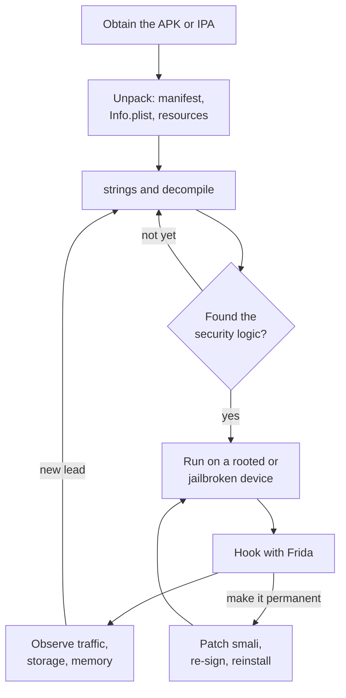
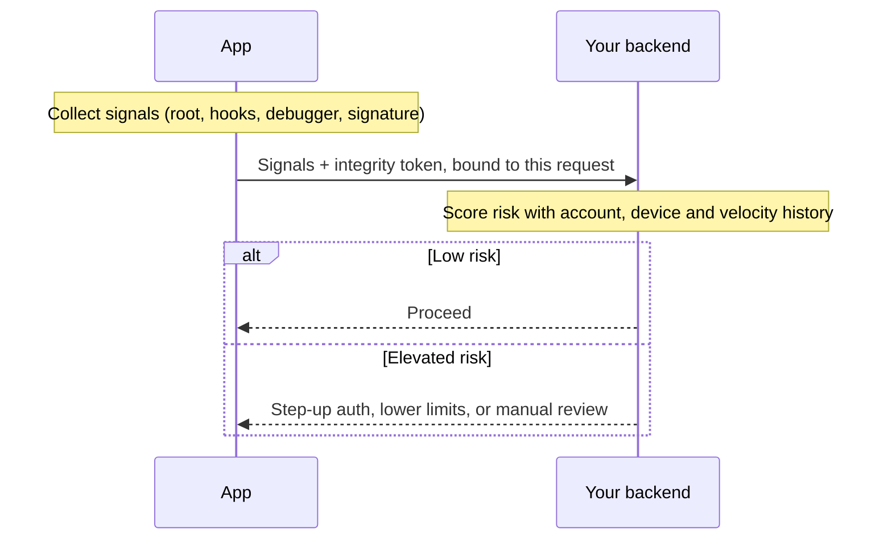

# Part 5: Resilience

## Chapter 13: How reverse engineering actually works

Picture a finance app that ships a root check. On a rooted phone it shows "This device is not supported" and closes. The team is pleased with it. Then someone downloads the APK, opens it in a decompiler, searches for the dialog's text and finds the method that shows it. They write eight lines of Frida script that make the method return `false`. The whole thing takes less time than the team's stand-up. It is the same sequence that MASTG-DEMO-0107 and 0108 publish (§13.3) *(illustrative)*.

You cannot reason about anti-tampering until you have seen that sequence at the level of the actual commands. This chapter is the attacker's workflow. It is also your testing workflow, because Chapter 22 asks you to run it against your own app.

Two terms first. **Static analysis** means reading the app without running it. **Dynamic analysis** means running it and interfering while it runs. Real work alternates between the two, and each pass tells you where to look in the next:



*Figure 16: The reverse-engineering loop: static and dynamic analysis feed each other*

The MASTG identifiers below are numbered testing techniques (Chapter 3). Where Android and iOS differ, both are given.

### 13.1 Static analysis

**Obtain the artefact** (MASTG-TECH-0003 Android, MASTG-TECH-0054 iOS). On Android, pull the APK from a device with `adb` or download it from the store with a third-party client. On iOS, an App Store IPA is encrypted with Apple's FairPlay DRM, so an attacker first obtains a decrypted copy on a jailbroken device. Frida-based dumpers such as bagbak read it from the running app; bagbak's author now marks it deprecated in favour of tools built on `mremap_encrypted`, which decrypt without launching the app at all. That extra step is a speed bump, not a wall.

**Explore the package.** The Android manifest, or the iOS `Info.plist` and entitlements, tells an attacker your components, permissions, exported activities, URL schemes, and whether you are debuggable. This is a map of your attack surface, and it is the first thing anyone reads.

**Retrieve strings** (MASTG-TECH-0071, both platforms). This is where hardcoded keys, internal hostnames and debug flags fall out. Thirty seconds of work; Chapter 1's Try it has the commands.

**Decompile.** On Android, **jadx** turns Dalvik bytecode (the compiled form of your Kotlin and Java) back into readable Java-like source (MASTG-TECH-0017). **apktool** instead disassembles it to **smali**, a human-editable assembly language for that bytecode, which is what you edit if you intend to repackage (MASTG-TECH-0016). On iOS there is no bytecode: the app is native ARM64 machine code in a **Mach-O** binary, so an attacker uses a disassembler and decompiler such as **Ghidra**, **Hopper**, **IDA** or **radare2** (MASTG-TECH-0068, MASTG-TECH-0069). Objective-C metadata still gives up class and method names generously, and Swift gives up more type metadata than most teams expect.

**Read the security logic.** Root detection, pinning configuration, licence checks: all of it is now visible, and its structure tells the attacker exactly what to hook.

> **Trap:** "It's compiled Kotlin, nobody can read that." Kotlin compiles to the same bytecode as Java, and jadx reads it back into something close to your source. Assume anything in the APK is readable, including every string, every `BuildConfig` field and every URL.

### 13.2 Dynamic analysis

**Get a shell and reach the data directory** (MASTG-TECH-0001 and 0008 Android; MASTG-TECH-0052 and 0059 iOS). On Android, `/data/data/<package>/` holds your preferences, databases and caches. This is where "we encrypt sensitive data" gets verified or falsified in about a minute.

**Monitor logs** (MASTG-TECH-0009 Android, MASTG-TECH-0060 iOS). Release builds that still log are found here.

**Set up an interception proxy** (MASTG-TECH-0011 Android, MASTG-TECH-0063 iOS). Route the device's traffic through mitmproxy or Burp Suite, with the attacker's certificate authority installed on the device.

**Bypass certificate pinning** (MASTG-TECH-0012 Android, MASTG-TECH-0064 iOS). This is the step that tells you whether your pinning is real. objection does it with one command for common implementations; a custom Frida script handles the rest. **Every engineer who has shipped pinning should have done this to their own app**, because until you have, you do not know whether your pinning survives contact.

**Hook methods with Frida** (MASTG-TECH-0043 Android, MASTG-TECH-0095 iOS; MASTG-TECH-0051 covers the concept). **Hooking** means intercepting a function call at runtime so your code runs instead of, or around, the original. With Frida you can make your root check return `false`, fire your biometric success callback without a fingerprint, or log the arguments to `Cipher.doFinal` and watch your own plaintext go past.

**Repackage** (MASTG-TECH-0004 Android). Decode with apktool, edit the smali, rebuild, re-sign with the attacker's own key, install. Hooking changes behaviour for one session on one device; repackaging makes the change permanent and distributable. This is the cloning attack, and it is why signature checks and attestation (Chapter 9) exist.

> **In practice:** attackers do not always need a rooted device to hook one app. **Frida Gadget** is a library that can be injected into a repackaged APK or re-signed IPA, so the instrumentation travels inside the app itself (MASTG-TECH-0026 covers non-rooted Android). Root detection alone therefore does not tell you whether you are being hooked.

#### The tools an attacker uses, and what each one gives them

You will see these names in every discussion of mobile security. Knowing what each actually does makes the rest of this chapter concrete.

| Tool | What it does | What it gives an attacker |
|---|---|---|
| **jadx** | Decompiles APK/DEX to readable Java-like source | Your logic, endpoints, and where your security decisions live |
| **apktool** | Decodes an APK to smali and resources, and rebuilds it | Repackaging: change something, re-sign, redistribute |
| **Frida** | Runtime instrumentation: hooks and replaces functions in a live process, on Android and iOS | The ability to change what your code does without changing the file |
| **objection** | Frida-powered toolkit with prebuilt commands | Storage inspection, pinning and root/jailbreak-detection bypass without writing a script |
| **LSPosed** and forks such as **Vector** (Xposed API) | System-wide Java hooking framework, loaded through Zygisk (Magisk's mechanism for injecting code into every app process) on rooted Android | Persistent modification of your app on every launch |
| **ElleKit** (a replacement for Cydia Substrate, the original iOS tweak-injection framework) | Tweak-injection and hooking library used by current rootless jailbreaks (jailbreaks that leave the system volume read-only; §14.4) | The same capability on jailbroken iOS |
| **Ghidra / IDA / Hopper / radare2** | Disassemblers and decompilers for native code and Mach-O binaries | Your native code, including logic you moved there for protection |
| **mitmproxy / Burp Suite** | Intercepting proxies | All your traffic, in cleartext, on a device they control |
| **`strings`** | Prints printable strings in a binary | Every constant you embedded, in about thirty seconds |

Two observations worth carrying. Nearly all of these are **free and documented** (IDA and Hopper are commercial but cheap next to any fraud payout), so none of your protection can assume scarcity of tooling. And you should be running them against your own app (Chapter 22): an attacker's toolkit and your test toolkit are the same toolkit.

> **In practice:** pin your tool versions in your test lab. Frida 17 (May 2025) moved its language bridges out of the core runtime and removed several long-standing `Module` APIs, so many scripts written for Frida 16 fail until updated (§22.1).

### 13.3 The three demos that make the argument

The MASTG ships runnable demos, and one sequence is worth more than any amount of prose on this topic. Read them in order:

**MASTG-DEMO-0106** — *Extracting Sensitive Data from Cipher.doFinal via Frida Hooking.* The attack works.

**MASTG-DEMO-0107** — *Detecting Frida hooks and terminating the application on response.* The defence works.

**MASTG-DEMO-0108** — *Bypassing Frida Detection in /proc/self/maps to Extract Sensitive Data.* The defence is defeated.

Protect, detect, bypass. That progression, published by the standard itself, is the strongest available argument for the position in the next chapter. Two more demos make the same point about obfuscation: **MASTG-DEMO-0132** (root detection in the Java/Kotlin layer protected only by identifier renaming) and **MASTG-DEMO-0133** (root detection in the native layer with insufficient obfuscation).

- <https://mas.owasp.org/MASTG/techniques/>
- <https://mas.owasp.org/MASTG/demos/>
- <https://frida.re/news/2025/05/17/frida-17-0-0-released/>

**Key takeaways**

- Static and dynamic analysis are one loop: reading tells you what to hook, hooking tells you what to read next.
- Everything in your APK or IPA is readable, including compiled Kotlin and Swift. Plan on that basis.
- Hooking needs neither your source nor, with Frida Gadget, a rooted device.
- The MASTG's own demos show a local defence being built and then bypassed. Design for that outcome.

**Try it**

1. Install **Android UnCrackable L1** (MASTG-APP-0003, from <https://mas.owasp.org/crackmes/>) on an emulator. Open it in jadx, find the root check and the secret-verification logic, and write down how long it took.
2. Run `strings` on your own release APK or IPA and list anything you would not want a stranger to read. Chapter 1's Try it gives the exact commands.
3. On a rooted emulator, use Frida or objection to bypass UnCrackable L1's root check at runtime, without modifying the APK. Note how little code the bypass needs.

---

## Chapter 14: Obfuscation and tamper detection — the honest chapter

This is where security writing usually oversells, so let me be direct: **everything in this chapter can be bypassed by a competent attacker with device access.** You are buying time and raising cost, not achieving prevention.

That is not an argument against doing it. Time and cost are real currency against the opportunist and the cloner (§1.3). Against the fraudster, who uses your app as intended, these controls matter only as inputs to a risk score (§12.5). It is an argument against *believing your own marketing*, and against designing as though these controls hold.

Two definitions. **Obfuscation** transforms your code so it is harder for a person to read (renaming, string encryption, control-flow flattening) without changing what it does. **Tamper detection** is code that notices the environment or the app has been modified (rooted device, hooking framework, debugger, re-signed APK). The MASVS groups both under **MASVS-RESILIENCE** (Chapter 26): RESILIENCE-1 platform integrity, RESILIENCE-2 anti-tampering, RESILIENCE-3 anti-static analysis, RESILIENCE-4 anti-dynamic analysis.

### 14.1 The cheap things, which you should simply do

Start here. Every item below costs close to nothing and removes the easiest tier of attacker.

**Enable R8 with minification and resource shrinking** on Android; **strip symbols** on iOS (§15.8 has the settings). R8 is Android's code shrinker and optimiser, and has run in "full mode" (its most aggressive setting) by default since Android Gradle Plugin 8.0. Renaming alone will not stop a determined attacker, but it removes every free hint.

**Remove all logging from release builds**, and verify by inspecting the artefact rather than trusting the build flag (§6.6 has the code; MASTG-BEST-0002, *Remove Logging Code*, for Android; MASTG-BEST-0022, *Disable Verbose and Debug Logging in Production Builds*, for iOS).

**Ensure `debuggable` is false** and no debug configuration shipped (MASTG-BEST-0007). A debuggable production build is not a hardening gap, it is an open door: anyone with the phone can attach a debugger, and `run-as` gives a shell with your app's identity and full access to its private files.

**Disable WebView debugging** in release (MASTG-BEST-0008).

**Prevent screenshots on sensitive screens**, and keep secrets off the clipboard (§6.6).

**Use up-to-date signing schemes** (MASTG-BEST-0006) and a current `minSdkVersion` (MASTG-BEST-0010). Old signature schemes and old API levels both reopen closed attack classes.

**Set sensible session timeouts**, shorter for financial flows (§14.5).

None of this is clever. All of it is worth more than most clever things.

### 14.2 Detection: report, never block

Detect what you can: root and jailbreak indicators, hooking frameworks (Frida, LSPosed, ElleKit and friends), debuggers, emulators and virtual devices, repackaging via your own signature check, and storage or code integrity failures.

Then **send those findings to your backend as risk inputs, and let the session continue.**



*Figure 17: Detect, report, and let the backend decide*

Three reasons, and they compound.

**Local blocks are trivially removed.** The attacker is already running your code under instrumentation with the ability to hook any method. Your `if (isRooted()) exit()` is one hook away from `if (false) exit()`. You have built a speed bump and paid for a wall. MASTG-DEMO-0108 is this argument, demonstrated.

**You generate false positives against real people.** Developers, power users, users of custom ROMs in markets where that is normal, users of legitimate accessibility tooling. A hard local block converts these into support tickets and one-star reviews, for no security gain.

**You destroy your own intelligence.** A backend that receives "hooking framework detected on this session" can require step-up authentication, cap transaction limits, flag the account, and correlate across sessions to find the actual attacker (§12.5 shows the scoring). An app that shows a "device not supported" dialog has taught the attacker exactly which check to remove next, and told you nothing.

The MASTG has reserved **MASTG-BEST-0029**, *Implementing Resilience and RASP Signals*, for this practice; at the time of writing the page is still a placeholder, so cite it for its title rather than its content. **RASP** (runtime application self-protection) is the vendor term for detection code that runs inside the app. "Signals" is the operative word.

> **Why it matters:** a signal the attacker can suppress is only useful if its *absence* is also suspicious. That is why the report must travel with something the attacker cannot forge on the device, such as a Play Integrity or App Attest result bound to the same request (Chapters 9 and 10). An empty signal list from a device that fails attestation is itself a signal.

The position is not unanimous *(contested)*. RASP vendors and some payment-scheme and banking rulebooks expect a local response, such as refusing to start a card-emulation or offline-payment flow, on the grounds that no backend is involved at that moment to make the call. That is a fair argument for **features that act offline or hold secrets the backend cannot revoke**. It is a weak argument for an ordinary online app, where the backend sees every request anyway. If you must respond locally, degrade the specific risky feature, keep the rest of the app working, and still report.

### 14.3 Where obfuscation genuinely helps

Two places, and it is worth knowing them so you spend effort well.

**Raising the floor.** Against automated tooling and the opportunist, obfuscation plus resource shrinking is often enough to make your app not worth the trouble relative to the next one.

**Protecting detection logic itself.** If your root detection is legible, it is removable. MASTG-DEMO-0132 shows detection logic in the Java/Kotlin layer defeated when protected only by identifier renaming; MASTG-DEMO-0133 shows the same in native code with insufficient obfuscation. The matching tests are **MASTG-TEST-0368** (*Insufficient Obfuscation of Security-Relevant Java/Kotlin Code*) and **MASTG-TEST-0369** (*Insufficient Obfuscation of Security-Relevant Native Code*). Moving security-critical logic to native code raises the cost of removing it only if the native code is also obfuscated; plain C compiled with symbols is easier to read in Ghidra than you would like.

What obfuscation does not do is protect a secret. An obfuscated key is a key. Chapter 1's principle still governs: make secrets useless if found (§1.2).

> **Trap:** R8 renames classes but not the strings inside them. A class called `a.b.c` that contains `"/system/xbin/su"` and `"com.topjohnwu.magisk"` announces itself to anyone who searches the decompiled output for `su`. Renaming hides *where* the check is only until someone searches for *what* it checks.

### 14.4 Detection, in code

§14.2 argues for detecting and reporting rather than blocking. This section is what the detecting part looks like, so the advice is actionable rather than abstract.

**The shape to aim for on both platforms** *(reasoned)*: collect named signals, return them as data, send them to your backend. No branching on the result locally.

Before the code, know what each check is up against. Modern root and jailbreak tooling is built specifically to hide from checks like these, and it is maintained: current jailbreaks are rootless (§22.1 lists which versions they cover).

| Signal | What still catches it | What defeats it |
|---|---|---|
| `su` binary on disk | Old one-click roots, careless setups | **Magisk**, **KernelSU** and **APatch** are "systemless": they do not modify `/system`, and their hiding features (Magisk's DenyList, plus modules such as **Shamiko**) unmount their files from processes you choose, including yours |
| Root-manager app installed | Default installs | Magisk can re-package its own app under a random name; Android 11+ package visibility hides other apps unless you declare them in `<queries>` |
| `Build.TAGS` contains `test-keys` | Some custom ROMs and emulators | Rooted devices running a release-signed build, which is almost all of them *(reasoned)* |
| System partition writable | Very old roots | Systemless root plus dm-verity; the check is close to meaningless in 2026 *(reasoned)* |
| Frida artefacts: `frida-agent` in `/proc/self/maps`, threads named `gum-js-loop` or `gdbus`, port 27042 | Unmodified Frida | Renamed or custom-built Frida; MASTG-DEMO-0108 bypasses the maps check |
| Jailbreak files at `/Applications/Cydia.app`, `/bin/bash` | Old rootful jailbreaks | **Rootless** jailbreaks (Dopamine; palera1n in rootless mode) install under `/var/jb` and use Sileo or Zebra, not Cydia |
| Hardware-backed attestation (Play Integrity, key attestation, App Attest) | Almost everything above, because the verdict is signed off-device | Leaked keyboxes (served by tools such as TrickyStore or TEESimulator), relayed attestation chains, zero-days; see Chapters 5, 9 and 10 for the limits |

Read the last row twice. Local file checks are the weakest signals you have, and the attestation APIs in Part 4 are the strongest. Ship both, weight them accordingly on the server.

#### Android: root indicators

```kotlin
import android.content.Context
import android.content.pm.PackageManager
import android.os.Build
import java.io.File

class RootSignals(private val context: Context) {

    fun collect(): List<String> = buildList {
        if (suBinaryPresent())    add("SU_BINARY")
        if (rootManagerPresent()) add("ROOT_MANAGER_APP")
        if (testKeysBuild())      add("TEST_KEYS")
    }

    private fun suBinaryPresent() = listOf(
        "/system/bin/su", "/system/xbin/su", "/sbin/su",
        "/system/sd/xbin/su", "/data/local/xbin/su", "/data/local/bin/su"
    ).any { File(it).exists() }

    // Requires these package names in a <queries> element in the manifest
    // (Android 11+ package visibility), or the lookup silently fails.
    private fun rootManagerPresent() = listOf(
        "com.topjohnwu.magisk",    // Magisk
        "me.weishu.kernelsu",      // KernelSU
        "me.bmax.apatch"           // APatch
    ).any { pkg -> isInstalled(pkg) }

    private fun isInstalled(pkg: String): Boolean = try {
        if (Build.VERSION.SDK_INT >= 33) {
            context.packageManager.getPackageInfo(pkg, PackageManager.PackageInfoFlags.of(0))
        } else {
            @Suppress("DEPRECATION")
            context.packageManager.getPackageInfo(pkg, 0)
        }
        true
    } catch (e: PackageManager.NameNotFoundException) {
        false
    }

    private fun testKeysBuild() = Build.TAGS?.contains("test-keys") == true
}
```

Declare the package names you query, or `isInstalled` returns `false` on every Android 11+ device and you will conclude, wrongly, that nobody is rooted:

```xml
<!-- AndroidManifest.xml -->
<queries>
    <package android:name="com.topjohnwu.magisk" />
    <package android:name="me.weishu.kernelsu" />
    <package android:name="me.bmax.apatch" />
</queries>
```

> **Trap:** do not reach for `QUERY_ALL_PACKAGES` to make this easier. Google Play restricts that permission to apps whose core function needs it, and root detection does not qualify.

#### Android: debugger, instrumentation and emulator

```kotlin
import android.content.Context
import android.content.pm.ApplicationInfo
import android.os.Build
import android.os.Debug
import java.io.File

class RuntimeSignals(private val context: Context) {

    fun collect(): List<String> = buildList {
        if (Debug.isDebuggerConnected()) add("JDWP_DEBUGGER")
        if (tracerPid() != 0)             add("PTRACE_ATTACHED")
        if (debuggableBuild())            add("DEBUGGABLE_BUILD")
        if (fridaInMaps())                add("FRIDA_MAPPED")
        if (emulatorFingerprint())        add("EMULATOR")
    }

    /** Non-zero while a native debugger or tracer (gdb, lldb, strace) is attached. */
    private fun tracerPid(): Int = runCatching {
        File("/proc/self/status").useLines { lines ->
            lines.firstOrNull { it.startsWith("TracerPid:") }
                ?.substringAfter(':')?.trim()?.toIntOrNull()
        } ?: 0
    }.getOrDefault(0)

    private fun debuggableBuild(): Boolean =
        (context.applicationInfo.flags and ApplicationInfo.FLAG_DEBUGGABLE) != 0

    /** Catches an unmodified Frida agent or gadget. Renamed builds evade it. */
    private fun fridaInMaps(): Boolean = runCatching {
        File("/proc/self/maps").useLines { lines ->
            lines.any { it.contains("frida", ignoreCase = true) }
        }
    }.getOrDefault(false)

    private fun emulatorFingerprint(): Boolean =
        Build.FINGERPRINT.startsWith("generic") || Build.FINGERPRINT.contains("emulator") ||
        Build.MODEL.contains("Emulator") || Build.MODEL.contains("Android SDK built for") ||
        Build.HARDWARE.contains("goldfish") || Build.HARDWARE.contains("ranchu") ||
        Build.PRODUCT.contains("sdk")
}
```

Know what each check sees. `Debug.isDebuggerConnected()` covers the Java debugger (JDWP) that Android Studio uses. `TracerPid` covers native tracers, which attach with `ptrace`. Neither is a Frida detector: the MASTG's list of Frida indicators (MASTG-KNOW-0030) does not include `TracerPid`, and Frida's design does not keep its injector attached once the agent is loaded *(reasoned)*. The `/proc/self/maps` check is what MASTG-DEMO-0107 uses, and MASTG-DEMO-0108 shows it being bypassed. Treat every line here as a weak signal.

#### iOS: jailbreak and hooking indicators

```swift
import Foundation
import MachO
import UIKit

enum JailbreakSignals {

    @MainActor
    static func collect() -> [String] {
        var out: [String] = []
        if suspiciousPathExists()   { out.append("JAILBREAK_PATH") }
        if canOpenStoreScheme()     { out.append("JAILBREAK_STORE_SCHEME") }
        if canWriteOutsideSandbox() { out.append("SANDBOX_WRITABLE") }
        if hookingLibraryLoaded()   { out.append("HOOKING_LIBRARY") }
        return out
    }

    private static func suspiciousPathExists() -> Bool {
        [
            "/var/jb",                                   // rootless jailbreaks (Dopamine, palera1n)
            "/Applications/Cydia.app", "/Applications/Sileo.app",
            "/usr/sbin/sshd", "/etc/apt",                // rootful jailbreaks
            "/Library/MobileSubstrate/MobileSubstrate.dylib"
        ].contains { FileManager.default.fileExists(atPath: $0) }
    }

    /// Each scheme must be listed under LSApplicationQueriesSchemes in Info.plist,
    /// or canOpenURL returns false regardless of what is installed.
    @MainActor
    private static func canOpenStoreScheme() -> Bool {
        ["cydia://", "sileo://", "zbra://", "filza://"]
            .compactMap(URL.init(string:))
            .contains { UIApplication.shared.canOpenURL($0) }
    }

    /// A sandboxed app cannot write outside its container.
    private static func canWriteOutsideSandbox() -> Bool {
        let path = "/private/jb-probe-\(UUID().uuidString)"
        do {
            try "x".write(toFile: path, atomically: true, encoding: .utf8)
            try? FileManager.default.removeItem(atPath: path)
            return true
        } catch {
            return false
        }
    }

    /// Hooking frameworks and Frida's gadget arrive as loaded images.
    private static func hookingLibraryLoaded() -> Bool {
        let markers = ["frida", "cynject", "libcycript", "mobilesubstrate",
                       "substrateloader", "substitute", "libhooker", "ellekit", "tweakinject"]
        for i in 0..<_dyld_image_count() {
            guard let cName = _dyld_get_image_name(i) else { continue }
            let path = String(cString: cName).lowercased()
            if markers.contains(where: { path.contains($0) }) { return true }
        }
        return false
    }
}
```

Two notes on this sample. `canOpenURL` is deprecated in iOS 27, and apps linked against the iOS 27 SDK may declare at most 25 schemes in `LSApplicationQueriesSchemes`, down from 50 ([Apple](https://developer.apple.com/documentation/uikit/uiapplication/canopenurl(_:))). Expect the scheme check to fade; the file and image checks do not depend on it. And older samples also call `fork()`, reasoning that a sandboxed app is not allowed to create processes. It is left out on purpose: `fork` is unavailable in Swift, so those samples reach it through `dlsym`, and because rootless jailbreaks keep the app sandbox in place, the check is likely to miss exactly the jailbreaks in use today *(reasoned)*. The same caveat applies to `canWriteOutsideSandbox()`, which stays in only because it is cheap and still catches rootful jailbreaks; weight it low *(reasoned)*.

> **Trap:** most jailbreak-detection snippets online still check only rootful paths such as `/Applications/Cydia.app`. Current jailbreaks are rootless by default and put everything under `/var/jb`. A detector that has not been updated reports a clean device on exactly the jailbreaks people use today.

#### Reporting, which is the whole point

```kotlin
import kotlin.coroutines.cancellation.CancellationException
import kotlinx.serialization.Serializable

@Serializable
data class SecurityReport(
    val rootSignals: List<String>,
    val runtimeSignals: List<String>,
    val signingCertSha256: String,
    val integrityToken: String?,   // Play Integrity token bound to this report (Chapter 9)
)

suspend fun reportSecuritySignals(
    root: RootSignals,
    runtime: RuntimeSignals,
    api: SecurityApi,
    integrity: IntegrityTokenSource,
) {
    try {
        val rootSignals = root.collect()
        val runtimeSignals = runtime.collect()
        val report = SecurityReport(
            rootSignals       = rootSignals,
            runtimeSignals    = runtimeSignals,
            signingCertSha256 = currentSigningCertSha256(),
            integrityToken    = integrity.tokenFor(requestHashOf(rootSignals, runtimeSignals)),
        )
        api.reportSignals(report)
    } catch (e: CancellationException) {
        throw e      // let the caller's scope cancel this coroutine normally
    } catch (e: Exception) {
        // any other failure is swallowed: this call must never block or crash the user
    }
}
```

`SecurityApi`, `IntegrityTokenSource`, `currentSigningCertSha256()` and `requestHashOf()` are yours to supply. Chapter 9 shows how to request a Play Integrity token with a request hash, which is what binds the token to *these* signals so they cannot be swapped in transit. Your signature check compares the APK's signing-certificate digest against the value you expect.

Three rules for this code. **Send, never branch**: the backend decides (§14.2). **Fail silently**: a detection report that crashes the app or blocks a flow has converted a security feature into an outage. Silently does not mean catching everything, though: `runCatching` in a `suspend` function also swallows `CancellationException`, so a report still in flight when the user leaves the screen would not cancel, which is why the sample rethrows it. And **let R8 rename your detection classes**: never add keep rules for them (§15.8), because a class still called `RootSignals` in release is a search term handed to the attacker.

#### Verify it

Detection code has two failure modes, and you should test for both.

**False negatives.** Run the app on a rooted device or emulator (a Google APIs emulator image without Play Store allows `adb root`; the community `rootAVD` script installs Magisk on one) and confirm your signals actually fire. **Pass:** the backend receives a non-empty signal list. **Fail:** an empty list from an obviously rooted device, which means the detection is not running, not that the device is clean. Then enable Magisk's DenyList for your app and repeat, so you know which signals survive root hiding.

**False positives, which matter more.** Run on a clean, stock, unrooted device. **Pass:** no signals. **Fail:** any signal at all, which means you are about to apply risk scoring to ordinary users. Test on at least one non-Google-Play device and one custom ROM if your market includes them.

**Then confirm you are not blocking.** Search your own codebase:

```bash
grep -rnE "isRooted|isJailbroken|isDebugged|RootSignals|JailbreakSignals" \
  --include='*.kt' --include='*.swift' .
```

Every hit should feed a report, not a branch that exits or refuses. A hit inside an `if` that ends a flow is §14.2's mistake.

**And confirm the names are gone from release.** Decompile your release build with jadx and search for `RootSignals`. Finding it means your R8 configuration is keeping what §15.8 tells you to let it obfuscate.

### 14.5 The hygiene controls, in code

Five hygiene controls turn up in every real assessment. Four of them are storage and privacy leaks, so their code lives with the rest of the storage material in Part 2:

- **Screenshots and the recents thumbnail** (`MASWE-0038`): §6.6.
- **Secure logging** (`MASWE-0005`): §6.6.
- **The clipboard** (`MASWE-0030`): §6.6.
- **Encrypting a local database** with SQLCipher: §6.7.

The fifth, the session timeout, belongs here because it is about how long a session survives on a device you do not control.

#### Session timeout

`MASWE-0024`, *Sensitive Data Accessible After Session Termination*. Time the background period, not just user inactivity, because a phone in a pocket is not an active session:

```kotlin
import android.os.SystemClock
import androidx.lifecycle.DefaultLifecycleObserver
import androidx.lifecycle.LifecycleOwner
import androidx.lifecycle.ProcessLifecycleOwner   // androidx.lifecycle:lifecycle-process

class SessionTimeoutObserver(
    private val timeoutMillis: Long,
    private val onTimeout: () -> Unit,
) : DefaultLifecycleObserver {

    private var backgroundedAt: Long? = null

    override fun onStop(owner: LifecycleOwner) {
        backgroundedAt = SystemClock.elapsedRealtime()   // monotonic; unaffected by clock changes
    }

    override fun onStart(owner: LifecycleOwner) {
        val since = backgroundedAt ?: return
        backgroundedAt = null
        if (SystemClock.elapsedRealtime() - since > timeoutMillis) onTimeout()
    }
}

// Application.onCreate: observe the whole process, not one activity
ProcessLifecycleOwner.get().lifecycle.addObserver(
    SessionTimeoutObserver(timeoutMillis = 15 * 60_000L) { sessionManager.expire() }
)
```

`elapsedRealtime()` matters: a timer built on `System.currentTimeMillis()` can be defeated by changing the device clock. The timestamp lives in memory, so if the system kills your process in the background the timer is simply lost; that is one more reason the server's session expiry, not this observer, is the real control. Reasonable starting points *(reasoned)*: 15 minutes for banking and payments, 30 for health and enterprise, hours or none for content and social. And "timeout" must mean invalidating the session **server-side** and clearing local data, per Chapter 0.3, not just showing a login screen over cached content.

**Key takeaways**

- Every control in this chapter can be bypassed on a device the attacker controls. Buy cost and time, and design as if the controls fail.
- Detect, report, and let the backend decide. Local blocking removes your intelligence and punishes legitimate users.
- File-based root and jailbreak checks are the weakest signals you have; hardware-backed attestation is the strongest. Send both and weight them server-side.
- Keep detection logic out of R8 keep rules, and remember that renaming does not hide the strings the logic checks for.
- The hygiene controls (screenshots, logs and clipboard in §6.6, database encryption in §6.7, session timeouts here) are small, cheap, and found in every assessment. Ship them correctly first.

**Try it**

1. Install the **RootBeer Sample** (MASTG-APP-0032) on a stock emulator and on a Magisk-rooted one. Compare which checks fire, then enable DenyList for it and compare again.
2. Add `RootSignals` and `RuntimeSignals` to a debug build of your app, log the output, and run the false-negative and false-positive checks in the Verify it block above.
3. Open a sensitive screen in your app, press Home, and open recents. If you can read the content in the thumbnail, fix it with §6.6's `FLAG_SECURE` pattern and check again. Then background the app for longer than your session timeout and confirm the server rejects the old session.

---
