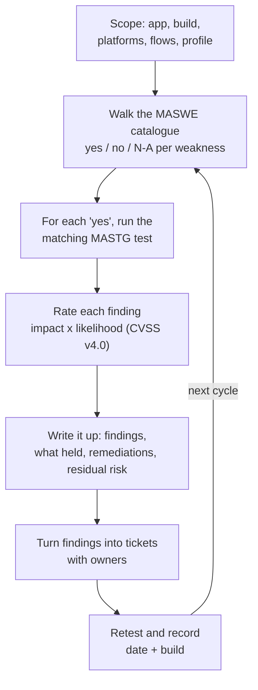
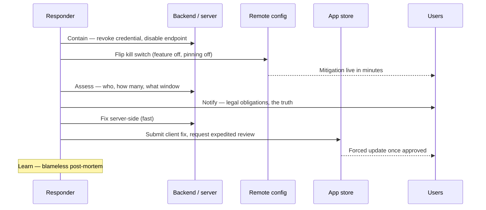

# Part 8: Practice

You learn this by doing it. Build a lab, run an assessment on your own app, write it up, and know what to do on the day something goes wrong.

---

## Chapter 22: Build your test lab

You can't learn this from reading. This chapter gets you to a working setup where you can attack your own app safely and legally.

**One rule before you start: only test apps you own or have written permission to test.** Testing someone else's app without authorisation is illegal in most jurisdictions, regardless of intent. Your own app, your employer's app with sign-off, and OWASP's deliberately vulnerable practice apps are all fine.

### 22.1 What you need

You can get useful results with free tools and an emulator. Here is the shopping list, in order of how much you will use each thing.

#### An Android device you control completely

You need **root**: the Unix superuser account, which the normal Android security model keeps away from you and from apps. Root lets you read any app's private files and run instrumentation freely.

| Option | Root | Cost | Use it for |
|---|---|---|---|
| **Android Emulator** with an **AOSP** or **Google APIs** system image | `adb root` works | Free | Your default lab. Start here |
| **Android Emulator** with a **Google Play** image | No: Google signs these with a release key | Free | Play Integrity or Play-only flows, not root work |
| **Genymotion Desktop** | Android 11 and older images rooted by default; Android 12+ images ship unrooted, with a root toggle that needs a paid licence | Free for personal use; root on Android 12+ is paid | Faster x86 emulation, scripted device fleets |
| **Corellium** (owned by Cellebrite since December 2025) | Rooted Android and jailbroken iOS virtual devices | Commercial | iOS at scale without physical jailbroken phones |
| A cheap physical phone, rooted | Yes, once rooted | A second-hand handset | Behaviour closer to real users; hardware-backed Keystore |

Google's own emulator documentation says it plainly: Google Play images "are signed with a release key, which means that you can't get elevated privileges (root)". Pick an image *without* the Play Store and `adb root` just works.

> **Trap:** rooting changes the environment you're measuring. That is fine when you are reading storage or proxying traffic. It matters when you are testing *detection* (your root check, Play Integrity verdicts or anti-debugging), because the thing you're measuring is now the thing under test.

#### An iOS device, or a plan for not having one

iOS is harder, and the difficulty is structural rather than a matter of effort. A **jailbreak** (the iOS equivalent of rooting, which removes Apple's code-signing and sandbox restrictions) exists only for older hardware and older iOS. As of September 2026:

| Tool | How it works | What it covers |
|---|---|---|
| **palera1n** | Uses `checkm8`, a bootrom flaw Apple cannot patch in software | A8–A11 devices and T2 Macs, iOS 15 and later; in practice an iPhone 8 or X, whose last iOS is 16. On A11, palera1n requires the passcode to be disabled while jailbroken (on iOS 16, after a device reset). With no passcode, Data Protection classes and passcode-bound Keychain items (`…WhenPasscodeSetThisDeviceOnly`) cannot be tested properly, so use Dopamine on those devices when you need that |
| **Dopamine** 3.0 | App-based, "rootless" | iOS 15.0–17.3.1 on A14–A17 and M1–M2; iOS 15.0–18.7.1 and 26.0–26.0.1 on A12–A13; iOS 15.0–18.7.1 on A9–A11 (in practice every iOS 15 and 16 release those devices run) |
| Anything for current flagships on current iOS 26.x and 27 | n/a | No public jailbreak |

So the practical options are: buy an old iPhone for the lab and keep it off the upgrade path, rent jailbroken virtual devices (Corellium), or work without a jailbreak.

Working without one still gets you a long way. You can do static analysis of the binary, check entitlements and `Info.plist`, inspect a Simulator app's container on your Mac, and review your own source. You can also inject **Frida Gadget** (a library form of Frida) into an IPA that you re-sign with your own development certificate, which gives you runtime hooking on a stock device (`MASTG-TECH-0090`, and `MASTG-TECH-0146` for dynamic analysis on non-jailbroken devices). Start there rather than not starting.

#### The tools, in rough order of usefulness

`adb`: the Android Debug Bridge, from the platform tools. Your shell into the device.

**JADX** decompiles an APK into readable Java. Use `jadx-gui` and browse your own app for twenty minutes; it's an education.

**Frida** does runtime instrumentation: you inject JavaScript into a running process to observe or replace any function. Install the client with `pip install frida-tools` and push the matching `frida-server` binary to the device (commands in §22.3). Two things trip people up:

- **Version match.** The client and `frida-server` must be the same version. Mismatch is the most common setup problem, by a distance.
- **Frida 17 moved the language bridges out of the core** (May 2025). The `Java` and `ObjC` bridges are no longer built into the runtime. The `frida` REPL and `frida-trace` still bundle them, so a script loaded with `frida -l` works as before, but a script loaded through the Python or Node API must now import the bridge and be built with `frida-compile`. Older blog posts don't mention this.

**objection** is Frida-powered, with commands for the common tasks so you don't write scripts on day one. The current syntax (objection 1.12) is `objection -n <package> start`, then `android sslpinning disable` at its prompt. The older `objection -g <package> explore` still runs but prints a deprecation warning, and older tutorials use it.

**An interception proxy** sits between the app and the server so you can read and modify traffic. **mitmproxy** is free and scriptable; **Burp Suite** (Community edition is free) and **HTTP Toolkit** are common alternatives. Install the proxy's CA certificate on the device and point the device's proxy at your machine. Getting that certificate *trusted* is the part that has changed; see below.

**semgrep** does pattern-based static analysis. Many MASTG demos use it, and it's how you find a class of issue across a whole codebase rather than one instance.

**apktool** for repackaging, **radare2** or `rabin2` for iOS binaries, and `strings`, which you already have.

#### Getting a proxy CA trusted on modern Android

This is where most first proxy attempts fail, so it is worth understanding rather than copying commands.

Android has two certificate trust stores. **User-added CAs** are the ones you install through Settings. **System CAs** are the ones the OS ships with. Since Android 7 (2016), apps do **not** trust user-added CAs by default. That was a deliberate change to stop exactly the interception you are now trying to do. So installing your proxy CA through Settings is not enough for most apps.

Your three options, in order of preference for a lab:

1. **Trust the CA for your own app only, with a debug network security configuration.** Add a `network_security_config.xml` that trusts `user` certificates for the `debug-overrides`, and reference it from a debug build. This is the cleanest option and the default when you are testing your own app: it needs no root, and it doubles as a lesson in why the setting matters. It only works on an app you can rebuild. Note that `debug-overrides` trust anchors also bypass your pins by default (§7.1), so for Experiment Four use a test-only build that adds the proxy CA to `base-config` instead, as in step 1 of §8.10 *Verify it*.

2. **Add the CA to the system store on a rooted emulator.** Historically you booted the emulator with `-writable-system`, remounted `/system`, and copied the certificate (named by its subject hash, e.g. `<hash>.0`) into `/system/etc/security/cacerts/`.

3. **Use a Magisk module** on a rooted physical device to inject the CA into the system store.

> **Trap:** on **Android 14 and later** the system root store moved into a Mainline APEX module at `/apex/com.android.conscrypt/cacerts/`, so it can be updated through Google Play. The old trick of mounting over `/system/etc/security/cacerts` is silently ignored: apps read the APEX path, not `/system`. The APEX path is mounted read-only with private mount propagation, so you cannot just overlay it either. Current tooling (mitmproxy's guide, HTTP Toolkit) works around this on rooted devices by mounting a writable copy over the app's certificate directory and then bind-mounting it into the Zygote and each app's mount namespace with `nsenter`. It needs root and it is fiddly. On a rooted Android 14+ emulator the mitmproxy and HTTP Toolkit helpers automate it; for testing your own app, option 1 avoids the whole problem.

### 22.2 Practice targets before your own app

Learn the tools on something designed for it, so you're debugging one thing at a time.

| Target | What it is | Platform | Link |
|---|---|---|---|
| **MAS Test Apps** | Two minimal mirror-image apps that every MASTG demo is built on. Paste a demo's sample into `MastgTest.kt` or the Swift equivalent, run it, and compare your result with the demo's | Android, iOS | <https://github.com/cpholguera/mas-app-android> · <https://github.com/cpholguera/mas-app-ios> |
| **MAS Crackmes** (UnCrackable) | Deliberately protected apps for reverse-engineering practice: Android L1–L4, iOS L1–L2 | Android, iOS | <https://mas.owasp.org/crackmes/> |
| **iGoat-Swift** | OWASP's deliberately insecure iOS app, organised as lessons | iOS | <https://github.com/OWASP/iGoat-Swift> |
| **DIVA Android** | Classic "damn insecure" app covering storage, logging and input validation | Android | <https://github.com/payatu/diva-android> |
| **InsecureBankv2** | Vulnerable banking app with a small backend, good for traffic and auth exercises | Android | <https://github.com/dineshshetty/Android-InsecureBankv2> |

Start with the **MAS Test Apps**: each demo tells you what to run and what you should see, so you're checking your tooling against a known answer. The full list of practice apps is at <https://mas.owasp.org/MASTG/apps/>.

> **In practice:** DIVA was last updated in 2016 and InsecureBankv2 in 2019. They still teach the concepts, but expect to run them on an older emulator image, and don't treat their API usage as current.

### 22.3 Your first five experiments

Do these in order on your own app. Each takes minutes and each will teach you something you didn't expect.

**One: `strings` on your release APK.** Not the debug build. An APK is a ZIP archive and its DEX files are usually compressed inside it, so unzip it first and run `strings` over the extracted `classes*.dex`, `resources.arsc` and any `.so` files. If you ship an app bundle (AAB), build a universal APK from it with `bundletool`, or pull the installed APK from a device. Read what comes out. Write down anything sensitive.

**Two: open it in JADX.** Find your API base URL. Find one security decision: a root check, a feature flag, a validation. Ask yourself how long it would take to change it.

**Three: read your own app's data directory.** `adb shell` then `run-as <package>` (debuggable builds only; for the release build from experiment one, use root) and look in `/data/data/<package>/`. Open the shared preferences files and any SQLite database. Look for tokens and personal data in plaintext.

**Four: proxy your traffic.** Get mitmproxy in front of the app and read a request. Use a test-only build that trusts the proxy CA through `base-config`, not `debug-overrides`, which would switch your pins off and hide the result (§22.1, option 1). If pinning is enabled, note that the pinned hosts fail. Then use `objection` to disable pinning and note that they now succeed. That contrast is the single most clarifying experience in mobile security.

**Five: hook something.** First get `frida-server` running on the device. The version must match your client (`frida --version`):

```bash
# On the host: download the frida-server build for your device's ABI from
# github.com/frida/frida/releases, matching your installed frida version.
# The asset is compressed and versioned; unpack it and give it a plain name.
# (Use android-x86_64 for an x86_64 emulator image.)
unxz frida-server-*-android-arm64.xz
mv frida-server-*-android-arm64 frida-server
adb root                                        # AOSP/Google APIs image or rooted device
adb push frida-server /data/local/tmp/
adb shell "chmod 755 /data/local/tmp/frida-server"
adb shell "/data/local/tmp/frida-server &"
```

Then, with Frida, hook your root-detection function and make it return `false`. Next hook `Cipher.doFinal` and log the arguments; `MASTG-DEMO-0106` shows you how and demonstrates `MASTG-TEST-0341`. Watching your own plaintext scroll past changes how you design.

### 22.4 What to do when a step fails

Each of these will happen to you. None of them means you have done something wrong.

**Frida won't connect.** Version mismatch between the client and `frida-server`, or the server isn't running, or you're not root. Check versions first.

**Proxy shows no traffic.** The app may be ignoring the system proxy (some HTTP clients do), or using a non-HTTP protocol, or pinning is rejecting the connection before you see it. Check the app's logs.

**Certificate errors everywhere.** The device doesn't trust your proxy CA, or the app doesn't trust user-added CAs, which on modern Android is the default and correct behaviour. Use a debug network security configuration.

**Nothing in the data directory.** You might be looking at the wrong user profile, or the app genuinely stores little locally, which would be good news.

Each of these failures is itself information about your app's posture. Note it rather than fighting it.

**Key takeaways**

- Test only what you own or have written permission to test.
- Learn the tools on a practice target with a known answer before you point them at your own app.
- Keep the Frida client and `frida-server` on the same version; it saves you most setup pain.
- A failed lab step is data about your app, not just a tooling problem.

**Try it**

1. Build one MAS Test App, run one MASTG demo that matches a weakness you care about, and check that your output matches the demo's.
2. Do experiments one to three from §22.3 on a debug build of your own app, and write down anything you'd be uncomfortable seeing in a stranger's hands.

---

## Chapter 23: Running an assessment and writing it up

Now you have a lab. This chapter is the method, and then how to communicate what you found, which is the part that determines whether anything changes.

The shape of an assessment is always the same, whatever the app:



*Figure 24: The shape of every assessment*

### 23.1 Scope it first

Write down, before you start: which app and build, which platforms, which device and OS versions, which flows are in scope, and what you're *not* looking at. Ten minutes of scoping saves you from a report that's impossible to interpret later.

Pick a **testing profile** to aim at. OWASP's profiles (MAS-L1, L2, R and P) each encode an attacker model, which is what makes them useful for scoping; §3.2 has the table. Profiles combine: a banking app is typically **L2+P+R**, a news app **L1+P**. Setting the profile first stops you writing up a missing anti-debugging control on a content app that never needed one.

> **In practice:** the MASTG does not yet have a test for every MASWE (Chapter 27). When a profile requires a weakness that has no test, OWASP's own guidance is to work from the weakness's *Modes of Introduction*, borrow the structure of a related test and, if you build a reliable procedure, contribute it back.

### 23.2 Work the standard, not your instincts

Take the MASWE catalogue in Chapter 27 (seventy-eight weaknesses) and go down it, marking each **yes**, **no**, or **not applicable** for your app. For each *yes*, find the matching MASTG test and run it.

This is slower than poking around and dramatically better, for two reasons. You cover the things you'd never have thought of, and your output maps to a standard someone else recognises.

Each MASTG test page tells you what to look for, which tools to use, how to reproduce it on each platform, and what a passing implementation looks like. Use the URL pattern from the ID:

`https://mas.owasp.org/MASTG/tests/android/MASVS-STORAGE/MASTG-TEST-0207/`

Check that the page is not deprecated first; Chapter 28 explains the banners.

### 23.3 Rate what you find

Severity is likelihood combined with impact, and both need thinking about.

For **impact**, ask what an attacker gains. Reading their own cached data is not the same as reading another user's account, which is not the same as moving money.

For **likelihood**, ask what the attack requires. Something exploitable remotely with no special access is far more likely than something requiring a rooted device and physical possession. "Requires root" is a genuine mitigating factor and stating it honestly builds trust, as does not using it to dismiss something that matters.

Be consistent, and be prepared to defend each rating. A report where everything is critical gets ignored entirely.

#### Use a scoring system, and use it honestly

Pick one scale and apply it to every finding so your ratings are comparable. The current standard is **CVSS v4.0** (published November 2023 by FIRST; still the current version in 2026, no v4.1). Two of its metrics map almost perfectly onto mobile findings and are worth knowing by name:

- **Attack Vector (AV).** `Network` for anything reachable over the internet; `Adjacent` for same-network attacks; `Local` for something needing on-device code or a shell; **`Physical` (P)** for "the attacker must physically hold the device". The plaintext-token-on-disk finding is usually `AV:P` or `AV:L`, which is exactly the mitigating factor you should state, not hide.
- **Attack Requirements (AT).** `Present` when the attack needs specific conditions, such as a rooted device or a race window. This is where "requires root" belongs.

CVSS v4.0 also separates **Vulnerable System** impact (`VC/VI/VA`) from **Subsequent System** impact (`SC/SI/SA`), that is, the app versus the backend or other systems it reaches. That is useful for expressing "reading this token lets the attacker act on the server".

> **Trap:** FIRST is explicit that CVSS measures *severity, not risk*. A Base score is a starting point; you are meant to enrich it with the Threat and Environmental metrics for your situation before you call something a priority. A High Base score on a finding that needs physical possession of an unlocked device is a number, not a decision. Record the full vector string (for example `CVSS:4.0/AV:P/AC:L/AT:N/PR:N/UI:N/VC:H/VI:N/VA:N/SC:N/SI:N/SA:N`, which scores 5.1) so a reader can see your reasoning, not just the number.

If your organisation already uses the OWASP Risk Rating methodology or an internal scale, that is fine: consistency matters more than which scale, as long as everyone reads it the same way.

### 23.4 Write the report

Structure it so a reader can act:

**Scope and date.** What you tested, which build, which devices and OS versions. Without this the report ages into uselessness.

**Summary.** Three or four sentences: what you assessed, what the overall posture looks like, and the two or three things that matter most. Assume this is all a senior stakeholder reads, and write it accordingly.

**Findings.** For each one: a clear title, the MASVS control and MASWE weakness, severity, reproduction steps precise enough that someone else gets the same result, evidence, and **impact in business terms.**

That last part is what gets work funded. Compare:

> *Token stored in plaintext in SharedPreferences.*

with:

> *An attacker who can get root on the phone (with a root exploit, or because the user has rooted it) can extract a session token that remains valid for 90 days and is not bound to the device — allowing full account access from the attacker's own machine, with no further interaction from the user.*

Both describe one bug. Only one of them gets prioritised.

**What held.** List the controls you tested that worked. This is counterintuitive and it's what makes your report credible. "Pinning held against objection's standard bypass and required a custom Frida script" tells a reader you understand the difference between a tool's output and an assessment.

**Remediations.** Specific, with before and after where you can. Link the relevant `MASTG-BEST` practice so the developer has the pattern, not just the problem.

**Residual risk.** What you're accepting and why. Senior reviewers read this section first, because it shows whether you understand trade-offs or merely found things.

#### A worked finding

Here is the token example written up in full, as one entry in a report. *(illustrative)*

**F-03: Refresh token stored in plaintext in SharedPreferences**

- **Maps to:** `MASVS-STORAGE-1`; `MASWE-0001` (Sensitive Data Stored Unencrypted in Private Storage); tested with `MASTG-TEST-0287` and `MASTG-TEST-0207`.
- **Build and scope:** `com.example.app` 4.12.0 (build 4120), release variant, Android 17 AOSP emulator image with `adb root`.
- **Severity:** `CVSS:4.0/AV:P/AC:L/AT:P/PR:N/UI:N/VC:H/VI:N/VA:N/SC:H/SI:H/SA:N`, Base score 5.8 (Medium).

| Metric | Value | Why |
|---|---|---|
| Attack Vector | `P` Physical | The path I reproduced needs the phone in hand. Malware on a phone the user has rooted is the other path; it scores `AV:L` and 7.0 (High). If you model the malware as already holding root, CVSS puts that in `PR:H`, not `AT:P`. Say which model you scored |
| Attack Complexity | `L` Low | Once the file is readable, nothing else stands in the way: no key to recover, no race |
| Attack Requirements | `P` Present | The device must be rooted, or the attacker needs a root exploit for it |
| Privileges Required | `N` None | The attacker needs no account of their own |
| User Interaction | `N` None | The victim does nothing |
| VC / VI / VA | `H` / `N` / `N` | The token and the cached profile on the device are disclosed; nothing on the device is changed or disabled |
| SC / SI / SA | `H` / `H` / `N` | The token works against the backend: the attacker reads the whole account and can act as the user. Availability is untouched |

**Reproduction.**

1. Install the release build on the emulator and sign in as test user `qa-07`.
2. Run `adb root`, then `adb shell cat /data/data/com.example.app/shared_prefs/auth_prefs.xml`. The `refresh_token` value is in plaintext.
3. On a different machine, send that token to the refresh endpoint (`POST /oauth/token`, `grant_type=refresh_token`). A new access token comes back, and `GET /v1/me` returns the account.

**Evidence.** `[screenshot: auth_prefs.xml with the token redacted after the first 6 characters]` · `[HTTP log: the refresh request from the second machine and its 200 response]`

**Impact.** Anyone who can get root on the phone, either with the phone in hand and a root exploit or as malware on a phone the user has rooted, walks away with a credential that stays valid for 90 days and is not bound to the device. From their own machine they can read the account and act as the user, and the user sees nothing. Logging out on the phone does not help, because the server never revokes the refresh token.

**Remediation.** Encrypt the token with a key held in Android Keystore before writing it (§6.6; [`MASTG-BEST-0050`](https://mas.owasp.org/MASTG/best-practices/MASTG-BEST-0050/)), keep the access token in memory only, and revoke the refresh token on the server at logout. The fix that changes the severity is on the server: bind the token to a device key with DPoP (§12.6) and rotate it on every use, so a copied token is useless on its own.

**What held.** The access token was not written to disk, and nothing sensitive appeared in `logcat`.

**Retest record.**

| Date | Build | Test | Result |
|---|---|---|---|
| 2026-09-01 | 4.12.0 (4120) | `MASTG-TEST-0287` | Fail: token in plaintext |
| 2026-09-22 | 4.13.0 (4131) | `MASTG-TEST-0287`, repro step 3 | Pass: value is ciphertext; a copied token is rejected (`401`) |

### 23.5 Getting it fixed

A report nobody acts on was a waste of a week. Two things help.

**Turn findings into tickets** yourself, with owners, rather than handing over a document and hoping. Include the reproduction steps in the ticket so the developer doesn't have to open the report.

**Retest and record it.** A finding isn't closed because someone pushed a commit; it's closed because you ran the test again and it passed. Note the date and the build. That retest history is what turns an assessment into a security programme.

### 23.6 Make it a habit

An annual assessment finds a year of accumulated problems at the worst possible moment. Instead:

Pick **one MASWE weakness a week.** Find the matching test. Run it against your app. Write down the result. Fifty-two weeks of that and you have covered the catalogue, built the skill and produced a documented history, and you become the person the team asks.

It also earns you a specific claim, and it is not "I know which controls to specify". It is: **"I attacked my own app, here is what I found, here is what I changed, and here is what I decided to accept."** Interviewers and reviewers can tell those two claims apart within two questions.

**Key takeaways**

- Scope and profile before you touch a tool; the profile's attacker model tells you what "done" means.
- Walk the MASWE catalogue rather than your instincts; it covers what you'd never think of and maps to a standard others recognise.
- Score with one honest scale (CVSS v4.0), and remember it measures severity, not risk.
- A finding is closed when a retest passes on a named build, not when a commit lands.

**Try it**

1. Scope a one-page assessment of your own app: build, platforms, devices, in-scope flows, and the MAS profile you're aiming at.
2. Take three MASWE weaknesses, run their tests, and write each finding with impact in business terms and a full CVSS v4.0 vector.
3. Turn one finding into a ticket with an owner, reproduction steps and the linked `MASTG-BEST` fix.

---

## Chapter 24: When something goes wrong

Every other chapter is about prevention. This one is about the day prevention failed, because that day arrives and mobile has specific constraints that make it different from a server incident.

### 24.1 The constraint that shapes everything

Mobile incident response differs from server incident response for one reason, and everything else follows from it.

**You cannot patch a mobile app quickly.** A server fix deploys in minutes. A mobile fix needs a build, a store review, and then *users choosing to update* — and a meaningful share of your install base won't update for weeks, or ever.

So mobile incident response leans on things you can change *without* a release:

**Server-side mitigation.** Reject the vulnerable request pattern, tighten validation, revoke credentials, disable an endpoint. Almost always your fastest lever, and often sufficient.

**Feature flags and remote configuration.** If you can turn the affected feature off remotely, you can stop the bleeding in minutes. This is why remote kill switches are a security capability and not just a product one, and why Chapter 8 asks for one on pinning specifically.

**Forced update.** `MASVS-CODE-2` and `MASWE-0043` exist for this moment. If you have a mechanism to require a minimum version, you can compel the fix. If you don't, build one before you need it: during an incident is a bad time to discover you can't.

Here are the levers side by side. The last column is the point: every fast lever has to exist before the incident.

| Lever | Time to effect | Needs a release? | Prerequisite |
|---|---|---|---|
| Server-side block or revocation | Minutes | No | Your backend can reject the pattern, the credential or the endpoint |
| Real-time Remote Config (`addOnConfigUpdateListener`) | Seconds, on devices with the app in the foreground; others on their next foreground | No | The flag shipped in an earlier build, the update listener calls `activate()`, and the code reads the flag on the next request |
| Remote Config with the default fetch | Up to 12 hours (the default minimum fetch interval) | No | As above; not an incident tool on its own (§24.4) |
| Expedited review plus forced update | Days | Yes | A minimum-version check shipped in an earlier build (`MASWE-0043`) |
| App Store phased release | Seven days to reach all users with automatic updates on (1% to 100%), unless you release to all; anyone can update manually at once | Yes | Nothing; but turn it off for an urgent fix |

### 24.2 Prepare before you need it

Four things, none of which take long, all of which are painful to arrange under pressure:

**Know who to call.** Who decides to disable a feature? Who talks to the regulator? Who approves an emergency release? Write down names, not roles.

**Know what your logs contain.** During an incident you need to answer "who was affected and when," and you can only answer it from data you were already collecting. Log security decisions with enough context to investigate but, per Chapter 12, never the secrets themselves.

**Have a rotation runbook.** Which credentials exist, where they live, and how to rotate each one. Chapter 15's discipline pays off here.

**Know your notification obligations.** GDPR requires breach notification within 72 hours. That clock starts before you finish understanding the problem, which is exactly why you find out the requirement now rather than then.

### 24.3 The sequence

Five steps, in this order. The ordering matters more than the detail.



*Figure 25: Incident response in order: contain, assess, notify, fix, learn*

**Contain.** Stop it getting worse. Revoke the leaked credential, disable the endpoint, turn off the feature. Resist the urge to investigate first: containment is cheap and reversible; a widening breach is not.

**Assess.** What was accessed, by whom, how many users, over what window. Be careful about early numbers; the first estimate is usually wrong and it's the one that ends up in the notification.

**Notify.** Follow your legal obligations and tell your users the truth. Vagueness reads as concealment and costs more trust than the incident did.

**Fix.** Server-side first because it's fast. Then the client fix, with a forced update if warranted.

**Learn.** A blameless post-mortem: what happened, why the control that should have caught it didn't, and what changes. The output is a change to your process, not a person to blame. Teams that blame individuals stop reporting problems early, which is the one thing you cannot afford.

### 24.4 The specific mobile cases

Five scenarios you are most likely to meet, and what each one actually demands of you.

**A signing key is compromised.** The split-key model decides how bad this is. With Play App Signing, Google holds the app signing key and you hold only an *upload* key. If the upload key is lost or stolen, you create a new one and submit an **upload key reset** in the Play Console (**Protected with Play → Play Store protection → Manage Play app signing**); Google re-signs delivered APKs with the key they still hold, so the attacker cannot ship as you. If the *app signing key* itself is compromised, Play now offers an **app signing key upgrade** (once per year). What enforces the new key depends on the device. On Android 17 (API 37) and later, the platform enforces a quantum-ready hybrid key (a classical RSA-4096 key plus a post-quantum ML-DSA-65 key) through APK Signature Scheme v3.2. On Android 13–16, it enforces your latest *classical* key through v3.1. On Android 7–12 the platform enforces nothing, and Google Play Protect checks that updates carry your latest classical key. After an upgrade you have **two** new certificate fingerprints, classical and post-quantum. Register both wherever you registered the old one: API providers, `assetlinks.json`, and any server-side check of the signing certificate. On iOS, revoking a compromised distribution certificate does **not** break apps already live on the App Store; Apple's documentation is explicit that existing apps are unaffected, provided your Apple Developer Program membership is still valid. You simply cannot ship new builds with the revoked certificate until you issue a new one. Two caveats from the same page: builds you uploaded but have not yet submitted may be marked Invalid Binary, and for in-house (Enterprise) apps revocation works the other way, because users can no longer run them. Either way, the split-key argument is far better made before the incident than during it (§15.6).

**A secret leaked in your app package.** Rotate immediately and assume it's public: a secret in a shipped binary should be treated as compromised the moment it ships. Then ask why it was in the package, because that's the actual fix. The leak is a symptom of §15.2's classification not being applied.

**Certificate pinning broke.** Users can't connect. Use your kill switch, a remote config flag that disables pinning without a release. Firebase Remote Config's default minimum fetch interval is 12 hours, so a switch that relies only on the next scheduled fetch is not an incident tool; use real-time Remote Config (`addOnConfigUpdateListener`) or an equivalent so devices pick up the change in seconds. Two details decide whether that works. The real-time listener runs only while the app is in the foreground, so backgrounded devices get the change when they next come to the foreground. And the listener only fetches: call `activate()` in it, or the new value never takes effect. Then make sure the flag is read on the *next request*, not only at app launch. If you have no kill switch, you're shipping an emergency release and waiting for review, precisely the outage risk that Chapter 8's critics were talking about.

**A vulnerable dependency lands in a shipped version.** Mitigate server-side if you can, ship the update, and consider a forced update if the exploit is remote and unauthenticated. Remember that a store rollout is not instant: an App Store phased release reaches users with automatic updates over seven days (and you can pause it for up to 30 days in total). Anyone can update manually at any time, so motivated users have the fix on day one, but most users do not. So for anything urgent, either turn off phased release or lean on the server-side mitigation until adoption catches up.

**A cloned version of your app appears.** File a store takedown (Apple and Google both run reporting channels for infringing or impersonating apps), and check whether attestation would have stopped the clone reaching your API in the first place. Often it would: a clone cannot produce a valid Play Integrity or App Attest token for *your* app, so a backend that requires one rejects it regardless of what is on the stores (Chapter 9).

### 24.5 The uncomfortable value of an incident

An incident gives you organisational attention you cannot otherwise buy. The security work that was deprioritised for two quarters becomes fundable in a week.

Use it well and use it honestly: bring the plan you already wrote, name the controls that would have prevented this specific event, and don't overreach into unrelated wishes. Credibility spent well here lasts for years — and credibility spent badly, on an inflated ask, does not come back.

**Key takeaways**

- You cannot patch mobile fast, so your fastest levers are server-side mitigation and remote kill switches. Build them before you need them.
- Contain first, then assess, notify, fix and learn. Containment is cheap; a widening breach is not.
- Prepare the four things that hurt to arrange under pressure: who to call, what your logs hold, a rotation runbook, and your notification clock (GDPR: 72 hours).
- The split-key signing model and app attestation turn two of the worst incidents (stolen signing key, cloned app) into manageable ones.

**Try it**

1. Write your incident one-pager now: names (not roles) for who disables a feature, who talks to the regulator, who approves an emergency release.
2. Confirm you actually have a remote kill switch that takes effect within minutes, not at the next 12-hour config fetch, and test flipping it in staging.
3. Check your Play upload-key reset path and iOS certificate situation before you need them, so key rotation is a runbook step and not a discovery.

---

## Chapter 25: Reference — testing method at a glance

This is the one-page version of Chapters 22 and 23, for the day you sit down to test. Do the steps in order on your own app; each one informs the next.

- [ ] **1. Strings.** Build a release artefact and run `strings` over it. Write down everything sensitive, even if you are sure it is clean.
- [ ] **2. Decompile.** Open it in JADX. Find the API endpoints and one security decision, and estimate how long it would take to change that decision and repackage.
- [ ] **3. Storage.** Install on a rooted device or emulator. Look for plaintext tokens, cached personal data and log files in app storage.
- [ ] **4. Traffic.** Put a proxy in front of it, with the proxy CA trusted through `base-config`. Does traffic intercept? Do the pinned hosts fail?
- [ ] **5. Hooks.** Attach Frida. Bypass your own root detection, your pinning and your biometric callback. Note how long each took.
- [ ] **6. Replay.** Send a valid authenticated request from a different device. What stops you?
- [ ] **7. Write it up.** Scope and date, findings with business impact, what held, remediations, residual risk.

| Step | Where it is taught |
|---|---|
| 1. Strings | §22.3, experiment one; Chapter 1's Try it; scan the repository history too (`trufflehog`, GitGuardian): §15.2 |
| 2. Decompile | §22.1 (JADX), §22.3 experiment two; why it matters: Chapter 14 |
| 3. Storage | §22.3 experiment three; what should be there: Chapter 6 |
| 4. Traffic | §22.1 (getting a proxy CA trusted), §22.3 experiment four, §8.10 *Verify it* |
| 5. Hooks | §22.1 (Frida, objection), §22.3 experiment five; biometric binding: Chapter 11 |
| 6. Replay | §12.4 |
| 7. Write it up | §23.3 (rating), §23.4 (the report and a worked finding), §23.5 (tickets and retest) |

**Key takeaways**

- The order matters: each step tells you where to look in the next.
- Every tool in the checklist is free, and each does one job: read the binary, decompile, inspect storage, intercept, hook.
- "What held" and "residual risk" are what make a findings document read like an assessment rather than a tool dump.

**Try it**

1. Run the checklist end to end on your own app, timing how long each bypass takes.
2. Write the findings up with a "what held" section and a residual-risk section, then have a colleague try to reproduce one finding from your steps alone.

---
