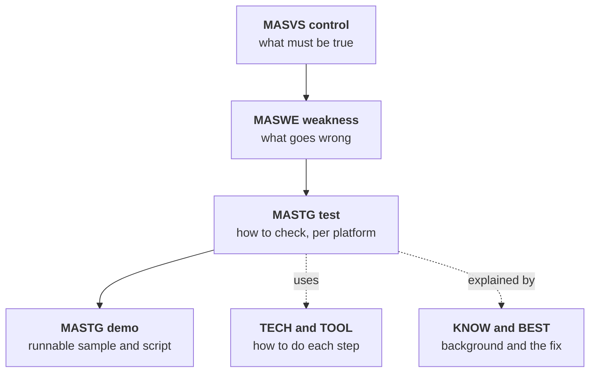

# Part 9: The catalogues

The previous parts explain mechanisms. This part is the standard's own structure, so you can audit against it and speak its vocabulary.

A reviewer who cites `MASTG-TEST-0001` in 2026 has told you, in one ID, that their checklist is out of date: that test is deprecated. IDs are how the standard is navigated, and they move. This part gives you the current ones and shows you how to spot the stale ones.

Everything here was read from `mas.owasp.org` and the OWASP `masvs`, `maswe` and `mastg` repositories on 23–24 September 2026. Control statements and weakness titles are quoted as published. Where I add a one-line explanation, that gloss is mine; the normative text is at the linked page.

**Versions in force on that date:**

| Component | Version | Released | What it means for you |
|---|---|---|---|
| MASVS | v2.1.0 | 18 January 2024 | 24 controls in 8 categories. v2.1.0 added MASVS-PRIVACY |
| MASWE | v1.0.0 | 17 August 2026 | First stable release. 78 weaknesses, **every ID renumbered once** from the beta; stable from now on |
| MASTG | v2.0.0 | 30 June 2026 | The v2 refactor is complete. **All v1 tests are deprecated** and shown only behind "Show Deprecated" |

> **Trap:** MASWE IDs from before 17 August 2026 are *beta* IDs and can mean something different now. The beta catalogue had 119 entries; v1.0.0 absorbed 47 of them into others, renamed and rescoped 72, and added 6, giving 78 with no gaps. An older document citing "MASWE-0027" may mean random-number generation (beta) or insecure certificate validation (v1.0.0). Translate old IDs with the `maswe-beta` key in the v1.0.0 `OWASP_MASWE.yaml` release asset. The mapping is not always one-to-one: some beta IDs appear under more than one v1 weakness, and at least one (beta MASWE-0097) appears under none, so check the title as well as the number.

The pieces connect in one direction, from abstract to concrete:

*Figure 26: From abstract requirement to concrete test*

---

## Chapter 26: The 24 MASVS controls

Each control is one sentence. That is deliberate: MASVS says *what* must hold and leaves *how* to MASWE and MASTG. The sentence in quotation marks is the published control; the text after it is my summary.

### MASVS-STORAGE — storage

**MASVS-STORAGE-1**: "The app securely stores sensitive data." Covers data the app stores on purpose, wherever it lands (app-private storage or public locations such as Downloads) and whatever its origin: the user, the backend, system services or other apps.

**MASVS-STORAGE-2**: "The app prevents leakage of sensitive data." Covers *unintended* leaks that happen as a side-effect of platform features such as logs and backups, where you have a way to prevent them. §6.5 is this control in practice.

<https://mas.owasp.org/MASVS/05-MASVS-STORAGE/>

### MASVS-CRYPTO — cryptography

**MASVS-CRYPTO-1**: "The app employs current strong cryptography and uses it according to industry best practices." The category page points to external standards such as NIST SP 800-175B and SP 800-57 for what "current" means.

**MASVS-CRYPTO-2**: "The app performs key management according to industry best practices." Keys across their whole lifecycle, including generation, storage and protection. Chapters 4 and 5.

<https://mas.owasp.org/MASVS/06-MASVS-CRYPTO/>

### MASVS-AUTH — authentication and authorisation

**MASVS-AUTH-1**: "The app uses secure authentication and authorization protocols and follows the relevant best practices." Enforcement must live on the remote endpoint; the app must use the protocols correctly. Chapter 0.3 and Chapter 12.

**MASVS-AUTH-2**: "The app performs local authentication securely according to the platform best practices." Biometrics and local PINs: in practice, a check that cannot be bypassed by hooking a boolean. Chapter 11.

**MASVS-AUTH-3**: "The app secures sensitive operations with additional authentication." Step-up authentication: Chapter 0.3 and §11.4–11.5.

<https://mas.owasp.org/MASVS/07-MASVS-AUTH/>

### MASVS-NETWORK — network communication

**MASVS-NETWORK-1**: "The app secures all network traffic according to the current best practices." Encryption plus endpoint authentication, without quietly disabling the platform's secure defaults.

**MASVS-NETWORK-2**: "The app performs identity pinning for all remote endpoints under the developer's control." Read Chapter 8 before acting on this one, and note the scoping phrase *under the developer's control*.

<https://mas.owasp.org/MASVS/08-MASVS-NETWORK/>

### MASVS-PLATFORM — platform interaction

**MASVS-PLATFORM-1**: "The app uses IPC mechanisms securely." Intents, content providers, deep links, app extensions. Chapter 17.

**MASVS-PLATFORM-2**: "The app uses WebViews securely." Configuration that prevents data leakage and the exposure of native functionality through JavaScript bridges. Chapter 16.

**MASVS-PLATFORM-3**: "The app uses the user interface securely." Sensitive data on screen must not leak through auto-generated screenshots, notifications, shoulder surfing or a shared device.

<https://mas.owasp.org/MASVS/09-MASVS-PLATFORM/>

### MASVS-CODE — code quality

**MASVS-CODE-1**: "The app requires an up-to-date platform version."

**MASVS-CODE-2**: "The app has a mechanism for enforcing app updates." Chapter 24 is why.

**MASVS-CODE-3**: "The app only uses software components without known vulnerabilities."

**MASVS-CODE-4**: "The app validates and sanitizes all untrusted inputs." Chapter 19.

<https://mas.owasp.org/MASVS/10-MASVS-CODE/>

### MASVS-RESILIENCE — resilience against reverse engineering and tampering

**MASVS-RESILIENCE-1**: "The app validates the integrity of the platform." Root and jailbreak detection, attestation.

**MASVS-RESILIENCE-2**: "The app implements anti-tampering mechanisms."

**MASVS-RESILIENCE-3**: "The app implements anti-static analysis mechanisms." Obfuscation.

**MASVS-RESILIENCE-4**: "The app implements anti-dynamic analysis techniques." Debugger and hook detection.

Read Chapter 14 alongside these. This is the category where a naive reading produces controls that report success while providing little.

<https://mas.owasp.org/MASVS/11-MASVS-RESILIENCE/>

### MASVS-PRIVACY — privacy, added in v2.1.0

**MASVS-PRIVACY-1**: "The app minimizes access to sensitive data and resources."

**MASVS-PRIVACY-2**: "The app prevents identification of the user."

**MASVS-PRIVACY-3**: "The app is transparent about data collection and usage."

**MASVS-PRIVACY-4**: "The app offers user control over their data."

Chapter 18 covers these in practice.

<https://mas.owasp.org/MASVS/12-MASVS-PRIVACY/>

**Key takeaways**

- There are 24 controls in 8 categories, unchanged since MASVS v2.1.0 (January 2024).
- A control is a single "what" sentence. Never write "compliant with MASVS-STORAGE-1" without saying which weaknesses and tests you checked.
- Verification levels (L1, L2, R) are no longer in MASVS; they are MAS *testing profiles* (§3.2, §23.1).

**Try it**

1. Take your last security report and map each finding to one of the 24 controls. List the controls with no finding and no recorded test: those are the ones you never looked at, not the ones you passed.

---

## Chapter 27: The 78 MASWE weaknesses

This is the most directly useful list in the standard, because these are the things that actually go wrong. Read it as an audit: for each line, ask whether your app does this.

The numbering is MASWE v1.0.0: one contiguous block per MASVS category, in the order STORAGE → CRYPTO → AUTH → NETWORK → PLATFORM → CODE → RESILIENCE → PRIVACY. New weaknesses will take the next free number whatever their category, so the blocks will stop being contiguous from here on.

The **Tests** column is the number of current MASTG v2 tests that each weakness's page on `mas.owasp.org` lists, read on 24 September 2026. Placeholder tests, which have a title but no procedure, are shown in brackets and not counted. **35 of the 78 pages say "No Tests Yet".** That does not make them untestable; it means you design the check yourself (§23.1 explains how). The column will go stale, and that is the reason to print it: recheck it.

> **Trap:** a zero here is about OWASP's metadata, not always the topic. As of September 2026 some tests link to a neighbouring weakness rather than the one their subject matches. The iOS pasteboard tests (`MASTG-TEST-0276` to `0280`) and the Android overlay test (`0340`) link to MASWE-0036, so the clipboard (0030) and overlay (0039) pages list nothing. The WebView bridge tests (`0334`, `0376` to `0380`) link to MASWE-0034, so the native-bridge page (0033) lists nothing. Pick tests by topic (Part 7 cites them that way), and don't treat a zero as final.

### Storage (MASVS-STORAGE)

| ID | Weakness | Control | Tests |
|---|---|---|---|
| 0001 | Sensitive Data Stored Unencrypted in Private Storage | STORAGE-1 | 8 (+3) |
| 0002 | Sensitive Data Stored Unencrypted Outside of Private Storage | STORAGE-1 | 4 |
| 0003 | Cryptographic Keys Stored Outside of Platform Keystore | STORAGE-1 | 3 |
| 0004 | Sensitive Data Hardcoded in the App Package | STORAGE-1 | 0 |
| 0005 | Insertion of Sensitive Data into Logs | STORAGE-2 | 4 |
| 0006 | Sensitive Data Not Excluded From Backup | STORAGE-2 | 4 |

### Cryptography (MASVS-CRYPTO)

| ID | Weakness | Control | Tests |
|---|---|---|---|
| 0007 | Improper Encryption | CRYPTO-1 | 8 (+2) |
| 0008 | Improper Hashing | CRYPTO-1 | 1 |
| 0009 | Improper Use of Message Authentication Code (MAC) | CRYPTO-1 | 0 |
| 0010 | Improper Generation of Cryptographic Signatures | CRYPTO-1 | 0 |
| 0011 | Improper Verification of Cryptographic Signature | CRYPTO-1 | 0 |
| 0012 | Improper Random Number Generation | CRYPTO-1 | 4 |
| 0013 | Improper Cryptographic Key Generation | CRYPTO-2 | 2 |
| 0014 | Improper Cryptographic Key Derivation | CRYPTO-2 | 0 |
| 0015 | Cryptographic Key Rotation Not Implemented | CRYPTO-2 | 0 |
| 0016 | Cryptographic Key Access Not Restricted | CRYPTO-2 | 0 |
| 0017 | Device Secure Lock Not Enforced | CRYPTO-2 | 4 |

### Authentication and authorisation (MASVS-AUTH)

| ID | Weakness | Control | Tests |
|---|---|---|---|
| 0018 | Lack of Authentication or Authorization on App Components | AUTH-1 | 6 |
| 0019 | Lack of Auto-fill Support for Credential Providers | AUTH-1 | 0 |
| 0020 | Local Authentication Can Be Bypassed | AUTH-2 | 5 |
| 0021 | Fallback to Non-biometric Credentials Allowed for Sensitive Transactions | AUTH-2 | 3 |
| 0022 | Crypto Keys Not Invalidated on New Biometric Enrollment | AUTH-2 | 3 |
| 0023 | Step-Up Authentication Not Implemented for Sensitive Actions | AUTH-3 | 0 |
| 0024 | Sensitive Data Accessible After Session Termination | AUTH-3 | 0 |
| 0025 | Lack of Non-Repudiation for Critical Actions | AUTH-3 | 0 |

### Network (MASVS-NETWORK)

| ID | Weakness | Control | Tests |
|---|---|---|---|
| 0026 | Network Traffic Not Encrypted | NETWORK-1 | 13 (+3) |
| 0027 | Insecure Certificate Validation | NETWORK-1 | 9 |
| 0028 | Insecure Identity Pinning | NETWORK-2 | 4 |

### Platform (MASVS-PLATFORM)

| ID | Weakness | Control | Tests |
|---|---|---|---|
| 0029 | Insecure Deep Links | PLATFORM-1 | 5 |
| 0030 | Improper Use of the Clipboard | PLATFORM-1 | 0 |
| 0031 | Allowing Untrusted App Extensions | PLATFORM-1 | 1 |
| 0032 | Insecure Intents | PLATFORM-1 | 3 |
| 0033 | Sensitive Native Functionality Exposed in WebViews | PLATFORM-2 | 0 |
| 0034 | WebViews Allow Access to Local Resources with Untrusted Content | PLATFORM-2 | 13 |
| 0035 | WebViews Loading Untrusted Content | PLATFORM-2 | 5 |
| 0036 | Unnecessary Exposure of Sensitive Data via the User Interface | PLATFORM-3 | 12 |
| 0037 | Unnecessary Exposure of Sensitive Data via Notifications | PLATFORM-3 | 1 |
| 0038 | Insufficient Protection of Sensitive Data from Screenshots or Screen Recordings | PLATFORM-3 | 3 (+3) |
| 0039 | App Vulnerable to Overlay Attacks | PLATFORM-3 | 0 |
| 0040 | Sensitive Data Leaked via Accessibility Services | PLATFORM-3 | 1 |

### Code quality (MASVS-CODE)

| ID | Weakness | Control | Tests |
|---|---|---|---|
| 0041 | Running on a Recent Platform Version Not Ensured | CODE-1 | 1 |
| 0042 | Latest Platform Version Not Targeted | CODE-1 | 0 |
| 0043 | Enforced Updating Not Implemented | CODE-2 | 4 |
| 0044 | Dependencies with Known Vulnerabilities | CODE-3 | 4 |
| 0045 | Compiler-Provided Security Features Not Used | CODE-3 | 5 |
| 0046 | Use of Deprecated APIs or Functionality | CODE-3 | 0 |
| 0047 | Using Non-Standard APIs for Security-Critical Functionality | CODE-3 | 0 |
| 0048 | Malicious Code Included in the App | CODE-3 | 0 |
| 0049 | Unsafe Dynamic Code Loading | CODE-4 | 0 |
| 0050 | Unsafe Handling of Untrusted Data | CODE-4 | 4 |

### Resilience (MASVS-RESILIENCE)

| ID | Weakness | Control | Tests |
|---|---|---|---|
| 0051 | Root/Jailbreak Detection Not Implemented | RESILIENCE-1 | 4 |
| 0052 | App Virtualization Environment Detection Not Implemented | RESILIENCE-1 | 0 |
| 0053 | Emulated or Virtual Device Detection Not Implemented | RESILIENCE-1 | 2 |
| 0054 | Device Attestation Not Implemented | RESILIENCE-1 | 0 |
| 0055 | Malware Detection Not Implemented | RESILIENCE-2 | 0 |
| 0056 | App Attestation Not Implemented | RESILIENCE-2 | 3 |
| 0057 | App Resources Integrity Not Verified | RESILIENCE-2 | 2 |
| 0058 | Runtime Code Integrity Not Verified | RESILIENCE-2 | 2 |
| 0059 | Code Obfuscation Not Implemented | RESILIENCE-3 | 3 |
| 0060 | Resource Obfuscation Not Implemented | RESILIENCE-3 | 0 |
| 0061 | Debug Artifacts Not Removed | RESILIENCE-3 | 7 |
| 0062 | No Application-Level Payload Encryption | RESILIENCE-3 | 0 |
| 0063 | Debug Mechanisms Not Disabled | RESILIENCE-4 | 3 |
| 0064 | Debugger Detection Not Implemented | RESILIENCE-4 | 4 |
| 0065 | Dynamic Analysis Tools Detection Not Implemented | RESILIENCE-4 | 0 |

### Privacy (MASVS-PRIVACY)

| ID | Weakness | Control | Tests |
|---|---|---|---|
| 0066 | Inadequate Permission Management | PRIVACY-1 | 6 (+3) |
| 0067 | Lack of Anonymization or Pseudonymisation Measures | PRIVACY-2 | 0 |
| 0068 | Incorrect Use of Identifiers for User Tracking | PRIVACY-2 | 0 |
| 0069 | Usage of Non-Privacy-Preserving Functionality | PRIVACY-2 | 0 |
| 0070 | Inadequate Awareness for Privacy Relevant Actions | PRIVACY-2 | 0 |
| 0071 | Inadequate Defaults for Privacy Relevant Actions | PRIVACY-2 | 0 |
| 0072 | Inadequate Privacy Policy | PRIVACY-3 | 0 |
| 0073 | Inadequate Data Collection Declarations | PRIVACY-3 | 3 |
| 0074 | Inadequate Tracking Domains Declarations | PRIVACY-3 | 1 |
| 0075 | Non-Reproducible Builds | PRIVACY-3 | 0 |
| 0076 | Lack of Proper Data Management Controls | PRIVACY-4 | 0 |
| 0077 | Inadequate Data Visibility Controls | PRIVACY-4 | 0 |
| 0078 | Inadequate or Ambiguous User Consent Mechanisms | PRIVACY-4 | 0 |

<https://mas.owasp.org/MASWE/>

Every v1.0.0 weakness page has the same four sections: *Overview*, *Modes of Introduction*, *Impact* and *Mitigations*. **Modes of Introduction** is the section to read when you audit. It lists the concrete developer mistakes that cause the weakness, which is your checklist when no MASTG test exists yet.

### Three that deserve special attention

Engineers routinely miss these three.

**MASWE-0022**: crypto keys not invalidated on new biometric enrolment. §11.3 is the scenario: someone who knows the device passcode enrols their own fingerprint and then unlocks your app's "biometric-protected" key. It now has tests on both platforms (`MASTG-TEST-0328` on Android; `0270` and `0271` on iOS), so there is no excuse for not checking it.

**MASWE-0024**: sensitive data accessible after session termination. Logout that clears the token but leaves cached responses, database rows and log entries on disk is a finding. It is extremely common, because "logout" is usually built as an auth concern rather than a data concern. It has **no MASTG test yet**: log out, then read the app's data directory (§22.3, experiment three) and see what is left.

**MASWE-0075**: non-reproducible builds. It is filed under Privacy, which surprises everyone; MASWE classifies it under `MASVS-PRIVACY-3` as a build-transparency weakness. It matters because nobody can verify what shipped if the build cannot be reproduced, which connects it directly to Part 6.

**Key takeaways**

- MASWE v1.0.0 has 78 weaknesses, `MASWE-0001` to `MASWE-0078`, stable from August 2026. Treat any earlier MASWE ID as needing translation.
- Almost half the weaknesses have no dedicated test. "No MASTG test" means "write your own check from Modes of Introduction", not "skip".
- The weaknesses with no test are disproportionately the ones teams miss: session termination, step-up, key rotation, non-repudiation.

**Try it**

1. Pick three MASWE entries with **0** tests that apply to your app (MASWE-0024 is a good start). For each, read *Modes of Introduction* and write a one-paragraph test procedure with a pass/fail criterion.

---

## Chapter 28: The tests, techniques and practices you will use

On 23 September 2026 the MASTG repository held 186 current v2 tests and 14 placeholder tests, 165 techniques, 66 best practices (plus 8 placeholders), 150 demos, 133 knowledge articles and 129 tools. All 92 v1 tests are deprecated. They run from `MASTG-TEST-0001` to `0093`; the repository has no `0074`.

Know the four page states before you cite anything:

| State | What the page shows | Cite it? |
|---|---|---|
| **Current** | A normal page | Yes |
| **Deprecated** | A banner saying the test "is deprecated and should not be used anymore", linking to the v2 tests that replace it | No: cite the replacements |
| **Placeholder** | "This test hasn't been created yet", plus a draft description | Only as "planned"; it gives you no procedure |
| **Draft** | Work in progress | With care |

> **Trap:** every MASTG test ID below 0200 is a v1 test and is now deprecated. If you inherited a checklist that cites `MASTG-TEST-00xx`, open each page: the deprecation banner links to the current tests. Keep the old ID in historic reports, but do not use it for new work.

### Old ID to new, for the ones you are most likely to hold

| v1 test (deprecated) | Replaced by |
|---|---|
| 0001 Testing Local Storage for Sensitive Data (Android) | 0200, 0201, 0202, 0207, 0304, 0305, 0306 |
| 0003 Testing Logs for Sensitive Data (Android) | 0203, 0231 |
| 0009 Testing Backups for Sensitive Data (Android) | 0216 |
| 0018 Testing Biometric Authentication (Android) | 0326, 0327, 0328, 0329, 0330 |
| 0020 Testing the TLS Settings (Android) | 0217, 0218 |
| 0022 Custom Certificate Stores and Certificate Pinning (Android) | 0242, 0243, 0244 |
| 0028 Testing Deep Links (Android) | 0393, 0394 |
| 0030 Vulnerable Implementation of PendingIntent | 0381 |
| 0033 Java Objects Exposed Through WebViews | 0334 |
| 0038 / 0039 App signing / debuggable app (Android) | 0224, 0225 / 0226, 0227 |
| 0045 Testing Root Detection | 0324, 0325 |
| 0052 Testing Local Data Storage (iOS) | 0299, 0300, 0301, 0302, 0303 |
| 0055 Keyboard cache (iOS) | 0313, 0314 |
| 0062 Testing Key Management (iOS) | 0213, 0214 |
| 0064 Testing Biometric Authentication (iOS) | 0266–0271 |
| 0066 Testing the TLS Settings (iOS) | 0342, 0343, 0344, 0345, 0348 |
| 0068 Certificate Pinning (iOS) | 0385 |
| 0070 / 0075 Universal Links / Custom URL Schemes | 0370, 0371, 0395 |
| 0076 / 0078 iOS WebViews / native methods in WebViews | 0331–0333 / 0376–0380 |
| 0081 App signing (iOS) | 0220 |
| 0088 Testing Jailbreak Detection | 0240, 0241 |

A few v1 tests have **no v2 replacement yet**, notably the two memory tests (`0011` Android, `0060` iOS) and `0031`, JavaScript execution in WebViews. Until a v2 test lands, work from MASVS-STORAGE-2 and the relevant weakness's Modes of Introduction.

### The current tests worth knowing by number

All IDs are `MASTG-TEST-xxxx`. Placeholders are marked *(placeholder)*.

**Android**

| Area | Tests |
|---|---|
| Storage | 0207 unencrypted data in the app sandbox at runtime · 0287 unencrypted data via `SharedPreferences` at runtime · 0200, 0201, 0202 external storage · 0203, 0231 logging at runtime and in code · 0216, 0262 backups · 0304, 0306 Room *(placeholder)* · 0305 DataStore *(placeholder)* |
| Crypto | 0204, 0205 insecure random · 0208 insufficient key sizes · 0212 hardcoded keys in code · 0221, 0232, 0350 broken algorithms and modes · 0307, 0308 key pairs used for multiple purposes · 0309, 0310 reused IVs *(placeholder)* |
| Auth | 0326 fallback to non-biometric · 0327 event-bound biometrics · 0328 enrolment-change detection · 0329 authentication without explicit user action · 0330 keys with extended validity duration · 0247, 0249 secure screen lock detection |
| Network | 0217, 0218 insecure TLS protocols in code and on the wire · 0233, 0235, 0236 hardcoded HTTP URLs, cleartext configuration and cleartext on the wire · 0234, 0282, 0283 hostname verification and custom trust evaluation · 0242, 0243, 0244 missing and expired pins, and pinning in live traffic · 0284 SSL error handling in WebViews · 0285, 0286 trust in user-added CAs · 0295 GMS security provider not updated |
| Platform | 0364, 0365, 0366 exported unprotected activities, services and receivers · 0355, 0356, 0357 content provider access and oversharing · 0372, 0374, 0375 implicit intents · 0381 insecure `PendingIntent` · 0393 unverified App Links · 0394 deep link input validation · 0250–0253 content provider and local file access in WebViews · 0334 native code exposed through WebViews · 0398, 0399, 0400 WebView URL loading and Safe Browsing · 0289, 0291 screenshots · 0315 notifications · 0340 overlay protections |
| Code | 0222, 0223 PIC and stack canaries · 0245 platform version APIs · 0272, 0274 vulnerable dependencies, including via SBOM · 0337 unsafe deserialisation · 0339 SQL injection in content providers · 0382, 0392 enforced updating |
| Resilience | 0224, 0225 APK signature version and key size · 0226, 0227 debuggable app and WebView debugging · 0288 debug symbols in native code · 0324, 0325 root detection · 0338 storage integrity checks · 0341 hook detection · 0351 emulator detection · 0352, 0353 debugger detection · 0368, 0369 insufficient obfuscation of Java/Kotlin and native code |
| Privacy | 0206 undeclared PII in captured traffic · 0254 dangerous permissions · 0255, 0256, 0257 permission minimisation, rationale and reset *(placeholder)* · 0318, 0319 SDK APIs that handle sensitive data |

**iOS**

| Area | Tests |
|---|---|
| Storage | 0299 Data Protection classes · 0300, 0301, 0302 unencrypted data in private storage · 0303 shared storage · 0388 shared App Group containers · 0215, 0298 backup exclusion · 0296, 0297 logs · 0313, 0314 keyboard cache |
| Crypto | 0209 key sizes · 0210, 0317 broken algorithms and modes · 0211 broken hashing · 0213, 0214 hardcoded keys in code and files · 0311, 0349 insecure random |
| Auth | 0266, 0267 event-bound biometrics · 0268, 0269 fallback to non-biometric · 0270, 0271 enrolment-change detection · 0246, 0248 secure screen lock detection |
| Network | 0321, 0322, 0323 cleartext · 0342, 0343, 0344, 0345, 0348 TLS in ATS, `URLSession`, Network.framework, third-party stacks and on the wire · 0385 missing pinning in ATS · 0396, 0397 `URLSessionDelegate` and `WKNavigationDelegate` bypassing certificate validation |
| Platform | 0331, 0332, 0333 deprecated WebView APIs, attacker-controlled URIs, broad file read access · 0335, 0336 relaxed file origin policies · 0376–0380 native bridges and `evaluateJavaScript` · 0370, 0371 custom URL scheme input and source validation · 0395 universal link input validation · 0276–0280 pasteboard use, contents, clearing, expiry and device scope · 0290 screenshots · 0346, 0347 hiding sensitive input · 0389, 0390 custom keyboard restriction and full-access requests |
| Code | 0228, 0229, 0230 PIC, stack canaries, ARC · 0273, 0275 vulnerable dependencies · 0383, 0384 enforced updating · 0386 unsafe deserialisation |
| Resilience | 0219 debugging symbols · 0220 outdated code signature format · 0240, 0241 jailbreak detection · 0261 debuggable entitlement · 0354 hook detection · 0358, 0359 implementation details in logs · 0367 virtual device detection · 0387 storage integrity · 0391 insufficient native obfuscation · 0401, 0402 debugger detection |
| Privacy | 0281 undeclared tracking domains · 0360, 0361 purpose-string accuracy · 0362, 0363 unjustified entitlements |

<https://mas.owasp.org/MASTG/tests/>

The URL pattern is `https://mas.owasp.org/MASTG/tests/<platform>/<MASVS category>/<ID>/`, for example <https://mas.owasp.org/MASTG/tests/android/MASVS-NETWORK/MASTG-TEST-0286/>. The Area column above groups tests by topic, and a few live under a different MASVS category on the site: 0246–0249 under MASVS-RESILIENCE, and 0372, 0374, 0375 and 0398–0400 under MASVS-CODE. If a URL returns 404, use the site search.

### The techniques, in learning order

A **technique** (`MASTG-TECH`) is a reusable how-to, such as "set up an interception proxy", that many tests share. Learn these once and most tests become a matter of combining them.

**Generic:** 0047 reverse engineering · 0048, 0049 static and dynamic analysis · 0050 binary analysis · 0051 tampering and runtime instrumentation · 0071 retrieving strings · 0119 intercepting HTTP by hooking network APIs at the application layer · 0120, 0121 intercepting HTTP and non-HTTP traffic with a proxy · 0122 passive eavesdropping · 0123, 0124 achieving a MITM position via ARP spoofing or a rogue access point.

**Android:** 0001, 0002 device shell and host-device data transfer · 0003 obtaining and extracting apps · 0004 repackaging · 0007, 0008 exploring the package and the app data directories · 0009 monitoring system logs · 0011 setting up an interception proxy · 0012 bypassing certificate pinning · 0013–0018 reverse engineering, static and dynamic analysis, smali disassembly, Java decompilation, native disassembly · 0026 dynamic analysis on non-rooted devices · 0127, 0128 inspecting backups · 0151 analysing the network security configuration.

**iOS:** 0052, 0053 device shell and data transfer · 0054 obtaining and extracting apps · 0058, 0059 exploring the package and the app data directories · 0061 dumping Keychain data · 0063 setting up an interception proxy · 0064 bypassing certificate pinning · 0065–0067 reverse engineering, static and dynamic analysis · 0111 extracting entitlements · 0146 dynamic analysis on non-jailbroken devices · 0155 analysing the ATS configuration.

<https://mas.owasp.org/MASTG/techniques/>

### The best practices worth putting in a PR template

A **best practice** (`MASTG-BEST`) is the fix a failed test points to. Link it from the ticket so the developer gets the pattern, not just the problem. Placeholders are left out below; they have a title but no guidance yet.

**Logging and backups:** 0002 remove logging code (Android) · 0022 disable verbose and debug logging in production (iOS) · 0004, 0023 exclude sensitive data from backups.

**Storage and crypto:** 0050, 0024 store data encrypted in the app sandbox (Android, iOS) · 0005, 0009 secure encryption modes and algorithms · 0001, 0025 secure random number generator APIs.

**Signing and build:** 0006 up-to-date APK signing schemes · 0007 debuggable flag disabled · 0008 WebView debugging disabled · 0010 up-to-date `minSdkVersion`.

**Screens and input:** 0014 preventing screenshots and screen recording (Android) · 0044 mask sensitive data in text fields · 0069 keep sensitive input on the system keyboard (iOS).

**Biometrics:** 0031 enforce strong biometrics for sensitive operations · 0036 use cryptographic binding · 0037 invalidate keys on enrolment changes · 0038 require explicit user confirmation.

**Resilience:** 0030 implement root detection · 0041 harden against runtime hooking · 0046, 0053 harden against emulation and virtual devices · 0047, 0074 anti-debugging checks · 0048 harden against reverse engineering tools (iOS).

**Network:** 0020 update the GMS security provider · 0042, 0043 strong TLS in ATS and where ATS does not apply · 0073 validate server trust properly in `URLSessionDelegate` and `WKNavigationDelegate`.

**WebViews:** 0011, 0033 securely load file content · 0012, 0013 disable JavaScript and content provider access where possible · 0028 WebView cache clean-up · 0035 prefer origin-scoped messaging over legacy bridges · 0032 migrate from `UIWebView` to `WKWebView` · 0058–0062 restrict native bridge functionality, render sensitive UI and text entry natively, use `WKContentWorld` isolation, use `WKScriptMessageHandlerWithReply`.

**IPC and components:** 0039 prevent SQL injection in content providers · 0040 prevent overlay attacks · 0049, 0052 restrict access to exported providers and components · 0056, 0057 explicit intents internally, and sanitise external data · 0063 immutable `PendingIntent`s · 0045 limit exposure through iOS IPC channels · 0068 secure data sharing with app extensions · 0064 safe deserialisation APIs.

**Integrity and links:** 0065, 0066, 0067 storage and source-code integrity checks · 0070 verify App Links with `autoVerify` and Digital Asset Links · 0071, 0054, 0055, 0072 validate deep link, custom URL scheme and universal link parameters and sources.

**Hygiene:** 0021 proper error and exception handling · 0051 minimise iOS permissions and entitlements · 0003 comply with privacy regulations.

<https://mas.owasp.org/MASTG/best-practices/>

### Demos and knowledge articles

A **demo** (`MASTG-DEMO`) is a runnable sample: a small Kotlin or Swift snippet, a script, and the expected observation. Demos are built on the **MAS Test Apps**, two deliberately simple mirror-image apps for Android and iOS (§22.2), so you can reproduce the result yourself. `MASTG-DEMO-0106`, for example, hooks `Cipher.doFinal` with Frida to show plaintext leaving a crypto call; it demonstrates `MASTG-TEST-0341`.

A **knowledge article** (`MASTG-KNOW`) is the platform background a test assumes, such as how the network security configuration works. When a test page cites one you don't understand, read it first.

<https://mas.owasp.org/MASTG/demos/> · <https://mas.owasp.org/MASTG/knowledge/>

### Platform security defaults by version

Raising `targetSdk` or the iOS deployment target changes what the platform does for you, and sometimes breaks code that relied on the old behaviour. This is the book's scattered version facts in one place; each row points to where the change is explained. On Android most rows apply only when your app *targets* that API level; the ones marked "all apps" apply on that OS version whatever you target.

**Android**

| API level | What changes | Where |
|---|---|---|
| 24 (Android 7) | User-added CAs ignored; network security configuration available | §7.1, §8.10 |
| 28 (Android 9) | Cleartext HTTP blocked by default. StrongBox keys available on devices with the hardware | §7.1, §4.2 |
| 29 (Android 10) | TLS 1.3 on by default, and only the focused app and the default keyboard can read the clipboard (both all apps) | §7.1, §6.5 |
| 30 (Android 11) | WebView `allowFileAccess` defaults to `false` | §16.3 |
| 31 (Android 12) | `android:exported` required on components with intent filters. `PendingIntent` must declare mutability. `dataExtractionRules` controls cloud backup and device transfer separately, and `allowBackup="false"` no longer stops device transfer. Touches through most untrusted overlays blocked (all apps) | §17.1, §17.3, §6.5, §17.6 |
| 33 (Android 13) | Clips can be marked sensitive (`EXTRA_IS_SENSITIVE`). `AD_ID` permission required for the advertising ID | §6.5, §18.2 |
| 34 (Android 14) | Implicit intents reach only exported components. `registerReceiver` must declare export. Mutable implicit `PendingIntent` throws. `ZipFile` rejects `..` entries. Dynamically loaded code must be read-only. System CA store moves to an updatable APEX (all apps) | §17.2, §17.1, §17.3, Chapter 19 (Zip Slip), §19.5, §22.1 |
| 35 (Android 15) | `PendingIntent` creators block background activity launches. Play requires 16 KB page support | §17.3, §19.6 |
| 36 (Android 16) | Play's minimum target since 31 August 2026. Certificate Transparency available as opt-in. Default intent-redirection hardening (all apps) | §17.3, §7.3, §17.2 |
| 37 (Android 17) | Certificate Transparency and Encrypted Client Hello on by default. `ACCESS_LOCAL_NETWORK` required. Native libraries loaded with `System.load()` must be read-only. `setContentCaptureEnabled(false)` no longer stops on-device intelligence capture | §7.1, §7.3, §18.1, §19.5, §20.2 |

**iOS**

| Version | What changes | Where |
|---|---|---|
| iOS 12 | `kSecAttrAccessibleAlways`, `UIWebView` and `NSKeyedUnarchiver.unarchiveObject(with:)` deprecated. Certificate Transparency enforced for publicly trusted certificates issued after 15 October 2018. TLS 1.3 on by default (12.2) | §4.4, §16.6, §19.4, §7.1 |
| iOS 14 | Declarative pinning with `NSPinnedDomains`. Devices fetch the associated-domains file from Apple's CDN, not your server | §8.10, §17.5 |
| iOS 16.4 | `WKWebView.isInspectable` defaults to `false` | §16.6 |
| iOS 17 | Screen-capture state readable from the trait collection. 17.3: Stolen Device Protection. 17.4: `https` callbacks for `ASWebAuthenticationSession`; alternative app marketplaces in the EU | §6.6, §11.3, Chapter 0.3, §18.5 |
| iOS 18 | `LAContext.domainState.biometry.stateHash` replaces `evaluatedPolicyDomainState` | §11.3 |
| iOS 26 | `URLSession` and Network.framework negotiate hybrid post-quantum TLS by default. CryptoKit adds ML-KEM and ML-DSA keys, including in the Secure Enclave. App Store Connect requires the iOS 26 SDK from 28 April 2026 | §7.3, §4.3, §19.6 |
| iOS 27 | `canOpenURL` deprecated, and at most 25 `LSApplicationQueriesSchemes` for apps built with the iOS 27 SDK. `UIScreen.isCaptured` deprecated. App Attest adds launch-validation and bundle-version extensions | §14.4, §6.6, §10.3 |

**Key takeaways**

- Cite only current v2 tests (`MASTG-TEST-0200` and above). Every v1 test is deprecated, and its banner links to the replacements.
- A placeholder page is a promise, not a procedure. Don't mark a weakness "tested" because a placeholder exists.
- Techniques are the reusable skill; best practices are the fix. Put `MASTG-BEST` links in tickets.

**Try it**

1. Take the last security report or checklist your team used. For every `MASTG-TEST` ID below 0100, open the page, confirm the deprecation banner, and write down the replacement IDs. Count how many of your "passes" were measured against a test that no longer exists.
2. Open `MASTG-DEMO-0106` and read its `run.sh` and its expected output side by side. Name the MASVS control, the MASWE weakness and the MASTG test it serves.

---
