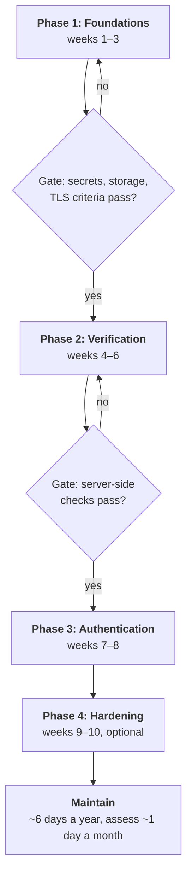

# Part 11: Making the case and running the programme

Everything before this part is for engineers. This part is for the conversation where you ask for time and budget, and for the plan you run once you get it.

**If you are a stakeholder rather than an engineer, you can read this part on its own.** Start with the one-page executive summary below. Chapters 29 and 30 give you the risk and the regulatory position, Chapter 31 shows what comparable teams do, and Chapter 32 is the plan with costs, phases, owners and success criteria. Technical terms are explained where they appear, and the § references point to the engineering chapters if you want the detail.

**If you are the engineer making the case,** the most useful thing in this part is §29.4: how to scope your *own* exposure instead of quoting an industry average. Quoting averages is how security people lose credibility, and you only get to lose it once.

## Executive summary

**The ask.** Approve a ten-week mobile security programme in four phases, and name one owner for each line in §32.4. Approve Phase 1 now; start each later phase only when the previous one meets its success criteria (§32.5).

**The cost.** About **18–26 engineering days** in total across Android, iOS and backend, spread over ten calendar weeks alongside feature work. After that, about **6 engineering days a year** to maintain it and **about 1 day a month** of self-assessment. All three are planning estimates, not measurements (§32.3). There is no licence cost: every control uses platform features or free tools.

**The risk it reduces.** Four things, roughly in order of likelihood *(reasoned)*:

1. A credential or API key leaked from the app or the build pipeline. This is the most common mobile failure, and the cheapest to fix.
2. Account takeover and fraud: stolen sessions replayed from attacker devices, or scripted abuse of payment and promotion flows.
3. A personal-data breach, which brings notification duties and possible fines.
4. A missed regulatory or app-store deadline, which can stop you shipping updates.

For scale, the average enterprise data breach cost **$4.99 million** in IBM's 2026 study, a record. Your own exposure is almost certainly different, and §29.4 shows how to work it out rather than borrow that number.

**Why now.** Several external dates have arrived or are close:

| Date | What happens | Who it affects |
|---|---|---|
| **2 Aug 2026** (in force) | EU AI Act transparency duties (Article 50); systems already on the market have until 2 Dec 2026 to mark AI-generated content | Apps with chatbots or AI-generated content used in the EU |
| **31 Aug 2026** (in force) | Google Play: new apps and updates must target Android 16 (API 36); extensions available to 1 Nov 2026 | Every Android phone and tablet app on Play (Wear OS, TV, Automotive OS and XR have lower minimums) |
| **11 Sep 2026** (in force) | EU Cyber Resilience Act: manufacturers must report actively exploited vulnerabilities and severe incidents, with a first warning within **24 hours** | Commercial apps offered in the EU, including ones already on the market |
| **30 Sep 2026** | Android developer verification starts in Brazil, Indonesia, Singapore and Thailand; global from 2027 | Installs from Play and six partner stores on certified devices in those four countries; all apps, sideloaded ones included, from 2027 |
| **11 Dec 2027** | EU Cyber Resilience Act applies in full: secure-by-default design, vulnerability handling, security updates | Commercial apps offered in the EU |

**The timeline.** Four phases. Each delivers something testable on its own, so the programme survives being paused (§32.2):

| Phase | Weeks | Delivers |
|---|---|---|
| 1 — Foundations | 1–3 | No live secrets in code or builds; tokens in hardware-backed storage; correct network security |
| 2 — Verification | 4–6 | Your server can tell a genuine app on a genuine device from a script |
| 3 — Authentication | 7–8 | Payments and account changes need a real biometric confirmation |
| 4 — Hardening | 9–10 | Tamper signals reported to the server; release builds that are harder to read |

**The decision needed.**

| Option | Effort *(estimate)* | What you get | What you accept |
|---|---|---|---|
| **A. Do nothing** | 0 days | Nothing | Leaked keys stay live; fraud controls rely on the app, which attackers control; no evidence for auditors or CRA reporting |
| **B. Phase 1 only** | ~6–8 days | The minimum it is irresponsible to skip (§32.7, "MVP") | No server-side way to spot scripted abuse or cloned apps |
| **C. Phases 1–3** *(recommended minimum for apps with payments or personal data)* | ~15–22 days | Secrets, storage, device verification and real step-up authentication | Weaker defence against casual reverse engineering |
| **D. Full programme** | ~18–26 days | All of the above, plus tamper reporting and build hardening | Phase 4 has the lowest return per day; cut it first if squeezed |

What you are being asked to decide: **which option, who owns each line in §32.4, and the date Phase 1 starts.**

---

## Chapter 29: The business case

In 2022 the security firm CloudSEK scanned mobile apps and found **3,207** of them shipping Twitter API keys inside the app, 230 of them with the full set of credentials needed to take over the linked accounts *(reported)* ([The Hacker News](https://thehackernews.com/2022/08/researchers-discover-nearly-3200-mobile.html)). Nobody had to break in. The keys were in the download. That is the shape of most mobile security failures: not a sophisticated attack, but something the team shipped by accident and nobody checked. This chapter turns that kind of risk into a case a budget holder can weigh.

### 29.1 Why mobile, and why now

Your mobile app is the main way many customers reach you. It is also the most exposed part of your system, for one structural reason: **the app runs on hardware you do not control.** A server sits in a data centre you own. Your app sits in the hands of anyone who downloads it, including anyone who wants to take it apart, change it or run it from a script. Anything shipped inside the app, including keys, business rules and "hidden" endpoints, should be treated as public. Chapter 1 covers what that means technically.

The "now" is partly the numbers in §29.2 and partly the calendar. The EU Cyber Resilience Act's reporting duty has applied since 11 September 2026, Google Play's new target-level rule since 31 August 2026, and Android developer verification starts on 30 September 2026 (Chapter 30). Each of those turns a security gap into a deadline.

### 29.2 What the current numbers say

The figures below come from three annual reports, each the latest edition as of September 2026:

- IBM's *Cost of a Data Breach Report 2026*, researched by the Ponemon Institute and released 29 July 2026. It covers 602 organisations breached between March 2025 and February 2026 ([IBM report](https://www.ibm.com/reports/data-breach), [IBM press release](https://newsroom.ibm.com/2026-07-29-ibm-study-one-in-four-malicious-breaches-are-ai-enabled,-costing-companies-6-million-on-average)).
- Verizon's *2026 Data Breach Investigations Report* (DBIR), released 19 May 2026 ([Verizon](https://www.verizon.com/about/news/breach-industry-wide-dbir-finds)).
- GitGuardian's *State of Secrets Sprawl 2026*, published 17 March 2026 ([GitGuardian](https://blog.gitguardian.com/the-state-of-secrets-sprawl-2026/)).

A **secret**, in this table, means a credential a machine uses: an API key, a token, a password or a signing key.

| Finding | Figure | Source |
|---|---|---|
| Global average cost of a breach | **$4.99M**, up 12% on 2025 and a record | IBM |
| United States average | **$11.5M**, more than double the global figure | IBM |
| Healthcare | **$6.64M**, costliest sector for the 13th year running, though down 10.5% from $7.42M *(reported)* | IBM, via [HIPAA Journal](https://www.hipaajournal.com/2026-cost-data-breach-study-ibm/) |
| Financial services | **$6.3M**, second | IBM |
| Mean time to identify and contain | **247 days**, reversing five years of improvement (up from 241 *(reported)*) | IBM |
| AI-enabled breaches | **One in four** malicious breaches, up 56% on the year, averaging **$6M** | IBM |
| Ransomware | Reported by **39%** of breached organisations, up from 34% the year before | IBM |
| Customer personal data | Stolen in **52%** of breaches, at **$192 per record** *(reported)* | IBM, via secondary summaries |
| How breaches start | Exploited vulnerabilities **31%**, overtaking stolen credentials for the first time in the report's 19 years; third parties involved in **48%** | Verizon |
| Mobile-first scams | Social engineering by text and voice call succeeded **40% more often** than email phishing | Verizon |
| New secrets leaked on public GitHub | **28.65 million** in 2025, up 34%, the largest one-year jump recorded | GitGuardian |
| Secrets never revoked | More than **64%** of secrets confirmed valid in 2022 were still valid when retested in January 2026 | GitGuardian |
| One AI coding assistant | Commits co-authored by **Claude Code** leaked secrets at **3.2%**, against a **1.5%** baseline for all public commits | GitGuardian |

**Read the trend, not just the headline.** IBM's global average was $4.88M in 2024. It *fell* to $4.44M in 2025, the first decline in five years, then rose to a record in 2026. A document that quotes $4.88M today is two reports behind. One that cites the 2025 fall as proof things are improving is one behind.

**Quote the GitGuardian AI figure exactly.** It is about one tool, identifiable by the co-author trailer it adds to commits, compared with all public commits, not with "human-only" commits. GitGuardian's own caveat is that developers still decide what to accept and push. The honest conclusion is that AI-assisted code needs the same secret scanning as everything else, not that AI tools double your leak rate.

**Three findings deserve extra weight in a mobile conversation.**

- **247 days.** A breach you have not noticed is the normal case. That argues for server-side monitoring and logging, which see every client, over client-side controls, which an attacker can remove.
- **The secrets figures.** They are about your build pipeline and your app package, which is Part 6. And the 64% figure says the industry is good at leaking and bad at rotating.
- **Mobile-first scams.** Your users are being phished by text more successfully than by email. That is a reason to stop treating SMS one-time codes and texted links as strong proof for high-value actions, and to prefer passkeys or key-bound biometrics (§11.7).

### 29.3 What you are risking, with real precedents

Abstract risk does not get funded. Each row below pairs a category of risk with something that actually happened and was publicly documented.

| Risk | What it looks like | A documented precedent |
|---|---|---|
| **Leaked credentials in the app** | API keys or cloud credentials shipped inside the app package or left in the build pipeline | CloudSEK, 2022: **3,207** apps leaking Twitter API keys *(reported)*. GitGuardian 2026: most leaked secrets are never rotated |
| **Account takeover** | Stolen tokens replayed from attacker devices; fraud losses, remediation cost, support load | Verizon 2026: stolen credentials were overtaken as the top way in only this year, and text and voice scams outperform email |
| **Payment and promotion fraud** | Business logic abused at scale: replayed requests, manipulated amounts, scripted sign-up bonuses | Financial services is second on breach cost, at $6.3M (IBM 2026) |
| **Data breach** | Personal data exposed through storage, logging, an insecure API or a leaked credential | Global average $4.99M; customer personal data at $192 per record *(reported)* |
| **Regulatory penalty** | Fines of up to 4% of global annual turnover or €20M, whichever is higher, under GDPR | **Meta: €1.2 billion**, Irish Data Protection Commission, May 2023, still the largest GDPR fine in January 2026. It was for transferring EU users' data to the US without adequate safeguards; Meta appealed. Cumulative GDPR fines reached **€7.1 billion** by January 2026 ([DLA Piper](https://www.dlapiper.com/en-us/insights/publications/2026/01/dla-piper-gdpr-fines-and-data-breach-survey-january-2026)) |
| **Private litigation** | Class actions that rival regulators in size | **Capital One**: $190 million class-action settlement (2019 breach, approved 2022), on top of an **$80 million** penalty from its US banking regulator, the OCC, in August 2020 ([OCC](https://www.occ.gov/news-issuances/news-releases/2020/nr-occ-2020-101.html)). **T-Mobile**: $350 million settlement (2021 breach, approved 2023), plus a commitment to spend $150 million more on security. **Equifax**: at least $575 million, potentially $700 million, with the FTC, CFPB and 50 states and territories (2017 breach) ([FTC](https://www.ftc.gov/news-events/news/press-releases/2019/07/equifax-pay-575-million-part-settlement-ftc-cfpb-states-related-2017-data-breach)) |
| **Reputation** | Churn, acquisition cost, brand damage | IBM 2026: **41%** of ransomware incidents involved threats against brand reputation, such as public shaming and leaks |

Three honesty notes on this table, because you will be challenged on it.

**The Meta fine was about data transfers, not a mobile security failure.** It is the right example for the *scale* of regulatory risk and the wrong example for "this is what happens if we skip certificate pinning". Use it precisely or someone will correct you.

**Capital One shows the two exposures are separate.** The $190 million was a settlement with customers; the $80 million was a regulator's penalty. You can face both for the same incident.

**Equifax was a combined settlement.** Most of it funds consumer compensation, but it was negotiated with regulators, not won in a class action. Quote it as "regulators and states", not as "litigation".

### 29.4 How to scope your own exposure — do this instead of quoting averages

This is the most important section in the chapter.

An industry average comes from enterprises with enterprise legal teams, enterprise notification duties and enterprise breach volumes. A mobile incident at a mid-sized company usually costs far less. **Present the average as your exposure and, when someone eventually notices, every future request you make gets discounted.**

So derive your own number. You need five inputs, and your organisation already has most of them:

| Input | What it means | Who has it |
|---|---|---|
| **Users affected** | Not your install base, but the people reachable through the specific weakness. "Tokens readable on rooted devices" is not all users | Analytics: active users of the affected feature or version |
| **Notification cost** | Per-user cost of notifying and, if needed, credit monitoring | Compliance or legal, or a vendor quote |
| **Response cost** | Engineering days to investigate and fix, the forced release and store review, support contacts, any forensic help | Your team's day rate; support's cost per contact |
| **Fraud losses** | What the weakness lets an attacker take, per affected account | Fraud or finance: historical loss rate for that flow |
| **Regulatory exposure** | The penalty framework that applies, and the reporting clock | Whoever owns compliance |

Two cautions on the last row. A percentage of turnover is a ceiling, not a forecast. And the reporting clocks are short: under GDPR you notify the supervisory authority within **72 hours** of becoming aware of a breach that risks people's rights, and the affected people "without undue delay" when the risk is high (Articles 33 and 34). Under the Cyber Resilience Act the first warning is due within **24 hours** (§30.1). Those clocks are why response cost is real and near-term.

**A worked example.** The numbers below are *illustrative*, not data. Replace every one with your own.

| Step | Illustrative input | Result |
|---|---|---|
| Weakness | Refresh tokens stored in plain files; readable on rooted phones or from unencrypted backups | — |
| Users reachable | 400,000 active users × a share you estimate for rooted or backed-up devices, say 3% | 12,000 users |
| Notification | 12,000 × $2 per user | $24,000 |
| Response | 15 engineering days × $800, plus 1,200 support contacts × $6 | $19,200 |
| Fraud | 0.5% of reachable accounts abused × $300 average loss | $18,000 |
| **Total** | | **≈ $61,000**, before any regulatory penalty |
| What reduces it | Phase 1 (§32.2) moves tokens to hardware-backed storage | Most of it |

Then say it like this:

> "The industry average for a full enterprise breach is $4.99 million. That is not our exposure. Ours is approximately X, derived as follows, and here is what reduces it."

That sentence is more persuasive than any borrowed statistic, because it survives scrutiny.

> **Trap:** inventing ranges. Any "$50,000 to $500,000 per incident" figure you have seen is an estimate someone made up and everyone repeated. If you need a range, derive a low and a high case from your own inputs and show your working.

### 29.5 The return side, stated carefully

The strongest honest argument is not a single return-on-investment number. It is three points.

**Prevention is cheap relative to response.** Chapter 32 estimates the programme at 18–26 engineering days. Compare that with the response cost you derived in §29.4. For most teams, one prevented moderate incident covers it *(reasoned)*. Say "for most teams" rather than asserting it as certain.

**Detection time drives cost.** With the mean time to identify and contain at 247 days and rising, monitoring and logging are not overhead. IBM also reports that breaches lasting more than 200 days cost about a third more than faster ones *(reported)*. Detection is the lever with the clearest cost link in the report.

**Some of this is not optional.** Where a regulator, an auditor or an app store requires a control, the business case is compliance, not risk reduction, and arguing risk numbers wastes everyone's time. Know which of your controls are in which category before you walk into the room (§30.3).

**Key takeaways**

- Use the current editions: IBM 2026 ($4.99M global, $11.5M US, 247 days), Verizon 2026, GitGuardian 2026.
- Quote precisely. The Meta fine was about data transfers; the 3.2% AI figure is about one tool against all public commits.
- Your exposure is a calculation from your own inputs, not an industry average.
- The return is prevention versus your own response cost, plus the controls you are required to have anyway.

**Try it**

1. Fill in the §29.4 worked example for one real weakness in your app. Mark every input you had to guess as *(estimate)*, and ask the owner of each input to confirm it.
2. Find the last security business case your organisation wrote. Check the edition year of every statistic in it against §29.2.

---

## Chapter 30: The regulatory landscape

On 11 September 2026 a new rule started applying to every company that sells software with a digital element in the EU, mobile apps included: if someone is actively exploiting a vulnerability in your product, you have **24 hours** to send an early warning to the authorities. Most mobile teams heard about it afterwards. That is the pattern this chapter exists to break.

You do not need to be a lawyer. You do need to know which rules apply to you, who in your organisation owns them, and what they require of your app. That last part is short. Nothing here is legal advice: confirm scope with whoever owns compliance.

### 30.1 The frameworks you are most likely to meet

These frameworks cover most situations. Find the rows that apply to you and ignore the rest.

| Framework | Applies when | What it requires of your app | Status, September 2026 |
|---|---|---|---|
| **GDPR** (EU/EEA) | You process personal data of people in the EU | A lawful basis, data minimisation, purpose limitation, rights of access and deletion, and breach notification to the supervisory authority within **72 hours** of becoming aware (Article 33). Fines up to **4% of global annual turnover or €20 million**, whichever is higher (Article 83) | In force since 2018. The Commission's *Digital Omnibus* proposal would raise the notification threshold to "high risk" and extend the deadline to 96 hours; it is **not law** *(reported)* |
| **EU Cyber Resilience Act (CRA)** | You make a commercial product with digital elements available in the EU. Standalone software, including paid and free commercial mobile apps, is in scope | Report actively exploited vulnerabilities and severe incidents through ENISA's Single Reporting Platform: early warning within **24 hours**, notification within **72 hours**, final report within 14 days of a fix (vulnerabilities) or one month (incidents). From 11 Dec 2027: secure by default, vulnerability handling including a software bill of materials, security updates. Fines up to **€15 million or 2.5%** of turnover | Reporting applies **since 11 Sep 2026**, including to products already on the market (Article 69(3)). Full application **11 Dec 2027** ([EC reporting page](https://digital-strategy.ec.europa.eu/en/policies/cra-reporting)) |
| **DORA** (EU financial sector) | You are a bank, insurer, payment or e-money firm, investment firm or similar, or a critical ICT provider to one | ICT risk management covering your apps, major-incident reporting (initial notice within 4 hours of classifying an incident as major and no later than 24 hours after becoming aware), resilience testing, third-party risk management | Applies since **17 Jan 2025** |
| **NIS2** (EU) | You are an "essential" or "important" entity in a listed sector (for example energy, health, banking, digital infrastructure, some digital providers) | Risk-management measures and incident reporting: early warning within 24 hours, notification within 72 hours, final report within one month. Fines up to €10 million or 2% (essential) and €7 million or 1.4% (important) | Transposition deadline was 17 Oct 2024. Most member states have national laws. On 8 Jul 2026 the Commission referred Ireland, Spain, France and the Netherlands to the EU Court of Justice for not transposing it ([EC press release](https://ec.europa.eu/commission/presscorner/detail/en/ip_26_1499)). Check your country's law |
| **EU AI Act** | Your app offers AI features to people in the EU | Tell people when they are interacting with an AI system and mark AI-generated content (Article 50). Prohibited practices banned. High-risk uses (for example credit scoring) carry heavier duties | Prohibitions since 2 Feb 2025; general-purpose model rules since 2 Aug 2025; Article 50 since **2 Aug 2026**, except that systems already on the market before that date have until **2 Dec 2026** to add machine-readable marking of AI-generated content (Article 50(2)). The Digital Omnibus (Regulation (EU) 2026/1744, in force 27 Jul 2026) moved high-risk duties to **2 Dec 2027** (standalone, Annex III) and **2 Aug 2028** (embedded in regulated products, Annex I) ([Gibson Dunn](https://www.gibsondunn.com/eu-ai-act-omnibus-agreement-postponed-high-risk-deadlines-and-other-key-changes/)) |
| **PCI DSS** | You store, process or transmit payment card data | Protect cardholder data at rest and in transit, restrict access, MFA into the cardholder data environment, logging, and controls on scripts in payment pages. Most apps avoid most of this by **tokenising through a payment provider's SDK**, so card numbers never touch your app or servers. **That is the cheapest compliance decision available to you**; your acquirer or assessor confirms the exact scope | **v4.0.1** is the only active version (v4.0 retired 31 Dec 2024). All 51 future-dated requirements became mandatory on **31 Mar 2025** ([PCI SSC](https://blog.pcisecuritystandards.org/now-is-the-time-for-organizations-to-adopt-the-future-dated-requirements-of-pci-dss-v4-x)). If the phone itself accepts card payments (tap to pay), PCI's separate MPoC standard applies |
| **HIPAA** (US) | You are a covered entity or business associate handling protected health information (PHI) | Safeguards for PHI including access controls, audit trails and breach notification. Encryption is currently "addressable", not mandatory | A proposed update (published 6 Jan 2025) would make encryption and MFA mandatory. It is **still a proposal**; HHS's 2026 agenda moved it to the long-term actions list, with final action anticipated in July 2027 *(reported)* |
| **FTC Health Breach Notification Rule** (US) | You run a health or wellness app that is *not* covered by HIPAA | Notify users, the FTC and sometimes the media after a breach, which includes unauthorised sharing, not only hacking | Amended rule effective 29 Jul 2024 |
| **SOC 2** | Enterprise or B2B customers ask for it | Access controls, audit logging, monitoring, and evidence that your controls operate over time. It is an audit of process, not a technical standard | Ongoing, annual |
| **Regional financial regulation** | You operate in a supervised market | Varies widely and is often prescriptive about specific controls. Central-bank certification programmes often test the app directly against a defined test suite | Check your regulator |
| **App-store policies** | Always | Data declarations that match actual behaviour, permission justification, no undisclosed tracking, current SDKs and target levels (§30.2) | Changes several times a year |

> **Trap:** reading the CRA as "a 2027 problem". The full requirements apply from December 2027, but the reporting duty has applied since September 2026, and it covers apps you shipped years ago. If nobody in your company knows how to file a 24-hour early warning, that is a gap today.

### 30.2 Store policy is the fastest-moving regulator

Worth saying plainly, because engineers systematically underrate it: **Apple and Google act in days, where a regulator takes years.** An app whose data declaration does not match its behaviour gets rejected or removed, and an app that misses a platform deadline cannot ship updates. Both are revenue interruptions now rather than fines later.

The current rules that most often catch teams out:

| Store | Rule | Since |
|---|---|---|
| Google Play | **Data safety** section must match what the app and its SDKs actually collect and share | 2022 |
| Google Play | New apps and updates must target **Android 16 (API 36)**; existing apps must target API 35 to stay visible to new users on newer devices; extensions to 1 Nov 2026 ([Play Console Help](https://support.google.com/googleplay/android-developer/answer/11926878)) | 31 Aug 2026 |
| Android | **Developer verification**: apps installed from Play and six partner stores on certified devices in Brazil, Indonesia, Singapore and Thailand must come from a verified developer; from 2027, all apps on certified devices worldwide, including those distributed outside Play ([Android developers](https://developer.android.com/developer-verification)) | 30 Sep 2026 |
| Apple App Store | **Privacy labels** must match behaviour; **privacy manifests** declare data use and the reasons for using certain APIs, including in third-party SDKs | Manifests enforced since 1 May 2024 |
| Apple App Store | Uploads must be built with **Xcode 26** and the iOS 26 SDK or later ([Apple](https://developer.apple.com/news/upcoming-requirements/)) | 28 Apr 2026 |
| Apple App Store | iOS and iPadOS uploads must target **iOS 13 or later** (minimum deployment target) ([Apple](https://developer.apple.com/news/upcoming-requirements/)) | 9 Sep 2026 |

§18.3 covers the engineering consequence: you cannot declare accurately unless you know what actually leaves the device. That means capturing your own traffic and checking it against your declaration. On Android, `MASTG-TEST-0206` ("Undeclared PII in Network Traffic Capture") is the test. Teams are routinely surprised, usually by a third-party SDK (§18.4).

### 30.3 How to use this chapter

Three actions, in order.

**Find the owner.** Someone in your organisation already owns compliance. Find them before you design a feature that touches regulated data, not after. This is a fifteen-minute conversation that occasionally prevents a nine-month remediation.

**Map your controls to their requirements.** When a control exists because a regulator or a store requires it, label it that way in your own planning. It changes how the prioritisation conversation goes.

**Separate "required" from "advisable".** Mixing them is why security proposals get cut wholesale. If three of your ten items are mandatory, say so and defend the other seven on their merits.

### 30.4 Where the plan meets the rules

Most of what these frameworks ask of a mobile app maps onto the programme in Chapter 32. Use this table to label each phase's items as "required" or "advisable" for your situation.

| Requirement | Frameworks that ask for it | Where the plan delivers it |
|---|---|---|
| Protect personal and payment data at rest and in transit | GDPR, PCI DSS, HIPAA, DORA, CRA | Phase 1: hardware-backed token storage, TLS configuration |
| Strong authentication for sensitive actions | PCI DSS (MFA), DORA, proposed HIPAA update | Phase 3: biometrics bound to keys, step-up authentication |
| Detect and report incidents quickly | GDPR (72 h), CRA (24 h), DORA (4/24 h), NIS2 (24 h) | Phase 2: server-side verdict logging and risk scoring; §32.4 names who files the report; Chapter 24 is the incident runbook |
| Know what is in your app, and fix vulnerabilities | CRA (vulnerability handling, SBOM from 2027), PCI DSS | Phase 1: commit scanning; Part 6: dependency and build provenance |
| Declarations that match behaviour | App stores, GDPR | §30.2 traffic check; §32.4 names the owner |

**Key takeaways**

- The CRA's 24-hour reporting duty has applied to commercial apps in the EU since 11 September 2026, including apps already on the market.
- Tokenising payments through a provider is the cheapest compliance decision you will make.
- App stores enforce faster than regulators. Put their deadlines in the plan.
- Label every control as required or advisable, and defend the advisable ones on their merits.

**Try it**

1. Go down the §30.1 table and mark each row "applies", "does not apply" or "ask". Take the "ask" rows to your compliance owner this week.
2. Ask who in your organisation would file a CRA early warning, and through which account on ENISA's Single Reporting Platform. If nobody knows, add it to §32.4.

---

## Chapter 31: What comparable teams do

The first question a sceptical manager asks is "does anyone else actually do this?" The answer is yes, and the more useful answer is *where* they put the effort. This chapter is for calibration: you are not proposing anything exotic. A caution first, though, and please keep it when you reuse this material.

**These are patterns observable from the outside** *(reasoned)* — from platform documentation, published engineering writing, app behaviour, and what the stores and regulators require. They are **not** confirmed descriptions of any named company's internal architecture, and you should not present them as such. If someone in the room has worked at one of these companies, an overstated claim will be corrected in public.

### 31.1 The patterns, by category

Different app categories converge on different configurations, and the reasoning behind each is worth borrowing even when the category is not yours.

**Banking and payment apps** cluster around the strongest configuration available: hardware-backed key storage, biometric authentication bound to cryptographic operations for transactions, certificate pinning, and device attestation. Two forces drive this rather than one — the value of a successful attack, and regulators who require demonstrable defence in depth. If you work in this category, "OWASP says most apps should not pin" will not end the conversation, because your auditor is not reading OWASP.

**Ride-sharing, delivery and marketplace apps** typically use **progressive security**: minimal friction for browsing and discovery, full controls at the payment and account-change boundary. The reasoning is sound and worth borrowing — friction spent where it buys nothing gets routed around by users, which leaves you less secure than before (§11.5). Payment is usually tokenised through a provider, which takes most PCI DSS scope off the app (§30.1).

**Messaging apps** with end-to-end encryption pair it with pinning and tamper detection, because their threat model includes network-level adversaries and the content is the product.

**Large e-commerce apps** lean on platform attestation combined with backend fraud scoring and rate limiting rather than heavy client-side hardening — consistent with Chapter 12's argument that the backend is the only real arbiter.

### 31.2 The pattern behind the patterns

Read down that list and one thing generalises: **the strongest teams put their weight on the server, and use client-side controls to produce signals rather than verdicts.** Nobody serious is betting on obfuscation. They are betting on attestation, risk scoring and server-side validation, with client hardening as the layer that raises cost for the opportunist.

That is the same conclusion Chapters 12 and 14 reach from first principles. It is reassuring when the theory and the observable behaviour agree.

It also tells a decision-maker where the money goes in Chapter 32. Phases 1 to 3 are mostly server-side trust and correct use of platform features. Phase 4, the client hardening, is last and smallest for the same reason these teams treat it as a supporting layer.

**Key takeaways**

- What comparable teams do is observable from the outside, not confirmed internal architecture. Say so when you cite it.
- Banking apps carry the heaviest controls because of both attack value and regulators.
- Progressive security puts friction only where it buys something: payments and account changes.
- The common thread is server-side decisions fed by client signals.

**Try it**

1. Pick the two categories in §31.1 closest to your app. List which of their controls you already have, and which the Chapter 32 plan would add.
2. Find one flow in your app where you add friction that buys nothing, and one high-value flow that has none.

---

## Chapter 32: The plan

A phased programme you can put in front of a manager. Adjust the effort to your team; the sequence is the part that matters, because each phase makes the next one cheaper.

Picture the alternative. A team spends a quarter on root detection and obfuscation, ships it, and a month later learns that a payment-provider key has been sitting in the app package the whole time. The hardening was real work. It was also the wrong work first. This chapter is ordered so that cannot happen.

### 32.1 Why this order

**Phase 1 first because a live credential in your repository makes everything else pointless.** There is no sense hardening a client while a working key sits in git history. Phases 2 and 3 need Phase 1's foundations in place: attestation and biometrics both rely on keys held in hardware-backed storage. Phase 4 is genuinely last, because it has the worst ratio of effort to risk reduction, which is also why it is the phase to cut if you are squeezed.

Phases 1 and 2 end at a **gate**: their success criteria in §32.5 pass, or the next phase does not start. Phases 3 and 4 have criteria in §32.5 too, checked as each phase finishes, but nothing waits on Phase 3's: Phase 4 is optional, so the diagram shows no gate before it.

*Figure 27: The phased plan, with gates after Phases 1 and 2*

### 32.2 The phases

Ten weeks, four phases. Each phase delivers something testable on its own, so the programme survives being paused. Effort is engineer-days across Android, iOS and backend, and all figures are *(estimate)*.

| Phase | Weeks | Effort | Scope | Why here |
|---|---|---|---|---|
| **1 — Foundations** | 1–3 | ~6–8 days | Secret audit and rotation; secrets injected by CI, with commit scanning that blocks (Part 6); tokens moved to Keystore- or Keychain-backed storage (Chapter 6); TLS configuration checked; the pinning decision made and written down (Chapter 8) | Highest risk removed per day spent. Nothing else matters while a credential is exposed |
| **2 — Verification** | 4–6 | ~6–9 days | Play Integrity and App Attest integrated **in report-only mode**; verdicts verified on your backend; risk scoring; token binding (Chapters 9, 10, 12) | Moves the trust decision to your server. Report-only first is not caution, it is Google's documented rollout (§9.4) |
| **3 — Authentication** | 7–8 | ~3–5 days | Biometric confirmation bound to a Keystore key through a `CryptoObject` on Android, or a Keychain or Secure Enclave key with access control on iOS, for sensitive actions; step-up authentication; keys invalidated when biometric enrolment changes (Chapter 11) | Depends on Phase 1's key storage |
| **4 — Hardening** | 9–10 | ~3–4 days | Tamper and hook detection reporting to the backend; R8 shrinking and obfuscation; release logging removed; screenshot protection on sensitive screens (Chapter 14 and §15.8; screenshot protection §6.5, §6.6) | Lowest ratio of risk reduced to effort. Cut this first if squeezed |

Some terms a stakeholder will meet here. **Play Integrity** (Android) and **App Attest** (iOS) are Google's and Apple's services for telling your server that a request came from your genuine app on a genuine device. **Report-only** means you record their verdicts without blocking anyone until you know what your real users look like. **Token binding** ties a session to a key on one device, so a stolen token is useless elsewhere. **R8** is Android's build tool that removes unused code and renames the rest.

### 32.3 Effort and maintenance

What to put in the plan, and what to say about how reliable these numbers are.

| Item | Estimate | Basis |
|---|---|---|
| Initial implementation | **18–26 engineering days** *(estimate)*, across Android, iOS and backend | Planning estimate for a team already shipping both platforms; scale to your own team's velocity |
| Ongoing maintenance | **~6 engineering days per year** *(estimate)* | Certificate and pin rotation, SDK and target-level updates, attestation quota monitoring, verdict-distribution review |
| Assessment cadence | **~1 day per month** *(estimate)* | One MASWE weakness a week, per §23.6 |

**Be honest that these are estimates, not measurements.** They assume a team that already ships on both platforms and has working CI. If you are also building the CI, or this is your first attestation integration, the number goes up. Say that in the room rather than being asked about it in week seven.

**Note what shrinking certificate lifetimes do to the maintenance line.** Maximum public TLS certificate lifetimes fall to 47 days on 15 March 2029 (§8.5). The rotation share of those six days grows unless you automate renewal and choose pins that survive it. Put that in the plan now.

**Note what the platforms add every year.** Google Play raises the required target level each August and Apple raises the minimum SDK each spring (§30.2). Each is a small, fixed tax on the maintenance line, and missing one blocks releases.

### 32.4 Ownership

Name people, not roles. A plan with role names has no owner.

| Responsibility | Typically owned by |
|---|---|
| Android implementation | Android lead |
| iOS implementation | iOS lead |
| Backend verdict verification, risk scoring, token binding | Backend lead |
| CI secrets pipeline, signing key custody, runner hardening | DevOps / platform engineer |
| Certificate and pin rotation runbook | DevOps, with a named deputy |
| Data declarations and privacy review | Whoever owns compliance |
| Vulnerability intake and regulatory reporting (CRA 24-hour early warning, GDPR 72-hour notice) | Compliance or security lead, with an engineering deputy who can triage |
| Store deadlines (Play target level, Apple SDK minimum, Android developer verification) | Release manager |
| Security review and sign-off | Engineering manager |

The ones that go missing most often are **pin rotation**, **data declarations** and **regulatory reporting**. All three cause incidents when unowned, and all three sit between teams, which is exactly why nobody picks them up.

### 32.5 Success criteria

Write these as things you can test, not things you can claim. Each row names the test, what counts as a pass, and the phase whose gate it belongs to.

| # | Criterion | How it is verified | Pass | Gate |
|---|---|---|---|---|
| 1 | No hardcoded secrets in source control or the shipped app | A secret scanner runs on every commit and blocks; a scan of the full git history and of the release package | Zero live findings; any historical finding rotated and revoked | Phase 1 |
| 2 | All authentication tokens in Keystore- or Keychain-backed storage | Inspect app storage on a rooted or jailbroken test device, and in a device backup, not by code review | No readable token or refresh token in any file, preference or backup | Phase 1 |
| 3 | TLS configured correctly, and the pinning decision documented | Check the network security configuration and App Transport Security settings; proxy the Android app through an interception tool with a user-installed CA; read the decision record | No cleartext traffic and no blanket ATS exceptions; on Android the proxy cannot read traffic (apps ignore user CAs by default since Android 7). A fully trusted user CA on iOS *will* intercept unless you pin, which is expected. The decision record exists. If pinning is on: backup pins ship in every release, an expiry date has a calendar reminder, the rotation runbook has a named owner, and pin failures raise an alert | Phase 1 |
| 4 | Every security decision is made server-side | Replay a valid request from a second device (§12.4); change a price or amount in a proxy and resend | Both rejected | Phase 2 |
| 5 | Attestation verdicts are logged for the whole install base | Dashboard of verdict distribution by label, OS version and country | At least two weeks of report-only data before any enforcement | Phase 2 |
| 6 | Payments and account changes require attestation **and** biometric confirmation | Attempt each flow with attestation missing, then with the biometric step bypassed by a hooking tool | Server refuses both | Phase 3 |
| 7 | Tamper signals reach the backend | Run the app under Frida or on a rooted device; check the backend risk log | Signal recorded against the session within one request | Phase 4 |
| 8 | Reporting path works | Tabletop exercise: a researcher reports an exploited bug in your app on a Friday evening | A named person can file the CRA early warning within 24 hours and the GDPR notice within 72 | Before Phase 2 ends, if you ship in the EU |
| 9 | An assessment exists | Findings document against the MAS-L1 profile, or MAS-L2 for apps holding sensitive data (§3.2), with retest dates | Every high finding has an owner and a retest date | End of programme |

Notice that each one names **how it is verified.** A success criterion you cannot test is a statement of intent.

### 32.6 This week

Five things you can do before anyone approves anything.

1. Run a secret scan across the repository and its full history. Rotate anything live. This is hours, not days, and it is the highest-value thing on the list.
2. Look for secrets in what you actually ship. An APK or AAB is a ZIP archive, so extract it first and run `strings` over the DEX files and resources; the Try it at the end of Chapter 1 has the APK commands (for an AAB, extract `base/dex/classes*.dex` instead). Read the output.
3. Get the compliance owner's name, and ask them the two questions in Chapter 30's Try it.
4. Book 40 minutes for a threat model on the next feature (Chapter 0.5).
5. Pick the pinning approach and write down the decision and the reasoning, even if the decision is "not yet".

None of that needs approval, and doing it gives you evidence for the conversation where you ask for the rest.

### 32.7 Questions you will be asked, and how to answer them

Taking a security proposal into a room means answering the same handful of objections. Most of them are reasonable. Here are straight answers.

**"Isn't StrongBox overkill?"**
It depends on your risk profile, and the honest answer differs by sector. First the terms: the **TEE** (trusted execution environment) is an isolated, hardware-backed area of the main processor that almost every modern Android phone uses for Keystore keys; **StrongBox** is a separate secure chip, a stronger tier that not every device has (§4.2). For banking or health, hardware-backed key storage is frequently a compliance expectation, and the TEE already meets it on most devices. For e-commerce, the TEE is generally sufficient. For a social or content app, standard Keystore or Keychain protection is fine. The decision belongs in §6.4's threat-model framing, and because StrongBox is not on every device, the real question is what your fallback does.

**"Should we block rooted devices?"**
Generally no, and §14.2 gives the full reasoning. Some Android users run rooted devices or custom ROMs for entirely legitimate reasons *(reasoned; there is no reliable primary figure for the share)*, and a local block is trivially removed by the attacker you were worried about while reliably annoying the users you were not. Report the signal to your backend and apply a risk-based policy. Hard blocking is defensible only for the highest-security applications, and even then it is a business decision about lost customers, not a security win.

**"How do we handle certificate rotation?"**
Ship at least two pins: current and backup. Rotate the server side first, then update pins in a later release. And answer the question in §8.5 before you ship anything: does your renewal reuse the key pair, or generate a new one? That single fact determines whether your pinning survives the 47-day certificates of 2029.

**"Will attestation slow down the app?"**
Barely, if it is built as documented. A standard Play Integrity token takes a few hundred milliseconds once the token provider is warmed up; warm-up takes a few seconds, which is why §9.2 says to prepare the provider at app start, off the critical path. Classic requests take a few seconds and are meant for occasional high-value checks, not per-request use. On iOS, attestation contacts Apple once per key, but assertions are generated on the device with no round trip to Apple, so the recurring cost is small (§10.1).

**"Do we need all of this for an MVP?"**
No. The minimum it is genuinely irresponsible to skip: encrypted token storage, correct TLS configuration, secrets out of the repository with commit scanning, and server-side validation of every sensitive request (success criterion 4 in §32.5, which your backend should be doing anyway). That is Phase 1 in §32.2 plus criterion 4, which §32.5 formally gates in Phase 2: about 6–8 engineering days over roughly three weeks *(estimate)*. Attestation, biometrics and hardening are Phase 2 onward and can wait for real users.

**"What if we exceed the Play Integrity quota?"**
The limits are documented, not folklore: by default **10,000 token requests and 10,000 token decryptions per day** per app, and **5 classic requests per minute** per app instance (§9.2, [Google's setup page](https://developer.android.com/google/play/integrity/setup)). Standard requests after warm-up do not count against the request quota, but every token your server decodes counts against the decryption quota, so that is usually the one you hit. Request an increase through the form Google links from Play Console (it can take up to a week, and the app must be on Google Play), set quota alerts, and design attestation to trigger on high-value actions rather than every API call. Do this before launch, not during it.

**"And the App Attest limits?"**
Apple documents them too. Keep `attestKey` calls, the one-off step that registers a key with Apple, below **about 100 requests per second across all your installs**, and ramp a rollout to **no more than 10 million users per day** per app. After the ramp, Apple says normal traffic should not be throttled. Assertions have no per-key limit (§10.5, [Apple](https://developer.apple.com/documentation/devicecheck/preparing-to-use-the-app-attest-service)). In practice that means a staged rollout for a large user base, not a design change.

**"What about location privacy?"**
Collect the coarsest signal that answers your question: approximate rather than precise location, where that suffices (§18.1). For fraud detection, consider server-side IP geolocation instead of device GPS. It needs no permission prompt and no location code in the app. It is not spoof-proof, since a VPN changes it, and location inferred from an IP address may still count as collected data for your privacy declarations, so check with your privacy owner *(reasoned)*.

**"Can't we just obfuscate it?"**
No, and Chapter 14 is the long answer. Obfuscation raises cost against opportunistic attackers and automated tooling. It does not protect a secret, because an obfuscated key is still a key. If the proposal on the table is obfuscation *instead of* server-side validation, it is not a security measure, it is a delay.

**"Does the Cyber Resilience Act apply to us?"**
If you offer the app commercially in the EU, paid or free, probably yes, and the reporting half already applies (§30.1). Confirm scope with your compliance owner. Whatever the answer, the work it implies is in this plan: commit scanning and dependency tracking (Phase 1 and Part 6), and a named person who can file a report within 24 hours (§32.4, success criterion 8).

**"Will Android developer verification affect us?"**
If you publish on Google Play, your Play developer account is most likely verified already. It matters most if you also distribute outside Play: enterprise builds, alternative stores or direct downloads. From 30 September 2026 the check covers installs from Play and six partner stores in Brazil, Indonesia, Singapore and Thailand; from 2027 it covers all apps on certified devices worldwide, including direct downloads, with an "advanced flow" left for power users who choose unverified apps (Chapter 0.4, §15.6). Check that every package name you ship is registered to your organisation before your market's date.

**"Our app isn't a target."**
Possibly true for a targeted adversary, and irrelevant to the other three attacker types in §1.3. Opportunists run automated scans across many apps looking for an exposed key or an unauthenticated endpoint; they do not need a reason to pick you. That is also the category most cheaply defended against, which makes this objection an argument for doing Phase 1 rather than for doing nothing.

**Key takeaways**

- Order matters more than effort: secrets first, server-side trust second, client hardening last.
- Every phase ends at a gate of testable success criteria.
- Name people, not roles, and give pin rotation, data declarations and regulatory reporting an owner.
- The objections have straight, sourced answers. Attestation quotas and rate limits are documented by Google and Apple.

**Try it**

1. Do the five items in §32.6 this week and bring the results to the planning meeting.
2. Copy the §32.5 table into your planning tool, replace "Gate" with real dates and put a name next to every row.
3. Run success criterion 4 against one endpoint today: replay a captured request from a second device and record whether the server rejects it.

---
