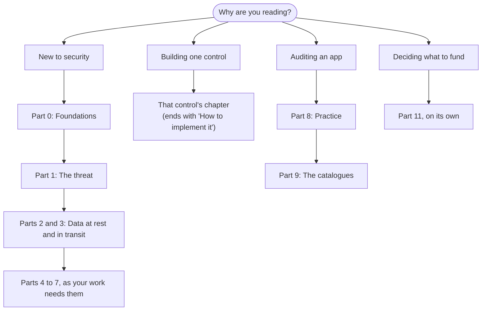

# Mobile Application Security

### A Study Book for Engineers

**Edition 1 · September 2026**
Hossam Atef — Software Engineer
Android · iOS · Kotlin Multiplatform

---

## Start here

Run `strings` over your own release build. It takes thirty seconds. Whatever it prints (API keys, internal hostnames, a debug flag someone forgot), anyone who downloads your app can already read. For most engineers, that is the moment mobile security stops being theory.

This book teaches you to secure a mobile app. More importantly, it teaches you to *reason* about mobile security, so you can handle the cases no book covers. It rests on one idea: **your app runs on a device you do not control.** Most good designs follow from taking that seriously. Most bad designs come from forgetting it.

**You don't need a security background.** If you can build and ship a mobile app, you can read this. Part 0 covers the foundations: what encryption actually does, how sign-in works, what the platforms protect for free. Every term is defined where it first appears, and the [glossary](12-verification.md#glossary) collects them.

**You do need to be willing to run things.** Reading about a pinning bypass teaches you very little. Running one against your own app teaches you a great deal. Most chapters end with a **Try it** exercise you can finish in under an hour, and [Part 8](08-practice.md) shows you how to build a test lab.

### What you'll learn

By the end of this book, you'll be able to:

- Describe what an attacker can do to your app, and explain why the usual instinct (hide the secret better) doesn't work.
- Choose where to store sensitive data on Android and iOS, and justify the choice.
- Explain how hardware-backed keys work well enough to answer "what happens when StrongBox isn't available?" without guessing.
- Decide whether to pin certificates, choose between static, dynamic and hybrid pinning, and defend the answer.
- Implement device attestation and biometric authentication so that your server, not a hookable function, makes the decision, with working code for both platforms.
- Secure your build pipeline, which is now often an easier target than the app itself.
- Threat-model a feature, including the new ones: AI assistants and agentic tooling.
- Test your own work and write findings someone can act on.
- Read the OWASP mobile standard and speak its vocabulary.

---

## How to read this book

The parts build on each other, but you don't have to read them in order. Pick the path that matches why you're here.

*Figure 1: Reading paths through the book, by reason for reading*

- **New to security?** Read Parts 0 to 3 in order and do each **Try it**. That is about a week of evenings. Then dip into Parts 4 to 7 as your work needs them.
- **Implementing one control?** Go straight to its chapter. Most control chapters end with a "How to implement it" section with code for both platforms. When it uses a term you don't know, the glossary points you back to Part 0.
- **Auditing an app?** Read [Part 8](08-practice.md), then work through the catalogues in [Part 9](09-the-catalogues.md).
- **Deciding whether to fund this work?** Read [Part 11](11-making-the-case-and-running-the-programme.md) on its own. It needs nothing else.
- **Preparing for an interview, or checking yourself?** Try [Part 10](10-questions-and-answers.md) cold, then reread the chapters behind the answers you got wrong.

### The parts

| Part | Chapters | What it covers |
|---|---|---|
| [0 — Foundations](00-foundations.md) | 0.1–0.6 | Vocabulary, the cryptography you need, authentication and OAuth on mobile, what the platforms give you free, threat modelling, asset classification |
| [1 — Understanding the threat](01-understanding-the-threat.md) | 1–3 | What an attacker can really do, the economics, and how the OWASP MAS standard fits together |
| [2 — Data at rest](02-data-at-rest.md) | 4–6 | Keystore and Keychain internals, key attestation, choosing storage, database encryption |
| [3 — Data in transit](03-data-in-transit.md) | 7–8 | TLS, the certificate pinning debate, static versus dynamic pinning, implementation and troubleshooting |
| [4 — Proving who is calling](04-proving-who-is-calling.md) | 9–12 | Play Integrity, App Attest, biometrics, the backend as the only real arbiter |
| [5 — Resilience](05-resilience.md) | 13–14 | How reverse engineering works, obfuscation and tamper detection, detection code |
| [6 — The build and release pipeline](06-the-build-and-release-pipeline.md) | 15 | Why CI is now the target, secrets, workflow hardening, signing keys, build configuration |
| [7 — Platform surfaces and new frontiers](07-platform-surfaces-and-new-frontiers.md) | 16–21 | WebViews, IPC and deep links, permissions and privacy, input validation, AI features, Kotlin Multiplatform. Most real findings live here |
| [8 — Practice](08-practice.md) | 22–25 | Build a test lab (22), run an assessment and write it up (23), handle an incident (24), and a one-page testing checklist (25) |
| [9 — The catalogues](09-the-catalogues.md) | 26–28 | The 24 MASVS controls, the 78 MASWE weaknesses, the MASTG tests and techniques worth knowing |
| [10 — Questions and answers](10-questions-and-answers.md) | — | About 160 questions with written-out answers, tagged by difficulty, plus design-review scenarios |
| [11 — Making the case](11-making-the-case-and-running-the-programme.md) | 29–32 | Business case, regulation, what comparable teams do, a phased plan with owners and testable success criteria. Written to stand alone |
| [12 — Verification](12-verification.md) | 33 | Audit log, known uncertainties, sources and glossary |

---

## A few conventions

**Sources.** When a claim rests on a number or a specification, the source is linked. When I'm summarising a standard rather than quoting it, I say so.

**Disagreement.** Where the industry disagrees, you get both arguments rather than a quiet verdict. On some questions, certificate pinning above all, it disagrees sharply. You'll be the one in the design review, so you need to be able to argue either side.

**Traps.** There are more traps in this subject than you'd expect, and most of them look like working code. They are all flagged the same way:

> **Trap:** a callout like this marks a mistake that looks correct. Slow down when you see one.

You'll also see `> **Why it matters:**` for the reason behind a rule, `> **In practice:**` for how a rule plays out on a real team, and `> **Evidence:**` where the book records what was actually tested.

**Chapter endings.** Most chapters close with **Key takeaways** (three to five points worth remembering) and **Try it** (one to three exercises you can finish in under an hour, on your own app or on a deliberately vulnerable practice app from the [OWASP MASTG app list](https://mas.owasp.org/MASTG/apps/)).

**Diagrams.** Flows, stacks and trust boundaries are drawn as [Mermaid](https://mermaid.js.org/) diagrams, which render on GitHub and in most Markdown viewers.

### On confidence

Not every claim in a book like this rests on equally solid ground, and hiding that would make the book less useful. Where a claim is weaker than it looks, it carries one of these markers:

| Marker | Meaning |
|---|---|
| *(reported)* | A figure from vendor or practitioner write-ups rather than a primary source or forensic report. The mechanism is corroborated; the exact number may not be. |
| *(estimate)* | A planning figure, not a measurement. Scale it to your own situation. |
| *(reasoned)* | A conclusion this book draws by analogy or first principles, not something quoted from a standard. Sound, but yours to check. |
| *(contested)* | The industry genuinely disagrees, and you get both sides. |
| *(illustrative)* | A made-up scenario or example, used to show a mechanism. Not a report of a real event. |

Everything unmarked traces to a primary or authoritative source: a standards body, platform vendor documentation, or an official report. [Chapter 33](12-verification.md) records what was verified, when, and what was corrected along the way.

### On verification

Most implementation sections end with a **Verify it** block: the command to run and the pass or fail criterion. These are written from documented tool behaviour and from the OWASP MASTG test procedures. **Most have not been executed against a live app.** Where one was run, on an emulator or simulator, the chapter says so in an `Evidence` note. Expected outputs are described, never fabricated, and where behaviour varies by device or OS version the block says so. Treat them as a test plan, not a transcript. If you run one and get a different result, that is the single most useful thing you can report back.

### On the code

Most chapters covering a control end with a "How to implement it" section: short, correct implementations in Kotlin for Android and Swift for iOS and, where a mistake is common, the wrong version next to the right one. Seeing `CBC` beside `GCM`, or `biometryAny` beside `biometryCurrentSet`, teaches faster than any amount of prose. The snippets are deliberately short: enough to adapt, not a substitute for the platform documentation, which is linked.

### On dates

Mobile security moves fast. Platform versions, attestation behaviour, certificate lifetimes and the OWASP catalogues all change within a year. Each part file records in its frontmatter when it was last checked (`last_verified`) and how quickly it decays (`volatility`). This edition reflects the state of things in **September 2026**: Android 17 (released June 2026) and iOS 27 (released 14 September 2026) as the newest platform versions, with iOS 26 and Android 15–16 still on most devices, plus MASVS v2.1.0, MASWE v1.0.0 and MASTG v2.0.0. Where behaviour differs between recent versions, the text says which version it means.

---
